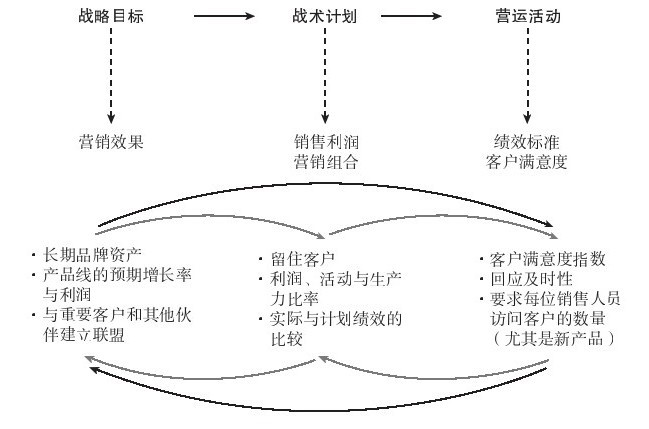
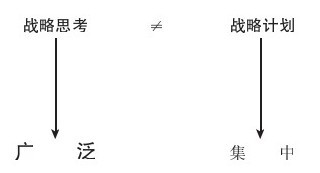
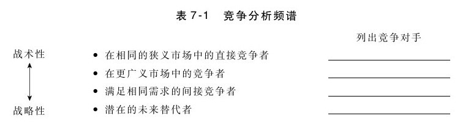

# 第7章 战略愿景和计划

如果我们能够确切地预测未来，那么未来就不会有什么变数……我们研究未来的主要目的在于：如果按照现在的趋势发展，未来会发生什么事情，然后判断这样的结果是不是我们想要的；如果不是，就要设法改变……预测和创造未来的能力，是领导能力的本质所在。

——美国世界未来学会（World Future Society）

有时候，我们往往会把战略愿景看做企业管理层的一项专用技术。其实不然。要取得未来的成功，产品经理也必须为其产品线制定愿景和计划。战略是通过最合理地利用资源和资产来获取持续竞争优势的艺术和科学。制定战略，需要先进行环境扫描（见第3章），然后还需要明确产品线未来发展方向、权衡利弊和制定实施计划的领导能力。

## 战略思考

我们来思考一下产品线的愿景：你对未来产品线有什么设想？假设现在是未来五年左右的某个日子，你要写一份产品线年度报告。你销售的是什么产品？处在产品生命周期的哪个阶段？有什么战略意义？谁是重要客户？他们对产品的品牌认知度如何？产品线的销售量、销售收入和利润如何？当然，还要考虑能和竞争对手区分开来的产品整体解决方案。正如托尼·曼宁（Tony Manning）在《理解战略》（Making Sense of Strategy）一书中所说的：“战略必须能使组织独树一帜，并对大多数真正的客户而言，这种独树一帜（差异化）必须是很重要的。”[[1]](part0075.xhtml#ch1-back)因此需要明确：对于产品线来说，什么是真正重要的？对客户来说，什么是真正重要的？对于企业来说，什么又是真正重要的？

许多产品经理往往会犯这样的错误：根据过去来推断未来，以为未来是过去的简单延续。尽管过去的情况是计划需要考虑的重要方面，但产品经理还必须考虑影响产品服务的外部趋势和变化。企业的成长战略是什么（例如，对企业和产品线而言，真正重要的是什么）？未来的战略定位会与现在一样吗？还是需要确定不同的发展方向？这对产品线会产生什么影响？从战略的角度来说，产品经理必须确定其是否有效，即做对事情；而从战术和运营的角度来说，产品经理则必须确定其能否做好事情——实现既定的目标。例如，你是否已确定谁是重要客户（战略目标）？获取这些客户后，如何留住他们（战术计划的结果）？你和企业的其他员工又如何长期留住这些客户（如营运活动）？这些关系如图7-1所示。

图 7-1 产品经理的目标设定 

从战略、战术和营运活动之间的关系可以看出，这是一个持续的过程，而非一年一度的活动。虽然不需要频繁地制定战略计划（见图7-2），但产品经理需要不断地进行战略思考。战略思考内容非常广泛，要求产品经理把握整体的市场变化趋势和新的竞争动态，但你不可能抓住或解决所有未来可能的机会或问题。你必须确定某一特定的发展方向，并制定相应的战略计划。为某一发展方向制定战略计划意味着需要放弃不同的发展方向。战略计划要比战略思考更集中一些，要求产品经理“敢下赌注”，准备好时间和资金，朝既定的方向前进。

图 7-2 战略需要思考和计划 

战略思考需要全面分析客户和竞争对手。先要分析客户现在和未来的需求，而这可以通过回答以下问题进行展开：

·未来的客户和现在的客户有何不同？这种变化会如何影响经营活动？

·这些客户期望或需要什么产品？

·是否需要开发新产品或开拓新市场？

·现有资源、资产和能力是否具有竞争优势？能否获取未来的竞争优势？

既然客户购买的是问题的解决方案（而非只是产品本身），那么就应从这一角度来分析企业所处的竞争环境。就短期而言，哪些竞争对手最直接地解决了客户的问题？这些是会让你失去或获取业务的最直接的竞争对手。从长期来看，竞争对手可能会用截然不同的产品来向客户提供同样的利益或“功能”。例如，某个准备购买小型汽车的客户，可能会把本田雅阁、丰田花冠或土星列为可选择的对象。如果把竞争对手的范围放宽，可能还包括从大众甲壳虫到宝马等一系列不同的车型。而更广泛的竞争对手可以定义为能够满足运输需求的交通工具，包括摩托车、卡车和厢式货车等。如果再把范围放宽，还可以包括公共交通甚或是休假——因为这可能会动用客户买车的预算。因此，我们需要根据这一思考方式来分析竞争对手，并完成表7-1。

思考要点

产品线的愿景是什么？

▶未来的产品领域需要什么样的客户、产品和品牌认知度？

▶哪些新兴的商业模式（或竞争对手）可能会吸引现有的客户？

▶对客户和企业真正重要的是什么？

产品经理既是管理者又是领导者。作为管理者，他们必须在日益复杂的环境中执行计划。作为领导者，他们必须应对不断的变化。哈佛大学领导学教授约翰·科特（John Kotter），对管理和领导的关系进行了全面的阐述：

领导和管理是两个既不一样但相辅相成的行为系统。管理需要处理复杂的事务，而领导则需要推动变革。领导与管理相辅相成，但不能互相替代。企业通过计划和预算、控制与解决问题来管理复杂的事务。而领导组织则需要设定方向、引导成员朝共同方向前进并鼓励他们实现愿景。

高明的战略家是优秀的变革推动者。产品经理未来将面对持续加速的变化，他们的适应能力将是生存的关键。正如阿尔文·托夫勒（Alvin Toffler）在《未来的冲击》（Future Shock）中所提到的那样，“现实”与“假设”不断变化，“即使是技能与智力最高的社会精英”，也未必能跟得上信息爆炸的速度。

[[1]](part0075.xhtml#ch1)Tony Manning,Making Sense of Strategy（New York：AMACOM，2002）preface.
