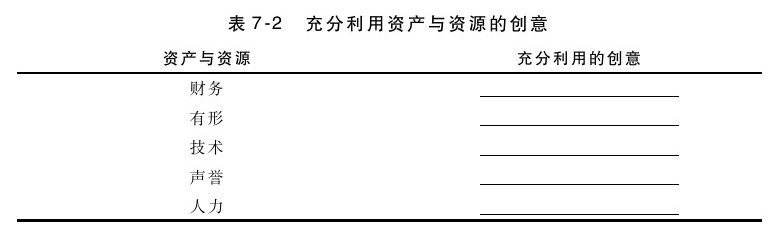

### 充分利用资产和资源

我们也可以通过分析资产和资源及寻找其优化利用的方式来制定战略。资源包括财务资源（可用于投资的资金）、有形资源（如工厂或场所）、技术资源（如专利）、声誉资源（如品牌资产）和人力资源（如技能组合）等。如果你拥有雄厚的财务资源，可以通过收购互补的产品线进行优化，也可以通过提供低价或免费的产品来刺激销售。有形的资源可以通过寻找其他用途进行优化。例如，快餐店力图通过鼓励客户经常到店里来用早餐和晚餐（及午餐），来提高其房屋和相关资源的利用率。技术资源，如知识产权等，则可以通过授权的方式得到更多的专利收入。声誉资源可以通过将现有产品品牌扩展到新产品类别来加以充分利用。人力资源可以通过将其集中于共同品牌而得到充分的利用。请思考一下如何充分利用企业资产和资源的战略方法。

正如前面讨论发展核心业务时所介绍的那样，这种方法可以衍生出几个不同的成长战略，然后还要确定能够最有效地缩短现状和目标之间差距的相关战略。
