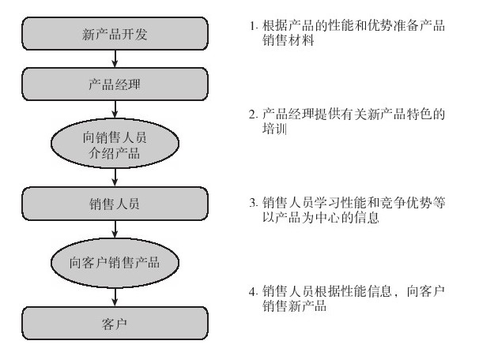
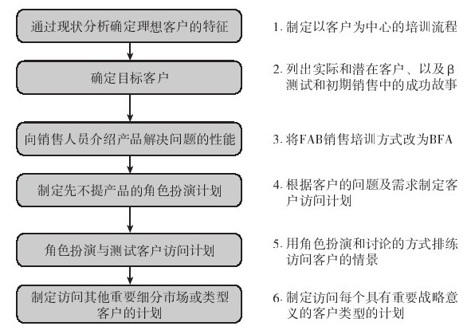

## 上市实施：获取承诺和支持

有时候，我们会把产品发布看做是上市的高潮，但其实上这只是开始而已。上市实施需要将上市前计划（pre-launch plan）贯彻落实，如争取产品知名度、铺货和试购等，而这就需要培训与激励上市计划执行人员。

上市前需要采取的最重要的一项行动是确保产品已准备就绪，确保内部和外部的所有辅助和沟通问题已经解决。另外，在产品发布时，还要检查并确保订货和支持系统已然到位。但如果这些方面尚未准备就绪，就需要与销售管理、人力资源或其他负责培训的相关部门合作，确定并准备与上市相关的教育方案。

### 内部培训

企业已经认识到，新产品培训的对象除了销售人员之外，还应包括客户服务、技术支持和其他负责客户联系的人员。这些人员对新产品的成败有重要影响。虽然他们不需要深入了解销售方法方面的信息，但他们需要知道产品对企业的重要性、谁将为客户提供哪种支持以及如何回答可以预期的问题。

也就是说，如何有效地激励销售人员销售新产品事关成败。但许多新产品的销售培训存在一个问题，即培训更关注的是产品能做什么，而非如何给客户带来利益。

培训的目的是让现场销售人员做好销售新产品的准备，这当然需要了解新产品。培训的主要内容应促使销售人员关注客户，而非内部问题。但为什么做不到这一点？这是因为产品经理长时间专注于产品开发中，千方百计地创建与竞争对手不同的产品特色，迫不及待地要向销售人员展示产品的卓越性能。仅仅提供客户利益并不能解决这一问题，因为其真正关注的还是产品特色。新产品的产品培训与销售技能培训需要结合起来，不可偏废。以产品为中心的培训如图9-1所示。

图 9-1 避免产品展示性培训 

如前所述，销售人员需要了解理想客户的特征。产品设计要改善或改变客户的什么现状？客户期望什么样的改善或改变？客户为什么期望这些改变？其迫切程度如何？他们会如何客观地评价你的产品是否确实能够提供期望的结果？

不幸的是，很多产品经理总想占领所有可能或可以购买新产品的市场，试图通过产品的多种用途激发客户的购买热情。这种散射的方式没有把宝贵的资源集中在高回报的机会上，削弱了销售力量。如果销售人员从最佳的潜在客户着手，在取得了一些经验之后，销售收入就会迅速增加，销售人员也会更热情地投入产品的销售中。

如果将培训的重点转向客户及客户的业务和需求上，就会提高销售人员的绩效。在培训过程中，应向销售人员提供内部信息、销售工具与辅销材料等新产品系列宣传资料，我们已在本章前面介绍过这些宣传资料。新的培训方式应类似于如图9-2所示的流程图。

图 9-2 用需求中心型培训取代产品展示型培训 

如图9-2所示，以需求为中心的培训方法是激励销售人员的首要步骤。然而，销售人员也需要了解上市销售管理的细节。他们销售新产品能得到额外的收入（奖金或更高的佣金）吗？这种高收入能维持多久？这对他们的销售定额有什么影响？如何追踪考核销售绩效？

思考要点

能对新产品上市的内部培训进行哪些改善？

▶是否确定了所有需要培训的人员并使之得到了培训？

▶上市是否解决了教育销售人员“如何销售”的需要及销售管理的激励需要？

▶销售人员是否能够向客户清楚展示产品的优势？
