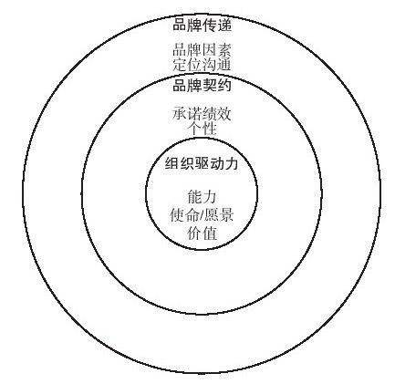
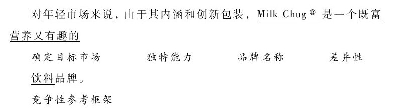
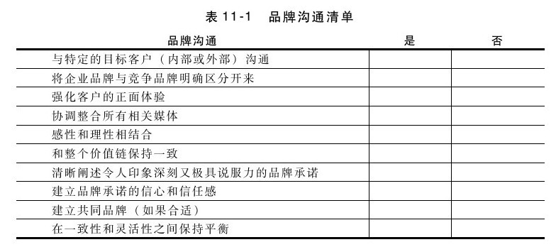

## 品牌资产和定位

强势品牌是企业或产品在客户心目中的概括印象，包括如下：

·差异化和市场细分策略的一部分（如同我们在第6章提到过的那样，丰田和雷克萨斯对不同的市场细分有不同的品牌形象和诉求）

·建立在企业文化、资产、人力资源和价值的现实基础上

·是对客户有关产品性能的隐性承诺和契约保证

品牌是一种对客户能够兑现的隐性承诺，如对客户服务、产品特色、卓越的质量、低廉的价格、有趣又刺激的心理体验或其他利益的承诺。目标客户对这些因素的评价就是品牌资产。这一层次的品牌资产只能建立在信任的基础上。产品定位是指与其他产品相比，如竞争产品或同一产品线的其他产品，客户如何看待你的产品的价值。请你思考一下下列问题：

·你的产品（或品牌）识别是什么？

·这一识别对客户有何价值（品牌资产）？

·和其他竞争品牌相比，目标客户对你的品牌感受如何（品牌定位）？

·客户对你品牌的看法是你想要的吗？是否和你的目标一致？

在宣传某一特定品牌定位之前，产品经理必须确定他们的承诺是否确实能够传递给客户。这就意味着品牌必须和企业的能力、使命、愿景和价值相一致。如图11-2内圈所示，这些是品牌背后的组织驱动力（organization drivers）。例如，如果品牌识别中有一部分是卓越的客户服务，那么企业必须要有训练有素并充满激情的客户服务代表，来提供这种水平的服务。如果品牌形象是创新，企业就必须要有创新的文化和强有力的研发部门的支持。

图 11-2 品牌发展因素 

明确了组织驱动力，品牌发展的下一个层次是确定品牌契约（brand contract）（如图11-2中圈所示）。需要确定客户相信你做出了哪些承诺（例如，快速交货），将其转换为产品的绩效标准（例如，所有订单在48小时内交运）。同时，还需要思考品牌个性的细微差别。你的品牌有趣吗？刺激吗？可靠吗？还是保守？例如，沃尔沃汽车会让人联想到安全，因而具有更保守的个性。

接下来还必须把品牌（承诺、绩效、个性）传递（convey）给客户，如图11-2外圈所示。美国迪安食品公司（Dean Foods）推出Milk Chug®的目的是吸引年轻消费者，公司意识到需要和其他饮料竞争才能成功。因此，公司设计了不同尺寸的独特包装（一种可重复封口的塑料瓶，形状像旧式的牛奶瓶），并推出了各种口味来吸引客户。品牌名称和包装都传递了“有趣”这一个性，和竞争对手相比，产品本身（牛奶）又提供了另一种健康的新选择。我们不妨来为该品牌写一个定位说明。该说明必须指出，客户在购买这一产品时，可能会考虑的竞争产品或其他选择（即竞争性参考框架），我们的产品与竞争产品之间能够区分的差异，特色、服务或其他能证明企业承诺可以传递给客户独特价值的能力等。这些知识有助于未来撰写和评估营销沟通信息。我们可以这样来撰写Milk Chug®的定位说明：

我们接下来评估品牌元素。品牌元素包括（但不限于）商标元素，例如：

·品牌名称

·标志

·符号

·字体

·标语

·广告歌曲

·包装

·声音

这些品牌元素容易记忆、有意义（如对产品承诺的描述）、可（通过媒体和市场）传递、有灵活性并（可通过法律途径）能得到保护？[[1]](part0108.xhtml#ch1-back)

现在，你已做好了准备，可将品牌创建活动整合到营销沟通方案中了。如果营销沟通和以前的强势品牌形象不一致，企业就必须十分小心。例如，几年前，为了促进旗舰品牌的销售，可口可乐发起了一场“激进”的广告宣传活动。与其“温暖又柔软”式传统广告不同的是，新广告讲的是，在家庭团聚时因为没有可口可乐，一位老奶奶发怒的情景；另一则广告讲的是，在中学毕业时，两位好朋友因没有可乐而吵架。消费者和瓶装厂都抱怨这一系列广告“气度太小”，所以很快就停播了。[[2]](part0108.xhtml#ch2-back)从销售渠道到所有客户联系，从企业文具信笺到广告、邮件，都应和品牌形象相契合。请用表11-1所列清单来评价品牌沟通。

思考要点

产品或品牌对客户做了什么隐性承诺？

▶如何保证这些承诺能够并会得到履行？

▶客户怎样看待我的品牌和竞争品牌？

▶品牌个性是什么？

▶标志和其他品牌元素是否传递了我期望的品牌形象？

[[1]](part0108.xhtml#ch1)有关利用品牌元素建立品牌资产的讨论，详见凯文·莱恩·凯勒（Kevin Lane Keller）的《战略品牌管理》（1998年）（Strategic Brand Management：Building,Measuring,and Managing Brand Equity）。

[[2]](part0108.xhtml#ch2)参见贝奇·麦凯（Betsy McKay）和苏珊娜·佛拉尼卡（Suzanne Vranica）在《华尔街日报》上发表的《观众如何看可口可乐的一则失败广告》（How a Coke Ad Campaign Fell Flat with Viewers），2001年3月19日。
