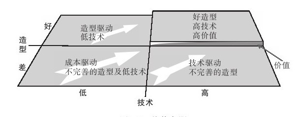

#### 1.3.2 成功的产品不是关注每个方面，而是聚焦于价值象限

2000年，桑格出任了Nupedia的总编辑，他立即着手建立了一个顾问委员会。这个顾问委员会主要由学术界人士组成。在接下来的几个月里，桑格和他的委员会精心设计了一种挑选潜在作家的方式——每个参与者编写的词条，都需经过7个烦琐耗时的评阅步骤，但在接下来的几个月里词条仍然少得可怜。

2001年1月，桑格提出用维基系统管理Nupedia的进度，那是非常简洁的系统，每个人都可以对词条直接提出编辑意见，到今天维基系统已经超过了220万个词条。如果我们从产品研究的视角切入，会发现Nupedia和维基百科的唯一不同在于产品价值的聚焦度。Nupedia希望确保结果的严密，而将焦点很大部分分散到力求过程的严密性，而维基百科则只关注结果的严密性，最终聚焦产品核心价值的设计取得了巨大的成功。

Jonathan Cagan、Craig M. Vogel共同提出一个观点：产品要获得成功，必须有能迅速地被消费者认为是“有用的、好用的和希望拥有的”功能特征和造型，最终提炼出“造型、技术、价值”模型。模型的核心思想是：“为了将造型和技术结合起来，市场、工程技术、工业设计或者互动设计等方面需要相互配合，从而将造型和技术相统一，以生产出让人觉得有价值的产品。”

在互联网刚开始流行的阶段，提供服务的企业还比较少，用户对产品的价值差异并不敏感，但是随着互联网服务越来越丰富，同质化倾向越来越突出，慢慢地，用户对价值的看法发生了很大的变化。同样价值的服务，用户选择更美观的产品；同样的产品特征，用户选择更容易使用的东西；相似的易用性，用户选择更有内涵的产品……用户对产品价值的要求一直在上升，因此产品也在不断地改进和更新换代，意识滞后的企业不断被淘汰，不断被具有创新意识和科学的产品管理体系取代。图1-2所示为价值象限，其非常生动地表达了用户对产品的期望。

图 1-2 价值象限 

产品创新的过程非常类似于自然选择学说。达尔文在1859年出版的《物种起源》一书中系统地阐述了他的进化学说，其核心——自然选择原理的大意如下：生物都有繁殖过剩的倾向，而生存空间和食物是有限的，所以生物必须“为生存而斗争”。在同一种群中的个体存在着变异，那些具有能适应环境的有利变异的个体将存活下来，并繁殖后代，不具有有利变异的个体被淘汰。如果自然条件的变化是有方向的，则在历史过程中，经过长期的自然选择，微小的变异就得到积累而成为显著的变异。由此可能导致亚种和新种的形成。

类似的，产品的进化则存在用户选择的过程。用户总是在满足现有需求之后提出更高的要求，“他们所寻找的是一种完整的、能够体现他们自身价值和素质，丰富他们生活的产品”[[1]](part0143.xhtml#ch1-back)。他们的更高要求迫使产品必须不断改进并将产品设计的焦点移到价值象限，不断地向产品添加价值，持续地进行价值创造和创新。

感谢Jonathan Cagan、Craig M.Vogel，他们提出的价值象限使我们开始重新思考产品质量体系。曾经的质量管理体系（如ISO9000等）一直是我们产品价值提高的风向标，但当涉及互联网行业时，这些标准都失去了意义。我们没有办法通过一个程序是否严密来评估产品的质量，但价值象限则为我们提供了新的标准。互联网产品的质量管理应该以用户价值体系为基础，以服务中获得的最大价值与损耗价值之差作为评估标准。

一个优美的产品设计无疑将提升用户的视觉满意度，一个高效的设计无疑也能减少用户的时间损耗，能为用户创造更大的价值也无疑将对用户获得进行有效的提升。相对的，我们也可以从产品提供的最终价值减去服务过程中产生的层层损耗，从而科学地测量产品对目标集群的价值总量的大小。如果从产品设计的角度进行研究，我们也会发现，价值象限并不是单一要素的结果，而是在各种环境因素下用户反映出来的常态，所以它要求企业产品管理战略必须将建立以用户为中心的产品开发体系作为重点。

在价值象限中，第三个维度——价值维度是非常难以预估的，但是它是产品的核心，所以又显得如此重要，我们不得不以审慎的态度去研究它。为此，Cagan和Vogel建立了价值机会理论模型，他们将价值分解为可用性、易用性和用户期望的各种具体的产品属性，而这些属性和艺术联系在一起，为用户创造了一系列的体验，而这些体验又是从产品表现上测量产品价值的高低的基准。

所以他们建立了一整套测量体系来评估产品的体验，称为七个价值机会：情感、美学、个人形象、人机工程、影响力、核心技术和质量。面对日益细分且同质化趋向明显的互联网行业，根据潜在而有不确定的需求的预测去设计新产品，必须将价值细分到每一个层面进行严密的细分，从而确保价值机会的预估的准确性。这些经过严密分析的可能存在的价值机会共同形成了产品的核心价值体系的价值链愿景，从而形成产品设计的核心价值理念，我们将在以后的章节中详细描述。

[[1]](part0143.xhtml#ch1)引用自《创造突破性产品》一书。
