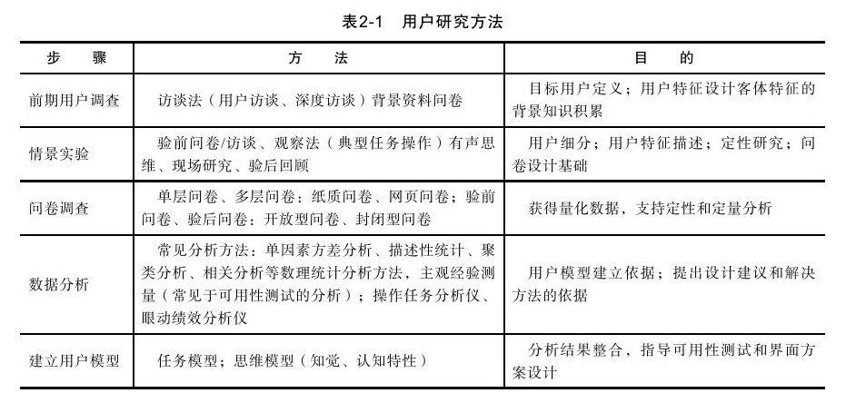

#### 2.2.2 用户研究方法与理论概述

用户研究是以用户为中心的第一步。面向用户的调研和普通的调研方式的不同，用户研究通常采用定性研究方法。因为定性研究必定意味着调查样本较小，开放性内容研究较多，所以用户研究项目总是伴随着结果的精确性问题以及调查广度和深度的平衡问题。尽管如此，用户研究也是可以通过机制流程来进行管理的。

用户研究项目的展开通常是因为发现某个很有价值的产品概念，或者数据曲线显现出异常的变化趋势。在大多数情况下，用户研究的项目背景信息对整个研究项目都具有非常重要的意义，而且是整个用户研究项目的起点数据的一部分。通常用户研究项目有两个目标：一是通过调研锁定用户需求和用户期望，二是获取已锁定问题的原因和了解问题的产生条件。当探寻用户需求时，我们需要控制调研的边界和问题的开放程度，促使调研在可控范围内进行，并尽可能深入地挖掘核心信息；当探寻问题存在的原因时，我们的调研重点应当偏向于客观问题的描述和深挖，切勿将用户当做“问题解决专家”或者“设计专家”。

通常的用户研究方法如表2-1所示。

并不是使用更多的方法进行用户研究便能够获得更多有价值的信息，企业用户体验实践方案的关键在于能否适应企业自身情况和企业的用户体验发展阶段。在敏捷程度较高的企业中，通常用户体验实践方案中数据分析占有较大的比重，而敏捷程度较低的企业则通常用户调查和情景实验占有较大比重。

用户研究项目的管理也可以纳入PDCA产品管理范畴，包括研究计划与筹备、研究执行、研究分析与总结。因为各个项目的研究目的和研究偏重的不同，而且每个项目通常包括非常多的方法和流程，所以用户研究项目在详细的策划准备工作之后才能进入启动阶段。接下来我们会一一介绍各种研究方法和具体实践。
