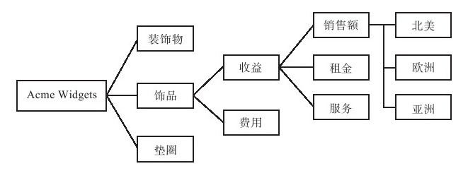

#### 2.3.3 整合——思绪整理术

整合，从另一个角度看也是综合性价值的结构化。分析，不断地分析，深度地分析，是整合的基础。但是问题在于：现实中我们可能获得太多的数据，用各式各样的方式去分析它们可能带给我们思维的乐趣，但是它无益于解决问题。要在可控的时间和资源下解决问题，我们必须知道什么样的分析是主要的，什么样的分析是次要的。

迪克·布里克控股公司（某个艺术品零售供应商）的首席执行官鲍勃·布什斯巴姆（BobBuchsbaum）认为：“在假设驱动的所有路径中，找出障碍最少的路径，做出假设，得到方向正确的答案。我们有一条格言：‘从来不可能有足够的数据和时间。’我把它解释为：‘做事情赶早不赶晚。’对于我们这样一个收入仅9000万美元的小企业，我不能让自己和公司的职员违反这些规则。渐渐地，我发现公司的职员已不再为商业问题建立‘统一理论’了。”

分析问题的诱惑在于，我们总是更愿意出于兴趣去分析问题而不是目的。在整个分析规划过程中，我们必须意识到，我们的分析是为产品目标而服务，思维的重点在于5W1H。

此外，从问题分析的层级来看，核心问题总是可以分解为一些关键问题。我们需要理解问题的优先顺序，这样我们便可以弄清楚针对什么问题的分析是“关键性的”，针对什么问题的分析是带有“滞后性的”，针对什么问题的分析是“无关的”。

以上，我们构建了一个3D思维，我们首先通过问题的5W1H确定了问题的区间，再通过问题优先的等级确定了问题与核心价值之间的关系，这样我们便对问题进行了空间定位，其重要性就在于我们能够清楚地看到问题的全局。

当我们确定了某个问题与全局的关系后，我们如何对问题进行不断的结构化分析呢？“MECE, MECE”，结构化不断帮助我们进行思考。问题是不是能够细分？问题是不是能够确定范围？问题能不能找到解决的模型？问题能不能得到解决？即使我们分析时遇到了非常大的困难，我们仍然能不断地缩小问题的范围，直到问题被描述得非常清楚，进而我们寻找答案提供契机。进而言之，只要向正确的方向，运用“结构化”的方法，最终还是能获得结论的。

分析的目的依然是整合，不断的结构化，不断的整合。结构化是我们将信息不断地分散和将分散的各个部分整合的最佳方法，对应的，逻辑树是将“结构化范式”清晰表现的最佳方式，清晰的逻辑树是规划的基础。当我们面对爱斯基摩人为什么会愿意使用冰箱时，显然是需要将这个问题细分为比如冰箱有什么好处、爱斯基摩人的文化特征、生存环境特征等。我们可以用逻辑树将这些问题统一起来。

小知识：麦肯锡逻辑树分析法

1.逻辑树分析法简介

逻辑树又称问题树、演绎树或分解树等。

麦肯锡分析问题最常使用的工具就是“逻辑树”。逻辑树是将问题的所有子问题分层罗列，从最高层开始，并逐步向下扩展。

把一个已知问题当成树干，然后开始考虑这个问题和哪些相关问题或者子任务有关。每想到一点，就给这个问题（也就是树干）加一个“树枝”，并标明这个“树枝”代表什么问题。一个大的“树枝”上还可以有小的“树枝”，以此类推，找出问题的所有相关联项目。逻辑树主要是帮助你理清自己的思路，不进行重复和无关的思考。

逻辑树能保证解决问题的过程的完整性；它能将工作细分为一些利于操作的部分；确定各部分的优先顺序；明确地把责任落实到个人。

逻辑树是所界定的问题与议题之间的纽带；它能在解决问题的小组内建立一种共识。

2.逻辑树分析法的特点

如果你多次采用逻辑树分析法从不同角度去分析问题，你会发现从任何一个角度构建的逻辑树都不同，有时甚至背道而驰，对，这就是逻辑树分析法的最大的特点：问题是逻辑化的，而且没有唯一的解。

如果我们能够从多个维度思考问题，则会发现当我们的思路具有很好的逻辑性时，“即使路不同，但是条条大路通罗马”。即使可能问题的构建展示了问题的矛盾，但是恰好证明了问题的复杂性，而且使问题也被考虑得更加周全，它简化了思考，更使我们认识到的事件的本质简化了。

3.逻辑树的使用范例

我们以Acme Widgets的案例为基础来简单描述下的逻辑树的使用原理（以下摘自《麦肯锡意识》）

以历史悠久、经营良好的蓝筹股公司Acme Widgets为例。假设该公司董事会聘请你的团队解决“如何增加盈利”这一基本问题。当听到这个问题时，你脑子里闪现的第一个问题是：“你的盈利从哪里来？”董事会回答：“来自我们三个核心产品：装饰物、垫圈、饰品。”

“啊哈”，你暗自想：“这个问题的逻辑树的第一层有了！”接下去，你可以对每种产品的收入流进行细分，通常分为“收益”和“费用”两项，这样你就得到了逻辑树的第二层，如此下去。在结束任务前，你就绘制出Acme Widgets商业系统详细的逻辑树图，如图2-2所示。

图 2-2 Acme Widgets的逻辑树 
