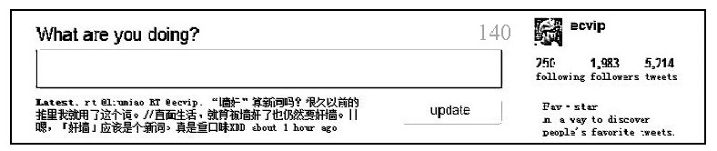

#### 2.3.4 概念测试

“总是存在大量的试验和错误……你在观察与理论之间反复。没有理论，你不知道寻找什么；没有观察事实，你也无法检验理论……我相信，在一项研究的过程中，反复移动会发生几千次，甚至上万次。”

——Joshua Lederbery，诺贝尔奖得主，1958年

当我们拥有了非常多的、系统的好想法时，我们是不是就应该立即投入到输出工作中呢？不！虽然我们为自己的想法激动不已，但是正确离我们还有一段距离。我们要对自己的想法进行测试。如何测试呢？我们不妨回味一下Joshua Lederbery的思想。概念也可以测试！概念测试就好像实验室工作一样，我们把很多的概念原型放到试管中，假设某些概念测试的结果是积极的，那么这些方案将被挑选出来进行更深一步的改进。当然也有可能最后一个都不剩下，那时我们就得回溯，概念提取就是这样一个不断迭代的过程。所以概念测试的主要目的包括：

·从一系列方案中选出最合适的方案；

·对该概念的商业前景形成一个初步的看法；

·验证目标用户群；

·获得更深一步的产品设计的方向信息；

·重新认识产品定义。

互联网产品的概念测试包括定性测试和定量测试，但是由于定量测试的环境复杂性可能造成数据的较大偏差，相对而言定性测试更具有参考价值。此外，定性测试可以更好地深入了解用户心理、偏好，以及群体表现的因素，为概念的改良提出方向。在概念测试阶段，主要采用的定性研究方式包括深度访谈、焦点小组研究等；主要采用的定量研究方法主要是用户使用习惯和使用环境的统计数据等，这个测试所获得的数据是可以是诊断性的，也可以是预测性的。

模板：定性测试准备表格

某微博产品概念测试：

该微博产品……

1.如果上面所描述的产品可以免费使用，您有多大兴趣会使用？

A.肯定会使用 B.可能会使用 C.可能使用也可能不使用 D.肯定不会使用

2.如果手机客户端使用将会收流量费，您愿意使用吗？

A.肯定会使用 B.可能会使用 C.可能使用也可能不使用 D.肯定不会使用

高级管理者必须意识到概念测试的重要性，并且把握概念测试的程度以及过程的科学性。在整个概念测试的过程中，被测用户的提取、测试环境对测试结果的影响、测试过程的科学性、测试结果分析的严密性这几个因素都是保证整个测试有效性的关键因素。高级管理者需要对这几个关键点进行质量分析，从而保证整个测试结论的有效性。
