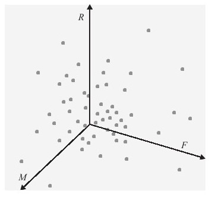
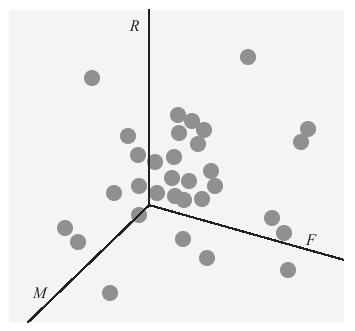
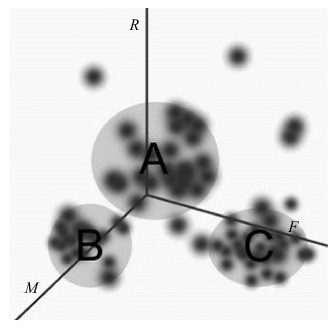
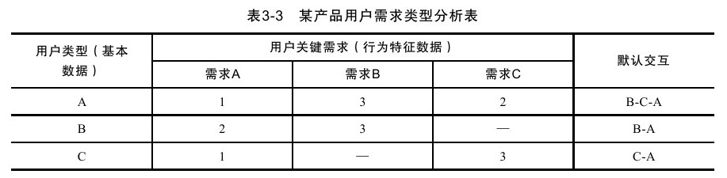
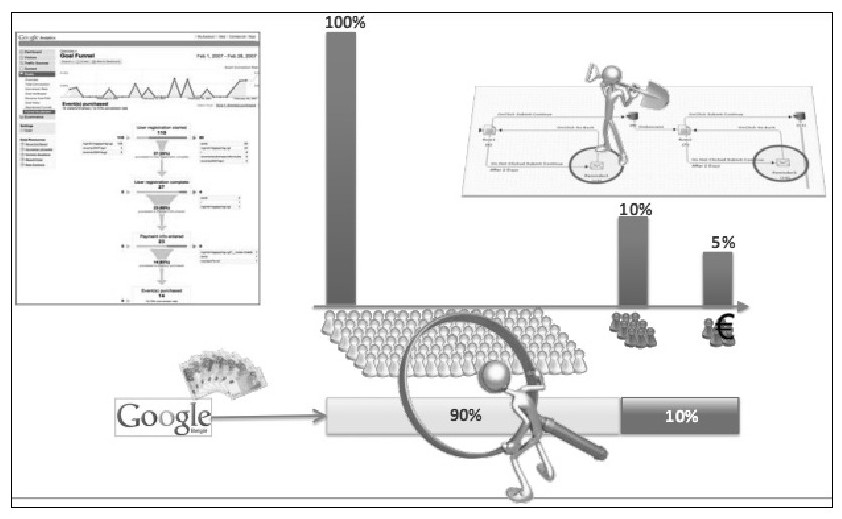
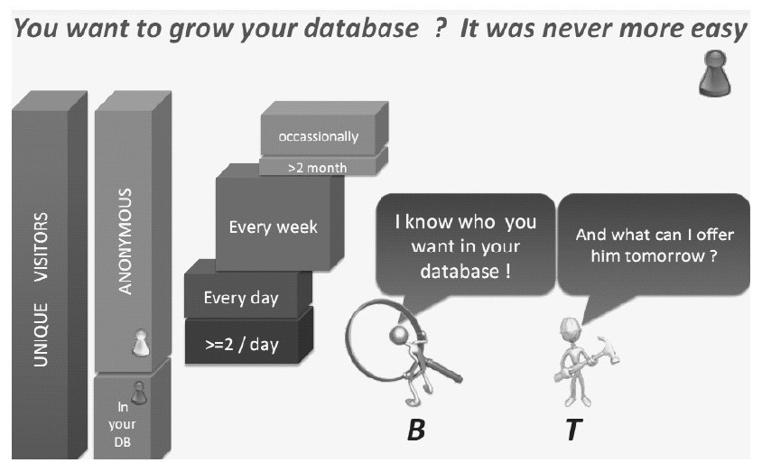
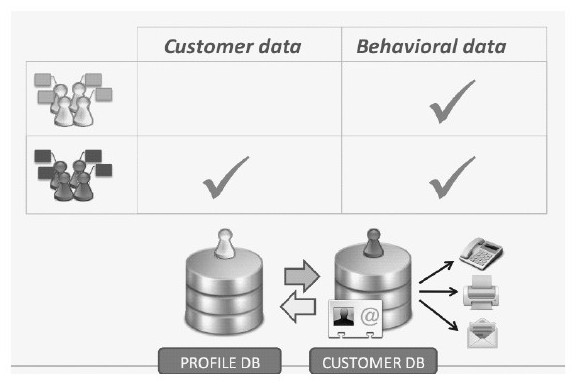
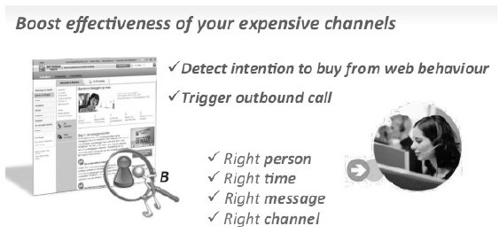
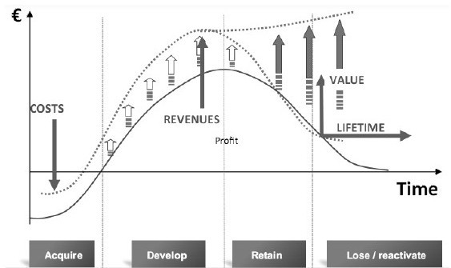

#### 3.5.4 以运营为中心进行数据管理平台建设

中国古代航海业非常发达，这与指南针的应用密不可分。在航海过程中通常会因为风暴、气候等原因不断地调整航行路线，而在指南针用于航海之前，海上航行只能依据日月星辰来定位，一遇阴晦天气，就束手无策。而在指南针用于航海之后，不论天气阴阳，航向都可辨认。史籍中最早记载指南针用于航海的是在北宋。朱彧在他的《萍洲可谈》一书中评述了当时广州航海业兴旺的盛况，同时也记述了中国海船在海上航行的情形，他说道：“舟师识地理，夜则观星，昼则观日，阴晦观指南针。”企业在运营中，就好像是航海一样，通常会遇到不同的事件，而就好比天气会使航海迷途一样，企业很容易在运营中迷途。数据是唯一能够反映企业运营方方面面的依据，而数据管理平台则是企业的指南针，而如何建立一个优秀的数据管理平台必须成为企业重点关注的问题。

虽然数据管理中心如此重要，但是由于每家企业的业务不同、管理体系架构不同、环境不同和资源配置不同等导致实施难度上升，企业实施数据管理中心的成功率依然很低，一些企业则不愿意进行数据管理中心实践。事实上在大多数数据管理中心实践项目中，失败是因为业务规划不清晰、数据管理中心项目目标不明确、经验不足等引起的，但是这些问题并非误解。在成功的数据管理平台建设中，我们发现有几个重要特征：

（1）清晰的以运营为中心的规划逻辑

我们通常可以看见很多企业数据库中存储了大量没有意义的垃圾数据，这些垃圾数据不但对运营没有什么作用，而且会影响我们的判断。对于数据管理平台建设来说，数据规划的目标没有做到足够清晰通常是致命的。清晰的数据规划来自于清晰的运营目标和运营管理逻辑。比如在客户细分中，我们需要非常清楚地细分规则以及依据，而其与运营指标一一对应——比如企业为了提升综合转化率，对18~22岁的客户投放A类型广告，而对22~25岁的客户投放B类型广告等。数据管理平台建设不仅要基于运营思维，而且更要满足运营需要，其前提是运营思维要清晰、逻辑要合理。

（2）灵活，能够满足敏捷分析和敏捷开发的需要

由于运营方式通常需要不断变化，所以数据管理平台必须足够灵活，这不仅要求数据能够被灵活地管理，而且要求数据管理平台能够支持敏捷分析和开发等。比如当对A类用户进行A类广告EDM营销的方式调整为对A1类用户发送A类广告而对A2类用户发送B类广告时，我们不仅需要通过简单用户重定义提取该类用户，而且要求能满足敏捷开发快速上线和数据分析的需要，并且下一次运营调整也能快速满足需要。

（3）易用

数据管理中心通常比较复杂，使用起来比较困难，所以易用性对数据管理平台的使用来说非常重要。易用性强，是数据管理中心的关键。

如果我们在规划中能做到足够细致的话，以上三点其实并非难以达到。但是在具体实践中总会遇到诸如各部门沟通基础、公司标准化实践、公司业务体系框架改良等问题，这些问题对数据管理平台的建设往往具有非常大的影响。那么如何构建一个优秀的数据管理平台以及有哪些必要的过程呢？我们建议从以下几点入手。

（1）跨部门沟通，明确业务目标和运营目标，达成共识

任何优秀的组织都强调沟通机制的完美，而数据管理平台涉及组织中各个部门利益，所以更需要通过沟通明确业务目标和运营目标以达成共识。数据管理平台的建设不仅涉及运营，还涉及绩效管理、公司业务体系改进等，因此通过沟通达成一致也并非容易的工程。我们建议在沟通前了解所有相关部门的目标和业绩指标，以能够协助相关部门改进工作绩效为基础，进行全方位的沟通并致力于协商解决，必要时适当做出退步换取进步空间也是明智的。

（2）将运营思路融入产品规划中，制定数据管理平台产品管理方案，并听取相关组织意见进行优化

任何事务并非完成协商便意味着事务能够顺利解决，数据管理平台就充分具有这样的特征。在完成项目调研和规划之后，不仅需要制定产品规划方案，还需要进行相关的使用和管理建议，并听取相关组织的意见对整套产品管理方案进行完善和改进，争取获得尽可能多的相关部门支持，在其后的具体执行中，在获得充分的支持下完成项目。

（3）执行产品管理方案，并监督使用情况，加以完善

产品管理方案完成之后，需要和通常的项目一样进入项目管理环节，在PDCA循环中不断进行改善。本书后面的章节中也谈到了项目管理的内容，同时推荐阅读《项目管理之美》，这本书非常生动地描述了优秀的项目管理是如何实现的。

（4）推动并促进公司具体运营事务基于数据管理平台进行分析和决策

拥有良好的数据管理平台并不等于数据中心的成功，企业必须将数据作为所有业务沟通的基础时，才能良好地执行PDCA管理，才能使企业进入良性循环。因此，完成数据管理平台的开发以及规则执行并不意味着项目成功，这只是一个项目的开始，只有通过不断推进公司具体运营事务基于数据并养成良好的习惯才算具备了成功的因素。

（5）推动数据管理平台成为企业管理的核心内容

数据管理平台的另外一方面是企业管理机制的内容。我们认为透过数据进行企业管理是目前比较科学的管理方法。企业管理如果能够基于数据则避免了太多感性因素在决策中的影响，这将会使企业管理者更加睿智和更具有洞察力，因此推动数据管理平台成为企业管理的核心内容应该成为一项长期不懈的工作来执行。

数据启示的互联网产品设计[[1]](part0186.xhtml#ch1-back)

Facebook的产品设计经理Adam Mosseri曾经做了一个非常棒的演讲《Data informed, not data driven》。这里提到了两个概念：“数据驱动”和“数据启示”。这里的数据驱动指一切产品设计行为都以数据为核心，而数据启示则指把数据作为辅助手段来影响产品设计。产品人非常容易陷入数据中难以自拔，一方面是因为很多评估产品设计的指标通常是非常明确的指标数据，另一方面是因为产品人通常对数据过于敏感。而Adam Mosseri的产品设计思想的核心在于不是以数据驱动的方式设计产品，而是把数据置于合适的位置融入整体产品的设计，既不过分依赖数据，又不完全脱离数据，我深以为然。Adam Mosseri认为过度依赖数据可能导致“微优化”（micro-optimization）和局部最大化（local maximization），所以数据应该是启示性的而不应该是驱动式的。那么如何充分利用好数据以协助产品设计呢？

一、用户行为是产品之魂，用户数据是产品之魄

通常产品设计通过用户研究、概念设计、交互设计、细节设计等一步一步地接近理论上想要的样子，但即便我们能认真地遵循每一步骤细致地完成工作，产品距离用户想要的依然很远。其中的原因很简单，我们的用户研究中用户角色的细分是有限的，而用户与用户之间的差异性是必定存在的，对用户分类的颗粒度越大那么离用户想要的就越远，这就是用户体验设计方法的天生缺陷。例如在常规的消费者数据挖掘的RFM（Recency最近一次消费，Monetary消费金额，Frequency消费频率）模型中，我们可以根据用户数据特征进行用户行为建模（利用XYZ坐标建模），得到用户行为分布图谱，如图3-11所示。

图 3-11 用户行为分布模型图 

我们从图3-11中可以看到用户行为密集状况，同样的，如果假设每个点的半径变大，我们可以预见到，用户分布图中点与点必然产生交集并聚类。半径越大则聚类越少，同一聚类中用户的差异越大；半径越小则聚类越多，同一聚类中用户的差异越小，如图3-12所示。

图 3-12 用户聚类分布图 

用户行为聚类的价值在于我们可以清晰地甄别出每种用户类型之间的区别，从而使产品设计更加贴近用户，常见的应用方式包括EDM营销，针对不同的用户进行不同的页面和广告展示等。当然RFM模型只是其中一种方式，还有很多其他的模型也可以进行用户细分，而因地制宜地选择数据模型也是技巧之一。

所以我们可以通过用户数据来对用户进行聚类分组，发现典型用户和构建角色模型等。数据建模不仅基于用户行为而且也直观地反映了用户行为，数据建模的准确性和适应性对产品设计有决定性的影响，所以我们认为行为是产品之魂，数据是产品之魄。

二、数据是产品的价值表现，但不是价值核心

也许所有的产品经理都希望产品数据非常漂亮，但是相比数据的完美程度，更重要的是价值核心。如果100%的坚持数据导向则不可能产生真正的创新，如果想要真正的创新则必须坚持用户价值导向。事实上很多优秀的创新完全抛弃了我们过去对产品评估的那些数据。假设Twitter完全以PV和IP为导向那么它一定不可能是今天的样子。

Adam Mosseri给我们提供了一个案例：Facebook的应用菜单设计曾几经周折，先是把位置从左边换到顶部，还曾为了提高流量而考虑使用蓝色大按钮的方案，尽管不断优化，但项目却最终出现了停滞不前，达到局部最大化（local maximization）瓶颈，最终则完全推翻了之前的方案并重新开始设计了目前的版本——这个版本有一半回到了最初的样子。另外一个例子是照片上传，虽然团队一直在优化，但是成功率却几乎不变，成为另一个瓶颈。在之后的总结中，Adam认为真正的问题在于坚持方向的错误——“害怕数据变差而拒绝变更，仅仅是局部的优化”，这也理所当然地成为大多数成功企业失去产品创新能力的本质原因。

“一切围绕数据”已经成为做产品最容易犯的错误之一，当然我们并不是说数据不重要，而是强调相比用户需求和用户体验而言，数据稍显次要。但与此同时我们必须认识到数据是用户需求和用户体验的最直观表现，数据虽然是配角但也是最重要的配角。坚持产品以用户价值为中心是产品之道，坚持通过数据分析、挖掘以及通过其他手段发现深层次的用户价值则是产品之术，以道驭术才能创造成功产品。

三、利用数据实现最佳用户体验

多年前谈及用户体验就已经产生了诸多“什么样的形式损伤用户体验”之类的争论，经过了许多年，这类争论依然不休。事实上如果项目经验足够丰富而且每个项目负责人都认真倾听了用户心声的话，一定会得出一个结论——没有什么样的形式用户体验一定是好的！回想很多年前做某银行客户端产品创新项目时，曾有一个没有任何网络经验的老大爷出现在用户研究项目中，而因为其对电脑的不熟悉大大超出了所有在场的用户研究员的预期而使用户研究项目难以进行。也许我们认为这情有可原，但也许再多几分用心的话，这也许会促成一个极有价值的创新。今日重新回归这个案例时，我们不难发现当时存在的核心问题：因为研究时缺乏数据而错误地预设了某类用户成为目标使用人群而导致过于关注“如何让这一类人群最佳使用”而非“如何让存在需求的用户实现价值”。

“什么是最佳用户体验”将会成为永恒的话题，在这个话题上我有几点看法：底层用户体验源自于核心业务能否满足核心需求；基础用户体验源自于核心用户使用是否能够普遍满足；中级用户体验源自于用户使用是否产生了较好的感官体验；高级用户体验源自于是否对每类用户足够细分并且无微不至；更高级的用户体验则源于超越用户期望的情感体验。同样的，最差的产品来自于基本业务面向一个空白的客群（我们也可称为针对外星人的业务），这些产品的特点是：从来没有经过任何数据分析和用户调研，而是直接拍脑袋的结果。稍好一点的产品则能够基本满足一部分人的需求。更加优质的产品则不仅考虑需求的问题而且开始注重用户的感官体验，国内大部分的优秀企业都做到了这样的层级。更上一层的企业则通过数据挖掘能够将客户类型细分到合适的颗粒度，并非常体贴地针对每一类型客户进行产品设计。比如Amazon在这方面做得便较为出色，每个类型的用户打开同样的Amazon却会看到不同的而且是他们想要的东西（有传闻说其数据挖掘程度甚至做到了对同一个产品给不同细分用户不同价格并且让用户接收并购买）。还有一些更为细致入微的企业则充分考虑到了用户的需求，他们在任何你需要他们的时候都会恰当地出现在你的面前。

在互联网产品中，真正做到细致入微，不仅需要对客户有200%的了解，还需要有能力构建出他们最想要的产品，而构建的途径则是数据分析。为了让每一类用户都能得到最佳体验，产品的用户体验架构就必须建立在数据的基础上。这样的产品必须能足够细分用户层级，这不仅需要开发人员具有非常专业的人机交互的功底，而且需要丰富的数据分析经验。当面对数据时，我们首先需要通过分析数据特征来构建基本的业务流程，再通过深入挖掘来进行业务细分，这样就可以避免由于概念设计中情景假设失误而导致的业务构建失误问题，而且可以将数据和业务结合发挥立体效应。在进行具体交互设计时，我们需要把客户特征抽象成特征数据（比如之前提到的RFM模型抽象就是数据抽象方法的一种），设计多种业务以满足每一类用户的需求（有时候用户类型可能多达上百种，如果产品经理能够充分理解数学中的排列组合，那么事情将会变得容易得多），再将这些业务进行合适的规划和关联，形成最优的交互设计图，如图3-13和表3-3所示。

图 3-13 某产品的用户RFM数据分布图 

如图3-13中所示的案例，我们先通过RFM图形对用户类型进行细分后聚类为A、B、C三种。在了解A、B、C类用户的核心需求之后，我们只需要通过数据挖掘进行细分就可以对应地找出每一类用户，并设计不同的交互流程以满足不同用户的需求，使得用户在使用过程中如同使用特别定制的产品，从而使用户需求的实现变得更加容易，能够处处体现出对客户的关怀。从另一个角度来说，只有基于数据的用户体验框架才能实现最佳的用户体验。

除此之外，一些常见的数据指标组合也是评价用户体验的重要手段，比如常见的“UV-UT指标（用户浏览页数和单位浏览时间）”、“IP-PV指标（用户IP和用户浏览页数）”、“转化率-用户忠诚度指标”、“用户活跃度-业务转化率指标”等。这些数据指标直接反映了产品的经营状况，更为直接地反映了产品的用户体验情况，也是用户体验框架中非常重要的一部分。

四、培养数据意识

伴随着互联网的发展，创新越来越难，而业务要素也越来越复杂，今天的产品经理已经慢慢变成复合型人才了。合格的产品经理不仅需要产品设计能力、用户体验功底和数据挖掘和分析能力，还需要超出一般人的远见卓识。国内大部分的产品经理大多有设计或技术背景，数据意识相对不足，这也是大部分企业所面临的问题。如果产品经理缺乏数据意识则会导致整个企业产品以主观思维为主导，产品风险必然成为企业的定时炸弹。

首先，企业必须建立以数据为参考的对话机制。诸如用户特征、用户行为习惯、用户消费习惯都必须以数据模型的方式进行抽象，产品设计则必须以这些抽象模型为基础。这首先避免了对用户认识的主观化，而且产品设计思路也将更为清晰，甚至于企业的产品运营思路也将会以之为范本。

其次，将产品的用户体验标准数据化作为产品标杆。用户体验虽然是较为主观的内容，但是也可以通过合理量化作为产品标杆。比如用户浏览时间的分布情况、APP流量情况等，这些都可以作为产品设计的方向。但要注意，用户体验数据标杆必须适宜且合理，否则反而会产生相反的效果，比如有的产品经理为了提高PV而在不应该分页的地方进行分页，为了加速交互速度而去掉不应该去掉的填写字段等。

最后，产品不应该以数据为渠道，而应该坚持用户价值驱动。此处要再次重申一下Adam Mosseri的产品设计思想：Data informed, not data driven。数据的价值在于发掘用户价值，而不是取代用户价值。产品必须坚持用户为体、数据为用的思想、以道驭术、勇于创新，此为产品成功之道。

此外，在过去的大多数案例中，很多企业在执行数据分析方面是消极的，更多的是对数据视而不见，对用户需求的变更视而不见，这不仅是国内互联网企业的通病，也是互联网企业短命的主要原因之一。我们建议数据分析工作的执行程度一定要与产品团队的KPI体系结合起来，形成较好的激励和惩罚机制，这是形成职业化产品团队的一种非常有效的方法之一。

案例：某基于数据的运营管理平台核心思想介绍

图 3-14 分析来自各种渠道的用户行为数据，充分理解用户 

图 3-15 通过用户行为数据分析洞察目标用户需求，聚焦用户需求以及用户关注内容 

图 3-16 基于用户行为数据和用户数据，通过多渠道营销提高客户转化率并有效提升用户体验 

图 3-17 有效的数据总是能够帮助获得更好的业绩 

图 3-18 通过数据管理平台，更好地实现客户生命周期的管理 

[[1]](part0186.xhtml#ch1)原文最初发表于《程序员》杂志。
