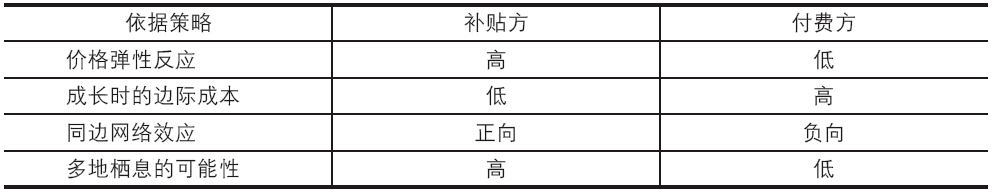

## 3.4 如何提供价值——选择什么样的价格补贴策略

在我们定位好了产品的用户以及这些用户的需求后，还必须考虑到我们的产品采用什么样的价格来吸引这些用户。也许有的读者会认为，同类产品市场上都在免费，那我也免费好了。殊不知，有的产品是对普通的用户（买家）免费，而对商家收费；有的产品是对女性用户免费而对男性用户收费；还有的产品对前30天内使用的用户免费而对30天后的用户收费。价格策略不一而同。如果我们以和竞争对手同样的价格服务于同样的用户，满足同样的需求，那么我们相当于没有产品战略，也就没有产品的竞争优势，因此制定适合自己产品的价格策略也是产品成功的重要一环。

我们都知道，由于互联网行业竞争极其激烈，用户迁移成本很低，因此基本都需要通过类似于“免费”、“低价”等价格“补贴”策略来吸引用户。我们采用《平台战略》的说法，把产品提供费用上补贴的某类群体用户称为“被补贴方”，反之，把能为产品带来持续稳定收入从而支持产品发展的某类群体称为“付费方”。我们制定互联网产品的价格策略的核心就是确定好“被补贴方”和“付费方”。

比如，百度搜索的“被补贴方”是普通的C用户，而付费方就是广告主，也就是商家。淘宝的“被补贴方”是买家，“付费方”是卖家。那么产品应该将哪一类群体用户设定为“被补贴方”，哪类设定为“付费方”呢？我们结合互联网产品的行业特点并引用艾斯曼、帕克等人所著的《双边市场的策略》中的观点为读者提供参考，如表3-2所示。

表3-2 互联网产品定价策略

如果某方用户对价格弹性反应的程度较高，则将其界定为“被补贴方”。比方某电商网站稍微一降价，普通互联网用户纷纷就流向了该网站，那么这类用户就应被界定为被补贴方，至于商家，电商网站对其收费涨价，多数情况下该商家是不会离开的（当然涨价幅度不能太大），如几乎很少有淘宝卖家因为天猫的服务费涨价而离开天猫。

如果随着产品销售额的增加，每增加一个用户，产品所额外增加的成本较高，则该类用户为“付费方”。现在电商网站将商家界定为付费方的一个重要原因是，每增加一个商家，电商网站往往要投入一定程度的服务成本，如签约、上货、提供物流配送服务、客服服务等。相反，增加一个互联网用户对电商网站来说几乎不增加任何成本。

如果某类用户的增长可以激发产品正向的网络效应，那么这类用户就是“被补贴方”。读者思考下QQ、微信、易信为什么对用户免费就会很快理解这一点了。相反，如果某类用户的增长无法激发正向的网络效应，那么产品就要对这部分用户收费了，比如《征途》游戏里的“有钱人”。为什么我们说这里的“有钱人”必须是付费方呢？其中一个重要的原因是：1个有钱人得需要100个玩家来服务他，比如为他制作一些游戏里的道具用品、听候这个有钱人的差遣，以及提供一些能使这个有钱人产生优越感的各种玩法，等等。有钱人多了，必然需要有百倍于他的普通玩家来玩，这个游戏的生态系统才能健康（如果大家都是有钱人，没有游戏中的穷人，那么有钱人就无法在游戏中体会到自己的优越感了）。

如果某类用户倾向于在多个同类产品之间不停转移，甚至转移成本很低，也就是多地栖息的可能性很高，如普通的C用户之于各大电商网站，那么产品最好把这类用户归为“被补贴方”。
