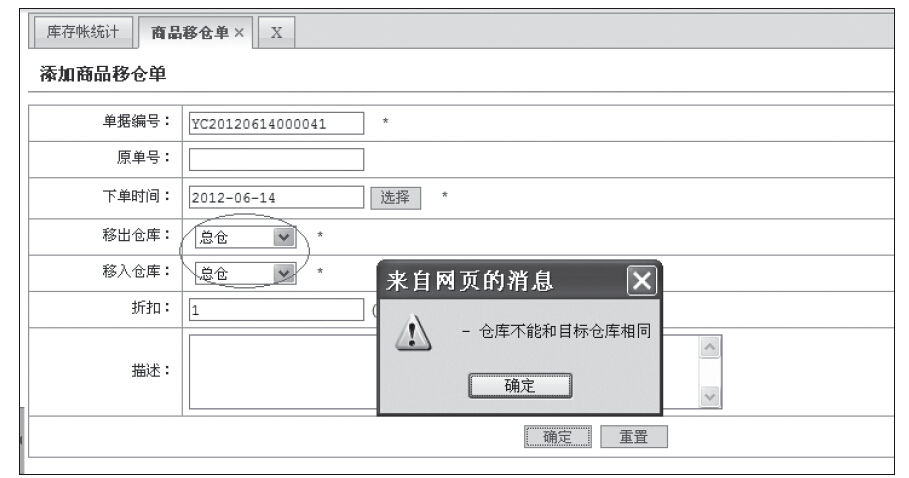
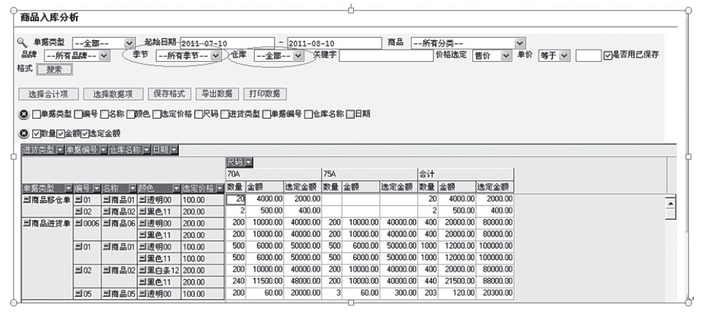
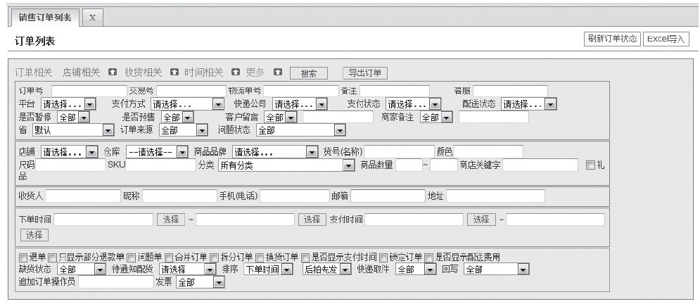
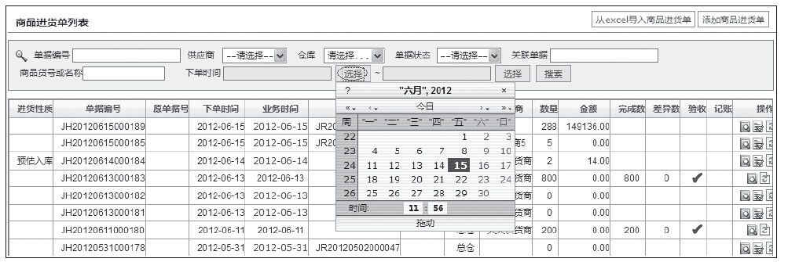

### 5.5.3 体贴就会让用户感觉简单

在第1章中我们就为大家介绍过，好的产品都是体贴的，而体贴的产品也会让用户使用起来感觉轻松、简单。下面我们以所有产品界面元素中最常见的类型——“表单”中的交互细节为例，向大家介绍如何设计体贴的产品从而让用户感到简单。

完美的表单可以帮助用户减少阅读及操作数据时的困难、提高用户完成效率及大大减少用户犯错的几率、节省用户的操作时间、带给用户更好的操作体验，总之，简单！当然，完美的表单可以为产品经理们带来：更少的服务成本、更好的产品、更高的商业价值。

以下是笔者曾经为一家软件公司提供的表单交互的优化建议，主要从四个方面来设计、优化表单的交互：即时验证、多余输入、额外输入（额外显示）、基于选择的输入。

（1）即时验证

优化：考虑使用即时验证，以确认或建议有效答案，并帮助用户在限制范围内输入。此点设计的好处远远大于等到用户犯错后再给予提示。

有些页面等用户操作完毕，点击“确定”提交后，才出现错误提示，如图5-14所示。

图5-14 “移出仓库”与“移入仓库”没有即时判断

建议：如果需要即时验证，则在用户输入完答案后进行判断，不要在输入过程中做出判断。如图5-14所示，在鼠标离开移入仓库后，系统再对“移出仓库“和”移入仓库”对应的逻辑进行判断。

（2）多余输入

建议：通过恰当设置满足多数用户需要的默认选择，智能默认（即在满足多数用户需要的地方放置选择）可以帮助用户填写内容。

如图5-15所示，起始日期：7月10日——8月10日。则季节可以默认为夏季。再智能一些，仓库甚至默认为用户最常用的仓库。

（3）额外输入（额外显示）

对于操作项太多的页面，可以考虑此点优化：即时增加提供额外的输入框给需要的用户，同时不会阻碍不需要的用户。如图5-16所示，可以将一部分选项隐藏起来，当用户点击“更多”时，再展开其余不常用的选项。

图5-15 “季节”、“仓库”没有智能默认

图5-16 输入项太多，没有做必要的隐藏

说明：

1）设计前，务必确保80%以上的用户不需要“更多”所隐藏的选项。

2）根据需要，主要内容应总是直接而且可见，次要内容应当点击一次即可见。不建议出现类似点击“更多”后再次点击“更多”等要进行2次或2次以上操作的即时增加设置。

如果需要显示大量额外输入，可以考虑采用叠层（浮层）方式（如图5-17所示的关于“下单时间”的选择项，点击“选择”，出现“日历浮层”）代替即时显示方式，以避免页面增加新内容时过度跳动从而给用户造成困扰。

图5-17 “日历浮层”

（4）基于选择的输入

基于选择的输入，就是根据用户的初始选择来显示后续问题。即，用户选择了一项表单内容，后续表单内容依此相应出现。

如果将来采用此类设计，主要注意以下几点即可：

1）任何情况下，要保证初始选项之间的联系清晰。不要让用户看不到顶级初始选项。

2）任何情况下，清晰显示基于选择的输入项和触发控件之间的关系。最好的方式是：使用颜色背景来显示这种关系。

3）任何情况下，都要避免页面过多跳动，页面跳动会中断基于选择的输入项和初始选项之间的关联。
