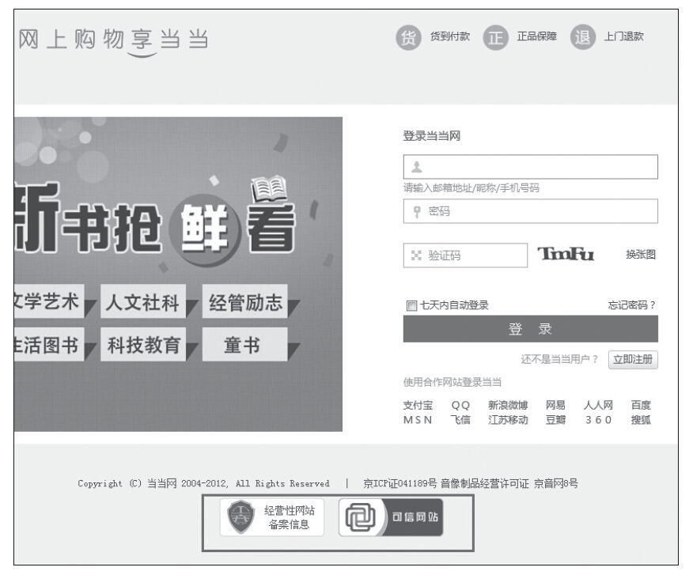
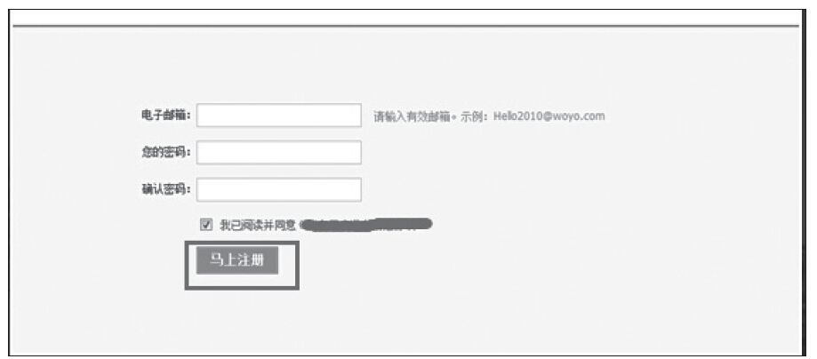
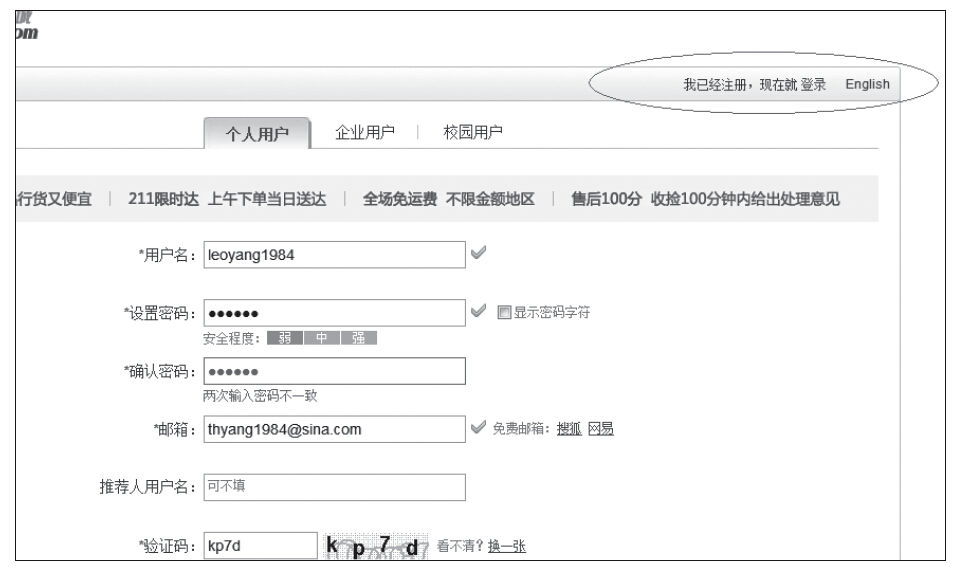
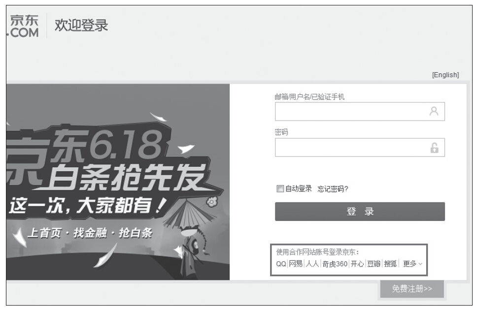

### 6.5.1 登录页

登录页是访客首先接触的页面，因此可以通过提供第三方好评或信誉评定（见图6-26），来消除新用户的不安全感。尤其是对于一些品牌知名度低的公司，可以在登录页中考虑将第三方对公司、服务或产品予以认可的信息包含进来。行业奖项，电视、报纸和杂志报道，认证都是很好的材料。

图6-26 当当网的登录页面

按钮是访客行动的工具，因此我们应该直观地放置按钮，至少让按钮看起来像个按钮，如图6-27所示。这里补充一点：对于比较长的页面，如果内容扩展到折线以下，那么在折线的上方和全文末尾应各设置一个按钮。

图6-27 某官网的注册界面截图

在页面右上角可以考虑增加“我已经注册，现在就登录”的提示，方便已经注册过的用户在注册页面直接登录，如图6-28所示。或者也可以支持用户使用合作网站账号登录，减少用户“放弃率”，如图6-29所示。

图6-28 京东商城的注册页面

图6-29 京东商城的登录页面
