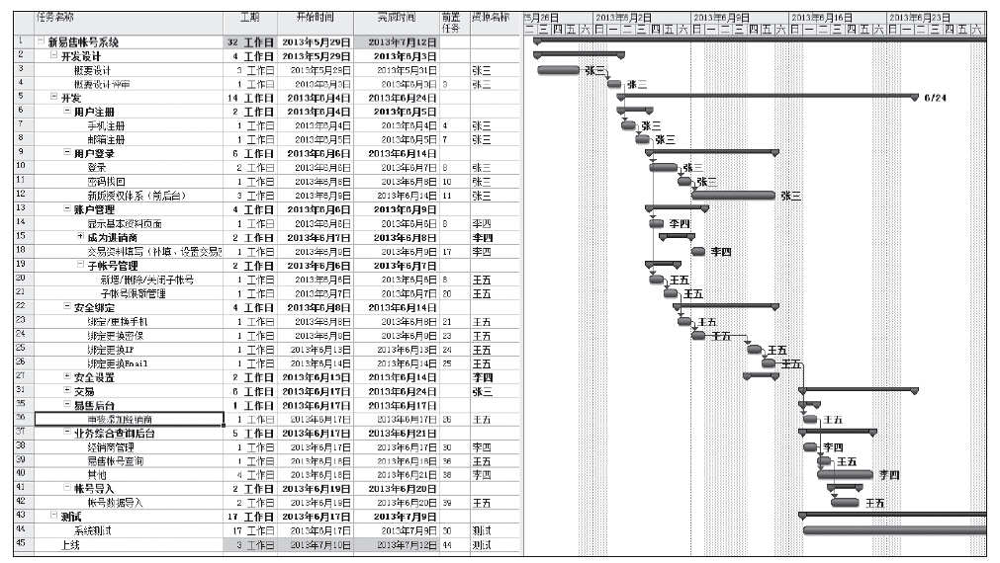
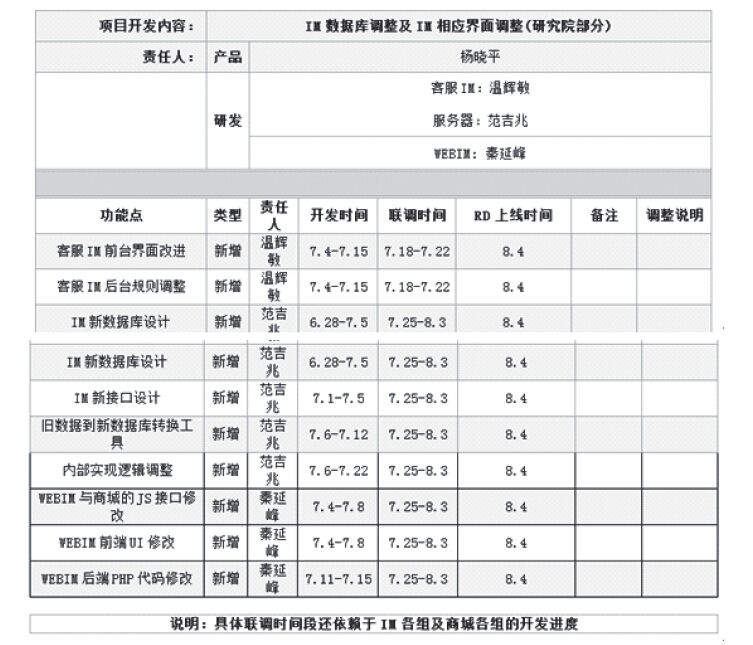

## 7.2 产品研发

### 7.2.1 项目启动

当产品经理的需求明确并形成产品需求文档后，通常“架构师”会依此做系统设计。做完系统设计后，就需要用甘特图的形式来给出项目开发时间表。一般来说，这项工作是项目经理给出的，但有些公司的产品经理往往兼任项目经理的角色，所以对于产品经理来说，制作甘特图也是一个非常重要的技能。

做甘特图的第一步是写出WBS（work breakdown structure），即工作分解，也就是把大块的工作化整为零，庖丁解牛。它的目的就是把大的项目通过细分，变成一系列小的、可操作和易实现的活动。这些活动，会落实到项目中的每个成员几天内（甚至每天）应该完成的工作。当然，WBS分解的方法有很多，可以按时间分、按地点分、按部门分等。但分到最后的活动层面应该是一样的，互联网产品的项目计划时间表通常都是细化到功能或子功能，也就是图7-9所示的“任务名称”。

图7-9 项目进度表

项目被分解完，即任务名称细化完以后，就需要产品经理与研发、测试等相关同事一起评估每个任务名称对应的活动完成所需要的时间，然后估算出大致的资源要求和进度计划，在时间表中清晰地体现出各项任务之间的先后关系，最后排列成项目的时间表，展现出整个项目的时间安排。这样一张完整的图表就叫做“甘特图”。不过，这里需要注意的是：

1）责任“落单”。注意每项“任务名称”（即活动）的责任必须落“单”，也就是一个任务绝对不能有两个责任人，否则执行中出现任何问题，难以责任到具体某个人，这样就造成了“多人负责等于无人负责”的局面。也许有的产品经理会有疑问：如果一项任务需要两人或以上的同事协助完成，这怎么处理？笔者建议：可以将第一责任人排在最前面，或者只写第一责任人，其他辅助人员的工作由第一责任人去协调。这样就能百分百做到责任落“单”了。

2）在预计项目的活动及时间安排上，要尽可能详细。比如开会决定一两个需求看上去好像只要一天，但之前的安排却往往需要一周，那之前一周的活动也都要详细列出来。所以甘特图的前置任务一定要落实好，最好每项任务都安排好相应的前置任务。

3）此外，每次正式开始研发产品前，建议产品经理发个“KICK OFF”邮件，发送到所有相关研发同事的办公邮箱中（并抄送相关领导及其他相关部门的同事），以便让所有同事了解两个关键点：

·本阶段的时间点及里程碑；

·各个时段需要的资源，即每个人要在各个阶段做什么事情。

“KICK OFF”邮件格式如图7-10所示。

图7-10 “KICK OFF”邮件
