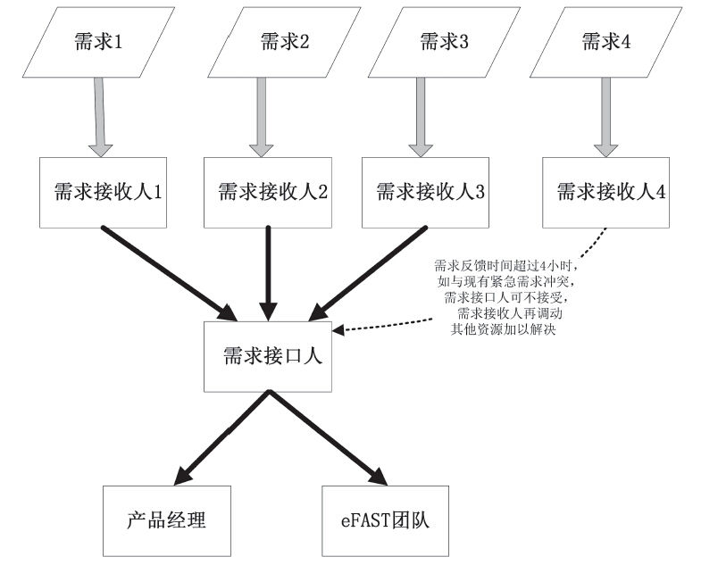

### 7.3.3 固定接口人——“114”流程

一般来说，互联网产品上线运营后，总会存在这样那样的问题，也会有各种不同角色的人或同事会向产品团队反馈各种需求，而这个反馈需求的流程如果界定不清，往往会出现需求很紧急，但反馈者却不知道反馈给谁，或者会出现同一个需求不同的人都来反馈、同一个需求分别反馈给了产品团队里不同的人等问题。因此，为了提高紧急需求的反馈效率，笔者建议设定“紧急需求接口人”，为便于记忆，我们把它称为“114合作流程”（产品经理们可以结合自身实际情况加以调整优化），如图7-16所示是笔者在实践过程中的合作流程示意简图，具体操作如下：

·1：尽可能通过1个需求接口人来反馈BUG等紧急需求，由需求接口人向产品经理反馈紧急需求，由产品经理向设计师、视觉、重构、研发等安排任务，以便达到任务有序安排，有序跟进，有序汇报。

·1：当需求跳过需求接口人时，请需求接收人第1时间反馈给需求接口人和产品经理，再由产品经理记录并安排任务优先级，以便有序跟进，有序汇报。

·4：超过4小时未反馈，且与下一任务发生优先级重叠时，请需求接收人负责协调资源，解决问题（此点要求会提高需求接受人不按时反馈BUG等其他紧急需求的成本，以便保证做到对用户的需求快速响应；此外，4小时的设定是让需求接收人能够意识到产品团队是多么关注用户的需求）。

图7-16 “114”合作流程图（人人网产品经理白宇峰对此亦有贡献）

说明：

1）实施此方案前，产品经理要邮件通知所有相关同事及相应上级领导，取得他们的支持；

2）所有BUG及需求都要统一经过某个产品的需求接口人；

3）所有BUG及需求的处理进展情况（需求排定计划、开发完成等）都第一时间由需求接口人通过邮件或平台或其他书面形式通知到需求发起人。
