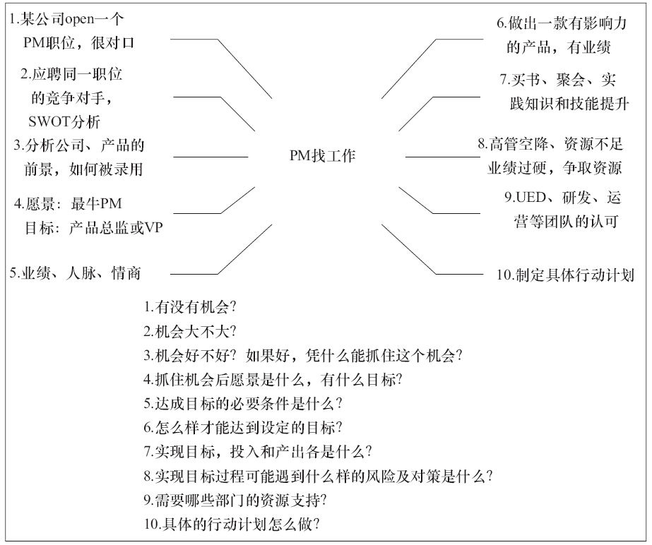

### 第11件事 产品战略规划十步法

小O听到老K师傅终于答应给自己培训产品的战略与规划，高兴得不得了，兴奋得好几个晚上都没有睡好，做梦都在想到底什么是产品战略与规划。他也去网上找了一些相关的资料，但看着看着就睡着了，有点看天书的感觉，也不知道是自己功力不够还是战略规划的内容过于复杂，总之理解起来有点费劲。

终于到了培训的日子，老K见小O面容有点憔悴，问其原因，才知道是这么回事，不过还是很欣慰，小O的积极主动很难得。考虑到小O的功力，老K采用找工作这个常见的案例来形象阐述战略与规划。小O听到找工作也需要战略规划思维时，立刻来了兴致。脑海中也回忆起自己当年毕业过五关斩六将，最终拿到offer的场景，往事历历在目。

什么是战略？战略的本质是选择，有所为，有所不为。通俗一点解释就是到达哪里？怎么实现？通过什么路径？差异点在哪？产品战略规划经常用到的方法是十步法，其内容主要包括：有没有机会？机会大不大？机会好不好？如果是个好机会，凭什么能抓住这个机会？抓住机会后的愿景是什么？有什么样的目标？达成目标的必要条件是什么？怎么样才能达到设定的目标？实现目标，投入和产出分别是什么？实现目标过程中可能会遇到什么样的风险？采取什么样的对策？需要什么样的资源支持？具体的行动计划如何制定？老K以小O当年应聘产品助理并被录用的案例来阐述。

1.有没有机会？

当年老K由于业务发展需要，缺少人手，需要招聘一位产品助理协助自己，所以就在北京大学BBS论坛上发布了一条招聘信息（注明了必须是应届毕业生）。小O对产品非常感兴趣，一直想找个产品助理的工作，之前也面试了几家公司，但基本上都不是产品方面的职位，虽然用人单位比较满意，但是小O不太满意，所以一直在等待机会。看到老K发布的招聘信息，无疑正中小O下怀，对小O而言，老K所在公司品牌知名度很高，自己也经常使用他们公司的产品，认可度很高，这无疑是一个好的机会，于是开始准备简历。

2.机会大不大？

短短不到一天的时间，老K发布的信息已经有100多条回复，老K发布信息说收到了100多份简历，也就是说有100多人竞争这个职位，其中就有小O的室友，也就是说小O被录用的概率大约是1%，可见竞争之激烈。小O觉得与公务员录取比例（万分之一甚至更低）比较，1%的概率还算好的。小O比较细心，专门在网上搜索了老K。原来老K在产品圈内小有名气，于是他果断关注了老K的微博，并私信老K希望获取更多的信息。没想到老K还真回复了小O，这使他掌握了一些别的候选人不知道的信息，小O喜出望外。总的来说，这个机会还是蛮大的。

3.机会好不好？凭什么能抓住这个机会？

通过私信老K，小O了解到老K负责的产品是公司核心级产品，前景十分乐观，并且老K所在的公司是一流的互联网公司，发展势头迅猛。老K的产品经验十分丰富，如果自己被录用，无疑是跟了一个好师傅。总的来说，这是一个特别好的机会。假设有这样一个机会：职位很高，但是产品所属行业不是朝阳产业，前景不容乐观，并且公司已经在走下坡路，这样的机会就算不上好的机会，这是对机会的一种判断力。一旦确定这是个好机会，接下来就是通过什么样的方法来抓住这个机会。小O通过私信老K，了解到要做一个什么样的产品，发送简历的基本都是一些什么人，从一些信息分析出，老K对这些候选人不满意，或者说这些候选人没有什么亮点能打动老K。小O要想抓住这个难得的机会，一定要跟别的候选人不一样，要有差异化，拼学习成绩，可能拼不过那些学习高手；拼实习经验，也没有什么特别亮的经验，不像有的候选人还在世界500强的公司实习过，这些都不是自己的强项。回归到产品助理岗位职责，小O查阅了大量资料并使用了大量产品，整理出一个竞品分析报告，并提出了对产品的意见和建议。发送给老K之后，获得了老K的肯定，因为小O是唯一一个发送简历的同时还附带了竞品分析报告以及意见和建议的候选人，给老K留下了深刻的印象，最终小O被录用了。

4.抓住机会后愿景是什么？有什么样的目标？

小O特别崇拜乔布斯，一直希望自己也能通过产品改变世界，成为最牛的产品经理，这就是愿景。愿景一般都很霸气，比如世界第一、行业领先、国内一流等，愿景虽很宏伟，但总得一步一步地通过目标来实现吧，这就需要设定目标，比如3年做到产品经理、5年做到高级产品经理、8~10年做到产品总监、15年做到产品副总裁等，需要设定短期、中期和长期目标。

5.达成目标的必要条件是什么？

要想从产品助理晋升到产品经理、高级产品经理、产品总监、产品副总裁，必要条件就是业绩、情商和人脉。业绩就是是否做出了突出贡献，给公司带来了巨大的价值。光有业绩还不行，还得需要人脉和情商，跟你的上级、平级和下级都要处理好人际关系，建立自己的影响力，为自己争取更多的优势资源。

6.怎么样才能达到设定的目标？

我们知道了达到目标的必要条件是业绩、情商和人脉，现在我们给这三个必要条件排一下优先级，很明显，业绩>情商>人脉，所以最关键的也是第一步就是业绩，业绩就是做出一款有影响力的产品，赢得用户和商业价值。接来下就是提升自己的情商，有了业绩和情商，自然而然就会逐步积累人脉，获取更多的资源助力事业取得成功。

7.实现目标，投入和产出分别是什么？

要想做出一款有影响力的作品，产品内功修炼和实战相当重要。需要丰富产品专业知识和技能，需要研究产品，需要跟用户“谈恋爱”，还需要参加一些培训、阅读大量书籍，提升自己的审美能力和品位等，这些都要一定的金钱和时间成本。产出指的是通过产品实战，形成自己做产品的哲学，形成自己做产品的理论体系，总结出实战成功经验，最重要的就是做出一款成功产品，超出用户预期，产生产品魔力，并给公司带来商业价值。归结起来就是要具有基本的财务分析能力。

8.可能会遇到什么样的风险？采取什么样的对策？

职位晋升最大的风险就是突然从外面引进的某位高管空降成为你的领导，使得你的晋升概率降低；还有一个风险就是争取不到资源，或者争取不到优势的资源；还有一个风险就是你自己出现重大失误，产品失败。面对这些风险，最好的应对之策就是要拥有过硬的业绩，突出的能力，超高的情商，丰富的人脉和优势的资源。

9.需要什么样的资源支持？

产品经理这个职位比较特殊，需要跟研发人员、用户体验设计人员、产品运营人员等频繁沟通，获取支撑。这样的话，要想得到晋升，必须要具备强大的影响力和气场，处理好团队之间的矛盾和冲突，得到这些团队的大力认可，同心协力，才能做出有影响力的产品。

10.具体的行动计划如何制定？

这个可以采用敏捷开发的思想来完成。将目标细分成若干子目标，完成每个子目标的任务有哪些，并将这些任务再拆分成若干子任务，每个子任务设置启动时间和完成时间。任务的状态可以分为要做的任务、正在做的任务和已完成的任务等，可以绘制任务的燃尽图。以提升产品专业知识和技能为例，分成战略规划、需求分析与管理、用户体验设计、项目管理、产品运营等任务，每个任务下面又拆分成子任务，比如需求分析与管理的子任务可以设置为获取需求、评估需求、定义需求优先级和管理需求等。

使用十步法战略规划思维找工作的示意如图3-1所示。

图3-1 使用战略规划思维找工作

小O听老K师傅这么一说，豁然开朗，原来把复杂的事情简单化是需要功力的。回想起自己当年成功应聘产品助理这个职位时，根本不知道原来还有这种战略规划的系统方法论。如果早一点知晓的话，说不定自己的职业规划会更清晰一些。选择真的比努力重要得多。

战略规划是一套系统的思维方法和方法论，不能说掌握这种思维方法之后就一定能成功，但至少能提高成功的概率，切记不要走向不干和盲干两个极端。需要重视产品战略规划，方向错了，再怎么努力也是白搭，选择真的比努力重要得多。
