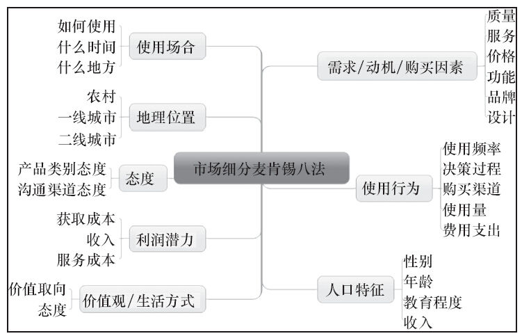
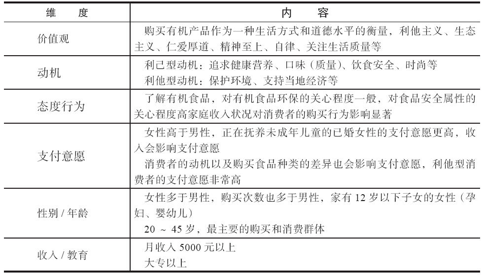
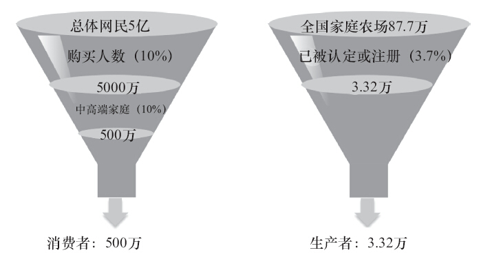

### 第13件事 用户和市场需求分析的方法

老K师傅将使用战略规划思维找工作的案例以及常用的战略规划工具传授给小O之后，就开始国庆7天长假了。小O很“宅”，7天哪也没去，“宅”在家里反复研究师傅传授的东西，如获至宝，力求将不懂的地方吃透。以前看产品或者新闻资讯，看到的只是表面，对于挖掘出产品或资讯背后的“为什么”却总感觉无从下手，总觉得在产品或资讯前边有一层朦朦胧胧的东西挡着。然后在研究并吃透了产品战略规划相关的方法论之后，使用相关的工具一分析，豁然开朗，不禁生出一种原来如此的感觉。这无疑又是一条修炼产品内功的上乘心法。

长假终于结束了，小O却是异常兴奋，因为又可以聆听老K师傅的教导了。节前老K留了一个念想，那就是没有详细展开战略规划十步法，也没有案例，再加上小O对什么是商业需求文档（BRD）和市场需求文档（MRD）不甚明了，所以老K计划启动十步法的培训。稍微有点产品经验的人就会发现，十步法其实是商业需求文档和市场需求文档的整合。这下可乐坏小O了。为达到预期的培训效果，老K计划使用某生鲜电商社区产品为主要案例，但考虑到商业机密，培训前进行了一些删节。

十步法的第一步是用户与市场分析，说到底其实就是“有没有机会”，这个机会从哪来。其实机会主要来自目标用户。所以这一步主要阐述目标用户群是谁；有什么特征；他们使用产品的场景有哪些；需求痛点是什么；需求频次怎么样；这样的目标用户群聚合起来的市场容量或规模到底有多大。

1.目标用户群分析

目标用户群的重要性不言而喻，通常将目标用户群形象地比喻成齐天大圣孙悟空头上的“紧箍咒”，旨在说明目标用户群贯穿战略规划、需求分析、用户体验设计和产品运营等产品生命周期关键环节。作为产品经理，应时不时反省一下，这是目标用户群想要的东西吗？这样做有没有偏离既定的目标用户群？产品脱离了目标用户群，就好像火车偏离轨道出轨一样，后果不堪设想。

到底哪些用户是被瞄准的目标用户群呢？这些用户有什么特征？这里通常使用麦肯锡八法来分析目标用户群，如图3-11所示。

图3-11 用户和市场细分麦肯锡八法

以某生鲜电商社区产品为例，目标用户群有两大类：C类和B类。C类用户我们以金字塔来表示，底层是乐活族，是崇尚贴近本源、自然健康、精致、环保、时尚生活态度的人群，他们重视生活品质；往上一层是消费者，吃货族、特产控、三高人群、孕妇、病人、老人和少儿家庭等；最顶层是达人，买手、品牌使者、技术专家、养生达人、营养专家、美食达人、厨房达人、旅游达人等。进行C类中的消费者目标用户群分析，如表3-1所示。

表3-1 目标用户及特征（消费者）

结论：以一二线城市、20~45岁、有12岁以下子女、收入和教育水平较高的女性用户（中高端），已经罹患某些疾病的用户及家庭，和吃某些食物得病的用户为主要目标用户群。影响因素：价格>安全>口味>环保。用户更偏好价格低、安全水平高、口味好、环保水平中等的食品组合。

消费者目标用户群（C类）分析完之后，我们再来分析生产者目标用户群（B类）：以种养业为主，生产经营规模较大（50亩或100亩以上，50亩种植两季，100亩种植一季）的已被有关部门认定或注册的家庭农场、有机农场、农业合作社、种植基地为主要目标用户群。

2.用户需求痛点分析

有这样一种情况：用户对产品的功能现状非常不满意，这使用户“疼痛”不已，用户特别希望这种现状能尽快解决。而我们要做的就是满足用户这种期望已久的需求。换句话说，如果在一定时间内不能满足用户这种需求，他们就会忍受不了产品甚至不会再使用或消费产品，从而导致用户的流失。用户真心想要的产品或服务与他们实际购买或使用的产品或服务之间，总是存在着一条巨大的鸿沟，这条巨大的鸿沟其实就是用户需求的痛点。

如何评估一个需求是不是用户需求的痛点？通常采用的方法如下：

·逆向法：如果不满足用户，就会导致用户忍受不了甚至不会再使用或消费产品的需求就是痛点需求。在这类需求上用户得不到满足，生理或心理就遭受重大打击。

·付费法：满足用户，用户愿意为之付费的需求。

·必须法：离不开，必不可少的需求。

·环境法：受国家政策法规、文化、习惯、重大事件等影响的需求。

·动态法：用户使用场景变更，可能会导致非痛点需求动态变化成为痛点需求。

·马斯洛需要层次法：生理、安全、社交、尊重、信息获取、审美、自我实现需要，越底层越有可能成为痛点需求。

以某生鲜电商社区产品为例，我们分别分析消费者和生产者的需求痛点。

（1）消费者

对于消费者来说，他们面对什么样的问题呢？

·信息不对称：不知道什么是有机食品；不知道有机食品对自己有什么好处；不知道怎么吃，好不好吃；有机食品的质量特征很多是隐性的，如安全、生态、健康等特质。

·缺乏信任：农药、化肥残留；抗生素、生产激素、离子辐射、转基因工程、食品添加剂、化学添加剂等带来的严重的食品安全问题；消费者对有机食品缺乏信心和信任；目前有机食品没有做到信息开放和可追踪。

·价格过高：价格过高，比较昂贵；消费者认为有机食品的价格高于认知价值。

（2）生产者

对于生产者来说，他们又面对什么样的问题呢？

·信息不对称：无法准确把握城市居民的消费需求；产销很难对路，严重积压滞销，损耗率高；销售渠道单一，不充分，更谈不上精准营销。

·消费者不信任：食品有机和安全认证门槛高，认证手续繁琐，认证费用高；同质化比较严重，消费者很难鉴别和选择；生产全流程不透明。

·成本高：流通环节多，损耗大；生产资金比较困难；冷链物流设施建设滞后。

3.用户场景分析

用户场景指的是用户在什么时间、什么地点使用或消费产品。上小学语文课的时候，写作文有四个要素：人物、时间、地点、事件，其中事件可分为起因、经过和结果。这些要素也同样适用于用户场景。通常通过讲故事的方式来描述用户场景，比如，主人公是谁（人物），在什么时间（时间）、什么地点（地点）要做什么事（起因），怎么做的（经过），结果怎么样（结果）。

以某生鲜电商社区产品为例，基本上根据场景可以将消费者分成以下几类。

·观察型：某天清晨，小D要去特定的地点买一些新鲜食材，为了买到放心食材，嗅觉、听觉、视觉、触觉、味觉等都用上了。现场详细观察之后做出购买决策。

·体验型：特定的时间，特定的地点，大家都说某一样食材非常不错，小M将信将疑。先少买一些，体验体验，看看效果怎么样之后才决定是否购买。

·信任型：特定的时间，特定的地点，一样的熟人，由于长期在特定的商铺购买食材，已经慢慢建立起信任关系，以后但凡买什么食材，小C就直奔特定的商铺处购买，不会选择别家。

·价格敏感型：特定的时间、特定的地点，小V买食材的时候经常货比三家，看哪家便宜，质量还不错，就选择哪一家，或者经常在食材促销的时候做出购买决策。

·无主见型：特定的时间、特定的地点，小P在淘宝上想买草莓，看了好几十种不知道买哪一种（周边也没有熟人给出意见），有一定的选择恐惧症，最后没办法，就专门挑那种热卖的草莓购买。在购买前他会看看最近一个月卖出去多少件、用户的评价怎么样等，然后再做出购买决策。

·熟人推荐型：特定的时间，特定的地点，小A想买橙子，买之前咨询了一下好友圈，其中有一个关系特别好的好友推荐小A购买褚橙，小A想都没想就下单了。

4.市场容量估算

市场规模即市场容量，是指一个特定市场供应品的使用或购买人数。市场规模主要是研究目标产品或行业的整体规模，具体可能包括目标产品或行业在指定时间的产量、产值等。需求的市场预测直接决定了企业是不是要对该产品进行创新实验和投资，市场规模是需求测量的目标。市场容量是一个变量，会因时而变，但是可以科学估算得出，那么具体如何估算市场容量呢？常用的方法有占比加权法估算、核心精算法估算、替代品类比法估算、统计调查法估算和历史数据分析法估算。这里介绍一种互联网和移动互联网产品中都比较常用到的一种估算方法——漏斗法估算。

某生鲜电商社区产品市场容量估算如图3-12所示。

图3-12 某生鲜电商社区产品市场容量估算

小O一边听老K师傅讲课，一边在积极思考，为什么十步法的第一步是用户与市场分析？原来无论做什么产品，最终的使用者都是用户，如果对面向的目标用户群都不清楚的话，何谈能研发出用户想要甚至喜爱的产品？小O突然回想起产品定位里面也有目标用户群定位一说，还有一个生鲜电商的案例：由于生鲜电商目标用户群定位不准确，导致企业转手出售的悲剧发生。产品实践中，绝大多数失败产品最主要的原因原来就是目标用户群的定位出了问题，还有就是对目标用户群的基本特征、需求痛点和使用场景都不了解，就好像闭门造车。“用户为王”，谁抓准了用户，谁就赢得了市场。

十步法第一步是最重要的一步，若第一步的分析出现偏差，那么后面的九步基本上都废了，可见用户与市场分析的重要性。学会利用麦肯锡八法来细分用户及市场，捕捉目标用户群特征，牢记目标用户群贯穿整个产品生命周期，是“紧箍咒”。懂得利用逆向、付费、环境、必须、马斯洛需要层次方法挖掘出用户需求痛点。采用漏斗法估算出产品的市场容量。第一步的重中之重是准确挖掘出用户需求的痛点。
