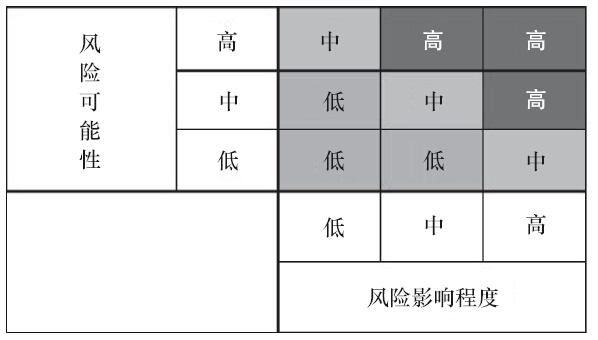

### 第20件事 风险分析

上周末小O的团队连续加班两天，他身心疲惫。老K师傅也在办公室现场坐镇指挥，可见事态有些严重。到底是出了什么问题导致大家加班加点“救火”？原来是产品出现了一个安全漏洞，被别有心的人攻击导致产品瘫痪，不能正常使用。老K也被领导训斥了一番。吃一堑长一智，老K觉得有必要进行一次彻底的风险分析和排查，确定风险等级以及采取应对之策。刚好又到了十步法第八步风险分析的培训，干脆借着这次机会，给小O上一堂风险分析课，加强小O的风险意识。

十步法第八步风险分析，主要阐述风险的种类、风险的等级以及其应对之策。到底什么是风险？通俗地讲，风险就是发生不幸事件的概率。换句话说，风险是指一个事件产生我们所不希望的结果的可能性。任何产品或项目都有风险，风险无处不在，风险发生的时间具有不确定性，从总体上看，有些风险是必然要发生的，但何时发生是不确定的。风险具有客观性，是一种不以人的意志为转移，独立于人的意识之外的客观存在。

风险主要来源于第二步竞争对手分析之SWOT分析中的弱势和威胁以及第五步关键成功要素分析中的关键阻碍要素，这些存在一一对应关系。

1.风险种类

产品或项目可能面临的外部和内部风险包括政策风险、市场风险、技术风险、决策风险、法律风险、资本风险等。

（1）政策风险

政策风险指的是受到国家政策、法律、法规的影响，如由原先的政策保护变成了政府政策不支持，或者政府出台了对业务非常不利的管制条例。比如对微博、在线秀场产品的监控，饭否、叽歪被和谐，广电总局的限娱令、净网行动等。

（2）技术风险

技术风险指的是由于技术上的不足或缺陷以及技术分析和决策失误等原因，给产品和运营带来损失的可能性。比如缺少核心技术人才、技术决策失误、核心技术的泄露、核心技术的攻关存在难度、产品被黑客攻击导致瘫痪、用户资料泄露引起重大安全隐患或导致产品不能正常使用等。

（3）法律风险

法律风险指的是在法律实施过程中，由于企业外部的法律环境发生变化，或由于包括企业自身在内的各种主题未按照法律规定或合同约定行使权利、履行义务，而对企业造成负面法律后果的可能性。比如百度文库侵权，韩寒等知名作家联名抗议和维权；Facebook侵犯用户隐私，CEO扎克伯格公开道歉。再比如团购网站的诚信和用户维权、供应商欠款纠纷、商标专利侵权、盗取竞争对手商业机密等。

（4）市场风险

市场风险指的是市场遭遇垄断、恶意并购、竞争对手发起的恶性不公平竞争、潜在进入者实力非常强大而给业务带来的风险。遭遇竞争对手的疯狂打压，比如京东的图书业务发展面临竞争对手压力；QQ具有霸主地位，如果QQ做某一块业务会怎么样；各大电商网站的价格战等。

（5）决策风险

决策风险指的是决策失误带来的风险。影响决策风险的因素有客观和主观两种。客观因素，如信息不充分或发生不可预知的事情、决策机制不健全等；主观因素，如决策者的能力不足、受情绪或成见影响导致判断失误。都可能导致决策失误。比如，百度拓展日本业务决策失误，2011年10月10日，淘宝商城中小企业围攻大商家事件。

（6）资本风险

资本风险指的是由业务现金流不健康、融资困难、不良债务、盲目扩张、投资方撤资等带来的风险。比如团购网站24券由于公司创业团队与投资人矛盾加剧，投资人强行抽走资金导致网站暂停运营。

2.风险等级评估

知道有哪些风险后，又该如何对这些风险进行等级评估呢？主要从两个方面进行，一个是风险发生的可能性（概率），可分为高、中、低三个等级，其中，“高”表示发生的可能性大于60%，“中”表示发生的可能性介于30%和60%之间，“低”表示发生的可能性小于30%。第二个是发生的风险对项目的影响程度，也分成高、中、低三个等级。将风险发生的可能性和风险对项目的影响程度进行矩阵分析，得出风险的等级，如图3-20所示。

图3-20 风险等级评估图

3.风险应对之策

面对各种风险，采取什么应对之策呢？主要包括以下四种。

（1）规避（Avoidance）

规避指的是改变计划以消灭风险或保护目标免受影响。

例如，在生活中，上下班时间，我无法忍受地铁里的拥挤，所以我远离地铁。公司考虑到员工有困难，决定调派专车接送。同理，在开发过程中，可通过增加项目资源和调整时间等来规避风险。

如规避技术风险，可招聘技术顶尖人才或者通过外援方式，攻克技术难题。加强网站的安全和保护措施，未雨绸缪。关于核心技术泄露方面，加强核心员工管理，做好保密措施。

（2）转移（Transference）

转移指的是把风险的影响和责任转嫁给第三方，并不消灭风险。

例如，在生活中，上下班时间，我无法忍受地铁里的拥挤，所以我让同事先挤，我跟着他上。同理，在开发过程中，客户没有提出要求，我们也不提醒，让他人来分担或转移风险。

如面对决策风险，可让项目相关人员都参与决策，要尽量得到老板的鼎力支持，从而分担决策风险。

（3）缓解（Mitigation）

缓解指的是谋求降低不利风险发生的可能性或影响程度。

例如，在生活中，上下班时间，我无法忍受地铁里的拥挤，但是我可以提前或延后几个小时上地铁，那个时候没有高峰时期拥挤；或者我搭同事的顺风车，不用挤地铁。同理，在开发过程中，可执行一种能够减少问题的新行动方案等。

如面对市场风险、资本风险，执行一种能够减少问题的新行动方案，寻求需求产品的差异化和合作伙伴战略联盟，减少与竞争对手的正面冲突。缓解资本风险最好的解决方案就是自己拥有强大的造血功能，即稳定的赢利能力和现金流等。

（4）接受（Acceptance）

接受指的是面对风险，选择不对计划做任何改变或干脆无计可施。

例如，在生活中，上下班时间，我无法忍受地铁里的拥挤，但没有其他可行办法，只能挤地铁，并且接受这个结果。同理，在开发过程中，可积极接受，制订应急计划；也可消极接受，不采取任何行动。

如政策风险、法律风险，要么积极接受，制订应急计划；要么消极接受，不采取任何行动。

鉴于这次产品漏洞安全事故，小O听完老K师傅的培训，深有感触。别小看风险，风险可大可小，大的风险能够使之前的努力全部付之东流。风险不可怕，可怕的是没有识别出来并采取相应的解决方案。未雨绸缪不是坏事。

风险的发生具有不确定性，风险发生并不可怕，需要提前做好风险应对计划，包括识别风险的种类，学会从发生的概率和影响程度两大维度利用矩阵分析得出风险等级，最后根据实际情况，制定相应的应对之策。应对方案主要有规避、转移、缓解和接受。
