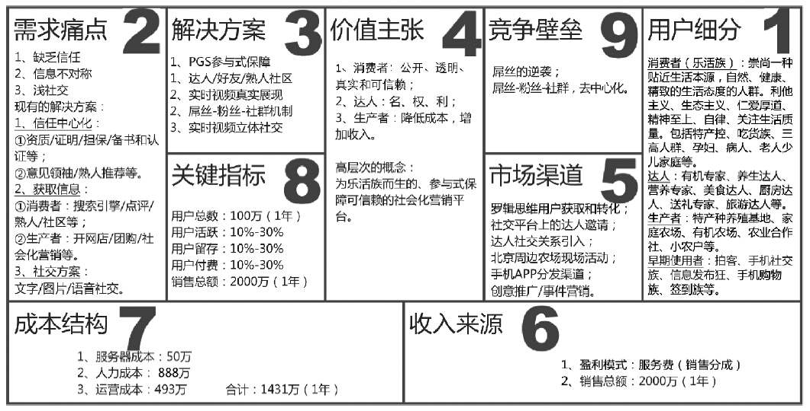
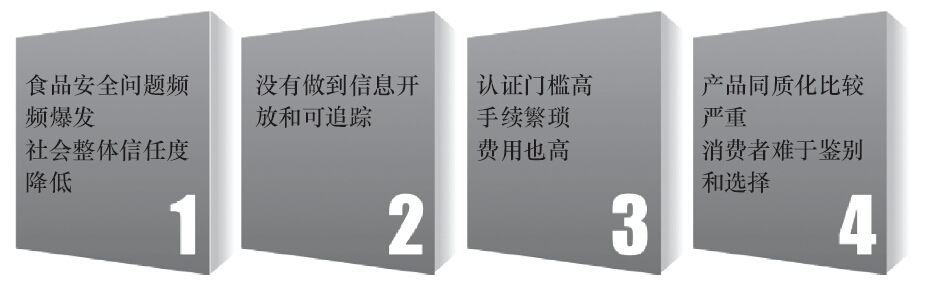
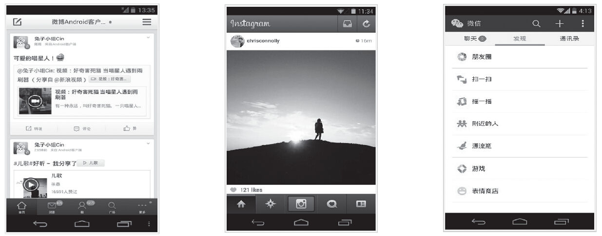
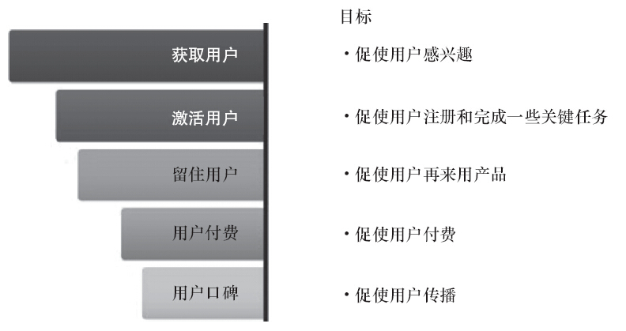

### 第25件事 创建精益创业画布的9个格

小O由于经常参加线下的产品经理聚会活动，自然也认识了不少同行，同行之间免不了沟通和问题咨询。有一天，小O的产品QQ群里正在激烈讨论一个问题：什么是商业模式？下面的答案是清一色的赚钱模式，比如会员收费、广告模式、分成模式、游戏的道具收入模式等。突然，小O眼前一亮，看到了师傅老K的回答：“这些答案概括起来可以理解为盈利模式，也就是赚钱模式，但是商业模式真的等同于盈利模式吗？”小O以为老K师傅会进一步解释，可是师傅却戛然而止了，在群里留下了一个悬念。

小O的好奇心一下子被钓起来了，赶紧找老K师傅问个究竟。看到师傅办公室里没人，上前敲门跟师傅攀谈起来。老K料到小O会来咨询，可没想到这么快。好吧，也是时候讲讲商业模式，恰巧要给小O培训怎么创建精益创业画布，索性一道讲了。

精益画布其实就是一张纸，上面有9个空格需要填写，分别是目标用户细分、需求痛点、解决方案、价值主张、市场渠道、收入来源、成本结构、关键指标和竞争壁垒。精益画布跟商业模式有什么关系？商业模式其实指的是创造价值、传递价值和获取价值的基本原理，也就是说基本上有三个阶段，画布中的价值主张对应给用户创造什么样的价值，市场渠道对应的是如何将创造的价值传递给用户，收入来源对应的是用户得到价值之后如何让用户付费，也就是盈利模式。这样看来，商业模式确实不等于盈利模式，盈利模式只是商业模式其中的一个阶段。

我们结合某生鲜电商社区产品案例来阐述如何创建精益创业画布，如图4-4所示。

图4-4 精益创业画布案例

1.用户细分

第3章在介绍十步法的第一步时已经对目标用户细分作了详细阐述，在此不再赘述。案例中第1格的目标用户群主要分为消费者、达人和生产者三大类。一般来讲，创建画布的时候一种目标用户群对应一张画布，也可以根据实际情况整合在一起在同一张画布中展现。

第1格中的下方有一个早期使用者，具体来说，指的是最早使用产品的种子或天使用户，早期使用者不一定会成为产品的主流使用用户，主要是深度访谈的对象，比如说获取需求痛点、提出解决方案的访谈对象基本上都是此类用户。如何寻找此类用户？一般是从身边的符合目标用户群要求的朋友或熟人开始，或者是好友的好友，获取此类用户的成本要低。

案例中的早期使用者：拍客，随拍随传“晒”生活；手机社交族，随时随地维系人际关系网络；信息发布狂，自我表达赢得频繁互动；手机购物族，边走边消费；签到族，潜力与实力皆具的时尚“切客”。

2.需求痛点

明确目标用户群之后，第2格要确定目标用户群的需求痛点，一般是聚焦1~3个最大的痛点，至于评估什么样的需求是痛点需求，前文已经阐述，此处不再赘述。

第2格中还需要针对每个痛点进行分析，确定目标用户现有的解决方案是什么，因为只有这样分析出用户对现有解决方案的不满意，或者用户得到的东西跟他们想要的东西存在着一条巨大的鸿沟，我们才有机会提出更好的解决方案从而超出用户预期。如果用户对现有解决方案比较满意，说明暂时没有机会，时机不宜。

案例中的需求痛点主要有3个，聚焦在缺乏信任、信息不对称和浅社交上。

（1）缺乏信任

缺乏信任，体现如图4-5所示。

图4-5 缺乏信任

社会整体信任度降低指的是人与人之间、人与生产者之间变得越来越不信任，受一些食品安全事件的影响，用户不再轻易相信，从而使取得信任的成本越来越高。

没有做到信息开放和可追踪指的是：生产者说食品是安全的，那么消费者就会质疑生产者凭什么说它是安全的，有证据没？证据在哪？在哪可以看到？

生产者为了寻求让消费者信任的证据，一般会做一些第三方的认证来打消消费者的质疑，但是第三方认证的费用价格不菲，而且手续非常繁琐。比如要想取得欧盟认证，这个门槛非常高，一个单品一年的认证费用就要上千元，生产者难以承受。

生产者生产的商品同质化比较严重，消费者都不知道选择哪个生产者比较好，消费者就有了选择恐惧症。

（2）信息不对称

信息不对称，消费者和生产者都存在信息不对称的问题。消费者的信息不对称主要体现在：很多好东西不知道；不知道吃什么；不知道怎么吃；也不知道好不好吃；也不知道吃了对自己有什么好处。生产者的信息不对称主要体现在：无法准确把握城市消费者的需求；产销很难对路，产品滞销卖不出去；销售渠道单一，更谈不上精准营销。

用户特征一般分为6类，他们的特点分别如下（这部分知识在第13件事中也有介绍，大家可参照学习）：

·观察型：充分调用视觉、听觉和触觉等系统进行现场观察，决定是否购买。

·体验型：先买来体验一下，之后决定是否购买或者再次购买。

·信任型：与生产者建立起长期的信任关系，之后消费者进行消费的时候会毫不犹豫，而且绝不会选其他人的产品。

·价格敏感型：经常比价，淘便宜，追求实惠。

·没有主见型：买之前先看看他人的消费点评之后再决定是否下单，具有很强的从众心理。

·熟人推荐型：熟人或朋友推荐购买的概率比较高。

实际上，消费用户一般是上述6种特征的集合体，只是每一种特征所占的权重比有差异而已。

（3）浅社交

浅社交，体现如图4-6所示。

文字、图片和语音都是内容的不同介质，用来维持和增强人与人之间的关系，但是文字、图片和语音社交都属于浅社交，都有其缺点：文字不够立体，不具象：图片比较具象，但定格在静态；语音，只听其声，不见其形，在表现真实的时候表现张力不足。

图4-6 浅社交

3.解决方案

第3格中如何提出靠谱的解决方案？关键是分析出对现有解决方案不满意的地方。案例中对应的解决方案主要有3个。

（1）缺乏信任的解决方案

现有的解决方案比较中心化，主要表现在资质、证明、担保、备书和认证等方面，还体现在意见领袖、熟人推荐等方面。采用逆向思维法，新的解决方案是去中心化。为什么是去中心化？这里需要分析信任的发展趋势，用户早期信任国家政府或者机构的资质、证明、担保、备书和认证，出现安全问题后，信任指数下降；后来发展到信任明星达人，但是明星达人代言也存在一定商业金钱关系，出现安全问题后，信任指数也下降。接来下信任将走向何方？答案是去中心化的参与式保障，实际上是信任的众包，降低了信任的风险成本。新的解决方案除了参与式保障，由于存在一个过渡阶段，所以新的解决方案还包括建立一个达人、好友和熟人社区，共同解决生产者与消费者之间的信任关系。

（2）信息不对称的解决方案

针对消费者现有的解决方案主要是搜索引擎、点评、熟人和社区论坛等。消费者不满意的地方主要体现在无法传达出真实的信息。针对这种情况，新的解决方案是采用实时视频技术，真实立体地传达信息，为消费决策提供辅助。针对生产者的现有解决方案主要是在淘宝、天猫、京东上开网店，团购预订和以微博、微信为代表的社会化营销等。生产者不满意的地方主要体现在不懂互联网，没有经验，还需要雇佣专门团队专门负责，成本增加。针对这种情况，新的解决方案是提供社会化营销整体解决方案，主要方法是通过线下活动吸引草根用户参与体验，帮助其建立起信任关系，进而转化成生产者的粉丝，然后积累粉丝成社群，走社群电商之路。

（3）浅社交解决方案

现有的解决方案主要是文字、图片和语音社交。消费者不满意的地方主要表现在文字不具象，图片比较具象但定格在静态，语音只听其声不见其形，从而导致在表现真实的时候表现张力不足，不够立体。新的解决方案是实时视频立体社交。

4.价值主张

第4格中给目标用户创造的价值一般包括：

·新颖：以前不能实现，现在可以实现。

·性能：速度快，性能好。

·定制化：私人定制。

·把事情做好：更好地完成任务。

·设计：美观、精致、时尚。

·品牌/身份定位：身份象征，代表品位。

·价格：实惠。

·成本控制：降低成本。

·风险控制：降低风险。

·可达性：能完成任务。

·可用性：用户体验好，用得爽。

案例中的价值主张主要体现在3类用户上：给消费者提供的价值是透明可信赖；给达人提供的价值是名、权、利；给生产者提供的价值是增加收入和降低成本。

第4格中还需要注明高层次的概念，实际上就是产品的差异化亮点。案例中的亮点主要体现在实时视频众播和参与式保障两个方面。

5.市场渠道

第5格中主要填写如何获取用户，也就是通过哪些渠道能低成本地获取用户。一般是先获取目标种子或天使用户，这是一种跟目标用户群交集比较大的渠道。也可以利用社交红利，低成本将社交平台用户转化成自己的用户。

图4-4所示案例中的市场渠道主要有罗辑思维用户的获取和转化、社交平台上的达人邀请、达人社交关系引入、北京周边农场现场活动和创意推广以及事件营销。

6.收入来源

第6格中确定主要的盈利模式是什么。主要的盈利模式包括：广告模式、会员服务、游戏道具、收入分成、增值服务等。

案例中的盈利模式主要是收取服务费，也就是销售分成。

待填写完第7格中的成本之后，就可以大概计算出达到盈亏平衡点的时间。如果刚开始没有明确的盈利模式，也可以不填。

7.成本结构

第7格中成本机构主要包括人力成本、硬件成本和运营成本。

·人力成本：每5~10名开发人员应该配备1名产品经理。1名交互设计师大约可以支持2名产品经理的工作，1名视觉设计师一般可以支持4名交互设计师的工作。凡超过10名开发人员参与的重大项目，就应该配备专门的项目经理。有的公司计算人力成本时会加上工位、水电费等成本分摊，具体多少可以咨询一下HR部门。

·硬件成本：服务器、带宽成本，还有其他设备成本，比如测试用的手机等。

·运营成本：首先将第8格中的关键指标目标分解成子目标，然后确定各个子目标采用什么样的策略和方法；采用这种策略或方法需要花多少钱，也就是预算，运营预算可以用开发一个注册或活跃或留存或付费用户的平均成本乘以目标的数量得出。比如今年要做100万的用户基数，得知每开发一个注册用户的平均成本是2元，大致可以得出要200万的运营预算，那么如何得出开发一个注册用户的平均成本是2元？主要有三种方法：其一是看行业平均；其二是看竞争对手；最后一种是精益法，比如先拿10000元做个小测试，假设花了10000元，带来了1000个注册用户，那么开发一个注册用户的平均成本就是10000/1000=10元。计算每平均开发一个活跃或留存或付费用户的成本方法类似。

案例中的人力成本、硬件成本和运营成本通过估算后分别为888万、50万和493万。

8.关键指标

第8格中主要填写产品的几个关键指标，首先需要了解用户的生命周期，如图4-7所示。

图4-7 用户生命周期

基于用户生命周期，关键指标主要包括用户基数、用户活跃度、用户留存率、用户付费率或客单价或总额、口碑推荐系数。关于各个指标的计算方法将在第7章进行详细阐述。

案例中的关键指标分别为：用户数100万（1年）、用户活跃10%~30%、用户留存率10%~30%、用户付费率10%~30%、销售总额2000万（1年）。

9.竞争壁垒

第9格中主要填写自己的核心优势或资源在哪，如果没有则可以不填。当然，这里也可以填写构建竞争壁垒的策略或方法。

构建竞争壁垒的方法有两种：

·第一种方法就是先让对手看不见、看不起、看不懂，然后让对手们学不会、拦不住、赶不上。要想使用这种方法，必须保证公司“内功”深厚。

·第二种方法根据周鸿祎的说法就是颠覆式创新。实现颠覆式创新也有两种方法，一种是把贵的变便宜，收费的变免费；一种是复杂的变简单。这两种方法实际上都是从低端切入，创造一个新的、原来大企业看不上的市场，然后让很多低端用户进来，让很多原来不是用户的用户进来，然后慢慢地往上蚕食。这就是草根的逆袭。

案例中的竞争壁垒主要是构建粉丝和社群，去中心化。

老K师傅的话音刚落，小O立马展开联想，本来在老K师傅培训过程就想插嘴说说自己的感悟，一直不敢开口，怕打断师傅的思路。培训一完，小O通过联想发现精益画布实际上可以理解为产品战略规划十步法的精简版，思路大致是相通的。

精益创业画布其实蕴含了商业模式的三个阶段，即创造价值、传递价值和获取价值。商业模式不等于盈利模式。画布的9个格并不是要求都要填写，在没有确定之前都可以先空着，然后通过用户参与之后，一步一步调整和完善画布。一般给领导汇报的时候，不一定要写商业计划书或者商业需求文档，使用精益创业画布加上产品原型即可。
