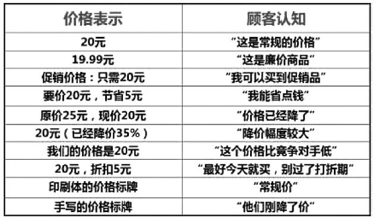

### 第27件事 产品哲学中必须关注的9大人性

2013年微信暴红，随之而来的是微信之父张小龙的产品哲学席卷了整个产品圈，一时之间，贪嗔痴、人性等词汇不绝于耳，引得无数产品经理竞折腰。小O也不例外。他向偶像学习的激情一直不减，他甚至对佛学展开了研究。这不，《少年包青天》在电视台重播，在相国寺一案中，刚好有一场佛学辩论的戏，是说有一个来自藏传佛教的达摩智上师与中土相国寺中的三位大师戒逸、戒嗔、戒贤辩论佛法。

达摩智上师问：请问几位每日如何参禅？

戒逸大师说：静坐参禅。

达摩智上师说：如若静坐即能参禅，那天下之人岂不是都能成佛了吗？

众人顿时一愣，而后，达摩智上师又问戒嗔大师是如何参禅。

戒嗔大师说：只要心中有佛，无事不是参禅，小僧每日只是扫扫地关关门而已。

达摩智上师说：佛门乃是净地，既是净地又何需再扫，既是空门又有何处门可关呢？

这时戒贤大师说：净地不常扫，就不成其为净地，空门一关，关的不是外人，只是关了些红尘在外头。

达摩智上师又说：红尘万丈，你的净地扫来扫去也扫不干净，那又如何呢？

小O也想听听老K师傅的见解。老K师傅对关门的看法：戒贤大师所说的关门，关的不是他物，而是我们自己心里的执念，人只有抛却执念，心才能静，静则生平，平则无偏执，无偏执则生善。我们只要明白什么是我们想要的，心中有目标就去追求，得之我幸；而得不到也不心生不甘，不心生怨念，失之我命，即能常保心境平和，其实，这也是一种福气！

“在这个行业里久了后，不接地气了，不知道现在年轻人喜欢什么，这是我觉得最可怕的。每天早上醒来最大的担心是，不理解以后互联网主流用户使用习惯是什么，不管是QQ也好，微信也好，没人敢保证一个服务是永久不变的，人性就是喜欢更新……”，这是腾讯马化腾的深刻感悟，非常担心不能理解年轻人喜好。这也是我们产品经理最头疼的问题。

佛学普度众生，度的是人性的优点和缺点，而作为产品经理，需要从人的本性角度去洞悉用户真正想要的是什么。反其道而行之。要想知道用户想要的是什么，关键是要从人有哪些本性说起。

人们吃饭不是因为需要食物维持生命；人们进行性生活也不是因为它是保持种族延续的基本条件；母亲们爱抚孩子并不是因为离开了她的照料，孩子便无法活下去。我们之所以吃饭、进行性生活、照顾孩子，是因为这一切都能给我们带来快乐。女人再不像从前那样，只是男人的配对物，女人追求男人是为了爱，为了陪伴、兴奋、好奇、安全、一处居所和一个家庭，也为了威望、消遣或躲在男人臂弯里的快乐。快乐是人的本性之一。

我们来看看用户对不同价格表现方式的感知，从中也可以洞悉出人的本性，如图5-1所示。

图5-1 顾客对不同价格表现方式的感知

用户通过对比和比价，倾向于比较实惠的价格，作出购买决策。诸如一些比价、团购、折扣促销等网站牢牢抓住了用户贪便宜这种人性。就像好多人舍得花费5000多元买一个iPhone手机，也不舍得花一分钱去下载有偿使用的App。吝啬也是人的本性之一。

新东方俞敏洪曾说过，一个女生只因看上男生英俊的外表而找他，这叫好色；而男生只因女生的外表而看上她，这叫审美。其实不管男生还是女生，从本质上来说都是好色的。我们再来看看唱吧这个App的首页。打开一看，你就会发现，首页展示的都是清一色的帅哥美女，相当养眼和勾人。这也是抓住了人的好色本性。好色也是人的本性之一。

现在好多的App产品都提供诸如一键电脑加速、一键下单、一键打车、一键关注、一键刷机等功能无不利用了用户的懒惰本性，用户永远是懒的。马云对懒的理解颇深：懒得爬楼，于是他们发明了电梯；懒得走路，于是他们制造出汽车、火车和飞机；懒得每次去计算，于是他们发明了数学公式；懒得出去听音乐会，于是他们发明了唱片、磁带和CD。这样的例子太多了，所举的例子，只是想说明一个问题，这个世界实际上是靠懒人来支撑的。世界如此的精彩都是拜懒人所赐。懒不是傻懒，如果你想少干，就要想出偷懒的方法。要懒出风格，懒出境界。懒惰也是人的本性之一。

现在好多的App产品都提供诸如附近的人、雷达、推推等功能，用户可以看到周边有哪些帅哥美女，周边的人看了哪些视频、下载了哪些App、发布了什么微博等，无不是利用了用户的好奇心、喜欢猎奇、窥探别人隐私且不想被发现的这种本性。就像马化腾所说的，不管是QQ也好，微信也好，没人敢保证一个服务是永久不变的，人性就是喜欢更新，更新也是猎奇的一种。猎奇也是人的本性之一。

现在好多用户喜欢不喜欢一个App，用不用一个App很大的一个因素是它好不好玩，是否有趣。用户不在一味追求功能性方面的价值诉求，而是重点关注精神层面的情感诉求，诸如摇一摇、碰一碰、推一推、刮一刮、扫一扫、拍一拍、声波支付等激发用户尖叫的功能。如果在功能层面没法做到让用户尖叫，那就在内容层面或运作机制上做到好玩、有意思，让用户持续尖叫。这些无不利用了用户的好玩有趣的本性。好玩有趣也是人的本性之一。

现在很多手机App不太考虑用户的选择恐惧症，组织信息架构的时候给用户太多的选择，让用户都不知道选择什么好，难以下决策，这就是选择悖论。选择悖论是指选择范围太大会导致无所适从，无法做决定，干脆什么也不买。选择范围大会导致作出更差的决定。问年轻人，他们选择生活伴侣的标准会是什么，他们会列出智慧、善良、风趣、好身材等，可在选择时果真考虑了这些标准吗？最后的选择标准会浓缩成一个：好身材。选择范围大会导致不满，不能保证做出完美的选择，选择后就越没有把握，因而也就越不满。再比如360安全卫士提示有多少垃圾没有清理，一些App搞的恐吓式营销等功能，都利用了用户的恐惧心理。恐惧也是人的本性之一。

以QQ等级系统和小米手机F码米粉机制为代表的产品，无不利用了用户的贪婪、虚荣、嫉妒的本性。孜孜不倦地从一个等级升级到更高的等级，享有更多的特权，在好友之间炫耀；以自己拥有F码作为身份和地位的一种象征。看到别人拥有比自己更高的等级，排在自己的前面，心里不爽，嫉妒别人，总想着各种方法爬到别人头上，以达到“会当凌绝顶，一览众山小”的霸气。

人是群居性动物，社会属性比较明显，害怕孤独，害怕空虚寂寞，需要被别人或者一群人接纳和认同，寻求一种归属感。归属于某一种社群。在社群里寻求存在感，有一种共同的信仰，以自己归属于这一社群为荣。如果有人挑衅社群，类似于侮辱社群群员的智商，社群里的人自发以捍卫自己的尊严和荣誉为己任。存在感也是人的本性之一。

当然了，人的本性还有很多，这里主要关注几个我们在做产品过程中经常碰到的人性特征。用户一般不会直接告诉你他真正需要什么，这个洞悉用户人性的艰巨任务就落在了产品经理的肩上。要想洞悉人性，产品经理需要多涉猎社会学、心理学、佛学方面的知识，加深对人性的理解。产品经理最主要的工作就是研究和洞悉用户喜欢什么。

我们来看一道很有意思的产品经理面试题。

女孩子喜欢白马王子，请问作为产品经理的你，是如何解决这一需求的？这里引入笔者和一位产品经理关于这个问题的探讨：

「PM」 10：17：02

需求痛处：高、富、帅。

需求优先级：帅、高、富。

可以这样推断吧？

krrishyan 10：18：27

你理解的白马王子是高富帅？

「PM」 10：19：25

白马王子也用于指代少女或年轻的女人梦想中的英俊、富有、能干的男士。通俗点，我理解为高富帅。

krrishyan 10：19：52

那情人眼里还出西施呢？

「PM」 10：21：20

核心是什么样的人才能是女人心中的白马王子。

krrishyan 10：22：00

你觉得呢？再思考一下，跟高富帅有很大关系吗？现实生活中那么多的白富美配矮矬穷，这说明了什么？

「PM」 10：23：05

听您这么一说，确实感觉高富帅不是真正的需求痛点了。

krrishyan 10：26：08

再者，白马王子如果不爱这个灰姑娘，即使是一等一的白马王子，那他是灰姑娘想要的白马王子吗？这对应马斯洛需要层次理论中的爱和被爱的需要，所以一句话，她要的不是白马王子，是白马王子一样的人。

「PM」 10：28：18

我看到的是表象啊，太浅了。还要继续学习啊，多谢指点。

krrishyan 10：31：49

如果在爱的基础上，白马王子又是高富帅，那是加分型的，是兴奋型需求，但是爱一定是最基本的核心需求。

「PM」 10：32：28

嗯，受教了。首页是要识别核心需求。

kano模型。

分析用户的需求。

爱是基本需求，白马王子是兴奋型需求。

谢谢指点。

总的来说，这道题考查的是产品经理对用户核心需求（痛点）的挖掘能力，在现实生活中，我们经常听到女孩子说，她心目中的白马王子在哪啊？怎么还没遇到啊？多么希望有一天有一位英俊潇洒的王子，骑着高头白马来娶她。这种憧憬，想想都觉得很幸福。我们会经常开玩笑地说，这个女孩肯定发春了，春心荡漾，春情萌动。实际上是女孩子需要有人来爱她、宠她，能给她浪漫和呵护，给她安全感，这才是女孩的核心诉求。

作为产品经理来说，当发现女孩的核心诉求是爱和被爱之后，那么是不是给女孩一个骑着高头白马的王子（高富帅）就OK了？显然不是，一般来讲，如果这个“白马王子”和女孩根本不来电，死活看不上彼此，没有感情作为基础，即使是王子腰缠万贯，富可敌国，女孩子也不会有什么幸福可言；相反，在现实生活中，白富美配矮矬穷的案例屡见不鲜，热播电视剧《第二十二条婚规》里的癞蛤蟆（宋小宝）吃到天鹅肉（黄圣依）就是最好的例证。因为这解决了女孩子的核心诉求，没有什么特殊情况，正常的女孩子不会跟一个没有感情的人度过悲苦、虐心的一生，即使那个人是名副其实的“白马王子”。

这个时候，读者朋友可能会反驳：你说得不对，现实生活中，就像《蜗居》里的情节一样，海藻抛弃了矮矬穷的小贝（海藻很爱小贝，有深厚的感情基础），投进了高富帅宋思明的怀抱。对于对这个反驳，合理的解释就是：爱和被爱是基本型的需求。如果有感情作为基础，对方又是典型的高富帅，女孩子那就欣喜若狂了，这是兴奋型的需求。女孩子对基本型需求和兴奋型需求的取舍，在于这个兴奋型需求在女孩子心里的诱惑阈值。再加上，兴奋型需求本来是一个动态变化的过程，即在一定的场景下，就会转换成基本型需求，这也并不奇怪。这也解释了我们在做产品的时候，在解决用户痛点的同时，也要给用户一些high点。这一原则尤其适用于新产品的发布和上市。

总之一句话，女孩子喜欢的不是白马王子，而是像白马王子一样的人。女人追求男人是为了爱，为了陪伴、兴奋、好奇、安全和快乐。因为快乐是人的本性。

小O现在终于理解寺院关的不是门，关的是世外红尘的深刻内涵了。也理解了马化腾对不知年轻人喜好的担心和忧虑。洞悉用户的人性是一门高深内功，需要产品经理持续修炼，一旦洞悉用户人性出现偏差，那后果将不堪设想，即使拥有巨大的资源和优势，也不见得能持续发展和壮大。

人性指的是人的本性和特性。洞悉用户人性，获取用户喜好可以从快乐、好玩有趣、恐惧、存在感、猎奇、虚荣、好色、懒惰、嫉妒、吝啬和贪婪等人性着手。时代变了，用户变了，玩法也变了，但是用户的人性相对来说比较稳定。年青一代更加关注精神层面和情感方面的诉求，这决定了产品经理需要跳出思维的围墙，重新审视和洞悉用户的人性。
