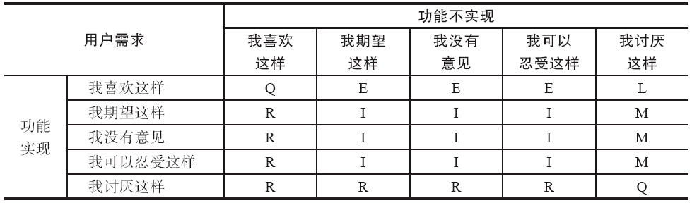
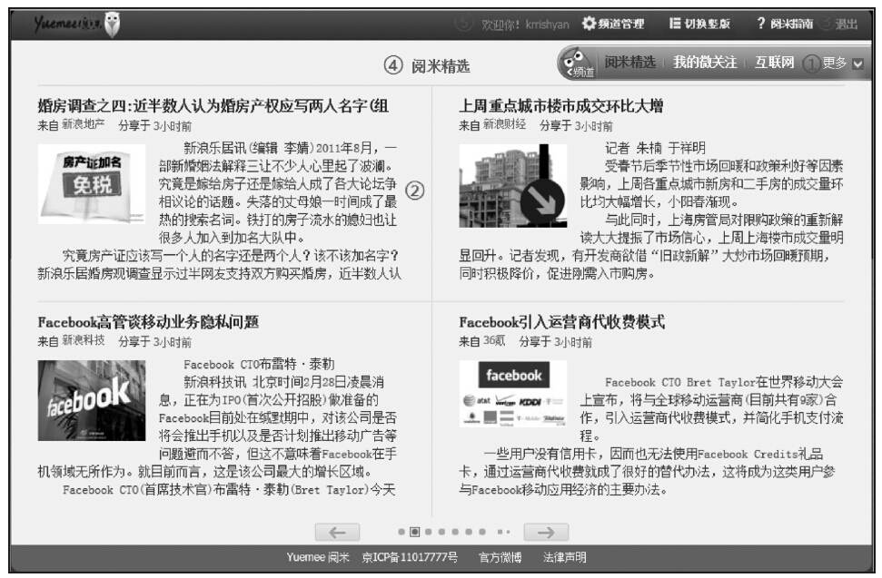
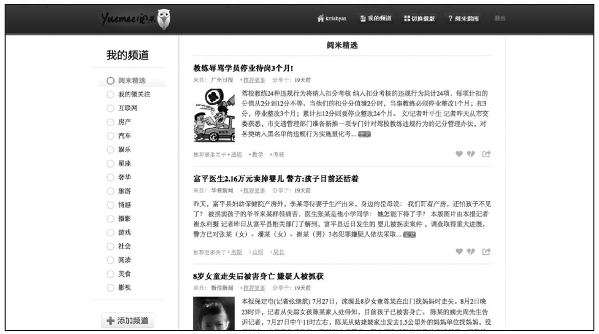

### 第29件事 评估需求的8种方法

小O最近收到了一位校友的求助信。据说这位校友也是从事产品工作的，他最近很郁闷。这主要是因为这位校友跟他们的研发人员大吵了一架，吵架的焦点在于校友坚持要做某个功能，但是研发人员拒绝实现。校友没有说服研发人员为什么一定要这个功能，甚是憋屈，这不，向小O求助来了。

小O自己也曾经遇到过这种比较尴尬的情况，好在有老K师傅在，轻易就化解了。但是评估一个需求或功能到底应不应做，有没有一些系统的方法论，小O也不甚明了。所以他带着这个疑问向老K师傅请教来了。老K思考了一下，决定向小O传授评估需求的一些主要方法论。

我们采集到用户的需求之后，就需要对各种各样的需求做评估，即评估哪些需求应该做，哪些需求不应该做。这是一项产品经理必须具备的基本功。很多产品面试官经常考察产品经理的这些基本功，比如针对某个产品，问候选人是否应该增加某功能。这里介绍几种评估需求的主要方法。

1.人性法

在第27件事和第28件事中，已经对用户的人性做过详细阐述。评估需求是否该做的最重要的方法也是人性法。具体的评估方法就是打算实现一个功能之前，看这个功能是否符合人性，跟哪个或哪几个人性相匹配或对应，如果非常匹配，那就值得做；反之，可以考虑不做。

在使用用户的人性来评估需求的时候，并不是说一个产品需要反映用户的多个或全部人性。也就是说产品反映的用户人性并不是越多越好。应根据自己所拥有的资源，挑选其中一个或几个人性，将所选人性做到极致即可。

比如微信中有一个漂流瓶的功能，这种做法称为复古法，就好像古代文人的诗歌辞赋讲究引经据典一样。我们先来看看漂流瓶的历史来源。在希腊有一个古老的传说：如果将自己的心愿写在纸上，装进透明的玻璃瓶，放入大海。瓶子载着心愿飘向远方，看到的人越多，你心愿实现的可能性就越大。后来，人们称这样的瓶子为漂流瓶。中世纪，漂流瓶是人们穿越广阔大海进行交流的有限手段之一。密封在漂流瓶中的纸条往往包含着重要的信息或者衷心的祝福。发现一个可能从未知领域而来的漂流瓶，对于古代水手而言或许是一种惊喜、神秘、偶然、期待……漂流瓶俨然是航海时代人类跨文化交流的象征符号。不难看出，漂流瓶反映了用户惊喜、神秘、偶然、期待、社交等方面的人性。

2.马斯洛需要层次法

在第27件事和第28件事中，已经对扩展后的马斯洛需要层次做过详细阐述。马斯洛需要层次法也经常用于评估需求是否该做，这种方法的重要性仅次于人性法。打算实现一个功能之前，看这个功能满足的是马斯洛需要层次的底层需要、中层需要，还是高层需要，从而决定是否该做。

需要特别注意的是，以前我们做产品的时候，主要着眼于马斯洛需要层次的底层，越底层就越应该做，因为是刚需。但是，现在时代变了，用户变了，玩法也变了，千万不能仅盯着底层需要，因为中层和高层需要也慢慢变成用户的刚需。

具体的评估方法就是对应底层需要的功能应该做，同时挑选一个或几个对应中层或高层需要的功能。

3.KANO模型法

如何利用KANO模型来评估需求呢？其实就是将要获取到的需求记录归类到基本型需求、期望型需求和兴奋型需求中。

使用KANO模型最简单的方法就是考虑每个主题或故事，对它所属的类型进行讨论。我们可以设计一套问卷，对用户进行问卷调查。KANO建议通过对一个功能问两个问题来确定分类。一个问题是：如果产品中有这个功能，用户会觉得如何？另一个问题是：如果功能不存在，用户又觉得如何？对每个问题采用5点度量方式进行回答：A表示我喜欢这样；B表示我期望这样；C表示我没有意见；D表示我可以忍受这样；E表示我讨厌这样。经过访谈后，根据归类矩阵，将问题进行归类来确定需求的类型，如表5-1所示。

表5-1 KANO模型需求归类矩阵

注：M代表Must-have，是基本型需求；L代表Linear，是期望型需求；E代表Exciter，是兴奋型需求；R代表Reverse，是相反的需求；Q代表Questionable，是可疑的结果；I代表Indifferent，是无关紧要的。

通过上述的矩阵分析，可以得出：哪些是用户需求表达时自相矛盾的；哪些是用户自己都不确定的；哪些是无关紧要、可有可无的；哪些是必须要有的；哪些是期望有的；哪些是自己都没有想到，但用户喜欢的（即兴奋型需求）。

具体的评估方法就是对应基本型需求的功能必须要做，不能在这方面失分；对应期望型需求的功能选择性做，提高其质量，力争超过竞争对手；对应兴奋型需求的功能选择1或2个必须做，让用户尖叫。

4.伪测试

伪测试指的是先不实现功能，只提供一个按钮接或文字链接或图片入口，用户点击之后提示此功能正在建设当中。根据用户的点击率数据情况来决定是否实现该功能。这也是灰度发布的一种形式。

伪测试在什么情况下比较适用呢？如果产品团队和研发团队双方争执激烈，谁也说服不了谁，需要拿出能让团队彼此信服的证据，这个时候就可以采用这种方法。但是，必须注意的是，先在产品的忠实用户中进行灰度测试，看点击率情况怎么样再做决定是否该做。

具体的评估方法就是测试用户中有超过40%的用户点击或使用了，则表明值得做。

比如，PC端新闻资讯个性化阅读工具“阅米”要不要做竖版，我们就可以采用这种方式来评估。阅米先实现的是横版，如图5-3所示。

图5-3 横版阅米

在横版阅米页面的右上角添加了一个“切换竖版”的文字链接来做伪测试。根据当时的点击数据，超过40%的测试用户点击过这个“切换竖版”链接，于是团队决定实现竖版阅米。开发出来的竖版效果如图5-4所示。

图5-4 竖版阅米

注意 伪测试是在不得已的情况下做的一种测试，建议不要轻易使用。

5.PK法

PK法指的是正反两方就某一个功能或需求进行投票PK，比如说，支持和反对。然后根据数据情况，再决定是否该做。这种方法一般在论坛上或社交媒体上（比如微博上）用得比较多。当然，也可以根据实际情况提供一个专有页面来收集正反两方用户的意见和建议。现在比较流行的做法就是使用抬杠这种App（语音版的BBS）来做调研，进而评估需求是否该做。这种方法其本质是用户的众包机制。

比如雷军在微博上做过这种测试——小米做不做豆浆机。当然了，他没有采用PK法，但是他把一个想法抛出来，看大家的正面和反面意见，比如评论、赞、转发数等，其本质跟PK法是一致的。

6.专家法

专家法指的是由相关的产品专家、用户体验专家、产品运营专家等一起来评估需求是否该做，这种方法主要是利用群体智慧来评估需求。现在有很多的公司都设立了产品委员会，其主要职责就是通过专家的力量来做评估。甚至一些大的产品决策，都需要应用这种方法做出。产品专家评审有以下几个要注意的地方。

·相关人员应参与。做需求评审的时候，产品负责人、研发负责人、运营负责人、市场负责人、销售负责人等相关人员都应该参与并积极讨论。之所以需要运营负责人、市场负责人、销售负责人参与评审，主要是因为他们与用户打交道比较多，对用户的理解比较深刻。

·多提问题。评审时不仅要发现用户的表面需求，还应该发现用户的本质需求，多问为什么。比如，用户行为背后的动机或目的是什么？用户需求的痛点是什么？用户使用的场景是什么？用户的这些需求符合现阶段的产品定位吗？这些需求能解决用户什么问题？为用户带来什么价值？这样的需求是我们目标用户的需求吗？这样的需求是个体需要还是群体需要？

7.定位法

定位法指的是根据产品定位来评估需求是否该做。比如，某音乐产品的定位是个性化音乐推荐引擎，这个时候，排行榜的功能是否应该做？这个产品的定位是根据用户的行为，建立用户对音乐的喜好模型，然后推荐给用户他们可能会喜欢的歌曲，这是个性化音乐推荐引擎。排行榜的功能指的是根据歌曲的播放量在一定时间内汇总后得出的一张榜单。这个榜单反映的是大众口味。当然，大众口味和个性口味会有交集，但是毕竟体现不出个性化的定位，跟定位不是很搭，所以，建议不实现排行榜的功能。

8.场景法

根据用户的场景来评估需求是否该做。比如，对于现在的打车软件比较火（嘀嘀打车、快的打车等App），假设某些用户的场景是这样的：用户经常会去一些陌生的地方办事。用户初到一个自己不熟悉的环境，或多或少都会有一些恐惧心理，再加上如果他还是个路痴，就很容易表达不清楚自己所处的具体的位置，这时又要打车去另一个地方办急事，他们该怎么办？确定用户的场景之后，快的打车研发了一键打车的功能，就很好地解决了这种场景下的用户痛点，再加上用户一般是比较懒惰的，恰好利用了人性的懒惰。这个功能做得很赞。

老K师傅的话音刚落，小O意识到自己评估需求的基本功还是比较弱的。学习了这些方法论之后，小O向他的校友详细讲解了这些评估需求的方法论。过了一段时间，校友给小O的反馈，说他提供的方法相当实用，这下终于不用经常跟研发团队吵得面红耳赤了，也增强了自己的说服力。小O也是把这些方法当做产品内功来修炼，毕竟这是产品经理必备的基本功。

评估一个需求是否该做主要包括定性和定量两种方法：定性的方法包括人性法、马斯洛需要层次法、专家法、定位法和场景法；定量的方法包括KANO模型法、伪测试和PK法。在产品实践中，一般都会综合使用几种或多种方法来评估需求，当然，强烈推荐产品经理使用人性法、马斯洛需要层次、定位法和场景法来评估一个需求或功能是否该做。
