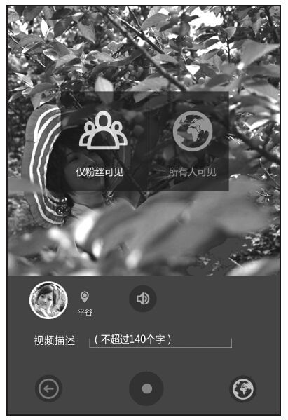
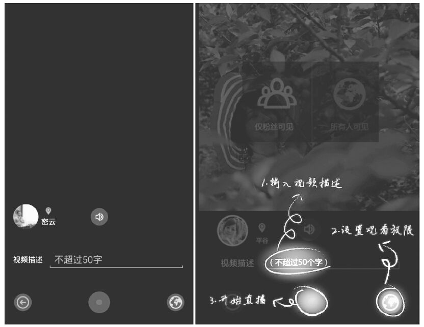
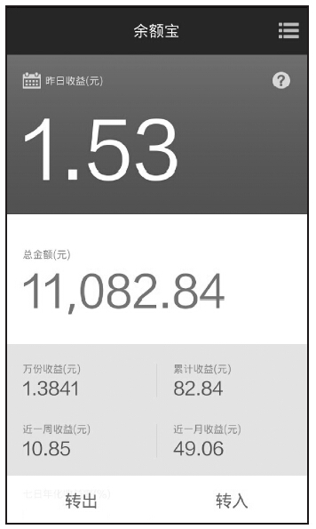

### 第33件事 极简设计的3个方面

小O忙了一天，拖着疲惫的身体回到家已经是晚上12点了。从事产品工作，加班加点比较常见。但是这一天小O也不知怎么了，虽然累了一天，反而难以入睡，于是他干脆打开了微信，没想到却看到一个用户体验的微信群里，好几个夜猫子还在那激烈讨论一个话题：极简设计。不一会儿，有一句话引起了小O的关注，那就是少即是多。怎么少就是多呢？小O怎么也想不明白，不知怎么的，就迷迷糊糊睡着了。

谁知小O在梦里还在思考这个问题呢，但还是无果。这不，第二天小O向老K师傅请教，什么是极简设计，少即是多代表着啥意思。老K思考了一会，其实这个问题也不难问答，关键是需要对极简设计进行全方位理解。

极简设计是相对于过度设计来说的，极简主义设计已经被描述为最基本的设计，剔除了多余的元素、色彩、形状和纹理，以及流程和步骤。它的目的是使内容更为突出并成为焦点。极简主义设计意味着平静，将思想带回本真，回归本质和简单。那如何理解“少即是多”呢？极简主义将最重要的内容带到最前面，避免用户分散注意力。如果一个页面有太多的元素，浏览者将迷惑于看哪里或误解元素的优先级。极简主义设计注重功能或内容的最优表达。

1.流程交互的极简设计

交互设计有一个“0123”法则。这个法则特别适用于移动互联网，意思是：不需要说明书或者帮助，一看就会，两秒等待时间，三步以内的操作。尤其是三步以内的操作，用户在3次点击之内如果还没有找到他们想要的信息或没有完成任务，他们就会离开该网站。这条原则突出了清晰的导航、符合逻辑结构和易于理解的网站层级的重要性。再加上之前阐述过的人性中的懒惰，所以完成任务的步骤越少，用户的满意度越高。

我们以快的打车App为例。现在想约车，正常的流程是：一键登录→语音或文字叫车→出租车司机接活儿→用户等车→上车到达目的地→支付→点评。我们主要看前面几个步骤，假设用户经常去某些地方，比如去公司、回家或者去某些特定的地方，又或者曾经去过的一些地方，如果流程还是一键登录→语音或文字叫车→出租车司机接活儿，那么因为用户每次都要进行这些操作，再加上懒惰，用户的主观体验会感受不是很好。但如果对经常去的地方提供一键打车功能，这个流程一下子简化了，用户完成任务的步骤也减少了，又比较便捷，随之而来的是用户体验的提升。

我们再以魏格曼这款App为例。魏格曼会根据用户的购买记录进行分析得出用户经常购买的商品，并提供一键下单的功能，这大大减少了用户购买商品的步骤。通过这款App，用户不用再去搜索想要的商品，也不用一个类目一个类目层层去筛选自己要想的商品。之前用户用于每次搜索产品的时间成本都很高，有时候还不一定能找到自己想要的商品。魏格曼还提供一个促销商品的快捷通道，也就是在类目的最上方提供了一个促销打折商品的快捷入口，对于想购买打折商品的用户来说，完成任务的步骤也减少了，那么对这款App的满意度自然也就随之提高了。

2.界面交互的极简设计

我们以一个App的某一个界面设计为例来阐述如何做界面交互的极简设计。简化之前的界面设计如图6-9所示。

图6-9 简化之前的界面设计

这是一个直播视频社交App，在做用户可用性测试的时候发现用户达到这个界面的时候，总是不知道该看哪里或点击哪里。之所会出现这种情况，是因为这个界面的元素有点过度设计，界面的元素包括直播视频的权限设置、输入视频描述（标题）、返回icon、直播按钮icon、权限设置更改icon，一时之间，用户不知所措，因为给用户的选择有点多，这样导致用户纠结到底点击哪个。这个时候，我们做了减法，简化之后的界面设计如图6-10所示。

图6-10 简化之后的界面设计

不难看出，简化之后的界面（图6-10中的左图）着重调整了权限设置的功能。这个功能在简化之前默认是弹出的，且默认权限为对所有人公开；简化之后，需要用户点击右下角的权限设置icon才会弹出，也就是说默认是不弹出的，等用户需要的时候才会进行权限更改设置，并且这款App也是鼓励用户公开分享他们直播的优质视频。对用户来说，精简后的界面用户不会再纠结于到底去哪儿或者点击哪儿。经过可用性测试，这时用户可选择输入视频描述或者点击视频直播icon开始直播。由于将最重要的功能放到最下面，从而避免了用户分散注意力。简化之后的界面（上图右图）还增加了新手引导灰层，这样对新用户来说，作出选择更加容易。

3.视觉的极简设计

视觉的极简设计主要表现在较少的纹理、色彩、形状、线条、内容或排版，重点关注四个关键词“留白”、“平衡”、“对齐”和“对比”。我们以余额宝为例，如图6-11所示。

图6-11 余额宝

不难看出，余额宝在视觉上进行了极简设计，整个页面划分成昨日收益、总金额、收益状况和转出转入功能4个区域。且采用了对比设计，视觉层次是：昨日收益>总金额>收益状况>转出转入。对齐体现在收益状况区域，包括万份收益、累计收益、近一周收益和近一月收益。总体感觉现在不是很空，比较协调，平衡感较好。留白体现在总金额区域，有利于突出总金额区域里面的内容，并以留白来区隔昨日收益和收益状况区域。

小O这才真正明白“少即是多”的真正含义，页面元素太多，用户纠结于选择，反而不知如何操作，索性可能放弃操作。页面元素少，重点内容或功能突出，用户能快速作出选择，这样用户使用产品的主观感受体验良好，以后会经常回来使用该产品，并慢慢喜欢上产品。

极简设计聚焦功能或内容的最优表达，主要包括流程、界面和视觉的极简设计。流程简化，方便用户在最短的时间或最少的步骤内完成任务；界面元素做减法，让用户不再纠结于选择，突出最主要的功能或内容以方便用户操作；视觉极简设计重点关注留白、平衡、对齐和对比。总的来说，极简设计旨在功能或内容的最佳表达。
