### 第38件事 移动App设计的11大法则

小O最近做了一款高保真的产品原型，跟真的App相差无几。也许是小O着急要得到身边做产品的朋友的认可和赞扬，就给朋友们演示了一下。令人大跌眼镜的是，这款产品被一个很资深的做产品的朋友泼了一盆冷水。小O心里很不服气，再加上朋友语气比较硬，这下可“惹恼”了小O。尤其是这位朋友说小O连移动App设计的重要法则都不知道，这不等同于直接被鄙视了！

小O心里不平归不平，但还是很虚心地向老K师傅请教了一下，果不其然，在高保真的原型设计上他还真的犯了几个常识性的错误。也许是自尊心的强烈驱使，小O迫切想知道移动App设计的重要常识性法则有哪些。老K师傅看小O很是急切和诚恳，就答应抽个时间给小O好好培训一下。

移动App设计的重要法则指的是我们在设计App需要遵守的一些设计规范和法则，这些法则就好像一些行为规范一样。

1.导航

手机客户端上的主导航（一级导航）如图6-22所示。

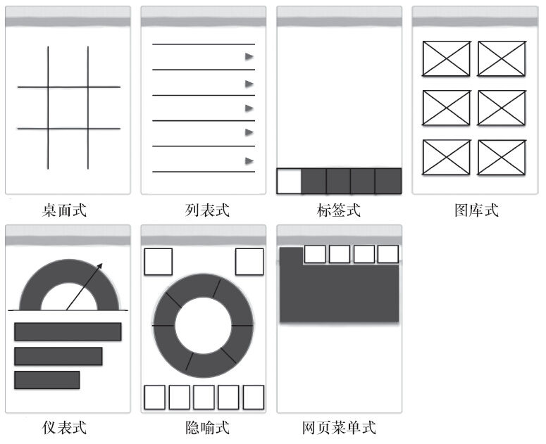

图6-22 主导航分类

对图6-22中所示的几个主导航简单介绍如下：

·桌面式主导航适用于“图标+短标题（名称）”的形式。在各个模块间无主次之分时，应保证代表各个模块的图标所占空间大小一致；有主次之分，应让主要的模块图标所占空间较大，次要的所占空间较小。还有一点需要特别注意，就是在进行桌面式导航设计时，要给用户提供个性化和自定义设置的功能。

·列表式导航适用于标题较长或有副标题说明的情况，点击列表式导航中的某一个列表进入下一个页面时，一般需要提供返回列表式导航的功能。

·标签式的Tab一般少于或等于5个，如果有6个以上的Tab，那么可以设置左右水平滚动显示（向左和向右的箭头），如果是超过7个Tab，建议放到“更多”（一般是第5个Tab）里。视觉上应对已选择和未选择的标签进行区分（用于区分当前Tab）。

·图库式导航适用于用户想浏览且经常需要更新的内容，比如新闻、图片和视频类应用。

·仪表式导航适用于财务类应用、分析工具、销售和市场类应用。

·隐喻式导航（隐喻，又称暗喻）即将不同的两者进行隐藏式的比较，表达方法为A是B。就是将生活中的物象抽象后表现出来的导航，比如转盘。隐喻式导航要求用户看到之后的认知成本要低，能立马明白创作者想表达的意思。

·网页菜单式导航，来源于Web页面的导航Tab，可能会有二级子导航，一般置于页面顶端。

手机上的次导航（二级导航）如图6-23所示。

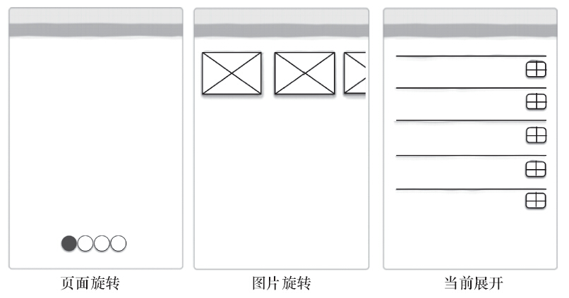

图6-23 次导航分类

任何主导航都可作为次导航，对于这一点上边已经介绍过了，这里就不再重复了。除了上边介绍的外，次导航还包括页面旋转、图片旋转和当前展开三种。

·页面旋转导航适用于只有少量页面的情况（一般不超过8个），直接标识出一共有几个页面，当前页面是哪个页面。

·图片旋转导航适用于显示文章、产品、图片等内容，提供视觉引导，比如箭头或圆点（暗示作用）等。比如有的图片没有显示完全，这是暗示用户可以向左滑动查看更多的内容。

·当前展开导航适用于在用户需要的时候一步一步展示更多的内容或选项。

2.表单

手机客户端上的表单如图6-24所示。

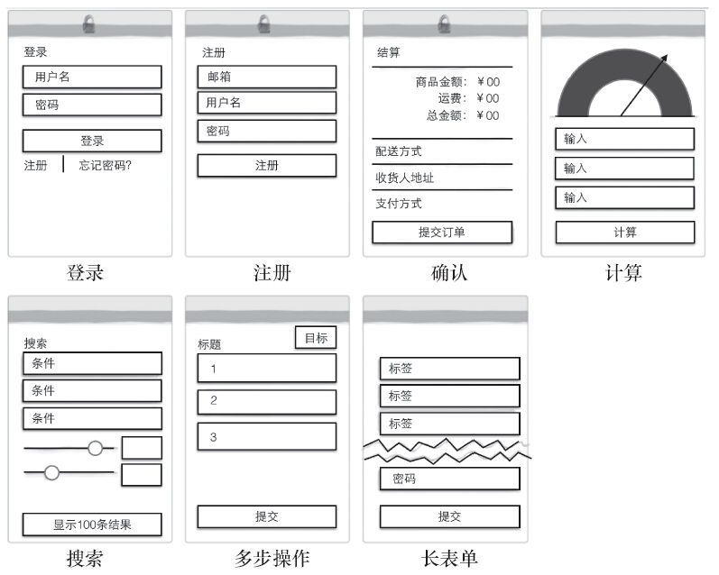

图6-24 表单

对图6-24所示的各个表单介绍如下：

·登录：要求用户输入的信息量要尽量少，最好在一屏之内显示，不要做所谓创新。这里要特别注意，“找回密码”功能是必须要提供的。

·注册：输入信息尽量少，一屏之内显示，去掉邮件和密码确认，使用纵向标签（建议一行只放一个字段）即时反馈有效性。

·确认：注重速度、效率和安全，减少不必要的字段，将页面和步骤最少化。

·计算：对齐、标签、字体、按钮摆放、对比、颜色都会影响表单的可读性，尽可能在同一页面显示可视化的数据效果。

·搜索：搜索字段不要太多，一个页面一个搜索字段或维度，使用合适的空间，尽量使操作方便、快捷。

·多步操作：显示用户在哪，还可以去哪，减少不必要的字段，将页面和步骤最少化。

·长表单：不要为了减少滚动，机械地将表单划分成几步，不要为了没有必要的字段去编辑表单，遵循各操作系统的UI设计规范。

3.表格与列表

手机客户端上的表格与列表如图6-25所示。

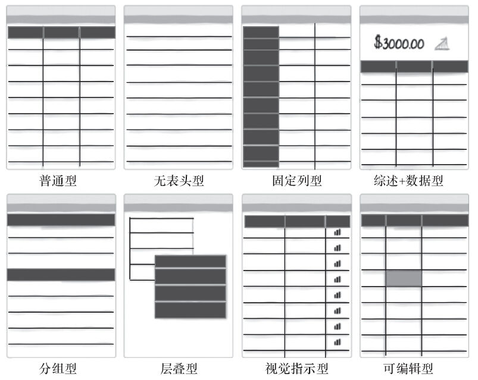

图6-25 表格与列表

对图6-25所示表格和列表介绍如下：

·普通型：尽量不要使用黑色网格线，也不要将表格垂直划分、文字左对齐和数字右对齐。如果一屏信息太多，可以考虑使用其他模式。

·无表头型：每一行最大显示三小行的信息，信息内容有主次之分，不要自己去猜哪些内容比较重要，具体的主次划分应该在做了充足的用户调研之后确定。无表头型在App中很常见。

·固定列型：当列被固定之后，要提供视觉引导（暗示），提示用户滑动后能看到更多的内容。

·综述+数据型：综述应该位于数据之上，且比较醒目，容易理解。

·分组型：在视觉上要区分总分关系。

·层叠型：一般是控制在三层以内，能在当前页面展示就在当前页面展示。

·视觉指示型：选择的图标要容易识别。

·可编辑型：不太适用于大规模的数据输入和编辑。

4.搜索

手机客户端上的搜索如图6-26所示。

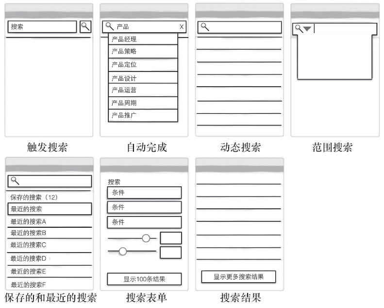

图6-26 搜索

对图6-26所示的搜索介绍如下：

·触发搜索：搜索框要比较醒目；需要提供取消搜索功能；当搜索正在被执行时，给用户提供反馈。

·自动完成：如果在显示搜索结果时有延迟，需要给用户提供反馈，在搜索结果中，对于匹配的结果可以重点突出一下。

·动态搜索：适用于有限的数据集，比如通讯录、个人媒体库等，如果数据集比较大，就不太适用了。

·范围搜索：基于数据集提供合理的搜索范围条件，3~6个选项已经足够了，可以考虑表单式的高级搜索。

·保存的和最近的搜索：尊重用户的劳动，让用户少操作。

·搜索表单：适合字段较多的高级搜索。

·搜索结果：显示搜索结果数量，使用加载的方式代替翻页，选择一个合理的搜索结果排序方式。

5.排序

手机客户端上的排序如图6-27所示。

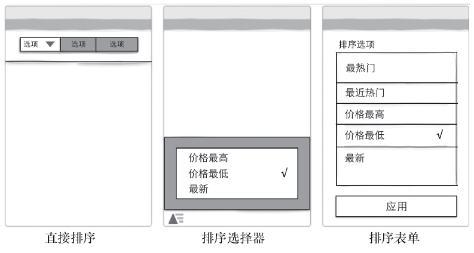

图6-27 排序

对图6-27所示内容介绍如下：

·直接排序：适用于3个以内的排序字段。

·排序选择器：在用户需要的时候弹出面板进行选择，比较节省空间。

·排序表单：适用于3个以上的排序字段。

6.过滤

手机客户端上的过滤如图6-28所示。

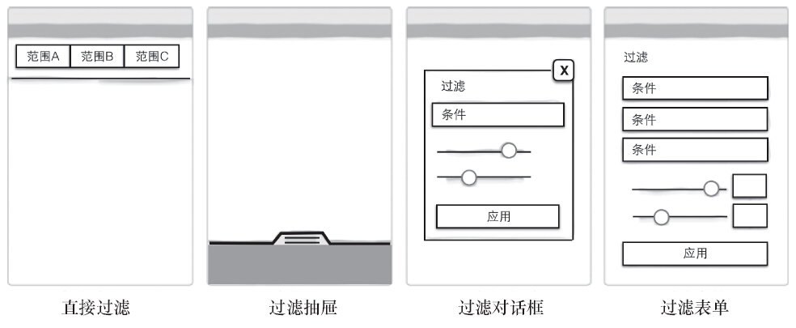

图6-28 过滤

对图6-28所示内容介绍如下：

·直接过滤：适用于过滤字段少于3个的情况。如果字段大于3个，可以设计成左右水平滚动显示。

·过滤抽屉：在用户需要的时候弹出抽屉面板进行选择，比较节省空间。

·过滤对话框：适用于过滤字段较少的情况，过滤的字段性质上有差异。

·过滤表单：适用于过滤字段较多的情况。

7.工具

手机客户端上的工具如图6-29所示。

对图6-29所示内容介绍如下：

·工具条：工具条一般放在屏幕的底部，选择的icon要易于识别，也可采用“icon+标签”的形式。

·选项菜单：尽可能选择直接的交互，不要将导航藏在选项菜单里，如果在屏幕上只有一个操作的时候建议使用行为召唤工具。

·行为召唤：不要将主要的行为召唤工具隐藏在菜单或是放置在工具条里（难以认出），主要行为与次要行为应该有明显对比。

·情境工具：尽可能选择直接交互，如果按钮是必需的，那么应该与被操作对象尽量靠近，选择易识别的icon或者文本标签。

·当前操作：尽可能选择直接交互，如果按钮是必须的，那么应该与被操作对象尽量靠近，选择易识别的icon或者文本标签，每个被操作的对象最多有2个当前的操作。

·多状态按钮：多状态按钮比较适用于关联比较紧密的几个操作，而这几个操作要按照一定的顺序执行。

·批量操作：比如删除或重新排序等操作最好放置在编辑模式下，提供比较明显的退出当前模式的操作。

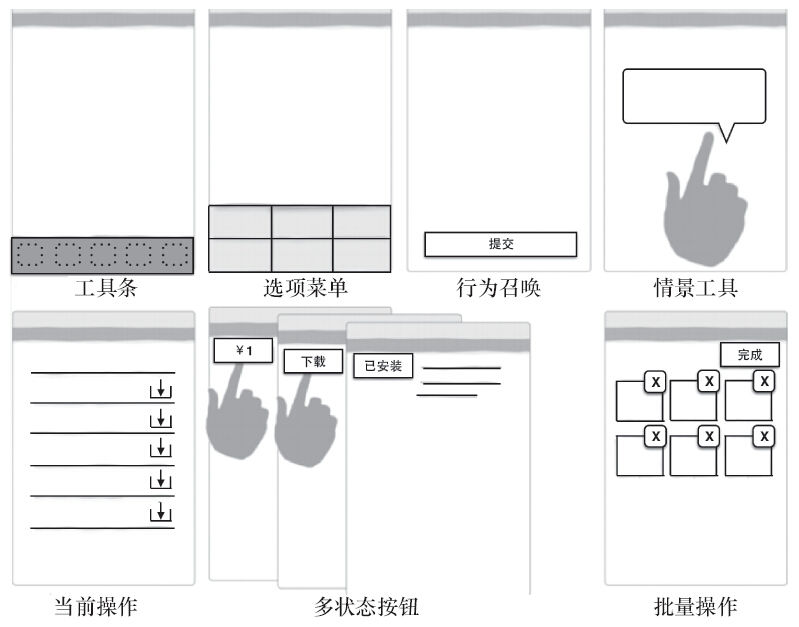

图6-29 工具

8.邀请

手机客户端上的邀请如图6-30所示。

对图6-30所示内容介绍如下：

·对话框：对话框内的内容要简短，在App应用里的其他地方也能看到同样的信息内容。

·提示：要尽可能靠近指向的对象，内容要简短，交互开始（比如说触屏）时“提示”消失。

·巡视：主要用于强调或突出显示应用的关键或核心功能，一般从用户目标角度出发，尽量保持简短和视觉引导。

·视频demo：要从标准的工作流角度阐述如何使用应用的关键或核心功能，一般要有播放、暂停、音量控制等功能。

·透明状：使用浮层或蒙灰图层作为新手引导。

·首次使用引导：引导用户进行某些操作。

·一致性：降低用户的认知成本。

·易发现：也是一种暗示，这种模式主要用于刷新数据或内容。

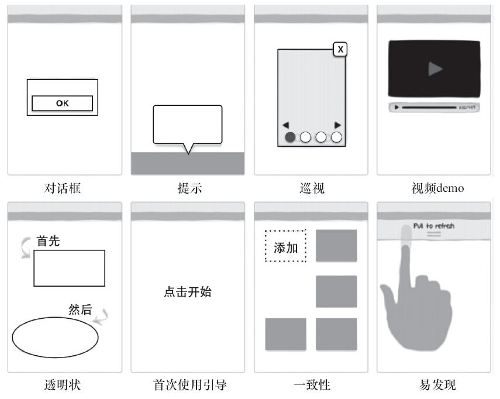

图6-30 邀请

9.反馈

手机客户端上的反馈如图6-31所示。

对图6-31所示内容介绍如下：

·错误提示：使用通俗的语言告诉用户如何解决出现的问题，在当前屏幕显示错误信息，不要使用模块化的对话框。

·确认信息：动作操作完成之后提供确认信息，但是不能阻碍用户完成此操作。

·系统状态：提供系统状态的反馈，如果存在长时间加载的可能，则还应提供取消的功能。

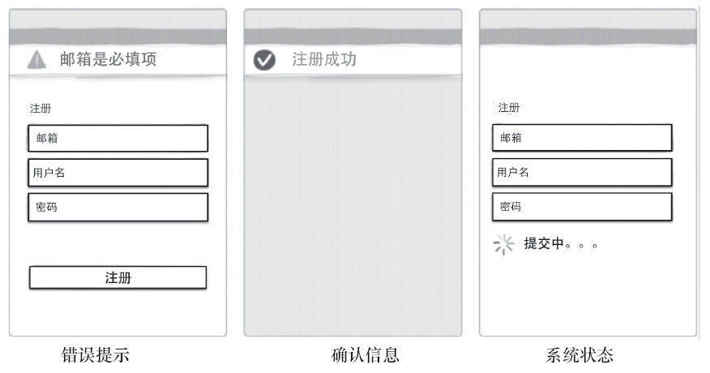

图6-31 反馈

10.功能可见性

手机客户端上的功能可见性如图6-32所示。

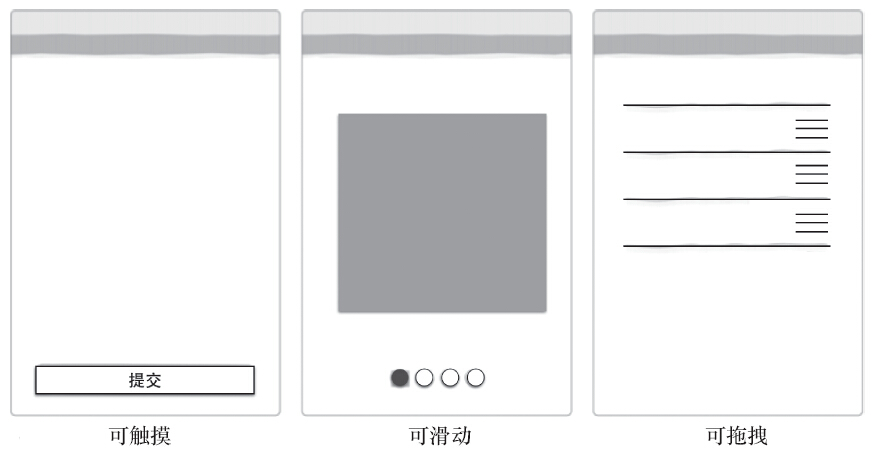

图6-32 功能可见性

对图6-32所示内容介绍如下：

·可触摸：视觉设计时，注意按钮等在空间上的可触摸性。能点击和不能点击的元素在视觉设计上要有区分。

·可滑动：这也是一种暗示，提示当前位置在哪，还可以去哪几个位置。

·可拖拽：icon容易识别，可以考虑使用邀请，告知用户拖拽功能是可以操作的。

11.Idiot Box

手机客户端上常见的Idiot Box如图6-33所示。

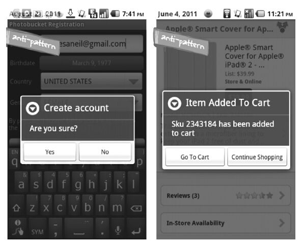

图6-33 Idiot Box

尽量不要阻碍操作流程，只有在不可修复的操作即将发生时，才提供确认对话框，比如永久删除操作。

听了老K师傅的这一讲，小O很是惭愧，因为在自己设计的高保真原型中犯了好几个常识性的错误，比如可点击和不可点击的元素在视觉上区分不明显。这次小O得到的教训很深刻，至少还有很多东西值得自己去学习和研究。老K很欣慰，他最怕小O成为井底之蛙，不求上进。

纵观移动应用的重要设计法则，不难看出，尽量让用户少输入，多选择；页面元素的多少会影响到使用什么样的解决方案，数量少的元素直接在当前页面展现，数量多的元素可以先隐藏起来，等用户有需要的时候再点击展开。将产品当做人来看，而不是机器，人机交互，重在反馈。
