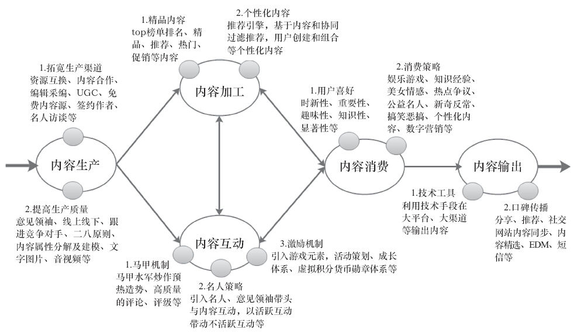

### 第41件事 内容运营的5个关键环节

小O自从长了一些本事之后，经常跟身边的产品和运营朋友吃饭聚餐，也结识了不少业界的专家和“大拿”。听君一席话，胜读十年书，与高手过招，学东西很快。其中有位“大拿”就说到了内容为王。怎么理解内容为王这句话呢？之前常听老K师傅说起，产品的功能就好像人的骨架一样，而内容才是人的血和肉，可见内容的重要性。

恰好小O的一个朋友制作了一款App，叫“美啦美妆”。这是一款时尚女性必备的美容化妆社区类App。在很短的时间内用户数就已经突破100万了。小O在采访“美啦美妆”的创始人时，她同样说了一句话，社区产品内容为王。小O迫不及待地向老K师傅请教，如何理解“内容为王”这句话。恰好，老K也打算讲讲产品运营另外一项非常重要的工作——内容运营。

内容在这里指的是泛内容，包括但不限于文字、图片、语音、视频、商品、App（应用商店）等。内容运营包括5个关键环节，分别是内容生产、加工、互动、消费和输出，如图7-2所示。

图7-2 内容运营

1.内容生产

内容生产指的是内容从无到有的过程，通俗解释就是内容是怎么来的。从Web1.0的编辑模式进入到Web2.0的UGC模式再到Web3.0的参与式生产内容（如知乎模式），内容生产的模式越来越去中心化。人人都可以是内容的生产者。

内容生产经常用到的策略和方法主要有：

·生产渠道：内容资源互换、内容合作或购买、编辑采编、UGC、免费内容源采集、签约专栏作者、名人访谈、用户参与式生产等。

·鸡和蛋模式：服务商家和消费者有个鸡和蛋的问题。有的先与几个短尾商家建立合作，生产内容，吸引到一个数量不小的用户，然后再让广大长尾商家入驻；有的先不与商家直接建立商业关系，而只做信息流，生产信息内容，吸引到足够用户之后再建立销售队伍攻克已经获益的商家，解决了用户和内容冷启动的难题。一般来说，前者模式成功的概率要高于后者。

·生产质量：意见领袖（谁生产）、内容载体多媒体化（内容展现方式）和看点内容（内容分类：用户一般喜欢看好玩、新奇、美女帅哥、反常、争议、幽默搞笑、知识、名人、公益和煽情等方面的内容）。

鸡和蛋模式适用于电商产品、O2O产品、应用商店以及平台型产品。需要用户生产内容的产品，要想活下来并能够成功，关键在于UGC机制的创新。最近互联网金融的模式比较火爆，我们所说的内容其实是用户的数字资产，借鉴互联网金融模式（类余额宝模式），可以考虑对UGC的内容进行虚拟货币投资，如果内容质量好，用户与内容互动率高，内容生产者的每天收益也高，这无疑会大大刺激用户生产内容的积极性。

2.内容加工

内容加工指的是将内容按照一定的规则重新组织和展示。加工内容经常用到的策略和方法主要有：

·精品内容：top榜单、精品、热门、推荐、新品、促销、限免、必读或必备内容等。这些内容一般都是由编辑和运营人员加工完成的。

·个性化内容：根据用户行为建立喜好模型，对内容进行建模，最后将合适的内容在合适的时间、合适的地点通过合适的方式推荐给合适的人，这是由个性化推荐引擎加工完成的。

·用户组织内容：用户将自己喜欢的内容加工成内容包，比如虾米音乐的“虾小米精选”频道就是用户将喜欢的歌曲组合成精选集，供更多用户聆听，这是由普通用户加工完成的。

3.内容互动

内容互动指的是用户对内容的直接反馈，比如阅读、下载、查看浏览、喜欢、赞、评论、分享等。用户与内容之间的互动多少直接体现了内容的质量高低。内容互动常用策略和方法主要有：

·马甲机制：马甲炒作、预热、造势、高质量评论、评级等互动。

·名人策略：引入名人、意见领袖带头进行内容互动，以活跃用户与内容之间的互动带动不活跃用户与内容之间的互动。

·激励机制：引入游戏元素，如任务系统、经济系统和等级系统等。

用户与内容之间的互动机制重在创新，比如TastemakerX把音乐社区当成“股票市场”，让用户自主去挖掘好听的音乐。例如，平台上有一首好听的新歌，你是第100个关注收听的用户，你就属于“原始股东”，而当这首歌后续有越来越多人收听时，你就能获得越来越多的虚拟货币“notes”。用户获得的“notes”越多，就证明自己的音乐欣赏品位越高，是一位懂得欣赏好音乐的“音乐潮流先锋”。

4.内容消费

内容消费指的是用户需要支付一定的费用（有时候是免费）才有权限使用或消费的内容。常见的内容消费策略和方法主要有：

·数字激励：利用用户从众心理，比如月销售量、好评数、星级、下载量、下载用户比例等。

·广告模式：用户可以免费使用需要有偿付费的内容，由第三方广告主买单，走电视台模式。

·交叉销售：要想完成任务，需要消费其他产品内容来完成。

·推荐引擎：根据用户行为和喜好模型，推荐给用户可能喜欢或购买的内容。

电视台运作模式指的是电视台广告招商，赚的是广告主的钱，电视台将广告主的钱用于制作电视节目或购买电视剧等内容的版权，或者让广告主赞助播映某电视节目，这样普通用户基本上可以免费观看更多的电视节目。可借鉴之处在于收费模式转移到广告主，用户可以免费使用以前需要付费才能使用的产品或服务。

Hitbliss让用户靠看广告赚“钱”以购买高清视频数字内容。看广告赚积分，购买更多内容。用户选择感兴趣的广告互动赚积分，看得越多，赚得越多；跳过广告就必须付费，通过监控机制，以弹出小窗的方式询问，要求短时间内响应；建立了一种信任机制，通过用户诚信行为发放信任点数，信任点数越多，越少被打断，询问是否在看的次数也就减少；注意力消费广告新模式，连接广告主与用户之间的平台赚取佣金。可借鉴之处在于收费模式的“太极转移”，目前的收费模式主要为付费下载或包月制，可以将收费模式转移到广告上。

5.内容输出

内容输出指的是将内容输出为产品，以优质的内容吸引更多用户使用自己的产品。常用的内容输出策略和方法主要有：

·分享机制：分享、推荐、社交网站内容同步、EDM或短信形式内容精选等。

·平台模式：将优质内容打包作为内容源，借助其他阅读工具作为输出。如在zaker、多看等阅读工具上输出优质内容。

·技术手段：利用手机碰一碰方式输出书籍、图片、音乐、视频、App等内容。

内容输出旨在将优质内容从一个小的生态系统输出到另外一个或几个生态系统中，吸引更多的用户使用产品，从而形成一个内容运营的闭环。

老K师傅的话音刚落，小O终于理解内容为王这句话的真正含义了。互联网时代有两个为王，一个是流量为王，另一个是内容为王，如果在这两个为王之间选出最重要的一个，那肯定是内容为王。有了优质的内容，才能吸引更多的用户，产生更多的流量，所以最终结果还是内容为王。

内容运营指的是内容怎么生产，生产后怎么加工，加工后怎么让用户与内容产生互动，产生互动之后怎么样让用户对内容产生消费，产生消费之后怎么样让用户对内容进行输出。最关键的环节在于内容互动和消费环节，这两个环节的机制都需要微创新。此外，在策划内容看点时，需要知道用户一般对好玩、新奇、美女帅哥、反常、争议、幽默搞笑、知识、名人、公益和煽情等方面的内容感兴趣。
