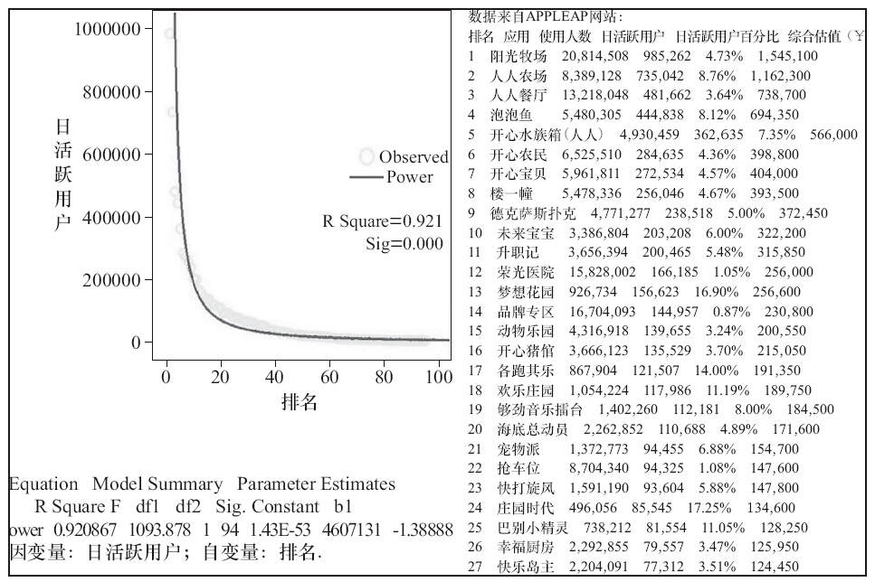

### 第43件事 幂律法则在产品运营中的应用

小O整整花了一个周末的时间阅读了老K师傅推荐的一本书，克莱·舍基所著的《人人时代》，收益颇多。其中一个幂律法则引起了小O的关注。总觉得对这个法则颇为熟悉，原来之前就听人曾经说起过，BBS论坛里大多数用户都在潜水，而只有极少用户在那发帖或灌水，这些用户可能占总体用户的1%还不到，也就是少数用户生产内容，大多数用户消费内容，颇有点二八法则的意思。幂律法则与产品运营有结合点吗？小O带着这个疑问走进了老K师傅的办公室。师傅今天心情大好，估计是碰到什么好事了，这不，很高兴地帮小O解答了这个问题。

幂律也叫可预料的不均衡，最显著的特征就是等级越高越不均衡，数学原理：第n个位置的rank是第1个位置的rank的1/n，第1位与第2位之间的差距要大于第2位与第3位之间的差距，以此类推。以用户上传照片为例，根据幂律分布，排名第2的次活跃用户的上传量只是排名第1的最活跃用户的上传量的1/2，而排名第10的只是排名第1的1/10。最活跃的少数用户完成了大部分的上传工作，尽管他们只占上传者里的少数并且经常是极少数。

不仅上传照片遵循幂律分布，其他很多情况都遵循这个规则，比如对一个相册里的每张照片的浏览数排序，还可以按照每个标签被应用的照片数量对标签进行排序（可以以标签云形式展现），所有这些图形都会大致呈现幂律分布。

Flickr、Facebook、Digg、Twitter是幂律分布的典型代表。它们的用户群体都体现出幂律分布的特征，类似于80/20法则所展现的。在此类群体中，最活跃的用户所占比例极小，但他们创造的内容占据了群体创造的绝大部分。其次的次活跃用户创造了另一部分，剩下的大部分用户提供很少部分的内容，甚至零创造。

我们以人人网应用的日活跃用户为例（截取部分应用数据），如图7-7所示。

图7-7 人人网应用的日活跃用户幂律分布图

通过分析可知，在人人网中排名前10的应用用户有率是52.2%，再次呈现幂律分布特点。

幂律法则在产品运营中的运用主要体现在用户运营和内容运营两个方面。

1.用户运营

以电商网站为例，我们根据用户的价值来制定用户运营策略，那么用户的价值怎么计算？一般有两个维度：忠诚度（3个子维度：最近购买时间、购买频率和购买产品种类）和消费能力（2个子维度：平均每次消费额和单次最高消费额），然后通过数据转化方法将每个用户的价值用百分制来表示，最后以横轴代表忠诚度、纵轴代表消费能力进行矩阵分析（以忠诚度和消费能力的均值划为依据分成4个象限）。

第一象限的用户：消费能力高，忠诚度也高，最有价值用户，数量相当少，其运营策略是差异化服务，专门重点维护，可以走彻底的奢侈路线。

第二象限的用户：消费能力高，忠诚度低，高价值用户，消费不多，消费额很高，其运营策略是为其提供高价值消费品、批量购买服务，可以走加少量钱就可享受的新奢侈路线。

第三象限的用户：普遍价值用户，忠诚度和消费能力都不高，代表着大多数用户，其运营策略是提高用户的忠诚度或消费能力，可以走让用户感觉质量好、价格低的路线。

第四象限的用户：传播价值用户，消费能力不强，忠诚度高，口碑传播者，其运营策略是提高用户的消费能力，可以采取促销低价策略，可以走彻底的低价路线。

对散落在各个象限里的用户价值数据点，都可以以幂律分布图展示出来，这样针对价值细分之后的用户实行差异化的运营策略，最终会提高整体用户的综合价值。

再比如，我们根据用户UGC的数量，我们制作出幂律分布图后，开辟一个UGC达人或明星频道（栏目），至少起到一种榜样作用，激励更多的用户生产内容。幂律分布图可以作为我们细分和筛选用户的一个重要工具。

2.内容运营

还是以电商网站为例，我们根据内容的价值来制定内容运营策略，那么内容的价值怎么计算？为了方便说明，在此使用浏览量和转化率两个维度，然后通过数据转化方法将每个商品内容的价值用百分制来表示，最后以横轴代表浏览量、以纵轴代表转化率进行矩阵分析（以浏览量和转化率的均值为依据划分成4个象限）。

第一象限的内容：转化率和浏览量都高，A类内容，其运营策略是重点维护和优先推荐。

第二象限的内容：转化率高，浏览量低，B类内容，其运营策略是提高曝光度，比如推荐位等。

第三象限的内容：转化率和浏览量都低，C类内容，其运营策略是可以考虑下架。

第四象限的内容：转化率低，浏览量高，D类内容，其运营策略是改善转化关键路径的用户体验优化。

散落在各个象限里的商品内容价值数据点，都可以以幂律分布图展示出来，这样可针对价值细分之后的商品内容实行差异化的运营策略，最终会整体提高商品内容的综合价值。

再比如，我们根据用户与内容互动的数量，比如点评数、浏览数、分享数等，制作出幂律分布图后，开辟一个好评、热门频道或栏目，这样至少可起到一种内容加工作用，方便用户找到他们想看的内容，从而起到一定的选择和决策辅助作用。幂律分布图可以作为内容加工的一个重要工具。

小O这下总算深刻理解了幂律分布，上哲学课的时候，老师曾经叮嘱过要抓主要矛盾，兼顾次要矛盾，统筹兼顾，幂律法则正是主要矛盾哲学思想的具体表现和应用。

幂律分布给产品经理或运营人员带来的最大启发在于对用户和内容进行细分，这种不均衡对产品只有驱动作用，并不会对产品产生损害作用，也许这就是生态系统的具体表现。
