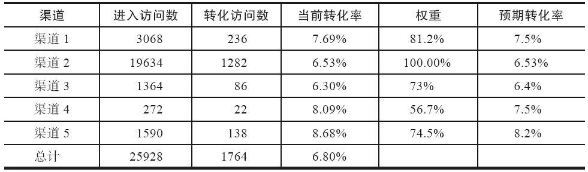

### 第45件事 评估推广渠道质量的3种方法

小O刚吃完中午饭，困得不行，突然收到最好的大学同学小Z发来的一封求助邮件，内容是小Z最近想跳槽，找工作面试的时候，面试官问了一个比较棘手的问题：如果现在有10个渠道推广App，但是领导说只能从10个里面选择3个，你会选择哪3个？选择这3个的理由是什么？

本来想咨询一下老K师傅的，恰好师傅倒休了。小O心想：一直以来，师傅一直是传道授业解惑，也是时候自己尝试着独立解决一些问题了，不能太依赖师傅。这次的问题，小O打算独立解决。

推广渠道的质量，很明显，说的是从各种渠道导入的用户的质量。那么怎么去衡量用户的质量呢？进一步往前推想，应该从用户安装使用App开始，安装之后是激活，激活之后是活跃，活跃之后是留存，留存之后是付费，付费之后是自传播，这不正是老K师傅曾经培训过的AARRR模型吗？

我们先看看看AARRR模型的关键数据指标。获取用户阶段，主要有下载量、安装量和激活量等指标。提高用户活跃度阶段主要有登录、启动、每次启动平均使用时长和每个用户每日平均启动次数、日活跃、周活跃和月活跃等指标。提高用户留存率阶段主要有次日留存、第7日留存和第30日留存等指标。获取收入阶段主要有LTV（用户终身价值）、付费率（转化率）和人均消费额等指标。自传播阶段主要是K因子（推荐系数）指标。

当我们分析出AARRR模型每个阶段的关键数据指标之后，接下来该怎么做呢？不同的产品，肯定重点考察的数据指标也会不一样，那有没有一种通用的方法评估推广渠道的质量呢？答案也很简单，我们将这些数据指标按照重要性排一下序。其中最重要的是K因子，为什么呢？因为，AARRR模型是一个典型的漏斗模型，漏斗过滤剩下的都是精华，是高质量的用户。K因子之后是LTV，为什么是LTV呢？因为LTV主要考察一个用户给产品贡献的收入价值。LTV之后呢？是留存率，留存率是回头率的具体表现。留存率之后呢？是活跃度。活跃度之后呢？是激活量。这样一梳理，数据指标按重要性排序依次为：K因子>LTV>留存率>活跃度>激活量>下载安装量。

当我们知道衡量用户质量的数据指标重要性排序之后，接下来我们就要依据每个渠道的数据进行分析。可以对每个渠道的用户进行一定百分比的抽样分析，也就是随机抽样，给被选中的用户打上标签或者唯一标识号。这样被标识的用户在使用产品时的所有行为记录都会被追踪。我们只需要对需要的数据采集并进行分析，即可得出结论：哪些渠道在K因子方面的质量最高，哪些渠道在LTV方面的质量最高，哪些渠道在留存率方面的质量最高，依次类推。问题迎刃而解。

10个渠道最终选择3个质量最好的渠道，就是依次按照K因子>LTV>留存率>活跃度>激活量>下载安装量的次序筛选，即没有K因子，那就自动切换到下一个指标LTV，这样依次筛选，即可得出答案。

如何评估市场渠道或推广渠道的质量？还有一种重要的方法，即

渠道的用户平均生命周期价值=每个渠道带来的所有新用户的生命周期价值总和/该渠道带来的新用户数

面试官之所以问这道题目，主要目的在于考察小Z对用户生命周期AARRR模型的理解程度。同时也在考察作为一个产品运营人员，懂得投入产出比才是最重要的，以最低的成本获取最大的收益，这才是运营的王道。

小O这次很高兴，立马将问题的答案抄送给了老K师傅，没想到师傅在10分钟内就回邮件了，他对小O这次解决问题的思维方式给予了很大的肯定。毕竟姜还是老的辣，老K还提供了一种解决问题的思维方法，即修正法。

我们再以电商产品的转化率指标来评估渠道的质量，数据如表7-1所示。

表7-1 细分渠道的转化率修正

其中，所有渠道的当前转化率均值为6.80%：

预期值=权重×当前值+（1-权重）×均值

权重=logmax 基数基数

即以基数的最大值（19634）为底。比如渠道1的权重=log 196343068≈81.2%。从表中不难看出，渠道4预期转化没有当前值反映那么好。统计学中有一个大数定理：样本的总量越大，样本数据对总体评估的置信度越高，置信区间越小，预估（预期）的效果更好。

小O这下终于明白了，数据原来也会撒谎，尤其是当样本量比较小的时候。不过这次小O很高兴，自己的独立思考得到了师傅的高度肯定。小Z同学也把小O的答案消化之后发给了面试官，果然获得了一次复试的机会。

AARRR模型数据指标按重要性排序依次为K因子>LTV>留存率>活跃度>激活量>下载安装量，这经常用于评估渠道质量的高与低。需要特别注意的是，由于样本之间差异较大，有的样本量较小，得出的结果会“忽悠”人，建议将数据修正之后再进行分析和总结。
