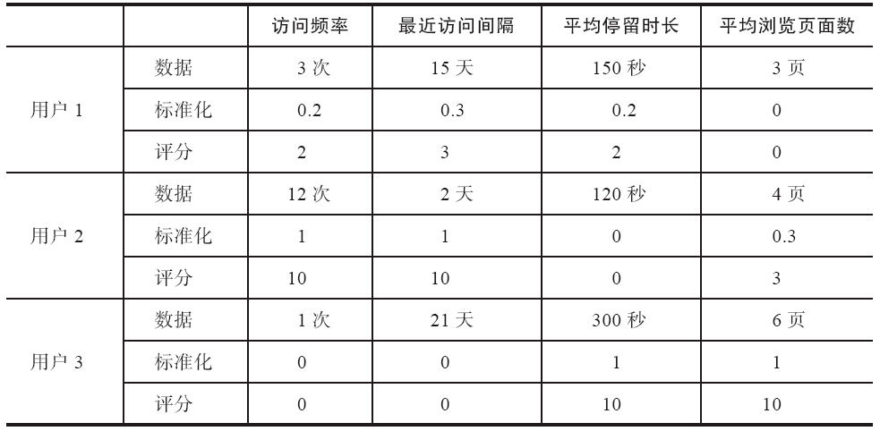
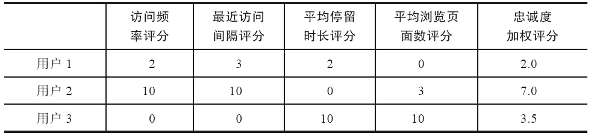
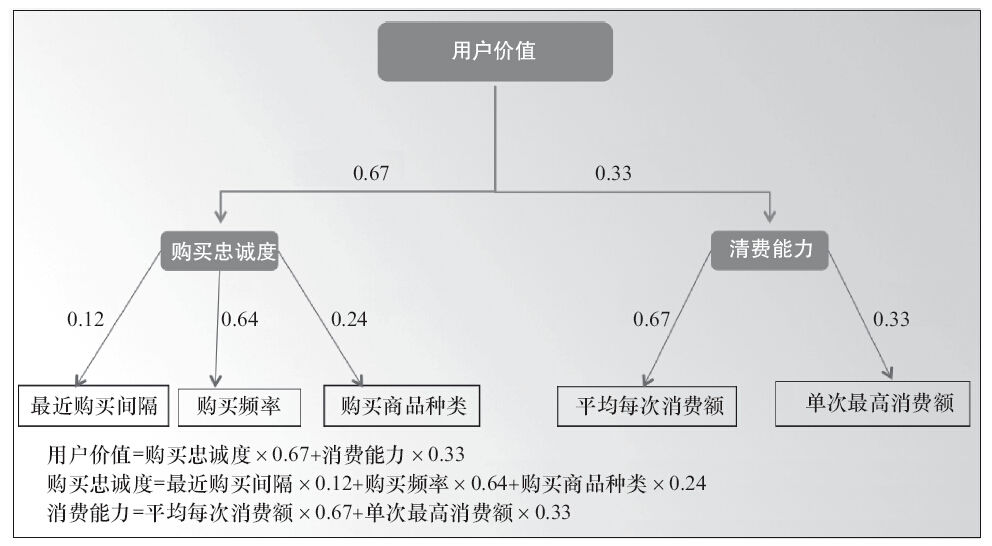
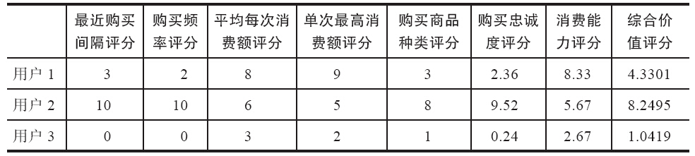

### 第47件事 3步分析用户价值

小O在幂律法则一节中，一直有一个问题没有想明白，那就是用户的价值怎么量化并转化成百分制数值。衡量用户的价值主要有两大维度：忠诚度（包括最近购买时间、购买频率和购买产品种类3个子维度）和消费能力（包括平均每次消费额和单次最高消费额2个子维度）。

关于用户的价值量化，小O迫不及待地向老K师傅请教，用户价值分析是产品运营人员的必修课，老K特意抽了一个时间比较充裕的下午，给小O详细讲解如何做用户价值分析。

用户价值分析指的是如何衡量用户对产品产生的商业价值，并根据价值细分后的用户进行差异化的运营策略。

1.数据标准化

在数据分析中，经常用到数据标准化。数据标准化指的是将数据按比例缩放，使之落入一个小的特定区间。去除数据的单位限制，将其转化为无量纲的纯数值，便于不同单位或量级的指标进行比较和加权。有两种非常重要的数据标准化方法：归一标准化和z标准化。

归一标准化：又称0-1标准化，数据统一映射到[0，1]，也可称为min-max标准化，其公式为

x *=（x-min）/（max-min）

这种标准化不足之处在于有新数据或数据有更新时，需要重新计算最大值和最小值。将x *乘以4得到[0，4]的数值，再加上1后得到[1，5]的数值，这就是5分制。

z标准化：其公式为x *=（x-μ）/σ，其中μ为均值，σ为标准差。

2.加权评分

我们以用户忠诚度为例，介绍如何对忠诚度指标进行评分。在此，将忠诚度指标细分成访问频率、最近访问间隔、平均停留时长和平均浏览页面数4个子指标，相关数据如表7-6所示。

在此，使用的是4个指标min-max归一化后乘以10得出评分。以用户1的访问频率为例，标准化=（3-1）/（12-1）=0.2，最近访问间隔指标比较特殊，因为间隔越短，忠诚度越高，所以采用（max-x）/（max-min）公式计算。

表7-6 用户忠诚度指标评分

对上表中的用户忠诚度指标进行加权评分，如表7-7所示。

表7-7 用户忠诚度指标加权评分

忠诚度评分=访问频率评分×0.4+最近访问间隔评分×0.25+平均停留时长评分×0.2+平均浏览页面数评分×0.15

0.4、0.25、0.2、0.15分别为每个指标的权重比，至于这个权重比是怎么得出来的，可以采用专家法结合矩阵分析法得出（在第17件事中已经阐述）。以用户1为例，忠诚度加权评分=2×0.4+3×0.25+2×0.2+0×0.15≈2.0。

3.用户价值加权评分

计算完成用户忠诚度指标加权评分之后，同理可以计算出消费能力加权评分。这时我们就可以计算用户价值加权评分了。计算之前，需要确定各个指标的权重比，如图7-14所示。

图7-14 用户价值各个指标权重比

用户价值加权评分数据如表7-8所示。

表7-8 用户价值加权评分

在计算得出所有用户的综合价值评分之后，以横轴代表为忠诚度、以纵轴代表消费能力进行矩阵分析（依据忠诚度和消费能力的均值划分成4个象限）。各象限的具体含义可参见第43件事申的“用户运营”小节。

小O今天终于掌握了一门关键手艺，那就是学会利用z标准化和归一标准化将数据转化为无量纲的纯数值，便于不同单位或量级的指标进行比较和加权，这门手艺可是数据分析的入门必修课。

学会利用z标准化和归一标准化将数据转化为无量纲的纯数值，以便于不同单位或量级的指标进行比较和加权。用户价值分析的主要目的是将用户进行细分，然后针对性采取运营策略。第一象限的用户：最有价值用户，运营策略是差异化服务，专门重点维护。第二象限的用户：高价值用户，其运营策略是为其提供高价值消费品、批量购买服务。第三象限的用户：普遍价值用户，其运营策略是提高用户的忠诚度或消费能力。第四象限的用户：传播价值用户，不能放弃，其运营策略是提高用户的消费能力。
