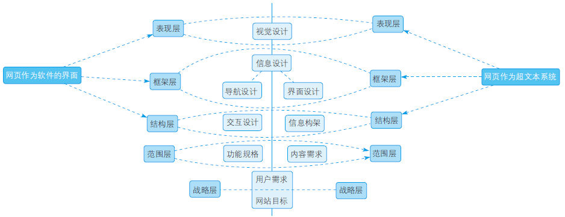
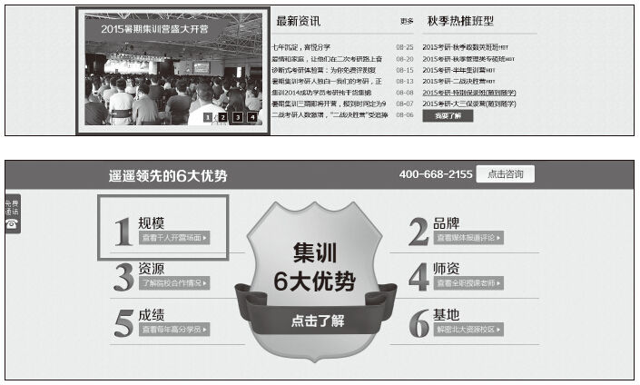

# 05 战略是决定产品成败的最关键要素

计湘婷

原跨考教育集团助理副总裁、集团移动云事业群/集训事业部总经理。品牌传播及产品营销从业者，专注教育领域。从业10年，在“传媒”与“营销”两个领域跨界切换，是“媒体人”与“经理人”合体。擅长品牌策划及管理，熟悉互联网运营、网络营销、市场策划、媒体运营。

曾供职于南方报业传媒集团，历任报社记者、杂志主编。热心公益传播，连续两年担纲崔永元公益基金“爱飞翔”项目媒体运行总执行。作为传统行业从业者，曾在O2O及新媒体的职业道路上摸索前行，经历创业公司带来的刺痛感和幸福感。

现任职百度，专注品牌传播。

精彩观点

如果一个产品失败了，既非技术原因，也无关用户体验，而是因为战略出了问题。

优质的用户体验页面是怎样的？

一个模型就够了。

“用户体验”可以转换成为一个简单清晰的模型，分5个层次10个要素，即战略层、范围层、结构层、框架层、表现层。每个层面又受1~3个要素影响。其中，战略层是最基础的层面，决定页面设计的基本方向，受“产品目标”和“用户需求”两大因素影响。

一个令人印象深刻又容易让人不求甚解的观点是：

“导致网站失败最常见的原因不是技术，也不是用户体验，而是在开始写第一行程序、描第一个像素，或配置第一个服务器之前，没人试图回答下面两个非常基本的问题：

1）我们要通过这个产品得到什么？（产品目标）

2）我们的用户要通过这个产品得到什么？（用户需求）”

这个观点看起来完全背离实用主义，却是决定页面成败的关键要素，即“战略层”，它是用户体验模型中最基础的层次，奠定了整个用户体验模型的根基。

如同一条择偶标准“没啥要求，人好就行”，“优质的用户体验”也是一个宽泛而复杂的概念。具备优质用户体验的网页应该是怎样的？

“它有非常友好的用户交互。”

“它能最大程度满足用户需求。”

“它能实现‘Don’t make me think’这条经典的用户体验法则。”

……

100位产品经理，对于“优质用户体验”可能有100个答案。这是因为创建用户体验受多方面因素影响：可用性、品牌识别、信息架构、交互设计。有没有一种“即插即用”式的网站设计方法呢？

在页面设计的5个层次中，“战略层”是值得思考和玩味的。尽管从管理学的角度看，“战略”是“道”而非“术”，但并没有在“战略”的内涵上进行学术探讨，而是用两个简单的问题：“我们要通过这个产品得到什么？”、“我们的用户要通过这个产品得到什么？”，界定了如何制定“战略”，使“战略”成为页面设计中的“术”。

实践案例

“战略”对网站设计有多大程度的影响？这难道不是CEO才应该思考的问题吗？下面将以魔鬼集训营产品页面的设计及改版思路为例，分析和佐证战略对网站设计的影响。

跨考教育集团是一家专注于为大学生提供学历与职业提升整体解决方案的教育培训机构，其高端的考研辅导课程（单价3~12万元）是公司的“金牛产品”。这些产品大部分通过互联网营销体系带来营收——通过SEM或社交渠道引流，使意向用户到达产品营销页面（即课程招生简章），促进用户与咨询师产生交互，然后由咨询师跟踪服务，最终促进用户报名。

在产品团队中，产品上线、招生简章的设计和优化迭代是极其重要的环节。但长期以来，教育培训机构的产品招生简章的设计都是快速上线、快速迭代，其页面设计也是非常粗放的。当我们用这本书的用户体验模型和“战略”要素去设计页面时会发现，前期战略制定得“慢”一些，“准”一些，会让页面的用户体验更加优质，营销转化能力更加高效。

1.以“满足用户需求”为主的“战略”，对产品页面的影响

我们用“战略”这一元素来界定产品营销页面在设计之前需要明确的问题。

1）我们要通过这个产品得到什么？（产品目标）

——营收及利润

2）用户要通过这个产品得到什么？（用户需求）

——考上研究生

对于第一个问题，答案是显而易见的，在此不作过多探讨。本案例主要针对第二个问题进行分析。

通过用户调研（咨询师访谈、学员问卷调查、校区老师访谈等方式），我们发现用户需求集中在以下几个方面：

①高效的课程体系。

②权威的师资。

③专业的教学服务体系。

④浓厚的学习氛围和严格的管理氛围。

⑤舒适的校区环境。

⑥这是一家值得信赖的大机构、大品牌。

⑦有多少成功学员在这里考上了名校研究生，他们的具体情况。

基于以上分析，我们对用户的关注点进行了排序，根据用户关注度的强弱顺序，确定了魔鬼集训营页面（简称MG产品页）的卖点展示逻辑。

页面头图展现魔鬼集训营产品的效果，眼球效应，快速吸引用户注意力。

·模块一：展现魔鬼集训营强大的品牌。

·模块二：展现高效的课程体系。

·模块三：展现权威的师资队伍。

·模块四：展现专业的教学服务体系。

·模块五：展现考上名校的成功学员案例。

·模块六：展现舒适优美的校区环境和校区文化。

·模块七：展现报名流程。

根据上述七大模块，互联网产品团队按照“用户体验模型”，依次梳理了网站的结构，在此基础上对网页的范围、结构、框架、表现进行设计，完成魔鬼集训营产品页（简称MG产品页）。

观察几周的数据后发现，此页面的跳出率、用户停留时长、TQ转化率（与咨询师对话超过1分钟时长的用户数与页面访客的比值）均达到预期目标。

但采用热力图分析用户行为时我们发现，页面右侧有一条明显的红色长画线，这条线到达页面中部时变绿，越往下热力线越来越淡直至消失。据此分析，页面右侧的红色长画线，是大量用户迅速向下滑动鼠标，对页面中部频繁弹出的广告弹框产生“关闭”动作的交互所致，同时表明用户希望快速浏览完冗长的页面。当用户将鼠标滑动至页面中部时，由于仍未触达页面底部，导致许多用户失去耐心，放弃浏览，选择跳出。显而易见，这个页面存在“内容过多”“页面过长”的缺点。

有什么办法使页面变短，提升用户体验，满足用户需求呢？需要更深入地分析用户，进而尝试调整战略。我们希望能设计出一个结构相对简单，页面长度较短，同时又能满足招生需求的产品页。

下面的案例是产品团队尝试对MG产品页进行战略调整的具体过程。

2.以展现“品牌”为主的“战略”，对产品页面的影响

经调研分析发现，尽管考研用户的终极需求是“考上研究生”，但从市场发展的角度来看，现阶段考研用户的直接需求，除了解产品是否能让他们“考上研究生”外，更需要比较同类产品的竞争优势——通过比较来决定自己最终报读哪一家机构的集训营。

这个变化是有据可依的：经过5~6年的发展，目前“考研集训营”产品已从新产品的“成长期”，进入了产品的“发展期”，意向用户对产品本身的认知已比较成熟（意味着产品页面不需要过多地对用户进行产品优势的教育），他们更多的是希望能通过页面了解这个品牌、这家机构是否值得选择。

也就是说，用户不仅仅需要通过产品页面来了解“是否能让我考上研究生”，而更需要对同类产品“进行比较”。因此按照“用户体验要素”模型的“战略层”理念，我们对“用户需求”进行追溯和分解。

用户需要通过我们的产品得到什么？

——考上研究生（一级需求）

——因此需要选择一家最值得信赖的培训机构（二级需求）

依据二级需求，我们重新界定了“战略”：强化跨考魔鬼集训营与竞品对比后的品牌优势（突出大品牌、大机构的代表性元素）。

依据新的战略定位，我们把用于论证“这个产品能让你考上研究生”的页面调整至二级页面，设计了魔鬼集训营产品页面的测试版（简称MG产品测试页）。

1）在范围层，突出了品牌优势，把代表品牌优势的“成功学员”“经典活动”等内容作为页面的内容主体，在页面突出显现。

2）在结构层，大幅缩减页面长度，将整个页面控制在3屏左右。

3）在表现层，通过简约大方的视觉设计，向用户传递出“大品牌”感觉。

从数据上看，在未对二级页面进行优化的情况下，MG测试页在上线第一周，跳出率和用户停留时长即与原MG页面持平，某些时间段的数据甚至要优于原MG页面。可以判断，测试页提升了页面用户体验，值得继续观察和进行SEM投放。但这个页面也存在明显的问题：跳出率与原MG产品页没有拉开显著差距（也可能与SEM策略和二级页面有关），目前处于观察测试阶段。

3.新的尝试：以“活动专题”战略定位来设计产品页面

大部分的产品都有淡旺季之分，教育培训产品也不例外。当产品进入营销淡季，用什么样的营销策略来实现招生突破？常规的MG产品页面在淡季时的数据往往表现不佳，需要尝试新的战略思路。

经市场分析发现，跨考魔鬼集训营与竞品相比，最大的优势在于——“规模”。作为考研培训领域的知名品牌，跨考魔鬼集训营在暑期集训招生人数突破1600人，这在考研培训界是绝无仅有的。

那么我们是否可以通过一个开营活动专题页来影响用户，唤起用户从众心理，进而促进用户在淡季依然能踊跃报名呢？我们尝试用这个思路去梳理和重新界定“战略”。

用户需要通过产品得到什么？

——考上研究生（一级需求）

——因此需要选择一家最值得信赖的培训机构（二级需求）

——因此需要了解培训机构开班的真实情况（三级需求）

将用户需求进一步分解后，我们打算放大集训营“招生规模”的优势，设计“1600人开营活动”专题页面，通过“活动专题”战略进行产品营销。

考虑到这是一次实验，页面没有通过SEM竞价进行导流，主要利用免费社交渠道（QQ群、微信、微博等）进行大范围的网络推广。连续观察两周数据后发现，这个活动专题尽管没有如预期那样带来明显的意向名单量的提升，但在社交渠道上的访客量（约6000UV/周）是较为令人满意的。

意向名单量没有明显增长，问题出在哪里？

分析发现，在制定网站“战略”时，我们对用户需求进行了3个层次的分解，“了解真实的开营情况”，已经是第3个层级的用户需求，无法直接打击用户痛点。之前的MG产品页和MG产品测试页，无论是聚焦“产品优势”，还是聚焦“品牌优势”，至少是对用户需求的直接界定（不超过2级）。

由此可见，开营活动专题页更适合的定位是“品牌优势的佐证”，将其融入MG产品页，作为展示品牌优势的一个详细案例似乎更为恰当。下图显示的是将活动页面嵌入MG产品页的设计，首页第二屏左侧焦点图，及“查看千人开营场面”交互模块（红色方框所示）均为活动专题页面的入口，活动专题页不再作为独立的产品页面进行推广。

总结分析

1）在设计页面时，你可能低估了“战略”的重要性。

“战略”对页面设计产生决定性影响。不同的战略，决定页面不同的范围、结构和视觉效果。对于产品页面而言，“战略”则直接决定页面的营销转化效率。因此战略不是CEO的专利，具备系统、准确的战略思维应成为每一位产品经理的必备素质。

2）花时间研究“用户需求”可能会费力不讨好，但不研究则更容易让你“在错误的方向上一路狂奔”。

“战略”来自对“用户需求”的理解和界定，以用户“直接需求”（购买产品的目的）界定的战略，和以用户“间接需求”（比较产品的品牌）界定的战略，所设计出的页面结构和用户体验可能是完全不同的。因此，花更多一些的时间来研究用户吧，这是做正确的事的开始。

3）“用户需求”是动态变化的，“战略”需要适时更新。

受市场变化的影响，用户需求是动态变化的。产品在不同发展阶段，促发用户不同的需求——产品成长期的用户更多需要了解产品，而产品发展期和成熟期的用户更多需要比较品牌。制定战略的产品经理应该对市场和产品有敏锐的感知，能及时根据市场变化和用户需求的变化来调整战略。
