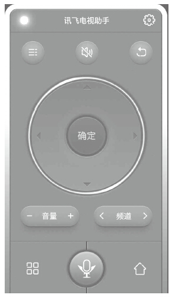
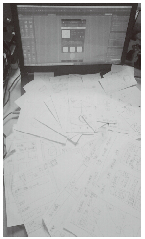
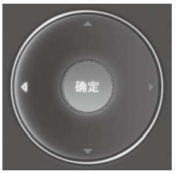
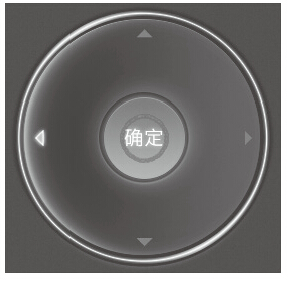

# 24 优化产品7步走

黄倪莎

科大讯飞股份有限公司，高级产品经理，主要负责的产品有讯飞电视语点、车载语点和讯飞电视助手等。计算机软件行业12年从业经验，中国科技大学MBA、软件工程硕士，在软件、项目管理、产品管理上有丰富的经验。曾在CISCO工作多年，是CISCO高级软件工程师。熟悉电视业务与语音业务，擅长用研、产品策划、产品设计、产品运营。讯飞用户体验创始人，用户体验中心创建者、用研工程师、用户体验专家。制定了整套讯飞用研工作流程和工作方法，并建立完整的产品体验体系。

邮箱：cocohns@gmail.com。

精彩观点

在实际优化工作中，最有效的办法就是从设计根源去梳理，所以总结了优化产品功能的7个步骤：

1）明确问题（是什么问题）。

2）明确问题出现的场景（用户有哪些可能的操作）。

3）确定操作步骤（用户具体是如何操作的）。

4）明确用户概念模型（如何建立系统状态与用户解释之间的匹配关系）。

5）分析用户概念模型与产品功能的差距（如何才能建立操作意图与操作行为之间的匹配关系）。

6）确定反馈方式（用户如何知道系统是否处于所期望的状态）。

7）验证反馈正确性（如何建立系统状态与用户解释之间的匹配关系）。

实践案例

我所服务的科大讯飞，是国内最顶尖的语音服务提供商，一直致力于语音改变生活。科大讯飞联合电视厂商提供电视语点解决方案，解决智能电视上的语音交互问题，为用户提供更简单易用的交互方式。

大家都知道，智能电视的标配遥控器一般不提供语音功能（语音键、录音功能），这就使得很多人无法使用语音控制。讯飞电视语点产品组还计了与之配套使用的讯飞电视助手，使该产品成为用户手中既可以作为虚拟遥控器也可以使用语音键的“利器”。

内测版发布一周后，产品组对用户进行了使用反馈调查，发现有60%以上的用户在反馈中提到了“误按”这个问题。用户说，他们只是在使用方向键切换内容，结果总是不小心就进入了某个内容。这样导致用户不得不频繁地从各个误确认界面返回，用户体验非常不友好。接下来，我们将按照7个步骤的思想来阐述这次优化过程。

讯飞电视助手内测版遥控器主界面

首先，用户遇到了什么问题？在使用中会“误按”确定键，也就是确定键有些时候的触发在用户意料之外。

在进行可用性测试前，我们曾经把问题场景定义为，用户在从一个键到另外一个键的过程中产生了误按，所以当时把触屏自身的特点当作了解决问题的鸿沟。我们下意识地用自己已有的知识来解释，因为用户在手机上使用的是触屏操作，那些看起来凸起或者凹下的边缘并不能被触觉感知。这个问题对产品组来说，真是个令人沮丧的事儿。

优化界面设计头脑风暴时的草图

事实上，在产品设计初期，我们就已经意识到，不论我们把反馈设计得多么明显，把界面设计得多么好看，按键设计得多么有质感，用户在触屏上使用这件事本身就决定了，触屏无法带给用户传统遥控器的触感和按键反馈。

所以，当时我们很快就决定，重新调整布局，解决用户问题。当时我们用了一周时间，开了很多讨论会，萌生很多创意，设计了无数版本的草图，但是没有一版可以通过评审。我们得说，有些方案真是非常不错，但是成本太高，只能可惜了。

优化界面设计头脑风暴时的草图

后来，我们做了可用性测试来弄清楚到底发生了什么。在测试中，用户确实出现了误按现象，导致用户的浏览行为被打断。通过可用性测试的用户行为观察，我们发现真正的事实是，问题往往在用户重复点同一个键时出现。

知道了问题出现的具体步骤，接下来就要分析用户的概念模型。为什么按同一个键会容易出问题？在观察用户行为时，可以看到，用户在更换按键时往往会谨慎地低头看下手机来确认位置，但是如果是重复点击一个按键，他会在接下来的点击中抬头看电视，不会每次都看手机确定位置。而这时候手指多次点击的地方并不是精准到某个点，而是落在一个区域内。当用户点中方向键和“确定”按键交界区域的位置，而响应的是“确定”按键时，用户会认为出现了误按，因为在用户的概念模型中，他一直在点击同一个位置，执行的是同一个行为，那么就应该有同一种结果。“确定”的按键行为他没有做过，所以出现“确定”操作是错误的。

那么，现在我们要说的就是用户概念模型与产品功能不匹配的问题了。在用户的概念模型中，这个“确定”按键有很明确的意向指示，用户会在使用中通过准确的行为来表达他的意愿，也就是点击按键中间。对比起来，方向键的行为看起来就比较模糊，让用户认为任意点击按键的某个地方都可以达到目标。在原有设计中，“确定”按键的出发焦点区域（见下图的红圈）与按键同样大，当用户触及按键边缘时，便可能会触发确定操作。

主界面方向键区域，用红圈标明了“确定键”的焦点区域

接下来，怎样的反馈才是正确的方式？我们的目标是通过减少“确定”按键的焦点区域避免出现用户认为的误按行为，只有用户清晰明确地表达确定意愿时才执行。

为了达成这个目标，行为意向分别是产品人员需要通过实验测定合适的焦点区域并更新功能文档，然后研发人员根据功能文档更改代码，重新定义按键的焦点区域（见下图中的红圈）。

主界面方向键区域，红圈表示优化后“确定键”的焦点区域

整个方案成本低，风险小，立刻就通过了评审。一切确定后，纳入版本计划等待执行。

验证反馈正确性的时间到啦，新的测试版本出来后，可用性测试结果显示问题出现几率从76%降到了0.2%。版本上线后，统计数据显示“误按”方向键问题出现率从60%降到0.1%，真是个皆大欢喜的结局。

案例产品官网：[tv.iflytek.com](http://tv.iflytek.com)。

总结分析

优化工作是产品经理工作中的重要内容，本文通过一个很小的案例，向大家说明如何使用这个方法。在工作中，大家比较喜欢用自己的经验来解释问题，但是这种解释是建立在跟“过去”对比的基础上，过去的经验并不会一直适用于解决现在的问题。很多时候我们自己的分析，其实只是对外界事物的本能反馈。要想培养面对问题理智思考的习惯，就要学会“采取行动的7个阶段”。当然，并不是说在每一次的活动中，每个阶段都是必需的。根据经验，至少要重视以下几点：

（1）找到正确的问题出现场景

即使在不同环境中说同一句“打开”，打开的对象也可能会不同。你想打开的也许是一盏灯，也许是一扇门，也许是一本书或者挚友的心之窗。同样的，用户的问题在什么场景出现，也直接决定你对问题的判断和分析。总之一句话，思考解决方法之前，要先看清楚问题。

（2）清楚了解用户现有的概念模型

解释外部世界的状况并不是用你自己的经验去解释，而是要站在用户的视角去分析你所观察到的现象。仁者见仁，智者见智。我们不能要求用户对产品的概念模型和产品自身的设计模型完全一致。我们能做的，就是在关键功能上，不要让用户产生歧义并尽力消除用户的使用困扰。通过用户行为分析问题出现的真正原因。

（3）找出成本低、效率高、风险小的解决方案

在案例中大家也看到，问题其实可以有很多解决方案，有的方案抽筋扒骨，有的方案要打补丁，有的方案只需要小小的改动，在用户没有感觉时静悄悄地解决了问题。我们不能说哪种方案一定是好的，但是根据投入产出比，成本低、效率高、风险小的一定是最合适的。要记住，产品不是用来拯救世界的，它只是为用户提供服务的工具。
