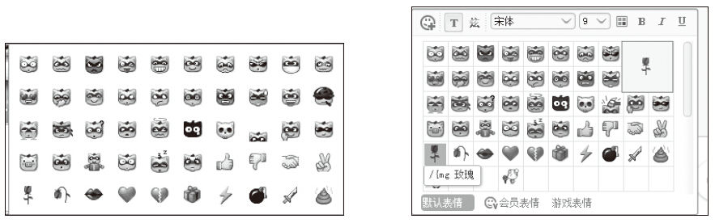
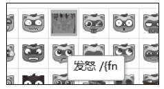
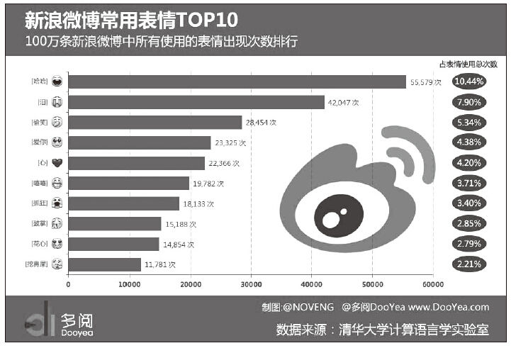
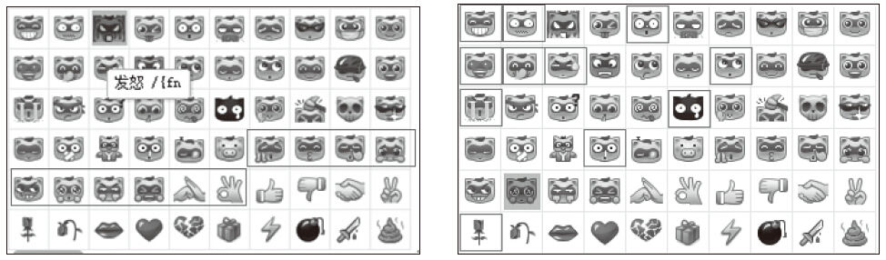
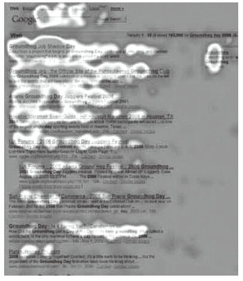

# 28 格式塔法则在界面设计中的应用

王媛（网名：北欧雪兔）

欢聚时代基础产品部产品经理。2013年毕业于中国科学技术大学，主要研究基于认知与情感相关理论的用户行为，现任YY平台产品的设计与策划。先后担任YY五周年平台级活动、平台资源管理与基础体验、YY 7.0项目负责人。热爱生活、热爱吃喝玩乐，努力做一个正能量满满的靠谱产品经理。

精彩观点

格式塔（Gestalt）理论主要包含：接近性法则、相似性法则、连续性法则、封闭性法则、对称性法则、主体/背景、共同命运法则。

接近性法则：物体之间的相对距离会影响感知，即相互靠近的元素看起来更像属于一组。越接近，组合在一起的可能性就越大；也可对同类内容分组，同时留出间距或分组框、分割线，给我们的视觉以秩序和合理的休息。相似性法则：在其他因素相同的情况下，有明显共同特征（形状、大小、颜色等）的物体看起来更趋向于属于一组。例如，颜色的变化能比较清楚区分不同层级的内容，数据分析中的色阶即应用了此概念。

接近性法则强调的是位置关系，这是我们最熟知，也是最常用的一项法则。相似性法则强调的是内容，可在不同分组、不同信息的设计上有着广泛的应用。以上两种法则被广泛运用于页面内容组织、分组设计中，对引导用户的视觉流及方便阅读起到重要作用。以下介绍的5种则较多地运用于视觉系统中的解析模糊、填补遗漏等感知物体方面。

视觉擅长感知连续形式的元素，不擅长感知离散型的碎片，这就是连续性法则。最著名的例子就是IBM标志，由非连续性的蓝色条块组成，如百叶窗般，但却一点也不含糊地让我们很容易就识别出3个粗体字母。

根据以往经验和视知觉的整体意愿驱使，我们的视觉倾向于将敞开的图形关闭起来，当元素不存在或不完整时，仍然可以识别，即为“封闭性法则”。

主体/背景法则：当某个较小的图形被一个更大且格式一致的图形围绕时，在视觉上会产生一种“较小的图形更为靠前，并具有封闭性”的印象。这就使得我们会将场景中的主要元素意识为主体，其余元素意识为背景。

视觉还会将一起运动的物体感知为一组或彼此相关，也会自动组织复杂的场景赋予其对称性，即分别为共同命运法则、对称性法则。

在生活中，我们总是先看到事物的整体，然后再关注局部，眼脑作用是一个不断组织、简化、统一的过程。格式塔原理不是对视觉感知的基础性解释，但直观反映了人类在没有引入反思，或心不在焉状态时的知觉最终结果。这样的原理性知识为我们的用户界面设计提供了理论基础，能解决我们凭感觉判断一个设计好坏的问题。

实践案例

一个产品从想法的产生到最终上线，其中每一个环节都可能影响最终的体验。所谓体验，是用户的整体感知过程，而并不只是在交互上的体现，更是一种思维方式。在很多互联网公司，基础体验设计和优化是贯穿所有项目的必备环节，产品经理们也希望以此来用一种更符合“自然”的方法构建产品模块，从而更“自然”地映射和解决问题。

在显示视觉场景中，上文中提到的各种格式塔原理不是孤立的，而是共同起作用的。原理可总结成三句话：人类视觉总是先看到整体，然后再关注局部；人类视觉对事物的整体感受并不等于局部感受的加法；视觉系统总是不断试图在感官上将图形闭合。我们就结合格式塔原理从自己来YY的第一个需求说起。先一起回顾一下最初版本的YY表情。

依据相似性原理，很容易初步感知到上图的表情整体可分为两个组：1~4行是表情熊，4~5行开始非熊类表情。当准备选择某个表情预览时，鼠标移入展示如下：

没错，最明显的感受是，选择左下角的“玫瑰”，却在右上角出现了非放大的预览图。从视觉感受上，接近性原理让我们很难忍受同一个物体的相同形态相隔如此之远；从功能体验上，预览效果同原图片无任何区别大小、动态方面的展示区别。

仅有初步感受和部分理论基础，还不足以支撑改版。接下来，我们又通过产品论坛、产品讨论群收集各种用户吐槽，总结起来大家对这版YY表情的痛点还有：

①尺寸太小。看不清脸部动态效果，不适应网络大图的趋势。

②种类不足。聊天用得多的基本情绪，在系统表情里未体现。

③预览效果不佳。鼠标悬停表情后，在非原图位置预览动态效果，不符合视觉焦点。

④新建自定义表情入口较深。大部分是将自定义表情与系统表情混在一个tab内翻找。

确立上述几个吐槽最多的问题后，开始分别评估并确立方案。

（1）修改尺寸（接近性）

原表情22px×20px尺寸表现静物还可以接受，但通过YY熊面部来体现情绪表情时，在选择时确实需要一定的辨识和判断。原因在于本身表情图片较小，表情窗格也非常小，加上主色值都为黄色时，视觉上会强化这些表情元素的接近性。与美术设计师讨论后，决定修改为：表情26px×22px，表情格34px×34px。通过增大表情格子来增加各表情间的距离，从而减少接近性引起的区分问题。

（2）调整色值（相似性、主体/背景）

再来看第二排的连续几个表情：，一眼扫过后似乎很难一眼识别每个表情表达的是什么情绪。于是，提亮脸部黄色色值为FEE561；增加Y熊棕色眼圈、眼白的色值与范围，以提高眼部与黄色脸庞的对比度，如。区别颜色的能力取决于颜色的呈现方式：深浅度、色块大小、分隔距离。两个颜色越浅、色块越小或越细、距离越远，就越难区分。

俗话说，眼睛是心灵的窗户，通过夸大眼睛/眼圈或脸部关键元素来表达情绪，可以在较大程度上抓住情绪表达的主体；而所有表情的脸部轮廓和颜色都是一致的，就可以视为背景了。前后样例对比：

（3）预览效果（接近性、连续性、相似性）

其实人类的边界视力很糟糕，每只眼睛有600万视网膜视锥细胞，它们在视野的中央凹区域分布得比在边缘紧密得多。这就使得我们的视觉空间分辨率从中央向边缘锐减，从而当注意力集中于某个表情时，就很不习惯移动视觉再去看存在于其他位置的预览效果。

同时，视觉倾向于感知连续的形式，预览效果修改为鼠标悬停时在原框格内显示动画。

内测版刚推出时，看习惯了小Y熊表情的用户普遍反馈：画风萌了、选择多了，但好像有点找不到自己要找的表情了。问题出在哪里呢？——静态帧和区分排序。

由于每个表情都是5~15帧不等的gif图，所以静态时展现给用户、作为唯一识别并最大化区分每个表情的特色帧就非常重要。我们把原调整为，调整为，等等。这里也在一定程度上运用了连续性原理，如一颗破碎的心虽然在静态上已经四分五裂，但人眼仍然能够辨识出这原本是一颗完整的心。同时重新排布每行相近的情绪表情，从而在最大程度上避免相似性。

（4）种类增加

先来看一张当时关于新浪微博表情的网络统计图。

上面的10个表情，每个都有鲜明不可替代的情绪。YY没有的是：爱你、抓狂、故障、挖鼻屎。

再对比一下当时QQ表情中，排名靠前，但YY没有的是：抠鼻、委屈、快哭了、可怜、尴尬、阴险、鄙视、左哼哼/右哼哼、抓狂、咖啡、鼓掌、抱拳、勾引。

新增表情时，我们的筛选原则是：聊天用得多、感情鲜明强烈、没有其他可包含或替代的——即在情感上不相似。例如，“尴尬”这个表情，在YY表情里可以用流汗/发呆/晕这些来代替感情的抒发。又如“左/右哼哼”在情感上也可用鄙视/傲慢这些来替代。最终，新版YY表情确认新增10个：鼓掌、亲亲、抠鼻、委屈、可怜、阴险、鄙视、抓狂、抱拳、OK。

（5）数据观测

用得最多前10位表情如下，没错，就是尼尔森的F型视觉原理。

总结分析

通过实践中的具体案例，可感受到格式塔各原理并不是孤立的，它强调整体的关系而非局部的表现。几个原理相加的效果远远大于求和的效果。正如我们听的是不同的音符，感受到的却是音乐的旋律；电影胶片上的画面是静止的，但观众看到的却是运动着的画面。人们感受外界事物时，在具体的元素之外，另加了一层“完形”的意义，这种“完形”决定着人们对客观物体的最终感受。在产品设计中，每一个局部的处理都应服从于整体的结构关系，这是创作出令人满意的产品的前提条件。
