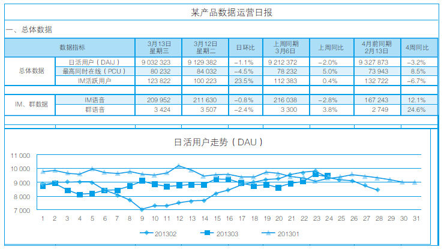
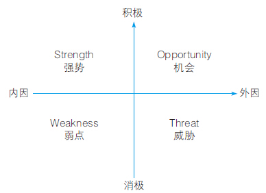
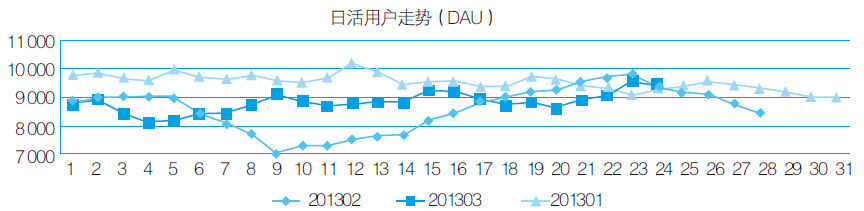

# 35 产品经理必备的数据分析能力

张俊海

大海边成长，江淮畔求学，奋斗在广州，欢聚时代YY语音产品经理。在职期间从事过数据运营、用户研究、产品设计和运营等相关工作。2014年起负责YY语音平台级运营活动，历次活动都创百万级用户数参与，较大幅度地提升了平台日活跃用户数和最高在线用户数，同时利用平台优势给予中小业务有力的扶持。不仅使活动取得了超预期的效果，也在思考平台活动的特性、逻辑和流程化并进行总结，使之形成一套方法论。

坚信行者无疆，喜欢自由自在去旅行，感受这个世界的悲欢离合。欢迎关注我的个人微信公众账号Junehi，多分享多交流，共同进步。

精彩观点

如果让大家来说互联网产品经理要具备哪些技能，我想会听到诸多例如执行力、需求提炼、产品功能设计、项目管理，等等的词语。但除此之外，在大多数公司里，产品经理往往也要从事交互视觉设计、产品运营和数据分析的工作。

首先需要明确的是数据分析对于产品经理来说有什么用？我认为这个问题可以从两个方面回答：一是就工作而言，数据对于产品经理来说至关重要，从一个需求的提出，到上线后产品的表现，每一个环节都少不了客观数据的支撑，这就少不了数据处理和分析；二是就数据分析本身的意义来说，在这样一个大数据时代，数据的价值越来越大，数据分析能力也将会是今后许多行业需要的。

明确了数据分析对产品经理的意义，再来谈谈数据分析所需的5项要求：懂业务排在首位，不对业务产品有深入的了解，就根本无从谈起数据分析；懂管理其实就是能够利用经过千锤百炼的方法论来支持你的数据结论，更有说服性和指导性；懂分析这里并不要求产品经理像专业数据分析师一样，但应该掌握常见的一些数据分析方法；懂工具这里只提Excel这一款软件就足够了，先学会用Excel，它能解决80%甚至100%的问题；懂设计要求能清晰地把你的数据展现出来，让人能够看得简单明了，有句话说得好“能用图说明的问题就不用表格，能用表格说明的问题就不要用文字”。

实践案例

在被校招进入YY后，我一项日常工作内容就是负责每天分析并发送部门产品的数据日报，接下来就围绕这份神奇的数据日报表格展开，这些数据处理和分析能力在后续很多工作中得以利用，觉得受益颇多。

这项工作的大体内容是：每天将各项产品的相关数据采集到表格中，然后分析这些数据得出一些数据结论，最后将数据和数据结论恰当地展现出来，通知负责人和相关人员。此数据日报表格（部分）如下图所示。

这份表格之所以神奇，是因为每天只需要采集各个产品的数据后，更改一个日期，就可以“自动”生成当天的数据日报表格——“自动”算出各项数据的日环比、上周同比和上月同比，“自动”画出各项数据的近三个月的对比折线统计图，还能自动“智能”判断出哪个数据存在异常。而这一切，均来自一些数据分析的基本能力，下面介绍数据分析要求的5个方面。

1.懂业务

每天在做的这份数据日报最终目的其实是能给我们一些有用的数据结论，所以一般都会把相关数据结论放到日报最前头，使没有时间查看详细报表的同学能够一目了然。数据结论不仅包括今天什么数据跌了，什么数据涨了，哪些数据出现异常了，更有价值的是能找出数据变化的原因，这与了解业务息息相关。

印象最深的一次就是发现某游戏工具产品数据比昨天的数据环比涨幅超过20%，这很明显就是数据异常，在排除数据出错的可能性后，需要依靠对业务的了解和敏感性来解决问题。果然，在查看了几款主流游戏后，发现某用户数排名第一的大游戏厂商发布了游戏新版本，内置了这款游戏工具，所以导致其数据暴增，要是不懂业务，恐怕怎么也分析不出来个原因。

2.懂管理

这里所讲的管理其实就是熟悉类似SWOT、PEST等营销、管理等领域成熟的方法论，虽然这是每天的数据日报，但有时也会分阶段做一些专题数据报告，如某产品的某功能近期的数据探究。在做这一类分析时，数据往往只是作为客观事实，要想拿出令人信服的结论，用合适的方法论会是个不错的选择，可以以下图的SWOT理论为依据，将日报中某产品数据结论有理有据地给出。

3.懂分析

分析这份数据时，值得一提的是之前的数据准备和数据处理工作，由于这份数据日报涉及产品众多，所以每天都需要人工把数据从系统上粘贴复制进表格里，这其实就是数据采集。

在处理数据时，一定要养成较好的习惯和规范，利用好Excel的标签分类，一个产品一个标签，一类表格一个标签，而且不要在原始数据上进行数据处理，这样可以有效地避免错误操作导致原始数据丢失。

数据分析方法多种多样，如漏斗分析法、交叉分析法，等等，需要根据具体需求挑选适合的分析方法。比如此项日报中某产品是视频类观看产品，就可以利用漏斗模型，分析出用户完成使用这个产品的行为路径，找出几个关键环节作为很形象的漏斗，记录这几个关键环节的数据，可以分析出经过每一个环节漏过去多少用户，没有漏过去的就是流失的用户，从而看出哪一个环节导致用户大量流失，就可以有针对性地优化该环节。

4.懂工具

这份数据日报报表从头至尾都是用Excel制作出来的，并没有使用任何其他的软件，正应验了那句话“先学会用Excel，它能够解决80%甚至100%的问题”。之所以整个报表的“自动化”程度这么高，主要是贯穿全表使用了Lookup函数，根据日期这一维度，将各个产品的数据引用到一个总表上来，日期相应减1、减7、减30就可以很方便地引用到此产品昨天、上周和上月的数据。

各个折线图也可以预设好日期，当在相应日期填上数据后，会自动在折线图上画出这一天上的这一个点，也就是所谓的自动化画图了。另外，可以对表现环比和同比的百分数单元格标记数据判断条件，比如环比百分数大于10%就自动标红，环比百分数小于10%就自动标绿，这样也就实现了填上数据后，自动“智能”筛选出异常的数据。

5.懂设计

这份数据日报很显然表格很多，在数据展现时其实会让人感到有些头疼，很难一眼就看出数据变化，还记得之前说的“字不如表，表不如图”，这时很有必要来一张如下的折线图。

折线图的展现不求多么美观漂亮，但一定要实用有效率。比如3种折线图的颜色一定要清晰易辨识，坐标轴刻度间距要合适，既能让三条折线间隔适中，又能很好地表现出折线变化，从而更好地展现数据的变化。

总结分析

数据分析能力佳的产品经理，会发现在工作中凭借这项能力事半功倍，因为数据分析无处不在，渗透在产品的各个环节。

我认为掌握一套正确的数据分析流程、思想和规范才是很重要的。用哪个Excel操作技巧去实现，用哪种数据分析方法去实施，再套用哪个方法论来证实，这些都不是那么重要。

我想，如果能够掌握文中实践提到的自动化程度很高的数据日报表格制作方法，那么你的数据分析思维和数据分析基本技能都会得到比较大的提升。
