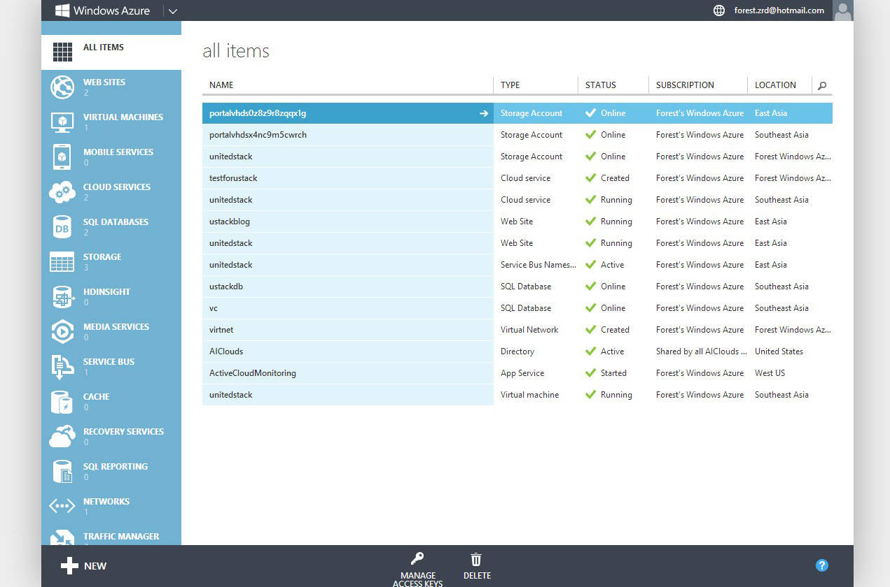
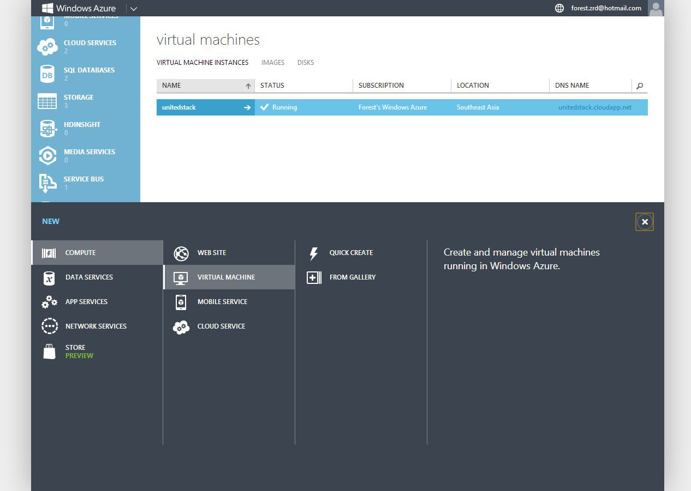
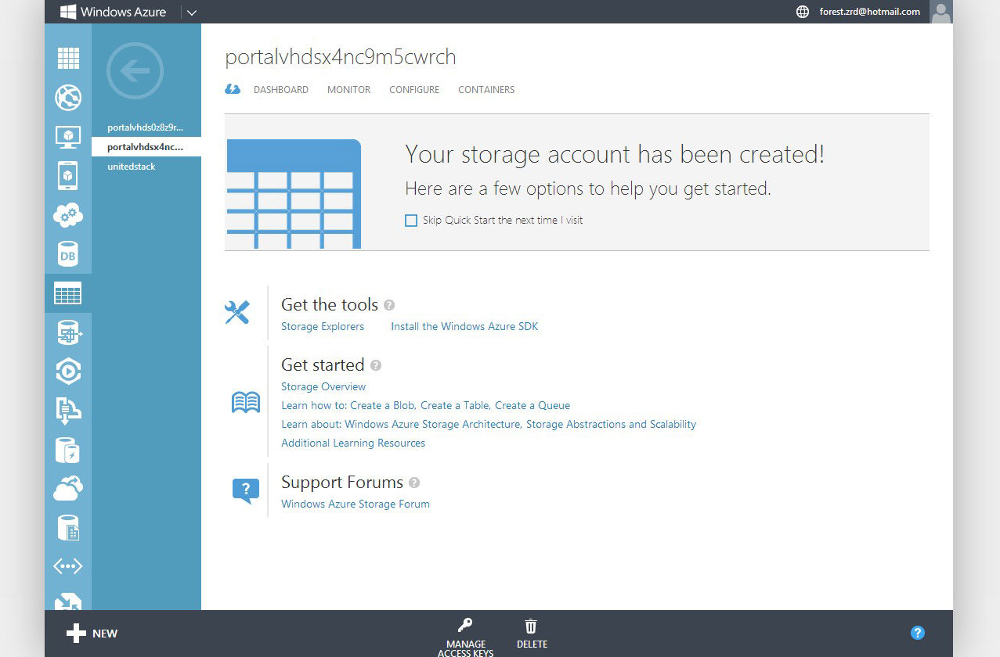
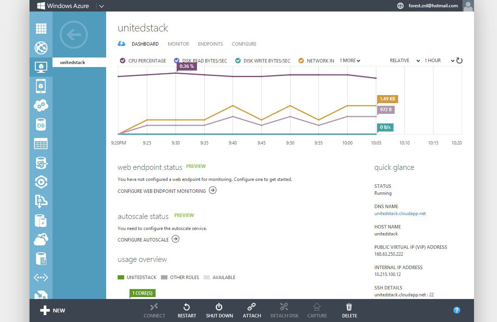
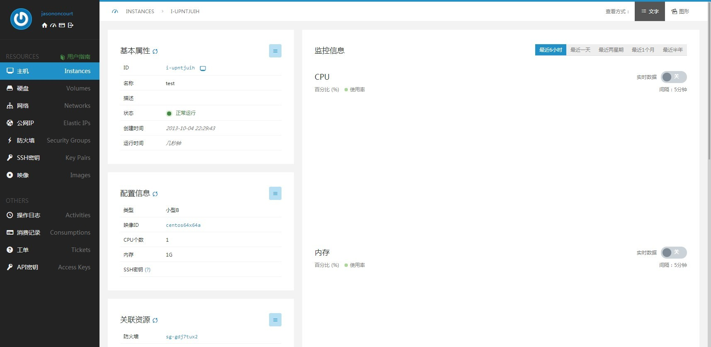
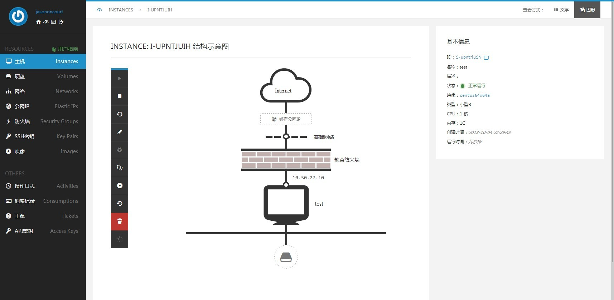
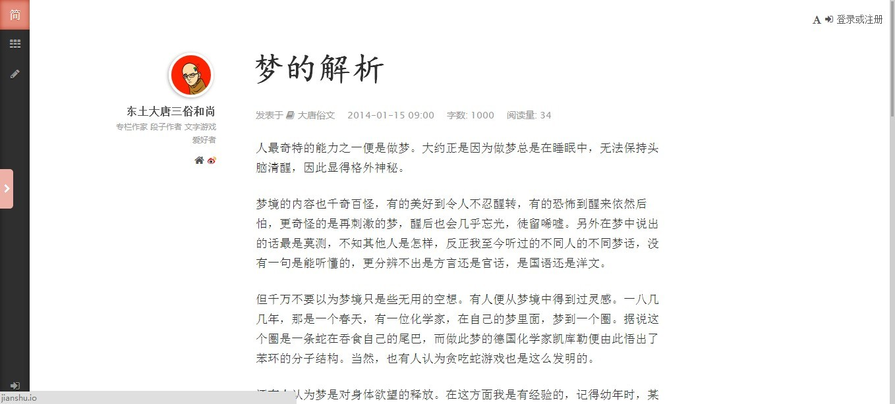

# 二、优雅的领先者

这篇文章取自于内部邮件，文中指“我们的产品”指的是当时笔者参与的一款云计算产品。

在设计领域内，其实如果连基本原理都还没有掌握，竞品分析是无意义的。所以这一篇中，竞品分析只是手段。阐述自己产品的设计方向才是目的。

我们直接来最刺激的吧。

这是刚登录Windows Azure的界面。分为四个部分：顶栏，左边菜单栏，内容区，下边操作栏。整体宽度为固定960px，对于面板型产品来说，略显小气。以灰度较高的蓝色做主色，视觉效果非常优雅。界面传达的几个关键信息：

一、用户登录的第一页直接列出所有资源及其当前概况，非常实用。在资源不多的情况下，真正起到了overview的作用。

二、左边菜单栏平铺了所有服务，不是以虚拟机为中心。服务的类型也不是完全对等的，比如数据库这些通常是面向开发的服务。所有服务合起来有17个之多，初看起来无法一眼找到想要的服务，如果能简单分组效果会好很多。

三、所有操作全部移到了下边栏，非常有特点。其中最好的地方是左下角的NEW。如图：

Azure把所有资源的创建全部放在了这里，无论你在哪一个页面，都是使用下边栏作为创建的入口。而且它会根据你当前所在的页面自动选中相应的可能创建的资源。上图中就是我在“虚拟机”的页面点了"NEW"之后，自动选择了"COMPUTE"中的"VIRTUAL MACHINE"。理论上来说，Azure的设计和AWS的设计、青云的设计、我们的设计，“从登录成功到打开创建一台虚拟机的对话框”要点击的次数是相同的，那为什么Azure要这样设计？

这样分析竞品就错了，随意揣测作者意图是无意义的。因为也许Azure的设计师只是把下面作为快捷操作入口，没什么特殊的，Drupal等产品也有类似设计。我们只看这样设计产生的直接效果：

将操作从资源列表的页面上彻底分离出来，形成了两个维度。从此“创建任何资源”和“进入任何资源列表页面查看资源”没有了必然联系。虽然操作步骤并没有减少，但是这种“统一入口，并通过浮层的方式减少页面跳转”的方式很大程度上减少了对用户注意力的干扰。三月出的时候我提到过，我们的用户主要日常操作可以分为两种：一种是日常产看，知道系统没有任何问题就行；另一种是对资源的实际增删改。这两种操作目的性都很明确，“尽可能让用户专注在自己的目的上”能在一定程度上提升产品整体在用户心中的印象。具体点来说，传统方式是进入资源列表再点击“创建”。而当我进入资源列表时，首先有一个页面跳转的等待。然后又有一个加载资源的等待。如果发现资源出现问题，我的注意力会被进一步分散。等到打开“创建”的对话框，我的注意力已经被分散了三次。如果你不能体会，等到晚上很累时再去做这个操作，你就会感受到这些看似细小的差别在你注意力有限的情况下产生了多么大的影响。最重要的是，通常注意力有限时的人是最敏感最易怒的，这个时候你只要有一点点不好用──比如说虚拟机列表出错了，页面刷不出来，让他点不了“创建”──那你马上就会被形容成“屎一样的产品”。

谈到了Azure的资源操作在用户感受上的优越性，我们可以继续深入讨论用户体验。

Azure统一了创建的入口，虽然减少了对用户注意力的分散，但也使得在IMAGES等页面中，没有了“从镜像创建虚拟机”的快捷按钮。意味着你上传完镜像，还是得从左下角的“NEW”里去点创建虚拟机，然后手动选中刚传的镜像。还是在三月的时候，我在我们自己的wiki里写我们产品的交互原则时提到，“我们要关注用户的真实目的”。什么意思呢？比如说用户要上传镜像，上传镜像的通常目的是什么？当然是拿这个镜像创建虚拟机。所以“创建虚拟机”才是上传镜像的真实目的。反映到产品中，当时我的设计是，上传镜像的对话框中有一个选项叫做“上传成功后自动创建虚拟机”的选项，选中之后展开虚拟机要填写的字段。然后你等结果就行了。还可以做得再还好一点，直接在“创建虚拟机”的对话框中，“选择镜像”的下拉框后面跟一个“上传镜像”按钮，你可以继续填完其他参数然后点“确定”，系统会提醒你“镜像上传完之后会为你自动创建虚拟机”。这样你就不用在已经打开“创建虚拟机”对话框时发现没有想要的镜像，然后又关闭窗口重新去上传镜像，上传完再创建虚拟机了。

想象一下产品的所有操作都能像上面一样，让你一次性达成最终目的。在你最累最忙的时候，用这样的产品，真是感动得眼泪都要掉下来了。

关于资源的操作先讲到这里，下面讲讲Azure的资源显示方式。

点击其中一台虚拟机，出现“帮助页面”：

这种方式不如“青云每个页面上方几句简短话来说明”简洁。如果真有复杂到不得不看文档的概念，可以统一在右上方固定位置放个？号。我们的产品将采用“？”的方式。

继续点击"Dashboard"后出现：

进入了当前虚拟机的overview。这种方式和青云一样，都是资源独占以一个页面，如图：

相比青云，Azure的优越之处在于直接将同类资源作为二级菜单（图中只有一台虚拟机，所以看不出），这样方便切换。而青云上方则是多了一个毫无意义的导航。不过Azure将资源作为左边的二级子菜单而不是“镜像、硬盘”什么的，让我找镜像找了半天。

我们的产品设计点击某一个虚拟机是在下方显示详细信息。究竟哪种方式好，之后采集了用户操作信息之后再实际分析。

青云在虚拟机的显示上还有大亮点：

视图化的操作很有噱头。但是我发现它永远都是关于单个虚拟机的，无法显示整个集群。

最后总结来关于整体体验的、也是我们的产品要改善的方面：

一、所有操作都会立即响应。其中青云的后端响应速度特别快，使得整体感觉达到了惊叹的程度。Azure资源操作比较慢，如果能显示细节或者进度会更好一些。

二、所有概念都比较简单，基本不用看文档，直接上手。但用户操作的细节仍有大量可以改善的地方，不再赘述。

三、青云和Azure整体非常统一优雅，这种优雅渗透到图标、字体、页面动态效果等等每一个细节里。

说到优雅，最后我们再来鉴赏一个近期我发现的在阅读方面设计做得最好的网站，简书。

几乎它的每一个元素应该用什么字体、颜色、大小都是经过了精心设计的，所以给人第一眼就是说不出的舒服。它的技术人员还写过一篇详细介绍字体渲染等方面技术原理的文章，大家感兴趣地可以去翻阅。

产品的整体体验像和人交流一样，一个人在各个方面审美都高那么点，最后就让人感觉高出了一个气质。这些本来就需要积累的方面，要更加被重视，更加被支持才能形成我们自己的气质。
