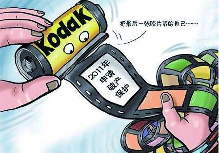
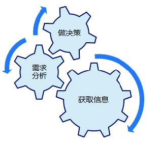

# 第2章 从资源到机会，规划产品蓝图

2.1 认识产品规划

2.2 产品规划核心四问

2.3 需求处理的基本方法

2.4 需求处理的实用技巧

2.5 通过知名网站看规划

规划，对于我们来说其实并不陌生，比如，伴随着改革开放，中国的城市化和工业化进程加快，大量人员涌进城市。可有限的中心城区承载不了这种增量，它饱受供求失衡带来的严重压力，于是周边区域联动规划，通过快速的交通（快速公交、地铁）、相对优惠的住房和经商政策，为去中心化、人口的有效分流提供了可能性。以北京为例，城区一直从二环延伸到了六环。

再比如，产业结构的落后会阻碍经济社会的发展。以资源型和劳动密集型为主的支撑产业中，劳动力价值低、产能过剩、重复建设、区域性结构的不平衡等都阻碍了生产力的可持续发展，因此国家出台了一系列的产业规划：扶持技术密集型产业、大力发展新技术新能源、推进中西部开发等，这些措施也正逐步改善这些结构之间的失衡问题。

可见，我们的社会、生活都是离不开规划的。规划的真正意义在于：通过对未来整体性的思考，制定出一个长远发展的计划。现在的企业同样也需要规划，不仅要活在当下，更要未雨绸缪，规划出有竞争力的产品，从而面对市场中出现的机遇和挑战。

曾经，柯达的广告语深入人心：“你只要按下按钮，其余的都交给我们！”而今，按下按钮的人越来越多，但交给柯达的事情却越来越少。云时代、物联网时代到来的今天，消费者拍摄照片的存储习惯已经变了，甚至连照片的用途也有所改变。柯达没能规划出与时俱进的产品，来适应快速变化的市场，最终走向了破产的边缘。

7年前，新闻集团用5.8亿美元收购了当时如日中天的MySpace，7年后，MySpace以3500万美元左右的价格贱卖给了美国数字媒体公司Specific Media。由于没能推出满足用户核心需求的产品，这位昔日的社交网络老大，如今只能默默地祝福今日的社交网络巨头Facebook。

互联网行业也不断进行着新旧更替，每天有很多网站起来，也有很多网站倒闭。信息的流通性越来越高、技术的壁垒越来越小，这让很多企业面临着业务规划难、产品推陈出新难等一系列问题。如何进行卓有成效的构思和规划，成了企业想要努力解决的课题。那么，我们看看互联网产品是如何展开规划工作的。

## 2.1 认识产品规划

但凡一个产品呱呱坠地，都会要经历：产品规划、产品设计、项目研发、运营推广等环节，产品规划是整个产品的第一阶段。

产品规划是个复杂的脑力工程。其过程涉及：对市场机会的识别、对产品技术的了解、对企业资源的盘点等内容，这在客观上也就决定了必须是专业能力过硬、有经验、懂行业的人才能胜任相关工作。而刚入行的产品新人，对产品的理解还处于朦朦胧胧的状态，更多是围绕着产品形态进行思考的，这也是大多数产品经理为什么从产品设计起步的原因，他们离产品规划还有一段路要走。

### 2.1.1 什么是产品规划

产品规划人员一般要通过调查研究，来了解市场、了解客户需求、了解竞争对手、了解外在机会与风险，以及市场和技术发展态势，然后根据公司自身的情况和发展方向，策划可以把握市场机会，能满足消费者需求的产品，并制定出其远景目标以及实施该远景目标的战略、战术。

从本质上来讲产品规划就是：获取信息、需求分析、做决策的过程。获取的信息充不充分、真不真实、可不可靠；需求分析到位与否，是否客观、全面、深入；所做的决策是否明智、是否符合当下的情况又能兼顾日后的发展，这其中每个环节都是会影响产品规划的。
