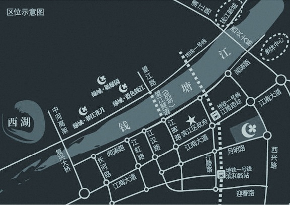

### 2.1.2 产品规划要做什么

产品规划要做什么？用一句话来讲，就是想清楚要做什么。下面来看一个现实生活中的例子，相信会帮助大家理解产品规划的过程。

起因：国内某房地产开发商想在钱塘江边上开发一个楼盘。

首先要进行需求分析，看看这个地区目前的人口与楼盘之间的供需情况，分析有没有市场需求。然后对这个片区的人口情况进行摸底，如果大家都有房子，是不是对改善型住房的需求比较多，如果企业职工和外籍人口所占比重较多，是不是对小户型房子需求更旺盛。

如果经过分析认为这个区域有市场需求，那么就得进入下一个环节：了解这个地区政府有没有拍卖的土地、有几片土地、各土地周围的景观（比如江景、山景）怎么样、周围的配置设施怎么样（比如：主干公路、地铁规划、医院、学区）。然后根据土地的价格、土地使用的性质进行楼盘方案的预算（比如：盖一个改善型商品房的小区，其成本、利润、风险的综合可行性评估），在经过权衡以后，就是竞拍得到土地了。

以上可以认为就是产品规划的过程。此过程告诉大家，某某公司在某个地方要盖一个楼盘，大概的定位是小户型还是大户型。至于整个楼盘盖成多少层，户型都是怎样的，阳台怎么开，一梯几户、楼间距多少、小区景观怎么设计，房子是黄色的还是灰色的，在产品规划阶段都不是很具体，得到产品设计阶段才会非常清晰。

从房地产开发商的角度来说，产品规划总体要解决的是：在哪里盖一个满足什么需求的楼盘，为此带来的价值和回报大概是多少。互联网产品的规划，本质上也是如此。
