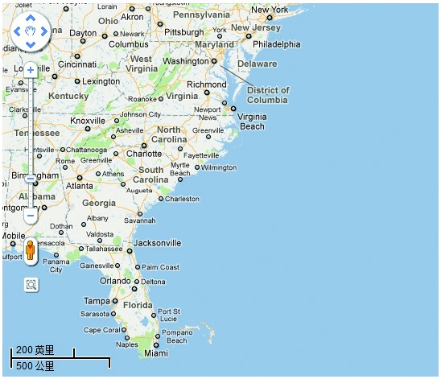
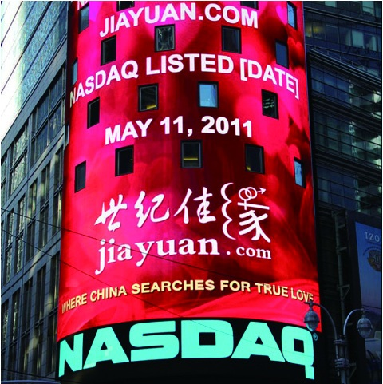

## 2.2 产品规划核心四问

曾有产品经理说：“产品规划方案谁都会写”，是的，没错！有些产品经理甚至一天可以写好几个方案，但我们要知道，并不是所有方案都能得到认可。这里面就涉及一个是否可衡量的问题，方案具备可衡量性很关键。

通常，下属在给老板汇报、老板在给投资方汇报时，基本上都会被问：“你做什么？有什么价值？为什么要做？如何做到？”看似简单的四个问题，足以问倒很大一批人。

### 2.2.1 做什么

首先得回答：做什么？做什么，是规划的结论。这个结论通常需要你仔细想清楚，比如：服务于什么用户，提供什么产品，满足什么需求。没有人会相信，你连要做什么都含含糊糊说不清楚，将来这事的结果会是一片大好。

这里看似是在测试你使用5W3H分析法的熟练程度。实际上是帮助你在系统梳理答案的过程中，增加思考问题的成熟度。回答对方问题的过程，同样也能让自己想得更清楚。所以在回答要做什么时，通常需要一句话或几句话就要说得大家都明白。

再来看几个例子。

例1：人人都有爱美之心，都希望可以把自己的照片处理得好看一些。但普通用户不会用专业的图像处理软件，傻瓜式处理图像的软件（如美图秀秀）的出现，降低了操作的门槛，满足了这类人的需求。

例2：城市建设日新月异，不断有新的路线产生和调整，对于出行的人来说，掌握最详细的路线，以最快方式到达目的地是非常重要的。地图产品（如谷歌地图）的出现，提高了大家对出行路线做决策的效率。

例3：很多企事业员工工作忙碌、社交圈子狭窄，而传统的婚恋市场操作又不规范，三托四骗现象普遍。实名制婚恋交友网站（如世纪佳缘）的推出，很好地解决了单身男女渴望幸福的需求。

