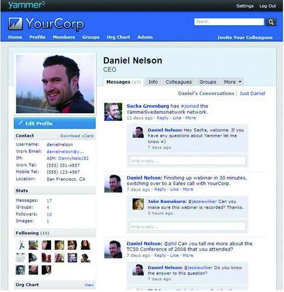

### 2.2.2 有什么价值

其次得回答：有什么价值？在商业社会中，做任何一款产品都得在生产、消费或交易的某个方面体现其经济价值。商业的本质就是盈利，不能盈利、不能自我造血的公司肯定是不能长久的。回答价值，其实就是要回答做这个事情最核心的经济利益。

通常老板和投资方看待一个产品的时候，主要看它可能承载的商业机会。比如，做在线旅游项目时，如果旅行的人根据网站的指点进行了消费，商户将按照客户的消费费用给服务提供者返点。那么这个产品能带来多少盈利是可以通过它的商家拥有量有所预期的。比如，做新闻资讯的垂直搜索，但仅仅是新闻资讯类的内容，用户的获取成本很低，替代性强，那么就不太会产生付费的群体，自然商业价值就要受到质疑了。但是如果线路调整一下，让其给企业提供舆情系统，企业是可能去买单的，那么商业机会自然就孕育而生了。

接着看例子：

例1：yammer.com是2008年9月推出的服务于企业客户的社交网站，它的价值在于：封闭性的企业微博为企业内部的信息交流提供了便利，并且可防止企业的敏感信息外泄；内部协同办公平台方便了工作的管理、项目团队的协同，是替代企业内部论坛不错的工具。

例2：foursquare.com是2009年推出的一家基于用户地理位置信息进行服务（location based service）的网站，更确切地说是场景服务（scenariosbased service）。它的价值在于：通过鼓励用户用自己的手机来"Check in"自己所在的位置，积累和分析庞大的节点数据，从而向商家、企业提供精准营销的解决方案。

