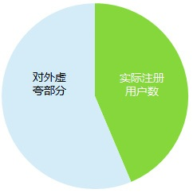
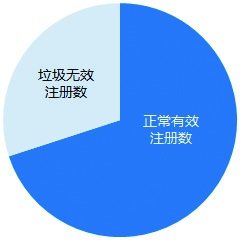
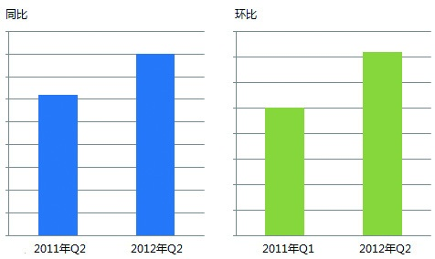
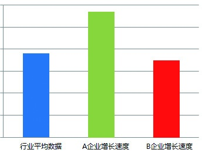
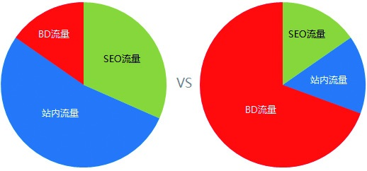

### 2.4.4 学会看懂数据

当市场有波动的时候，通常会通过政策、数据传递信号，所以我们在进行需求分析的时候，要通过大量的信息、数据来辅佐自己进行判断。于是，如何看懂数据，并进行有效的数据分析成了产品规划人员的必备能力。

1.看真实有效性

很多人看到媒体披露的数据，就毫不怀疑的相信。事实上，这其中有很多数据为了达到某种目的而隐藏了统计背景、统计方法、误差范围等因素。比如，很多网站说注册用户数已经达到了600万，可能实际的注册用户数才占比44%，将近264万。

不要觉得找到264万就差不多了，真正有价值的是真实数据中的有效部分。往往大多数网站中都会有大量的垃圾注册数。很多注册用户是马甲，根本起不了什么实际作用，所以我们在看数据的时候，找到真实有效的数据才是关键。

很多时候，我们是没办法直接拿到原始数据的，但不妨碍我们找到对这个行业持续关注的业内人士，获得相对准确的整体信息。另外一个方法是，通过多项指标去推论，还原数据的真实情况。比如，对于电商网站，我们可以根据客单价（per customer transaction）、行业的转化率、重复购买数、整体流量等情况，推断某个企业的实际成交量和媒体上所称的成交量的差额。

2.看数据趋势

数据本身是没有什么意义的，只有找到数据的对比参照物，看到数据的趋势才会让它附有意义。一般，企业自身会通过同比、环比两个数据指标项来看业务数据变化。

如果涉及行业竞争力，则通过企业数据和行业整体数据进行对比，从而了解企业的发展速度是超过了行业发展速度还是赶不上行业发展速度。这是从宏观层面看企业情况的一种方法，由上图看来A企业是高于行业增长速度的，可见其保持着强劲的势头。

3.看数据构成

即使数据的结果、趋势都是好的，还是会有很多问题存在。这时，最好回归到实操层面，看一下数据的构成，看看不同的构成下数据是怎样的。比如，发现网站的UV指标在某周上涨了，似乎体现了市场坚挺状态，暗喜。但通过数据构成分析发现，某一项的数据波动很高，仔细分析才知道是恶意的爬虫带来的指标上涨，暗惊。

一般，网站自身的流量需保证在50%左右，这是一个很健康的数字。因为在这个结构下，BD（Business Development）和SEO（Search Engine Optimization）流量都是可以控制的。很多团购网站的流量都来自BD流量，说白了就是靠投广告、烧钱得来的。一旦资金链吃紧，BD流量下降，自有流量就起不来，支撑不了业务团队的运营需求了，这时，很可能整个循环体就会发生故障。
