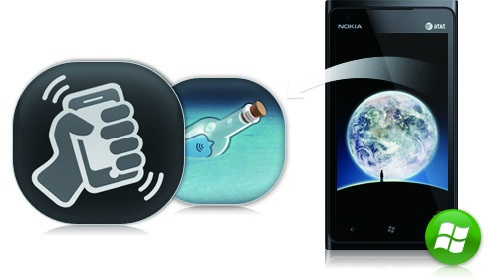
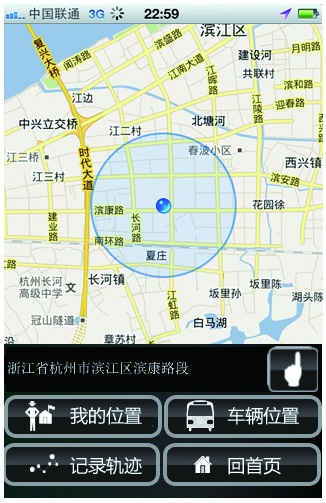
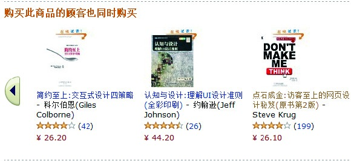

### 3.4.5 基于场景匹配设计

很多产品的设计是以实际的场景作为前置条件的。现实中很多产品的设计灵感均来源于真实的生活。

通常，我们在与陌生人打交道的时候，首先会互相交换名片，之后录入电话等信息到手机中，便于以后联系。如果是在活动场合，可能会与很多人交换名片，之后要逐一录入电话号码到手机中，很麻烦，不是吗？要是有一款软件能让大家做一个动作就可以神奇地解决这些问题那可就太好了。微信的摇一摇，一经推出便深受广大用户青睐，它是利用手机陀螺仪的原理来实现的，在某个时间点，大家同时晃动一下手机，各自的信息便可瞬间交换到微信的产品载体上，方便吧？

你是否有过这样的经历：你有急事想要预约出租出，打电话给调度公司，对方要求你清楚地告诉他们自己所在的位置，然后由相关工作人员呼叫出租车司机，可有时半天没有司机应答，非常低效。现在国内各大城市的出租车均实现了和调度公司之间的GPS定位，基于此，中国台湾Lifestyle最近设计出一款名叫“叫车小帮手”的产品。它的设计思路大致是乘客申请叫车，出租车公司对乘客的坐标进行定位，最后最近的闲置出租车根据乘客的坐标赶过来服务。随着移动互联网的发展，相信这样的场景将会越来越多。

数据推荐是各大互联网公司探索的方向。道理很简单，没有明确目标的用户远比清楚自己目标的用户来得多。所以当大量的用户进行访问时，可以根据他们访问的信息建立起偏好，进而向其推荐一些可能符合其诉求的结果，这是有很大商业价值的。

亚马逊网站在数据推荐领域一直做得不错。它可以根据你的访问行为、购买行为，以及相似的邻居属性等进行偏好计算、协同过滤，帮助你找到更多有用的信息。一般只要你买了一两本书以后，它就会把符合你口味的书籍推荐给你，辅助你进行决策。

