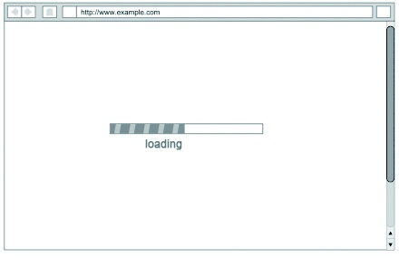
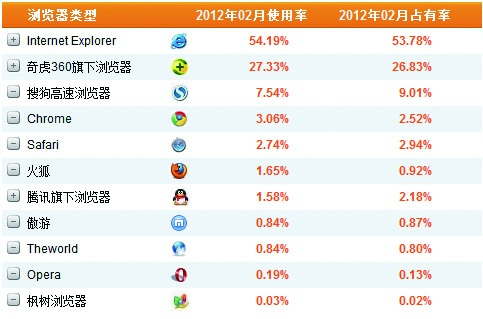

### 3.5.2 可靠性

随着互联网的不断发展，商业价值的同质化竞争越来越激烈。这时候，产品本身的属性和特点为产品的胜出作出了不可磨灭的贡献。

1.理想的速度

调查研究表明：在一般情况下，用户在访问网站时是没有耐心等待5秒钟的，绝大多数用户会关掉8秒钟还没有打开的网站。所以提高机器和用户交互的速度非常关键。

还记得前面提到的C/S和B/S结构吗？基于C/S架构的客户端应用程序，其界面的逻辑都是封装在客户端的，只要服务器的响应够快，它会第一时间取到数据然后将其展示出来。这也是大多数人认为打开软件要比网站快的原因。

而基于B/S架构的网页产品，要先向服务器提交请求，在接收到服务器反馈的数据后，还要进行页面的渲染（包含页面的样式等），待渲染完毕用户才会看到。相比于客户端软件，这个过程中多了渲染环节。所以在进行产品设计的时候，要考虑到信息的内容量级、复杂度和速度之间的平衡。比如，进行一些异步加载和分屏加载，会让用户感觉快一些。

2.兼容性

最令用户苦恼的事情是，有些软件在Windows XP系统下可以正常使用，到了Windows 7中却打不开——这就是兼容性的问题。另外，随着越来越多的浏览器的推出，在进行产品设计时还需要考虑如何兼顾各种浏览器，比如IE6、IE7、IE8、IE9、谷歌、火狐、360、搜狗、淘宝、世界之窗等。

当然要兼容所有的场景几乎是不可能的。在进行产品设计时，可以采用“标杆分析法”。比如，对同行业中做得最好的公司进行分析，了解他们都支持哪些场景。在产品推出以后，会逐渐积累越来越多的用户，有了大量的样本数据以后，就可以看出用户浏览器的使用分布比率了，这个时候就可以进一步确认如何配置产品的兼容性了。

3.并发处理能力

2011年年底，中国铁路客户服务中心网站（12306网）一跃成为了中国最大的电子商务网站。可是，面对每秒几千万的并发量，该系统明显无法招架。日逾10亿的访问量，日交易量最高达166万笔，大大超出了之前预估的每日最高4亿访问量和100万笔交易量，于是系统一度陷入瘫痪状态。

并发是指两个或多个事件在同一时间间隔内发生。服务器的并发处理能力总是有限的，如果并发量太大，超出了并发处理的极限，肯定会影响系统的性能，打个比方：马路再宽，即使是双向八车道，如果一下子涌过来上万辆汽车那也会造成交通瘫痪的恐怖状况。

产品经理在进行并发设计时要充分结合现有群体、自然增长率、市场推广带给并发范围的影响等因素，给出峰谷和峰顶的区间预估，这样技术团队才可能更好地按照目标进行架构。
