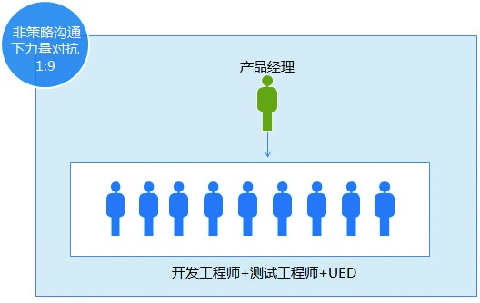
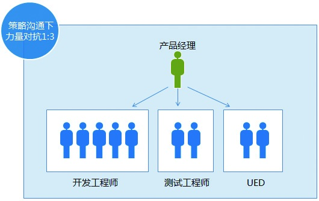

### 4.1.4 找到实现目标的方法

对于企业来说，最看重的是结果，执行力提倡的也是结果导向。如果没有结果，连解释为什么在等待中错失了实现目标，为什么有行动却徒劳无功都显得多余。所以设定目标很重要，掌握实现目标的方法更重要。

很多人在实现目标的过程中，也知道要把目标细化、要制定计划等，但是一遇到具体问题就卡壳了，不知道该如何跨越。这些现象说明他们其实并不是不会方法，而是不会思考。接下来我们就引入逆向思维、策略思维，以帮助大家更好地思考，进而帮助大家掌握实现目标的方法。

1.逆向思维

逆向思维是一种求新、求异的创造性思维。和人们习惯于沿着事物发展的正方向去思考问题并寻求解决办法不一样，逆向思维是对于某些问题，从结论往回推，倒过来思考。这种从求解回到已知条件的思考方法，往往会达到意想不到的效果。

公司为某部门Q4（第4季度）订了个目标：一个季度8000万元的GMV（Gross Merchandise Volume）。在设计方案时，一些新人对这个庞大的目标显得不知所措，有经验的主管对这个目标进行反向分析。8000万元，一个季度是3个月共90天，每天要有88.8万元交易额。当时所在的季度是冬季，冬装的平均客单价为210元左右，那么也就意味着每天要有4233件的销量。按照平均转化率5%来算，每天要有8.46万个独立用户进入卖场。

有了这些数字以后，方案基本上就有眉目了。一方面，根据所需要的流量核算推广引流所需的费用；另一方面，预算联合商家进行活动筹划所涉及的费用。最后细化对应的时间点、资源投入的配比、人员的具体分工安排等，这样，一个可执行的方案评估就出来了。这个例子直观地告诉我们，有了目标以后，要逐一分析达到目标的条件是什么，然后思考如何达成这些条件进而实现目标。

每一个产品，做细做深了都会有很多需求，通常都是20%的需求贡献了80%的价值，若关键性的需求已经满足了，那后面需求的边际收益将会越来越低。这时候产品经理往往嘴上说着要做减法，执行的时候还是在不断地做加法。此时最好的办法就是逆向思考，想想不做这个需求会怎么样？这样，答案就会随之而来，如果是不做影响不大的需求，就可以先放一放了。

在执行的过程中大家会让产品经理做决策，产品经理则会通过逆向思考把决策抛给大家。比如，笔者负责的平台产品支撑公司的30多个产品线，所以笔者每周都会收到很多产品线提交过来的需求。一个有意思的现象是，每个都说自己的需求是最重要的、优先级第一。这可让笔者为难了，到底谁的最重要呢？后来通过沟通发现，他们都是站在各自的产品角度来考虑问题的，并不是站到公司层面对产品优先级进行排序的。有了这些信息后，笔者把大家提过来的需求合到一张需求列表上反馈给每个人。与其给出结论，还不如大家商量好给出结果，这样也公平。后来再遇到类似的问题，就能很容易搞定了。

2.策略思维

喜欢下象棋的人可能知道，我们其实不知道自己下一步要出哪个棋子。通常是别人走了一步，我们分析其意图，然后才针对性地去攻击或防守。在项目执行过程中也是如此，很多时候信息是不透明的，我们必须根据实时的情况，以及自己对过去、现在、未来的理解进行动态判断，然后做出相应的决策。这个过程中采用的就是策略思维，又叫博弈论。

任何产品都会经历从小到大的过程。当产品小的时候，没有用户也没有知名度，这时可以找平台进行合作。虽然可能要被抽成，但毕竟用户流量掌握在平台的手里。等自己的用户流量占据一定份额，自己的产品成了平台后，你们就可以平起平坐，进行深度合作了。如果你变得很强，而原来的平台又没落了，这个时候他可能又会来找你，当然这时你也可以找他要抽成。

QQ曾经差点被卖掉，如今成了腾讯帝国。360当初几遭壁垒，如今也牢牢占据了终端。可见，任何事物都在经历着强弱间的转换，策略思维告诉我们，作为产品经理，不要把自己的产品定格在应用或平台上。想好自己擅长做什么，让自己各个阶段的利益保持最大化。只有足够强大，才有话语权，才有可能制定游戏规则。

有人的地方就会有意见不一致的情况。在一个项目团队中，如果队员间发生分歧，内耗会比较严重。掌握策略思维，可以帮助你更好地进行团队协同。下面继续来看例子：

一个团队共10个人，5个开发工程师、2个测试工程师、2个UED人员、1个产品经理。如果1个工程师有意见，那么很有可能获得2个以上工程师的认同。如果还有1个UED人员有意见，那么有可能获得另外一个UED人员加1个工程师的认同。这个现象说明10人的团队中，当1个人产生意见的时候，可能对峙的结果是3:7；当2个人有意见时，可能对峙的结果是7:3。任何一个人有意见，都将很难控制最终的结果，这会导致产品经理协同起来非常被动。

所以产品经理在沟通的时候，应该先有策略地找开发工程师、测试工程师、UED人员的代表进行沟通。因为如果每个角色内部有理解分歧，则他们更容易达成一致。如果产品经理只是平面、没有策略地沟通，确实很容易遭遇被动局面。

