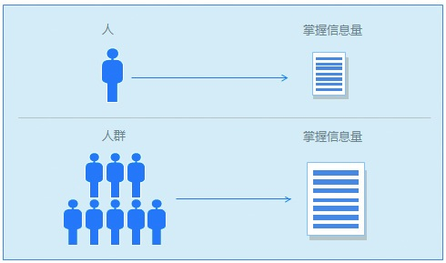

## 4.2 进行有效沟通

沟通的本质是人与人之间、人与群体之间信息、思想、感情的传递和反馈过程，以求两者的思想达成一致且感情通畅。在工作和生活中，许多问题都是由于沟通不当或缺少沟通而引起的。所以，具备良好的沟通技能，办起事才能畅行无阻。接下来，我们进一步看沟通。

### 4.2.1 沟通的价值

沟通的价值在于让信息充分交换，让彼此达成共识，最后有助于决策。

1.信息对称

由于每个人的信息接收渠道是有限的，因此能接收到的信息总量也是有限的。另外，人是有价值观、有立场的，不同的人对信息的认知度也不同。当信息到来的时候，人们会自运行筛选过滤机制，以便把很多自认为无用的、不能理解的信息剔除掉。

正是这些因素的存在，决定了个人获取信息的方式存在弊端。而人与人的有效沟通，为彼此之间信息的充分交换提供了可能。人们沟通的范围越广、越有深度，得到的信息也就越对称。这也就可以解释为什么很多时候跟他人交流以后，能达到完善和加深对某个事物认识的效果。

2.彼此达成共识

事实上，彼此之间达成共识，是一件很难的事情。一方面每个人都有自己的价值观，不同的人对事物的看法不一样，这表现在对事物的价值取向、衡量和判断的标准的差异性方面。比如说，一个人很注意细节，正面的声音说他是精益求精，负面的声音则会说他缺少格局。同样，如果一个非常坚持的人成功了，大家都会说他坚持有道；如果没成功，相信大多数人会批判他固执。

很多时候，我们在项目执行过程中遇到阻碍，也是由于存在共识问题。即使是在一个环境下，不同的人对同一个事物表现出来的看法是不一样的，这也就决定了他们对此事物的态度会截然不同。比如，你认为某个产品的功能不错，可以去尝试，而他认为产品不好，不值得投入，于是双方就存在分歧了。其实，观点本身是没有对错的，不同的是看问题的角度。

另外，立场不同看法也会不一样。用同理心来看，大多数技术人员追求技术的先进性，而测试人员则考虑如何将风险降到最低，对于UED人员来说，更希望让用户体验达到极致，但公司则是希望能以最快的速度做好一个项目。由此可见，不同的立场会导致大家关注的主要维度不同，所以很多时候你会发现开会的时候，很多人只在乎其所在乎的。

举个例子，某产品经理非常喜欢产品设计工作，平日里也表现出了良好的职业素养。公司老总有意要栽培他，看到一块新业务要发展，就把他调过去当产品主管。本来是一件蛮好的事情，但问题来了。在新的岗位上这名产品经理由于没有处理新业务的经验，加上之前没带过人，所以从早忙到晚显得手忙脚乱，差一点要离职。后来经过沟通才发现，这名产品经理给自己的定位是产品设计，所以他没有管理的意愿。而公司老板呢，也没有表达出栽培他、鼓励他的意思。这导致产品经理产生错觉，认为原本自己做得好好的，公司不重视他了才把他给调过来。通过老板的沟通之后，这名产品经理彻底转变了观念，后来在新的岗位上干得风风火火。
