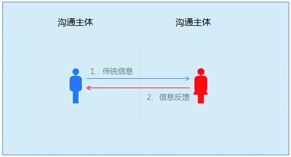
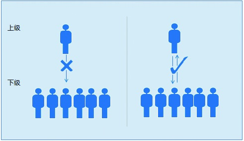

### 4.2.3 掌握沟通路线

关于沟通路线方面的问题，大家平时遇到的可能就比较多。很多时候是因为信息没有充分反馈，导致了认知的偏差。如果不懂得向上管理，被迫接收上级的信息，又不知道如何处理，那一定会让自己陷入困境。接下来，我们就选取两个方向进一步介绍沟通路线方面的内容。

1.双向沟通

沟通的重要性不言而喻，然而这种大家都知道的事情，也常常被人们忽视。和单向沟通不一样，双向沟通强调的是，信息接收者是否有充分的信息反馈。

举个例子，有些父母在教育孩子的时候，喜欢不停地在孩子耳边唠叨，然后问其听进去了没有，孩子一般会点点头说自己听进去了，实际上可能孩子根本就没有听进去。同样，在产品沟通的过程中，很多人看似很认真地在听你讲，头点的比谁都快，其实根本没有用心听，等真正做起事来才暴露出他还是按照自己的理解去执行了。

在双向沟通中，不管采用哪种形式（交谈、协调、深入交流等），必须让信息接收者充分地表达自己的看法和理解。通过彼此思想和感情的传递及反馈，把对方内心潜藏的疑问统统消除掉，从而达成真正意义上的理解一致，而不是形式上的认同，形式上的认同其实是没用的。

不过，要让心与心之间的天堑变成通途，有一点非常重要，那就是要确认对方是不是真的明白了，这比单纯你明白了或者他自认为明白了来得更有意义。

2.向上沟通

有些人喜欢抱怨老板的想法是今天这一出，明天那一出；而有些人会觉得老板不了解情况，纸上谈兵，制定的目标不靠谱。虽然大多数人内心对领导传递过来的信息是有判断的，但真正把自己的判断反馈过去，或进行沟通的却很少。

现在的普遍情况是：不表明态度，对老板传递的信息全盘接收；内心觉得不合理，但总结不出说不的理由；有想法，但提不出建设性的方案；想沟通，不去找合适的机会沟通。

其实，老板是非常在乎执行团队的信息反馈的。不过，在一个团队中，不同人说的话对老板的影响是不一样的，这也意味着部分人的反馈对老板的影响力更大。这个现象也说明了向上沟通不是仅凭沟通就可以的，不是每个员工都可以达到同样效果的。从本质上来说，老板的心里有个计算器，员工能力强、事情做得棒的，老板就加分。相反，对于事情做得不好的员工，老板就会给他减分。取得老板的信任是第一步，所以做好该做的事情，打造自己的实力是基础。

在很多事情上，老板的格局比较广，但这也有弊端，那就是对业务的细节没有执行层清楚，所以老板的有些想法和决策也不一定是全对的。作为产品经理，要珍惜每一次和老板对话的机会。很多人仅仅是拒绝执行，又说不出理由，自然会受到质疑。所以，当每一次发现不合理的决策时，产品经理要充分地把问题、风险点、原因、综合的解决方案抛出来，这样才能有助于老板调整决策。

当彼此的信任感通过一次次事情培养起来以后，你就已经营造出了和老板双向沟通的环境。这时，你就可以提出一些自己考虑过的想法了，而且不一定是非要有解决方案的。如果在信任感没有培养出来之前这么做，相信会很难达到理想效果。最后，随着彼此了解的加深，你的授权也会相应变多，你会有更多向上沟通的机会。
