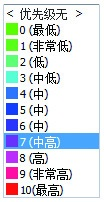

### 4.4.2 优先级排序

人的时间和精力毕竟是有限的，不可能一下处理完所有的事情。所以要处理的事情就有轻重缓急之分了，这就涉及了优先级排序问题。

前面在讲需求分析的时候提到过利用四象限定位法将事情分为：重要又急需的、重要不急需的、不重要但急需的、不重要不急需的。通常重要又急需的优先级最高，最高优先级的先解决掉，剩下的事情按照优先级由高到低的顺序解决，这样就不会因为没有重点而显得手忙脚乱了。
