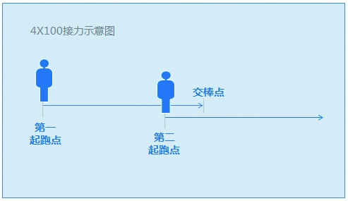

### 4.5.5 往前多走一步

在进行4×100接力赛的时候，前面一棒的选手总是要往前多跑几步，好让后面一棒的队员跑起来接棒。这样的配合，才有可能让团队的成绩最好。理由是，后面接棒的队员，接到棒的瞬间，速度也已经起来了，而不是冷启动。社会的专业化分工越来越细，每个岗位的边界被划得很清楚，在岗位之间的协同中，也需要彼此往前多走一步。

举个例子，产品经理避免不了迭代需求，很有可能原来给用户传递的功能，过了一段时间就变样了。这种改变从外部来说会影响到老用户的使用，代理商的重新培训；在内部也会影响到客服、销售、市场人员重新学习的成本。所以产品经理不要觉得服务是客服的事情、市场是销售的事情而不管不问，事实上，产品的每一次改动都会给很多方面带来相关性的影响。

多往前走一步指的是，做事要有主动性，个人的目标是目标，整体团队的目标更是目标。需要增加责任心，把可预见的相关性影响及时告知各个团队，帮助大家充分做好对风险的预案处理。否则就会出现大家不是努力解决问题，而是努力撇清自我责任、相互踢皮球，执行效率低等现象了。
