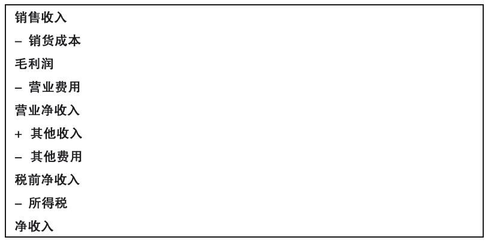
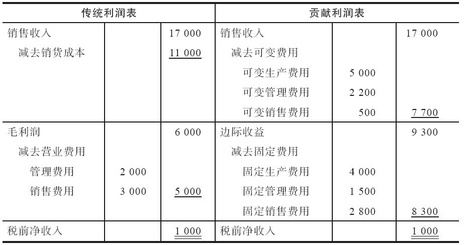
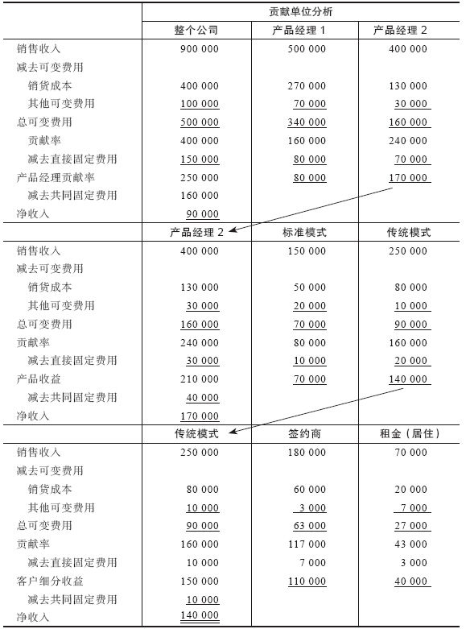
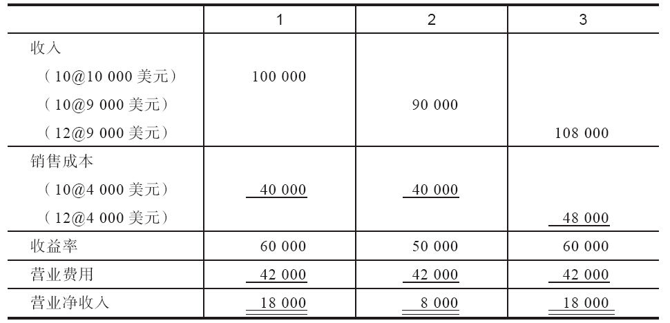
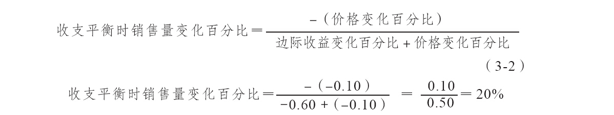
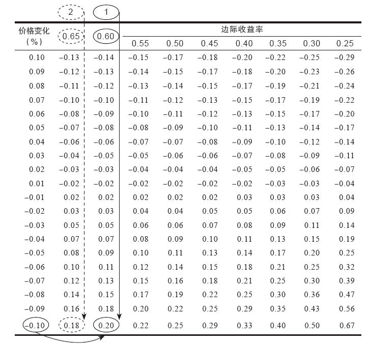
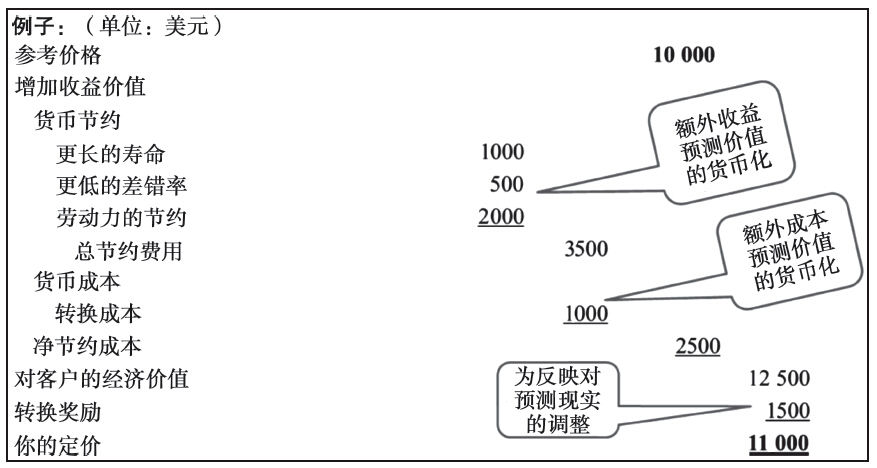
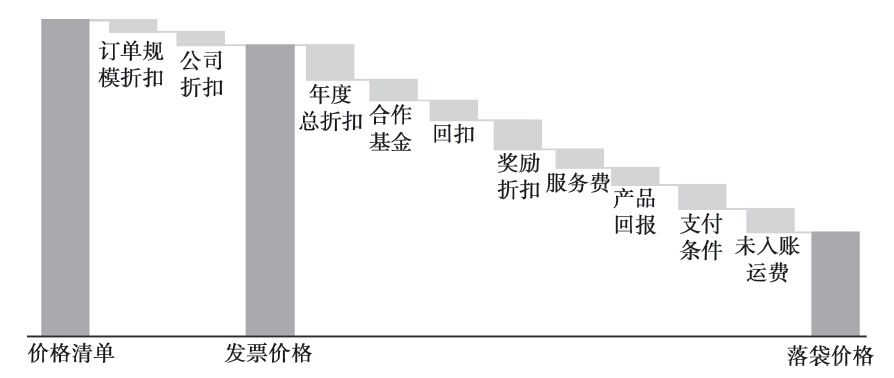

## 第3章 业务能力

请判断对错：成功产品经理要努力提升产品的销量。

错。这个说法的措辞有问题。因为提高销量的最快方法之一，就是给产品定一个基本上相当于白送的价格。产品经理应该理解产品的贡献毛利，并以此信息来增加高利润的业务。这不仅包括提升产品销量，还包括鼓励利润率更高的销售，来增强盈利能力，或是以产品线为基础来管理产品定价，以便最优化核心产品本身及其未来相关耗材和配件的销售。

如前所述，我鼓励产品经理把自己当作经营虚拟企业的企业家，这就意味着，他们需要弄清楚产品决策对于资本利用率、现金流、库存、供应链关系以及经营企业的其他方面有哪些影响。产品开发显然受成本影响，成本因素应在企划方案中明确列出，不过也有例外，有些成本因素很重要，但却体现得并不明显。比如在定价时，我们既要考虑客户价值（营销），也要考虑成本构成（财务）。产品经理需要不断加强对这两个方面情况的了解。对于新产品，他们需要准备一份经济价值数据表，以便能够测算：与竞争产品相比，自己的新产品所能带来的客户福利（或福利损失）的货币价值。对现有产品，产品经理应能理解（也许需要说明理由）价目表中的价格与实际价格会有所差异，这个有时是因为计划中的和临时性的折扣导致的。

基本财务概念

因此，为了做出正确决定，产品经理需要构建一整套有关财务计划、预算，以及与产品、服务和客户有关的财务控制方面的知识框架。首先，他们要有一定的财务和管理会计方面的知识。这让他们能够更好地理解产品的利润贡献情况，因此能够在产品合理化、产品定价以及产品线管理方面做出最明智的决策。其次，从更为宏观的财务管理角度看，产品经理应理解各种财务报表所需的关键比率和概念。最后，他们应了解财务状况，这关系到产品的定价决策。尽管产品经理没有必要成为财务方面的专家，但他们仍然要掌握首席营销官（CMO）的建议专栏文章中所提到的一些基本知识。

首席营销官的建议专栏

首席营销官给产品经理的财务建议

马克·菲利普斯（Mark Phillips）

通用电气医疗集团亚太区首席营销官

好的产品经理没必要拥有财务方面的专业学位，也没必要是财务方面的专家，但他们应具有足够全面的财务技能，以便有能力做好两件事：（1）确定最佳定价策略；（2）制定可靠的企划方案，充分说明新产品开发或为产品增设额外分销渠道和增加营销投入的理由。

这就要求他们熟练掌握电子表格，基本了解利润表，并且熟悉盈亏平衡分析和价格瀑布的基本概念。这些都是必须了解的；当然，还有些更为复杂的工具和其他财务概念，如果都能了解，自然是锦上添花。在当今世界，作为产品经理，你至少需要熟悉这些基本知识。

确定最佳定价策略

确定最优价格时，多数定价工具要求人们能够整合基本数据表上的信息，并能理解其中隐含着的财务状况（有时候，只需要进行基础的代数运算）。经济价值预测表（EVE）就是一个例子。这个表格能帮助你计算出，购买替代产品或不购买任何产品，顾客可以从你的产品中获得多少经济价值。这一点很重要，因为它能让你充满自信地走进首席财务官办公室（以B2B业务为例），向他说明你的产品是如何削减某些成本、如何帮助公司获得额外收益的。创建可靠的经济价值预测表需要了解客户购买过程以及随之而来的财务问题，如人工费率、销量，或如果产品属于价值增值那部分时的产品定价问题。因此，你需要能在电子表格中创建数据模型，输入来自客户的信息变量时，就能运行这个模型。这不是什么高深的财务知识，但需要你能掌握用电子表格建模的基本知识，了解客户对产品的使用方法，以及他们使用该产品所带来的财务影响。

另一个例子是盈亏平衡分析或价格-销量分析。这个分析的根本目标是了解产品销量的价格弹性，发现产品价格的“最佳点”。这个例子中，需要再次使用电子表格，预测产品处于不同价格定位时的需求量，列出每个价格与销量点的利润率，并由此确定能够带来最高利润的产品价格。

针对产品在不同时间和不同条件下价格变动的原因，要进行深入分析。这些不同的条件包括交易规模组合、次级产品组合（产品线中）、市场细分组合、货币价值波动之类的各项目以及其他类似项目。了解驱动价格波动的因素及其背后的逻辑有助于产品经理做好充分准备，针对实战中遇到的各种情况，巧妙地向销售团队和其他部门人员指出问题。

不少产品经理的成功，可能只是用价格-毛利比来衡量的，或者他们自己也只关心价格-毛利比。可是这样做局限性很大，因此，我建议产品经理跳过毛利，而直接考虑边际收益（CM）。此外，我也建议产品经理不要只关注发票价格，而直接关注实际落袋价格。上述两种能力要求掌握一定的电子表格技术和相关财务知识。

价格边际收益比要求产品经理能够理解与销售、交货和为顾客安装产品有关的各种变动成本要素。了解这些项目及其背后的原因，可帮助产品经理让产品为公司贡献更高的利润率。这使得产品经理所了解到的信息，要远远多于已售产品的数量、价格和成本这三个方面的内容。

有时候，还需要考虑价格侵蚀问题，产品经理往往只看发票价格或计算销售佣金所依据的价格，可这并不一定是公司赚取利润的真实价格或落袋价格。能够意识到是哪些财务因素导致了发票价格被侵蚀到落袋价格的，将有助于产品经理获得成功。这些能发挥作用的各种因素，包括年末的数量折扣、提前付款折扣、紧急装运以及其他隐蔽项目上的折扣。了解这些其他要素及其如何影响产品利润率，对公司能从产品获得多大价值影响重大。你可能必须去财务部门，让他们帮你制作一份有关这些因素的报告，因为这原本就是财务部门的分内工作，所以要求他们这么做倒也无可厚非。但是，作为产品经理，你的工作就是充分了解完成业绩所涉及的各种相关要素，你也就应该知道，需要他们给你提供哪些帮助，以及如果需要某些变动时，又要到哪里去获取相关信息。

制定可靠的企划方案

我做过产品经理，现在是首席营销官。我曾花大量时间来制作各种企划方案，从新产品方案到新销售团队组建方案，当然也包括营销费用支出方案等。这其中涉及的财务知识倒不复杂，但你需要理解公司是怎么解读利润表以及实现收益的关键要素的。他们根本没必要深入了解税收、利息和其他公司评估方面的信息，只需要能够了解从销售收入、总收益到边际收益再到经营利润这些方面的信息就行了。当然，卓越的产品经理要知道一个销售人员最终能实现的产品销售量是多少，每个销售人员的成本为多少，要成功所需支出的营销费用又是多少。

最后，一定要和财务人员搞好关系，这会让你的事业蒸蒸日上。

一般成本分类

制成品的成本可分为两大类：制造成本和非制造成本。每一类都可进一步细分。制造成本包括把原材料转变成最终产品过程中所产生的所有成本，有直接原料、直接人工和制造费用。例如：

·直接原料，诸如做桌子所用的木头和做汽车所用的钢材之类的东西，是最终产品不可分割的部分，可以看做直接成本。诸如胶水之类的其他原料难以直接与个别产品联系起来，可列为间接原料，计入制造费用。

·直接人工，包括生产产品直接可追溯的人工成本。研发、后勤人员的时间，以及其他与生产没有直接联系的人工应归入间接人工。

·制造费用，包括上述直接原料和直接人工成本之外的所有制造成本支出。这一类成本项目还包括间接原料、间接人工、供热、照明和折旧等。

非制造成本包括营销、销售、管理以及与产品生产没有直接联系的支持成本，通常会列在利润表的销售、管理及行政费用中。以前，对多数产品来说，非制造成本没有制造成本那么重要。但是，服务的增加和各种技术的出现，颠倒了多数公司中这两种成本的权重。包括在非制造成本中的有：

·营销和销售成本，包括广告、运输、销售佣金以及薪水。

·管理费用，包括行政、组织和员工的薪水。

制造成本和非制造成本来自企业的日常运营活动。此外，还可能有其他费用支出，如购置资产，尽管这不是营业费用，却列入当期利润表的支出项下。销货成本包括直接投入的原料、人工以及分摊的制造费用。这些数据通常来自标准成本，并且是固定成本和变动成本的总和（标准成本是个预先设定的额度，表明在最有效的运营方法中什么东西的成本是多少；换句话说，这是用来衡量绩效的标准）。同样，间接费用（非制造成本或者销售、管理及行政费用）也可能是固定成本和变动成本的总和。简化后的基本利润表如图3-1所示。

图3-1 简化后的基本利润表

简单说，我们通过下面几个步骤，就可从利润表中计算出净收入了。

·从销售收入中减去销货成本；

·从毛利润中减去营业费用；

·在营业净收入中加入其他收入并从中减去其他费用；

·从税前净收入中减去所得税。

通过上述过程得出的利润表，体现了经营结果的历史发展。它并不必然为产品经理提供了他所需要的、用来规划和改进产品管理过程决策的信息。为了提供此类信息，有必要区分与产品有关的变动成本和增量成本，这样的话，产品经理就能更好地理解自己占用了多少成本以及贡献了多少利润。

#### 市场细分财务报告的概念

变动成本是成本中直接参与生产活动并随生产活动水平变化而变化的成本。如果活动水平加倍，变动成本也会加倍。这不无道理，因为在一定范围的相关活动中，单位成本几乎不变。直接原料和直接人工是变动生产成本，销售佣金则是可变销售费用。此外，还有阶梯式变动成本（类似于累进成本或半固定成本）。准备时间、季节性用工以及与特定数量业务有关的类似活动，相对于该项业务，可看成变动成本。相反，固定成本则不会随着活动水平的变化而发生变化；不论是否生产产品，固定成本始终存在。由于固定成本总量保持不变，每单位成本的数量随着所生产产品数量的增加会逐渐减少。据说，有时候人们把变动成本称为“做”生意的成本，把固定成本称为“入行”成本。

成本被分为固定成本和变动成本之后，产品经理确定不同产品或细分顾客对企业利润的贡献就简单多了，公司评估产品经理的业绩也容易多了。表3-1对传统利润表（用历史成本信息）和贡献利润表（区分固定成本和变动成本）进行了比较。

表3-1 传统利润表和贡献利润表 （单位：美元）

注意，用这两种方法计算时，表3-1中第一行（销售收入）和最后一行（税前净收入）的值都一样。但运用贡献利润方法计算，这些销售贡献了9300美元，由固定成本（收支平衡之前）和利润（收支平衡之后）组成。贡献利润表可用于业务单元、部门、产品经理、产品线、客户或类似的分析单位。运用到这些分析单位时，就必须理解直接成本和共同成本这两个概念。

直接成本是在特定分析单位（如产品经理、产品、客户等）中可以直接识别出来的成本，并且这个成本因该单位或因其内部活动而产生。共同成本是指那些无法判断直接来自具体哪一单位，而是由所有单位共同产生的成本。共同成本（最有可能是固定成本）只能通过主观手段进行分配。表3-2就是一个贡献利润表的例子。

表3-2 贡献利润表 （单位：美元）

注意，表3-2这个例子展现的是把产品经理当成企业，为他们构建的一份利润表。数字显示，公司销售收入为90万美元，其中50万美元由产品经理1创造，40万美元由产品经理2创造。他们分别贡献了8万美元和17万美元利润，但有16万美元的管理费用没有分摊。产品经理2的40万美元销售收入中来自标准模式（15万美元）和传统模式（25万美元），分别贡献了7万美元和14万美元。产品经理2有4万美元的固定费用，没有直接由任何一个产品分担。传统模式从签约商手中获益18万美元，从固定客户获得收益25万美元。传统模式有1万美元的固定成本，与两类客户群体均无直接关联，细分收益也就没有对这1万美元进行成本分摊。

#### 成本驱动因素

产品经理对产品做出定价或对产品线进行评估之前，必须清楚不同产品和客户的成本驱动因素是什么。有些客户要求额外的加急费用，有些则需要特殊的运输与处理，还有些则希望获得免费服务。这些成本的每一项都应分摊到每个特定的产品或客户身上，才能确定其真实的财务贡献。

财务报表分析

如前所述，财务报表是对一个特定时段内所发生的事情的历史记录。报表所提供的视角能帮助产品经理通过使用率来判断过去的绩效。此外，比较历时数据的变化，可能看出绩效的发展趋势，并运用该信息来制定后续的各种决策。

产品经理可能直接或间接地参与资本预算决策，为新产品、新市场或新的业务方式准备投资建议。评价不同建议最常见的方法是平均收益率、回收期、现值以及内部收益率。

平均收益率是年平均利润和项目投资的比率。运用这种方法，产品经理可以从多年的既定投资中，预测出利润的增长情况。总利润除以年数，就得到了年平均利润，而这可以用原始投资的一个百分比，或者作为每年平均投资的一个百分比来表示。假设下面是来自某一新产品的利润流：

·第一年：100000美元

·第二年：200000美元

·第三年：300000美元

·第四年：250000美元

·第五年：350000美元

·总计：1200000美元

·平均：240000美元（1200000美元/5年）

如果初始投资为100万美元，年平均利润为24万美元，或利润率为24%。同样，这24万美元可表示为这5年每年平均投资的一个百分比。无论用哪种方法，都应该把这一比率和该公司或者行业的最低利润率进行对比。

回收期是指收回初期投资所需的时间（年数）。在上述例子中，投资100万美元，花了5年时间收回。4年后，累计收入为85万美元，还剩下15万美元本金在最后一年赚回。这再次说明，一个项目回收期绝对年数的长短，还不如与其他项目的回收期年数进行相互比较来得更加重要。

现值（或净现值）是相比于当前首期投资的流出，未来现金流入的价值。

内部回报率是使所有预计未来现金流的现值等于首期投资支出的利率。换句话说，它是让净现值等于零时的一个比率。这个值的数学计算比较复杂，正因如此，让财务部门成为业务伙伴就至关重要，关于这一点，我们在本章末尾对英格索兰公司财务副总裁道格·沃恩的访谈中会有所提及。

为定价决策估算有关成本

评估与产品定价有关的成本看似简单，其实不然。每个公司都运用不同方法来分摊成本，因此，变动成本和固定成本之间的界限也是模糊不清。不管怎样，我们都需要先对这些常用定价术语给出明确的定义。

如前所述，变动成本是（总量上）随着产品和服务的生产而变化的成本，包括直接原料和直接人工成本。在特定生产水平上，单位变动成本不变，因此就为定价决策提供了一个基准。长期来看，所有成本都是变动成本。在确定产品的长期定价时，所有成本都应考虑在内。但是短期内，任何高于变动成本的价格都至少要能贡献出固定成本和（潜在的）利润。

财务报表中销货成本（COGS）一行也许是对变动成本最好的估值（尽管它习惯上包括一些标准的分配），并因此可能是与定价决策有关的唯一的增量成本。也有例外情况，如在竞标时形成的固定成本，它在作决策时可能渐增。在此情形下，必须把新增的固定成本纳入变动成本之中，以确定一个定价的基准。

下面的收支平衡公式可以用来作为计算价格的起点。标准的收支平衡公式表明，必须以特定价格出售多少产品，才能收回全部成本，如式（3-1）所示

假设有一位产品经理，他同时负责10个咨询服务项目，每个项目收费1万美元，每个项目的直接成本为4000美元，总的管理成本为4.2万美元。根据这些数据，需要出售7个项目才能实现收支平衡。尝试给产品不同的定价，并把得出的收支平衡销量和市场的预期需求进行对比，产品经理就可以开始作定价分析了。另外，目标回报（利润）可以包括在分子中（与固定成本一起），来估算实现特定利润所必须售出的单位产品数量。如果在分子上的固定成本中加入需要实现的1.2万美元的利润，就必须出售9个单位的产品才能实现收支平衡。

根据这个例子，我们来看看边际收益，并评估不同的决策情况。每个项目贡献6000美元（当前价格和变动成本的差额）到固定成本和利润上，将会产生1.8万美元的营业利润，如表3-3第1栏所示。

如果产品经理把每个项目的价格降到9000美元，则每个项目贡献5000美元到固定成本和利润上。如果不存在其他变化，则新产生收益9万美元，新的最后利润为8000美元。降价10%（从1万美元降到9000美元）将使营业利润下跌55%（从1.8万美元下降到8000美元），如表3-3第2栏所示。

表3-3 价格/利润比较 （单位：美元）

如果要保持1.8万美元的利润，公司需要多雇用两个人。我们假设销量增加，营业费用即固定成本不变，其目标是提供边际收益至少6万美元。因此，公司需要出售12个项目，而不是10个（6万美元除以新项目数就是每个项目的贡献5000美元），如表3-3第3栏所示。两个新增的项目表示需要增加20%销售量，才能弥补价格降低10%所造成的损失。

调整上述收支平衡公式能让我们迅速发现产品价格变化所造成的影响。修正后的公式见式（3-2）。边际收益是价格和可变价格的差额，本例中是10000－4000＝6000（美元）。边际收益变化百分比是价格百分比变化之后单位边际收益的百分比变化（本例中是6000÷10000，或60%）。得出的结果是实现与当前同样回报率所必需的单位销量的百分比的变化。换句话说，边际收益率为60%时，要增加20%的销售量，才能取得表3-3所示降价10%所产生的效果。

这个公式可以放到电子表格中，用来表现价格变化的影响。确定各栏中的相关的边际收益率，每行内列出潜在的价格变化，在单元格中就可以得出表3-4所示的类似数据。注意实线1前为60%的边际收益率，以及降价10%，得出单元格中要增加销量20%。

表3-4 价格变化收支平衡分析表表格样本

如果变动成本更低（如3500美元）但其他条件不变，要实现65%的边际收益率，会有些什么变化？（请看2下面的虚线。）在此情形下，只要增加18%的销售量就能够实现收支平衡。如果变动成本大大提高（如7000美元），而边际收益率为30%时，又会是什么样？同样，如果其他条件不变，应如何调整销售量才能实现收支平衡？答案是增加50%，也就是说要增加5个项目的销售。价格增加也可以用图3-3调整过的收支平衡公式来评估。但是，如果考虑提价，那么在实现增值的产品变化或增加额外服务之后进行比较合适。

要考虑调整价格，就有必要了解价格变化对实现收支平衡所需的销量有哪些影响。要这样，你需要提出如下几个问题：竞争对手还有多少筹码可用？如果在这个产品上对方的变动成本比你的更低，他们降价后就能坚持更长时间。他们降价并保持低价的可能性有多大？还有，顾客对价格变化的敏感程度如何？是否有可能实现价格变化后所必须实现的销量变化？请记住，电子表格中的信息并不能给你提供“答案”，它只提供了一个数据点，有助于你做出更好的决定。

#### 经济价值预测建模

定价战略需要综合考虑主观和客观数据，这对于给新产品定价可能尤其困难。对于设备之类的资本支出，产品经理有责任与竞争对手的产品相比，并把产品收益价值进行货币化。请看图3-2中的经济价值预测模型[[1]](part0010.xhtml#ch1-back)。

在本例子中，参考价格可以是顾客考虑该产品时所采用的任何一个基准。它可以是某个竞争产品的价格、自己公司中已被取代的产品的价格或者实现客户提供某些功能所需要的成本。确定了比较基准之后，产品经理就可以开始与知识丰富且愿意合作的客户一起来进行预测，与参考替代物相比，新产品的收益与成本的现金价值是多少。标准产品的估值是根据多位有代表性客户提供的信息而做出的，而对传统产品的估值则根据特定客户的使用情况做出。如果新产品因使用时间更长而预计节约成本平均为1000美元，该值就会被用到价值模型中去。但实际上，这些都是基于多种假设的预测数据。因此，在确定最终价格时必须有一定的灵活性（做出必要的调整）。

图3-2 经济价值预测模型

#### 落袋价格瀑布分解法

与多数产品经理有关的最后一个财务领域知识是理解发票价格和落袋价格之间潜在的价格侵蚀，也称为落袋价格瀑布（见图3-3）。价格侵蚀（或价格泄露）可能来自于为达成交易而给顾客多种形式的折扣和激励。不同部门可能出于不同的原因给顾客提供不同程度的折扣。确立定价战略，决定是否授权特殊的落袋价格，或分析产品的真正价值时，产品经理需要明确客户为产品所付的“真实”价格。

图3-3 落袋价格瀑布分解法

本章思考

学习与产品的定价和利润率有关的基本财务概念，向组织中的财务人员寻求帮助，以实现自己的目标。

道格·沃恩访谈：与财务人员成为业务伙伴

道格·沃恩（Doug Vaughan）

英格索兰公司财务副总裁

电子邮箱：vaughan36@aol.com

（也可以在领英网站联系到他）

道格，你曾在多家公司担任财务主管或首席财务官，你的大部分工作为内部控制与财务管理，你和你的同事还为产品开发与公司持续运营决策提供各种建议。你能不能谈谈，你在产品开发与维持方面，与产品经理合作时的角色定位？

成功的产品经理必须能够理解他们所管理的产品的各种经济含义。产品利润率多少？产品总成本多少，生产成本、分销成本以及销售成本是多少？产品收益未来趋势如何，对其定价和成本会有什么影响？产品组合有什么影响？财务部门在产品管理中的作用就是确保提供有关产品线的、准确且容易理解的经济分析数据，帮助产品经理了解真实情况，并从经济分析中获得灵感。

优质的财务支持很重要的另一领域就是投资领域。产品经理考虑投资某个新产品时，财务部门能够协助开展全面企划方案的财务分析，帮助产品经理决定是否投资。除了最基本的决定投资与否之外，优秀的财务人员还能帮助投资取得成功。例如，投资获益的根本要素是什么？实现成本目标了没有？有没有获得市场份额？通过帮助确定成功的关键指标，并且帮助优化资源和投入，财务人员能帮助实现项目的成功。

我们通常鼓励产品经理要像“经营一家企业那样经营自己的产品”。这就要求产品管理和财务部门成为战略合作伙伴。在你看来，要构建双方紧密的合作关系，他们彼此需要采取哪些行动？

首先，财务部门要给产品经理提供良好的财务数据，帮助他们更好地管理产品。不过，在多数成功的案例中，他们所做的远不止这些。财务人员作为业务伙伴，这意味着他们要成为产品管理团队的一员，那么他们就必须具备商业敏感度、沟通能力以及公关技巧。财务人员要与产品经理紧密合作，深入了解企业，并且能够运用财务和业务技能，帮助产品经理做出正确的决策，开展正确的行动。

这是财务和产品管理部门之间关系比较积极的方面，你认为还有哪些方面需要改进的？

典型组织中都有很多方面需要改进。通常，会计制度或财务制度的基本出发点不是为了提供正确的数据。因此，我们需要做大量工作来组织信息，使之有益于产品管理。问题的另一方面是财务组织本身，组织结构方面和能力方面同样如此。最好的做法是确立产品管理和财务部门之间明确的组织界限。换句话说，每个产品经理都配备有财务人员与他们一起工作。财务人员必须掌握相应的基本技能，以便更有效地完成本职工作。这样，财务人员的工作态度就显得至关重要。他们应把自己看做是团队的一分子，并努力帮助产品经理取得成功。利用自己掌握的信息来破坏合作伙伴工作的财务人员应该尽快被清除，不能让他继续担任相应职务。

财务理解能力（从制定新产品企划方案到完善现有产品定价），你认为每个产品经理都需要具备的三四项最重要的技能是什么？

显然，他们首先要能够看懂产品利润表，理解收益和任何对于收益的减损情形。深入了解产品的成本结构，以及所有将产品投放市场所需要的其他支出（如销售、工程、坏账等方面的支出）。

理解投入资本回报率的概念，如何将该概念用于对产品的持续管理（“存货和服务水平之间如何平衡”），以及如何将该概念用于投资决策（“什么是现金流量贴现”）。

定价：能理解价格落差，以及如何确定自己的产品与竞争对手的产品相比所具有的特征、优势以及价格。

预测：理解如何运用公司财务预测流程发现产品线盈利能力的发展变化趋势，并根据这些数据采取适当行动。

请问，你还有其他什么“真知灼见”要对产品经理说的？

如果你有一位很好的财务伙伴，一定要让他成为你的团队的一员，让他参与你所做的每一项工作。如果你暂时还没有这么一位伙伴，请赶快物色一位。

[[1]](part0010.xhtml#ch1) 这是汤姆·纳格（Tom Nagle）对《定价战略与战术》一书中提出的经济价值预测（EVE）方法经过调整后得出的。
