## 第4章 情报收集

请判断对错：客户总是对的。

这种说法比较有趣，但并不全面。如果是正确的客户，那么该客户就是对的。如果没有这个限定条件，产品经理会被引导到错误的方向。在调查客户的过程中，产品经理必须警惕，随时保持对他们未来客户的关注（而不是他们过去的客户）。他们不应主观地认为所有客户在任何时候都是对的。

成功的产品经理都会收集各种来源的大量事实情报。有关市场行情的外部信息尤为重要，包括细分市场的规模和增长率、客户期望、竞争产品与竞争战略、监管要求与限制、经济和政治因素，以及所有这些因素的发展趋势或变化情况。内部信息也很重要，包括涉及公司宏观生产能力方面的知识、围绕着产品经理自己负责的产品的各种成本与财务问题、工序流程以及公司内部政治问题。本章中，我们将讨论这两类情报，首先讨论外部情报。

产品经理的时间总是很紧，工作常常夜以继日。因此，他们首先需要认真思考的是TIME问题（见图4-1）。这个缩略词由下面四个词的首字母构成：技术（technology）、产业（industry）、市场（market）和事件（events）。用时钟来象征这么一个事实：任何信息都不是静态的，各种调整与趋势的动态变化需要持续的情报支持，以构建一定的知识基础。我们接下来讨论外部情报收集过程的各个部分。

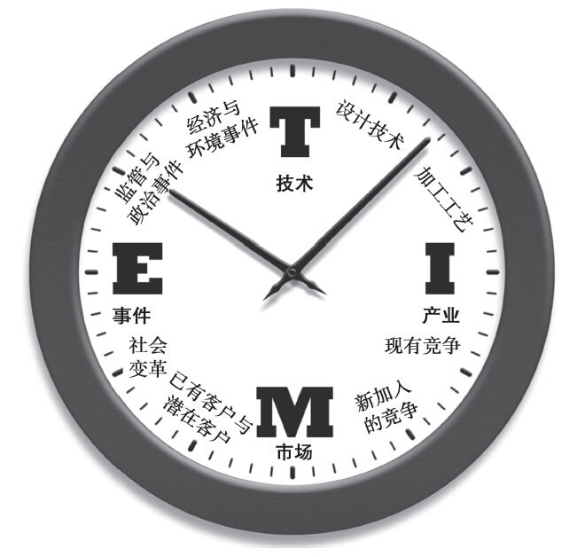

图4-1 情报收集的TIME分类法

技术

产品经理应从两个层面思考技术问题：可能成为新产品（或新产品部件）的新技术，或成为促成者或计划变更者、可能作为外部变量（如社交网络）的技术。例如，多年前，惠普公司发现了影响他们打印机业务的违背潮流的情况。大多数个人电脑所有者已拥有打印机，因此市场上新增销量几乎为零。竞争对手也变得更加咄咄逼人，致使惠普公司市场份额不断减少。同时，市场上还出现了一种新的加墨技术，打击了惠普打印机墨水的销售。可是，打印机业务部在惠普公司的重要性仍十分显着（2004年占其收入的73%）。公司必须重视这些趋势，必须投入资源开发新产品。[[1]](part0011.xhtml#ch1-back)

技术发展既带来机会，同时也带来威胁。纳米技术，在其尚处于创新的模糊阶段时，就已经具有影响众多产业的潜力。[[2]](part0011.xhtml#ch2-back)网络为世界提供了海量数据，也带来了很多机会。随着越来越多的医院限制了医药销售代表的进入，产品经理开始转向网络寻求解决之道。在线诊断、产品网址以及电邮营销方面的投入预计会不断增加。[[3]](part0011.xhtml#ch3-back)

产业

产业知识包括对某一产业的“规则”的广义理解，以及对特定竞争对手信息更为具体的了解。在广义产业知识方面，多数领导力培训项目整合了波特（Porter）的五力分析法（见图4-2），来评估特定产业的“吸引力”。这五种力量包括：（1）购买者的议价能力；（2）供应商的议价能力；（3）新进入者的威胁；（4）替代品的威胁；（5）竞争压力的强度。

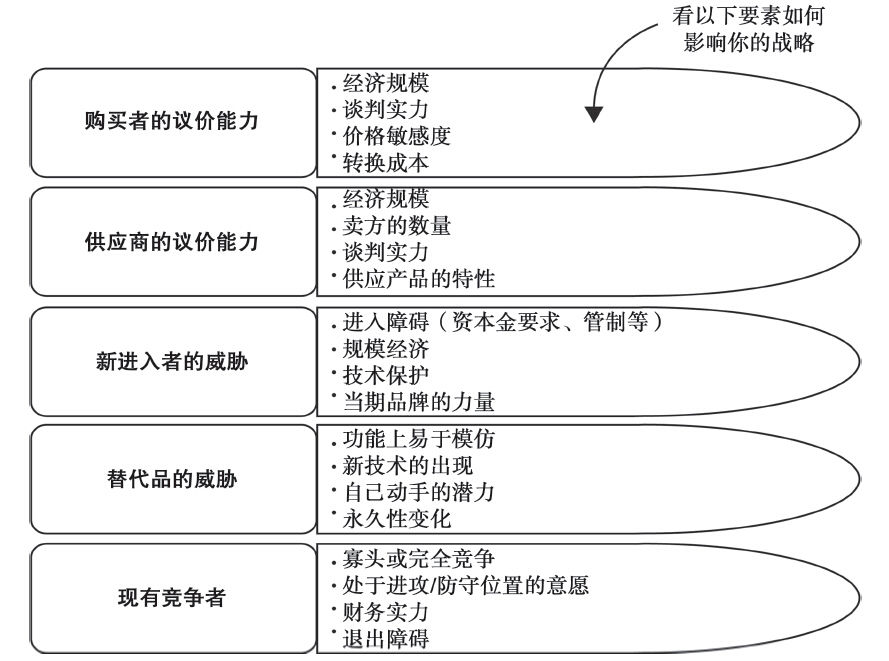

图4-2 波特的五力产业分析模型

购买者和供应商的议价能力依赖于它们自身的经济规模和相对于生产商的影响。例如，从英特尔公司采购或出售给沃尔玛公司，都会降低产品经理的谈判能力。这些在供应链规划和市场战略制定过程中就应予以考虑。请阅读企业案例4-1“对沃尔玛说‘不’的人”。

企业案例4-1

对沃尔玛说“不”的人

消费类产品经理通常希望通过仓储式零售商，如沃尔玛、家得宝（Home Depot）或者史泰博（Staples）等，来销售自己的产品，以获得更大的销量。这些公司都是每个行业的非常强大的买家，足以导致你的战略的动态变化，并对你的定价造成压力。因此，一定要记住，这只是一个商业决策，而不是必然的结局（预料之中一定会发生的事情）。斯蒂尔公司（Stihl）是通过工厂用电力设备零售商，而不是大型商场，来销售其手持户外电动设备，如修剪器、剪枝机和鼓风机等。多年来，该公司用新闻标题形式，发布各种特定产品的广告，如“是什么让这个修剪器变得如此功能强大，甚至不能在劳氏零售公司（Lowe’s）或家得宝销售呢？”

还有一个案例，几年前《快公司》（Fast Company）杂志中报道的简洁公司（Simplicity）的草坪设备。该文章宣称，公司管理层决定，在沃尔玛销售施纳博（Snapper）牌割草机与该品牌及其战略不符：

每年都有数万名高管涌向阿肯色州西北部去朝圣，罗列出各种理由、数据、样品，并运用他们完美的说服力，希望为自己的产品获得订单，或增加订单的数量。不论你卖什么，沃尔玛在全美国的3811家“门店”所带来的诱惑都让人难以抵制。很少会有人坐飞机前往阿肯萨斯州西北部的支线机场，只是想对沃尔玛说“不”或“别再”。

2002年，吉姆·威尔（Jim Wier）的公司—简洁公司—收购了施纳博公司，这是一家拥有50年历史的公司，专门生产高品质家用和商用割草设备。维尔对这笔新收购交易作了深入的研究分析，并得出结论，如果继续把施纳博牌割草机通过沃尔玛各门店进行销售，用他的话说：“与我们的战略方针不符。并且我认为，我应该去拜访他们一次，亲口告诉他们，我们为什么不再继续把产品卖给他们。”

在沃尔玛门店出售施纳博牌割草机不只与施纳博的未来发展不相适应，维尔认为，这会危害到施纳博的健康发展。在户外设备行业内，施纳博的知名度并非来自其巨大的销量，而是因为它的品质、可靠性和耐用性。一台保养不错的施纳博牌割草机可以用上数十年；很多客户成年后来购买该款割草机，就是因为小时候他们父亲曾经用过。但是，施纳博割草机并不便宜，就像瓦伊金（Viking）系列也不便宜一样的道理。其价值不在于价格，而在于其性能及较长的使用寿命。

波特的分析方法也许表明，存在强大买家会使某一行业失去吸引力，因此这些分析或情报本身并不是终点。产品经理必须决定是否具有足够的收益，来弥补其内在的风险；或者他们必须决定，是否采用备选战略（如斯蒂尔和施纳博）来改变行业内的某些规则。

资料来源：Adapted from Charles Fishman，“The Man Who Said No to Wal-Mart，”Fast Company（Jan.-Feb.2006）：66+.

新进入者的威胁部分依赖于行业的进入障碍。没有品牌资产、资本开支或监管合规等方面的限制，产品经理可以预料到，单个竞争者数量会持续波动。因此，他们需要多运用竞争能力比较的方法。如果技术变化或者对提供各种功用的不同方式的认识表明，有新的替代产品出现，产品经理就需要将其纳入计划。如果消费者能在外面干洗的地方用像Dryel这样的家庭干洗产品，这会对干洗行业的收入流造成影响，哪怕它不是直接竞争者。

最后，所有这些要素以及退出障碍，都能影响竞争的剧烈程度。行业参与者如何积极竞争，以实现工厂的持续运营？产品经理在对这些不同的行业因素深思熟虑之后，可以尝试“改变规则”，为自己的产品战略创造更有利的环境。如果任何一个产品战略带我们进入一个新的行业，我们就有必要对这些力量的影响开展一定的评估了。

至此，我们宏观考察了竞争问题。接下来，我们把关注重点转向获取竞争情报的过程，并从更为微观的视角来审视这个问题。

竞争分析

产品经理工作的重要方面是客观界定市场所认为的自己的产品与竞争对手的产品相比较所具有的优势和劣势，并运用该信息成功地执行竞争战略。为了能持续执行竞争战略，你就必须持续获取自己的产品所处的竞争环境方面的信息，以及该环境对产品竞争能力影响方面的信息。这种收集并处理此类信息的过程就称为竞争情报收集（CI）。

竞争分析是编辑和摘要来自各种电子和书面出版物以及人员的信息。年度报告、新闻报道、贸易展销、销售人员、政府和行业协会报告以及与客户的非正式会谈，均能提供大量必要信息。此类情报收集活动是产品经理工作的重要部分，为制定竞争战略和产品定位提供基础概念。下面是情报分析活动中需要考虑的一些问题：

1.你在业务方面输给了哪些竞争对手？从哪些对手手中争得了业务？（这是从顾客的角度来理解竞争情况。）

2.在哪些部分（哪个区域、哪些应用领域、哪些行业等）竞争最为激烈？为什么？

3.拥有竞争产品的公司的企业竞争力在哪儿？这些能力和产品之间有什么样的联系？

4.竞争产品的标价是多少？实际价格又是多少？

5.市场对竞争产品的看法如何？对它的认识水平怎样？顾客忠诚度如何？

6.是否有某些产品具备“同类最佳”的特性，可以作为自己产品的标杆？

7.竞争产品是竞争对手公司的一小部分业务，还是该公司的主打产品？该产品的销售对于竞争对手的重要性如何？它们愿意投入多少资源来保护该产品的市场销售？

#### 建立竞争情报收集流程

众多原因表明，产品经理应认识到自身所处的竞争领域。这有助于预测市场变化；有助于预测特定竞争对手的行动或反应，或者判断新增竞争情况；有助于从他人的成功和失败中获得教训；有助于了解会改变自己产品战略的各种新技术、新产品或新事件；有助于设计各种工具和方法，供销售人员或营销沟通人员运用。

假设一个销售人员告诉你，竞争对手降低了某个产品的价格，而且该产品与你的收益率最高的产品具有直接竞争关系。在跟进降价之前，请先自问，竞争对手的这次降价行动是否会影响到你的产品的竞争力。如果是，你应该做一点“调研”来回答下列问题：这次降价是否具有可比性，或者对手是否已就所选产品的某些特征或服务做过调整？降价的幅度是否足以改变消费者选用该产品的惯性，改变他们的购买习惯？如果是，竞争对手是否有足够的生产能力来应对突然增长的需求，并且不会影响到消费者的满意度？降价是只限于某一地区或某些客户，还是全面降价？

开始研究和开发某一产品或改变营销策略时，你应该考虑同样的问题，并预测潜在竞争对手对你的行动可能做出的反应，否则，可能会使你陷入不利的竞争地位。当百时美施贵宝（Bristol-Mayers）投放达特利牌止痛药[Datril，强调与泰诺（Tylenol）相比更为便宜]时，似乎没预料到强生公司对此可能做出的反应的速度和强度。强生公司运用竞争情报分析手段，弄清楚了所设定的市场进入战略，并能通过自己的媒体战略，抵消这种冲击的有效性。[[4]](part0011.xhtml#ch4-back)同样，当科亿尔公司（Corel）20世纪90年代中期购买了WordPerfect套装时，企图运用低价策略，直接与微软的办公软件套装开展竞争，可是它没有能力与微软打一场旷日持久的价格战。

#### 谁是真正的竞争对手

开发竞争情报收集流程的起点，是确定要持续研究哪些竞争对手，以及定期研究哪些对手。长期收集所有竞争对手的全部数据根本不可能，因此要根据重要程度安排一个先后顺序。这样限定了关注的焦点，也许会错失一些信息，但更高的可控性能为我们提供更多的可用数据。

我们先考虑一下这个有点欺骗性的问题：谁是你的竞争对手？很多人对此问题的回答是“这要看具体情况而定”，这样回答合情合理。正因如此，我们需要从多个视角来研究竞争对手。最为关键的竞争对手往往是提供类似种类产品或服务的直接竞争者，如牙膏（如佳洁士和高露洁）和装备方面（如卡特彼勒和小松）。在这个层面竞争，你必须明确强调自己的产品相对于主要竞争产品所具有的特别优势有哪些。

另一层面的竞争是品类竞争。尽管可能存在多个构成直接竞争关系的竞争对手，在品类竞争中，你可能与相同类型或产业的几十家公司展开竞争。例如，工业装备零部件生产商可能与多家本地私人商家竞争。此时，产品经理所面对的挑战就是如何保住“同类最佳”这一产品定位。

第三个层次的竞争是替代竞争，客户不需要使用同类产品中任何公司的产品，就可以获得这种功能。有些公司可能选择自己生产或提供所需的产品或服务。例如，一家银行可以提供自我保险，而不是向其他私人贷款保险公司购买服务。很多公司加入了“DIY”（Do-It-Yourself，自己动手）的行列（见企业案例4-2“DIY的竞争”）。或者，某个新产业（如卫星电视）可能取代现有产业（如有线电视）。在很多情形中，产品经理必须向顾客表明，坚持目前所用的解决自身需要问题的办法可能存在的风险，或向他们证明自己的产品比现有的方法更为高明。

企业案例4-2

DIY的竞争

由于航空行业财务状况脆弱，很多航空公司自己生产某些部件，而不是向供应商采购，尤其是那些易损部件。大陆航空公司就在自己的休斯敦设备公司生产折叠式餐桌和遮光窗帘，这样每年就可节省200万美元。它还自行制造塑料马桶座圈，只需要88美元一只，而（产品外包）OEM的价格则需要719美元一只；卫生间的镜子自己生产为460美元，而供货商的报价则要3000美元。美洲航空公司也开始生产某种以前一直向外采购的铝制部件，只需要花费5.24美元，每年可以为公司节省17万美元。

日益高涨的卫生保健支出也迫使某些公司开始尝试自己动手。Quad Graphics公司从1990年开始就不断增加自己提供的保健项目。它聘请了自己的内科医生、儿科医生以及家庭医生，总共有26位；建立了自己的实验室、药房和康复中心，并且与当地医院签署协议，购买它们的高级保健（诊疗）服务。Quad Graphics 2004年在每位员工身上花费的医疗保健支出为6000美元，比其所在的威斯康星州的普通竞争对手低20%。裴顿农场（Perdue Farms）、斯普林特公司（Sprint Corporation）以及必能宝集团（Pitney Bowes）都建有自己的医疗中心。丰田汽车公司、科勒管道公司（Kohler Plumbing）和米勒酿造公司（Miller Brewing）也正在考虑采用这一做法。

当很多公司在不断增加外包任务以节省费用时，某些公司却反其道而行之。诸如此类的任何变化都会影响你处理竞争情报的方法。

资料来源：Melanie Trottman，“Nuts-and-Bolts Savings，”Wall Street Journal（May 3，2005）pp.B1-B2.Vanessa Fuhrmann，“One Cure for High Health Costs：In-House Clinics at Companies，”Wall Street Journal（February 11，2005）pp.A1-A8.

替代品竞争的另一例子因技术趋同和中断而产生。如苹果的iPod引发了一次革命，因为它让消费者可以通过互联网下载，而不再通过零售CD的形式来购买音乐。但它现在正面临来自无线通信公司的竞争，这些公司正鼓励顾客运用手机下载歌曲。

第四类竞争是预算竞争。对于产品经理来说，也许这个难度最大，因为它最难触及。顾客可能选择购买新的软件系统，而不是投资购买新的办公家具。同样，房屋所有者可以选择购买硬木地板，而不是浴缸。尽管产品经理不能制定战略，以保证在顾客花钱购买别的任何东西之前，说服他们购买自己的产品，但至少要认识到竞争的水平，并相应调整销售预测。

最后一类竞争是组织竞争。对于很多B2B产品和不少服务，顾客的购买决定不是仅仅依据产品的特征，还依赖他们从某个公司所能够获得的服务和奖励、他们可能获得的一系列产品，或者他们与该公司已经建立的关系。在这些情形下，产品经理必须与组织内部的其他人合作，在整个公司层面建立某种可持续的优势。我们在表4-1中列出了所有这些类型的竞争情况。

表4-1 竞争种类

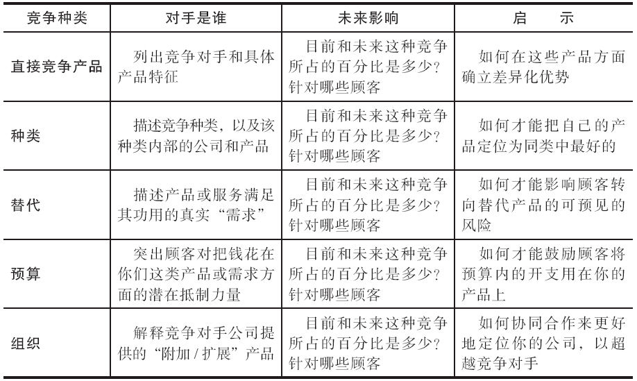

注意，不同市场对待竞争性供应商的看法是不一样的，因此产品经理需要根据市场-竞争者组合的重要性来确定自己产品最佳定位。有时候，需要制定不同的战略。例如，包装消费品产品经理可能需要针对消费者层面直接竞争产品制定营销战略，并同时在渠道层面（根据不同的价值定位）与其他组织开展竞争。

请记住，顾客在做出某个产品的购买决定时，都会有意或无意地把它与他们认为是竞争对手的产品进行对比。明确谁是顾客认为的竞争对手能为我们了解顾客的价格敏感度提供线索。经常追踪这些关键竞争对手，能发现对方可能迫使你改变定价或营销战略的各种战略变动。我们可以通过多种方法了解客户认为我们的竞争对手是谁。尼尔森（Nielsen）方法可以用来确定变换品牌行为。这帮助我们认清一个竞争行为指标：自己的业务到底输给了谁，或自己从谁的手上赢得了业务。另一种方法（除了用在消费品方面，还可用在服务和企业产品方面）是相似性评估。运用这种方法，给顾客提供产品或产品线索（如产品文献或者在3寸×5寸见方的纸牌上的产品名称），并让他们根据相似性对产品进行分组。

另一方面，顾客把你所放到的竞争集合可能与你所希望的不一致。你也许希望自己被看做是高端或低端竞争者，或者只是利基市场中的一员。在这种情形下，你需要自行审查你所处集合中的公司，并确定你是否能够改变你的顾客对你的认识的定位，或者你是否需要增加一个新的品牌。加州葡萄酒行业内就有这么一个例子。格伦·艾伦（Glen Ellen）和嘉露（Gallo）决定从低价葡萄酒转向增长更快的优质酒分区。嘉露通过创建一个新的商标—香叶（Turning Leaf），实现了转型，并按优质酒零售价来定价。格伦·艾伦则试图不引入新商标就实现转型，他专注于品牌的传承、蜡封以及提升产品质量。[[5]](part0011.xhtml#ch5-back)两个案例中，两种葡萄酒都在更高的价格点上与新对手展开竞争。

不论你所处何种情形，一定要降低你需要持续获得其信息的竞争对手的数量到一个可控范围（这个可控的少数可能会不断变化，因为新竞争对手不断加入，也会有退出市场的，因此不要担心变化，因为条件发生了变化）。不在可控少数范围之内的竞争对手，则应定期或必要时对其开展研究。

#### 需要了解什么

并不是所有信息都同样重要。对手的竞争优势是什么？了解竞争对手哪些方面的东西可以帮助我们保持自己的竞争优势？如果我们的竞争优势在于交货方面，那么只与对手推行同等水平的交货标准，可能会危及我们继续保持这种优势。如果差异化优势在于先进的技术支持，我们需要密切关注竞争对手所拥有的、可能会对我们的地位造成负面影响的技术支持活动。我们的目标是避免可能导致与对手开展价格竞争的突然变化。如果真是这样，我们就容易理解为什么很多产品经理这么在意获取竞争对手的价格以及成本信息了。（记住，如果我们所能获得的唯一竞争数据是价格的话，我们可能会被迫开展价格竞争。）

很多竞争价格在公共场所就可以获得。除了封闭式投标之外，多数公司能从贸易展销会、销售人员、共同客户或者互联网上获得竞争对手的价格清单。尽管这些可能不是顾客所支付的“真实”价格，但我们仍然可通过持续跟踪价格清单，并寻找各种价格变化来收集信息。所公布价格的变化应引起我们在这方面开展一些额外的评估活动。价格变化是不是与其他因素有关，如组织重组，或者生产能力的变化？这些因素通常是战略转变的部分内容。

有多种因素出现就表明需要对战略做出调整：管理层的变动、生产能力的变化或者企业宗旨的变化。下面我们具体分析这三个因素。

首先，来看管理层的变动。如果竞争对手产生了新的管理团队，这个团队可能指明新的发展方向（旧的管理团队因被董事会解职时，情况尤其如此）。对新管理团队的要求可能是，重现他们在前任雇主那里所获得的成功。对新管理人员在其之前的组织中所执行的战略方向进行分析，我们就能够了解他们可能会在新公司推行的类似战略。

其次，生产能力的变化可能来自于新的区位变化、研发方面的额外投入或者增加配备了人员。通过对来自于行业刊物、贸易协会、招聘广告以及个人资源方面的信息进行拼接处理之后，我们就能预测到，这种变化可能对我们竞争对手的未来战略造成什么影响。招聘广告不但提醒我们，竞争对手的战略在未来人员配备方面有什么要求（如在某个特定科学领域的能力，或者更加强调客户服务），而且它们还提供了有关公司方面的重要知识，因为它正努力向潜在员工“推销”自己。

最后，公司宗旨的变化也能给我们指示公司新的发展方向。例如，把公司宗旨的措辞，从“成为美国最好的以客户为导向的地产公司”改为“成为美国最好的以客户为导向的地产服务公司”，这样做就突出了新战略强调服务的重要性。

监控特定客户群的活动。竞争对手可能给大客户提供特别激励。促销闪电战可能表明，对方重新强调了某些产品或市场分区的重要性，或者它们可能企图直接从我们手中拉走某个关键客户。

最重要的长期信息来源也许就是销售人员。销售人员最直接接触顾客，拥有有关竞争对手最为真实和永久的客户反馈信息。但是，由于他们的主要工作是销售，让他们参与收集竞争对手情报的时候，一定要非常谨慎，这一点很重要。

要成功获取来自销售人员的信息，你必须向销售代表和他们的经理证明，这种做法对他们也有价值。这样就意味着，有必要做一些准备工作。了解已经可以从公司内部获得什么信息。财务报告、利润表以及销售记录都可以用来分析、找出需要警示的地方，以及未来的发展趋势。在某个领域的一次竞争动作可能看起来无关紧要，但如果增加从其他领域获取的信息，或者把它看做更大的全局性推广战略的一部分的时候，情况就大不一样了。把这些发现推广到一些公共数据中（各种已经出版的资源和行业分析报告），你也许就能够给销售人员提出建议，帮助他们更好地与对方开展竞争。

做了一定准备之后，就需要与销售人员面对面接触了。（任何公司内部邮件、电子邮件或者命令都不能取代这个会面。）花些时间做做自我介绍，让销售人员了解自己，同时也了解一下他们的客户。承诺与他们分享重要信息，帮助他们开展销售，了解他们的世界。通过开展这种信息分享，让他们知道“这里面的东西，什么是给他们的”，你就能诱导出销售人员的互惠行动。做好准备，通过销售行政部门、营销部门或者协调工作所必需的其他部门来开展工作。

让销售人员相信，与你分享信息确实能帮他们在工作上取得更大成功，之后，你就需要做出决定，确定收集与传播信息的最佳方法。说服销售人员把每一份与你的产品有关的价格清单、客户意见或竞争对手资料都转发给你。

销售人员和其他员工能在贸易展销时收集到很好的竞争情报，只要你要求他们做，或给他们提出具体目标。列一个你希望在展销会上调研的问题清单，给展位工作人员规定“任务”。例如，你可能希望了解竞争对手A所宣布的降价信息，以及竞争对手B提出的产品发布情况和竞争对手C在促销定位方面的变动。把每一个问题布置给一个人去调查，不论其是展位工作人员还是展馆巡视人员。一天或展会结束时，对他们进行回访，了解信息收集情况。

新产品销售培训可能是另外一个不错的地方，可以为未来的信息收集准备好人员。培训的部分内容可包括一定的解释，说明为什么产品经理需要市场情报，以及该情报有什么作用，提供这些情报能如何帮助销售人员。标准的情报报告格式可融入财务报告中，设计到局域网内的一个菜单系统中，或充当支出报表的一部分。因为该信息通常会传到销售管理部门或销售行政部门，因此需要建立一定流程，把有关产品的数据复制一份，发送给适当的产品经理。这类有用并需要传送的信息包括如下几个方面：

·竞争对手的新产品的发布情况；

·有效和无效的产品销售方式；

·竞争战略的变化；

·顾客对产品的反常用途，尤其是在这些用途显示一种潮流的时候；

·可能影响公司战略的有关市场趋势的看法。

#### 如何才能把片段信息整合在一起

竞争情报收集可分成几种类型：持续性收集、周期性收集、基于项目需要而收集。持续性竞争情报收集关注需要持续监控的、最直接的竞争对手（或行业、技术等），应包括可能对你在市场上竞争能力造成最大潜在影响的外部环境的各个方面。从销售人员那边获取的信息流（如前所说）是持续性收集信息的一部分，但我们不能止步于此。确定了所需信息，以及想要监控的杂志、报纸和网站之后，建立一个竞争情报警示程序。很多专门服务公司，如Factiva、Dialog及Lexis/Nexis等，都提供电子警示。不过，如果公司没有订购此类服务，可以转向运用谷歌公司，定制更加基本的预警服务。

尽管你不能在全部时间监控所有的事情，你仍应对非直接的竞争对手或趋势开展周期性竞争情报收集活动，确定是不是有什么变化发生。根据所处的行业，周期性竞争情报收集活动可以每月开展一次，也可以每季度或每年开展一次。周期性情报收集的价值在于，可能发现某些影响持续数据收集活动的优先顺序的意料之外的变化情况。

看其名称可知，基于项目需要的竞争情报收集是根据具体需要而开展的，类似于营销调研项目。当连续性或定期性的数据收集发现了某些预料之外的情形，或者在准备发起一个新产品，或者需要为某个新战略提供特别的见解时，就有必要对该问题开展专门且深入的调查分析工作。此类情报收集活动中可以运用的一个技术就是战争游戏（[www.fuld.com](http://www.fuld.com)中有一些简短的战争游戏视频资料）。为了确立这种方法，可能需要来自销售部门、营销部门或公司其他员工的帮助。选择最重要的2~4个竞争对手，把每一个竞争对手分配给由3~6人组成的小组。这样，每个小组就“变成”了指定的竞争对手，并且收集资料，让自己像竞争对手那样考虑问题。此后，召集各小组成员，分享在该游戏角色扮演中所获得的见解。

所有这些竞争情报收集活动的主要目的就是，预测竞争公司未来可能采取什么行动。如果在寡头竞争行业内参与竞争，要关注的就是单个竞争对手的策略。他们会怎样对你参与的提案申请（RFP）采取什么反应？他们会在什么时候推出更好的产品？此外，如果在“完全”竞争的环境中与大量竞争对手开展竞争，可能就要更加关注本行业的宏观发展变化情况。

竞争情报收集要求权衡竞争对手数据和客户数据的作用。过于关注某一方，特别是因此而忽视了另一方时，风险就会很大。真正做到以市场为导向，双方的信息都是必要的。只停留在收集市场导向的数据根本不够。产品经理必须运用该信息来改进他们的竞争战略。否则，就像马萨诸塞州韦尔斯利的核子研究公司（Nucleus Research）的研究副总裁丽贝卡·韦特曼（Rebecca Wettemann）所说的那样，“就会像拥有一个有数百万美元的银行账户，却没有自动取款卡一样。如果你不能取出钱来，并且不能让它为你服务，那么它就根本没用。”[[6]](part0011.xhtml#ch6-back)

在最根本的层面比较产品特征的相对优势和弱势，可以帮助产品经理明确定位战略、营销沟通方法以及销售支持材料。如前所述，苹果公司的iPod正面对来自无线网络的竞争。尽管在最为“纯粹”的意义上它们不是直接竞争对手，可它们对iPod的未来竞争能力构成潜在威胁。因为存储、压缩和电池寿命等方面的技术进步，用手机和其他移动设备接收和存储音乐变得更加容易。

制药公司正面对各种竞争挑战，它们努力设想产品专利到期之后，基因技术出现时的情形。产品经理需要监控与基因产品生产商有关的各种竞争情报。然后，他们就能构建模型（用Excel表格），预测在多种变化情景中，在其销售或市场份额损失并转移到竞争对手那边之后，会产生的影响。他们可能还在预测，这些情形真实发生的可能性。

市场和客户情报

现在我们转向信息收集工作最重要的一类：关于市场细分以及客户的信息。细分市场与明确客户的能力，已随技术的发展变得越来越复杂了。因此，产品经理不能再认为自己的工作就是销售产品。相反，他们的工作是帮助客户购买产品。由于不同客户有不同的需求和期望，产品经理必须表明差别在哪里，以及这些差别在他们的计划中的重要意义。

有效企业战略的基石是吸引和保持住高利润客户的能力。应该更加关注客户人数的增加，而不仅仅是产品销量的增加。产品经理必须能明确地了解与解释他们的产品的市场。这些市场可包括现有客户和潜在客户、单个客户和团体客户或市场分区，以及使用产品的个人和影响该产品购买的个人。这一部分关注分析市场并制订计划以实现利润最大化时所涉及的问题。

预备性客户分区问题

市场分析是指为某个产品或产品线而对当前或潜在客户进行的研究。首先问问自己有关现有客户的一些基本问题。

1.是不是存在一个很依赖该产品的群体？在这个群体中，真正买家占的百分比是多少？

2.主要目标市场是还在增长、处于稳定阶段，还是正在萎缩？

3.客户在哪种情况下购买产品？

4.产品的地理覆盖范围是如何受到限制的？为什么？

5.国内客户在全部客户中占百分之多少？国际客户呢？

6.是不是多数客户是新客户或是回头客？

7.客户是不是最终用户？如果不是，能够获得有关最终用户的什么信息？

8.你的客户是比较超前、传统还是消极？

9.客户对过去的价格变化的敏感程度如何？

10.客户基础是由少数几位大客户还是由众多小买家构成？

如果你还没有提过这些问题，请把当前或潜在客户进行分类或细分。客户分区是有共同人口学特征、共同需求、共同心理特征或共同用途/使用方法的客户群体。细分过程让营销人员更加了解客户，开始关注更小的客户群体的要求。尽管网络沟通努力做到更加接近一对一市场营销，但多数产品开发需要最小市场规模能超过一个分区（根据不同的市场细分参数），才能实现产品的盈利。

把整个市场根据不同原因分成多个次级市场很重要。首先，这样做可以让我们对整个市场有更好的了解，包括客户如何购买，以及为什么购买。其次，这样做确保了更好的资源配置，因为这确保了对特定分组所寻求的福利有了更好的了解，使得把竞争性特征或服务融入所供应的产品中去成为可能。最后，市场细分让公司能够发现隐藏的利基市场，利用好各种机会。

细分市场需要运用所处行业最合适的标准，如表4-2所示。消费品公司会运用诸如年龄和家庭状况之类的人口学变量，或者诸如态度和生活方式之类的心理变量。分组的目的，是为了发现他们可能用来应对产品战略的方法的相似点。当然，要记住，千万不能夸大个体之间的差异性。对此，利兹·托利斯（Liz Torless）指出：

理解人们在所作分类决定以及他们所选品牌方面是什么把他们彼此联系起来，要比确定他们是多么不同更能揭示问题。通常，是情绪和思维模式，而不是他们的人口学和心理学特征把他们彼此联系起来。来自多伦多的19岁女性自行车速递员与来自萨斯喀彻温省的58岁男性农民根本没有什么共同的地方：不同的人口学特征、完全不同的生活方式以及可能不同的价值观，但他们都喜欢卡夫晚餐（Kraft Dinner）、支持新民主党（NDP）、在折扣店购物、上网获取新闻，以及都去拉斯维加斯赌博。[[7]](part0011.xhtml#ch7-back)

表4-2 细分标准

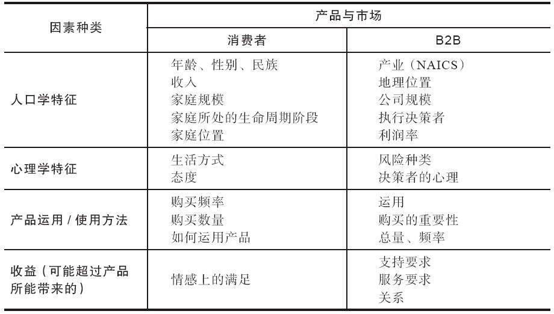

工业产品公司运用北美工业分类系统[[8]](part0011.xhtml#ch8-back)、公司规模或者部门头衔进行市场细分。很多公司把产品的最后用途作为市场细分的标准，例如，尼龙产品经理可能把市场细分为诸如男士衣服、轮胎和填充物之类的终端使用小组。多数B2B行业的市场可分为多个层次。例如，医院的产品供应商可能首先考虑不同公司种类，如教学型医院、社区医院、专科医院、家庭健康企业、门诊诊所、基金会或者公司资助的医疗机构；其次，医院内部也有市场分区或者业务单元，如肿瘤科、儿科、遥测医学科、心脏服务科、行为生活方式科、普通外科、产科、病例管理科、术后康复科和急救科；最后，部门头衔可能代表不同的需求，如内科医生、护士长、护士等。值得注意的是，同一职能部门内部不同个人的不同的个性和兴趣，可能表现出对产品和服务的不同层次的兴趣。

服务公司运用需求强度、风险种类或与公司的距离这些标准进行市场细分。生活方式存在差异，这也可作为市场细分的基础。爱玛克（Aramark）在对其医院饮食服务的客户细分开展研究时，根据个人的见解把卫生保健工作者分为五个类型。银行也针对客户建立了购买倾向模型。（见企业案例4-3“服务业的市场细分”。）

企业案例4-3

服务业的市场细分

爱玛克花了好几个月研究顾客，试图改进其零售食品部门。本次研究包括多个典型人群，访谈了700多位卫生保健员工，并发出了40000份客户看法调查表。基于本次研究结果，爱玛克把卫生保健工作者分成了五类：健康型、忠诚型、自带型、充电型和逃避型。

健康型：他们吃什么的决定因素是健康。

忠诚型：对医院的饮食表示满意。

自带型：自带午餐人群。

充电型：边吃边走人群。

逃避型：因对医院饮食持负面观点而不在医院吃饭的人群。

作为研究的一部分，爱玛克先预测了归入每个细分市场的顾客的百分比，确定了对目标客户的排序，并发现了通过制定战略来实现这些目标的最好方法。心理分区所用的方法，比标准的人口学方法更有利于改进产品的开发和营销沟通。

越来越多的社区银行开始根据有别于传统的人口分析方法的多种标准对客户进行细分。这些银行通常在自己的数据库中分析高利润的客户，并把他们的信息与外部资料进行匹配，从而建立潜在客户模型。

五年前，联邦商业银行（Commercial Federal）开始运用预测模型，根据顾客购买某款产品的倾向给他们打分。如今，每月邮寄促销单（每个月大概33次，对从支票账户到房屋净值贷款等各种产品进行促销）都是根据基于诸如到期贷款或客户存款周年纪念等因素所得出的倾向得分投寄的。通过分析购买过某些种类产品的客户特征，这样的市场细分营销真的很有作用。为了确定需要房屋净值信用额度的潜在客户，需要运用某个程序来核查数据库中的成千上万名此类客户。然后运用标准方法，开发一个模型，用来识别拥有相同特征的潜在客户。

同样，电器元件分销商鼎联公司（Tri-Tech Corporation）决定根据客户如何决定从该公司购买的信息，对客户进行分区。“现在，现场代表去拜访希望亲自体验销售过程的客户；电话销售人员处理希望通过电话或者物联网订购商品的客户。”这类分区过程尤其适合分销商的需要。

资料来源：“Aramark HMS：Hospital Foodservice Customers Ready for Their Close Ups，”Nation’s Restaurant News（April 4，2005），p.16.Chris Costanzo，“Finer Customer Segmentation Paying Off，”American Banker（December 14，2004），p.6A.Andy Cohen，“Addressing Their Needs，”Sales and Marketing Management（July 2004），p.18.

区分了拥有不同需求的细分市场后，考察每个细分市场中产品的表现。平均订单规模多大，每个细分市场的销售额是多少，或者每个细分市场所创造的收益有多少？表4-3中的例子呈现了四个细分市场。谈判者分区由拥有特殊需求的最大公司组成，它们因为巨大的需求而拥有讨价还价能力。对6个购买标准的重要性按1~5级进行评级，其中1表示“必须”，5表示“不重要”。我们发现，价格的重要性水平为2，品质/特征为5，发货为3，安装为5，营销/工程支持为5，销售覆盖为4。公司根据行业数据预测，该分区的总销售额为8900万美元，行业平均订单为1.5万美元。该分区中所占的份额为13%，市场平均订单规模为1500美元。对全部信息的研究表明，公司最为成功的是在大量订货分区和解决方案分区。这两个分区加在一起，占了大多数市场份额，并且订单规模也大于行业平均值。

表4-3 根据关键购买因子的市场细分

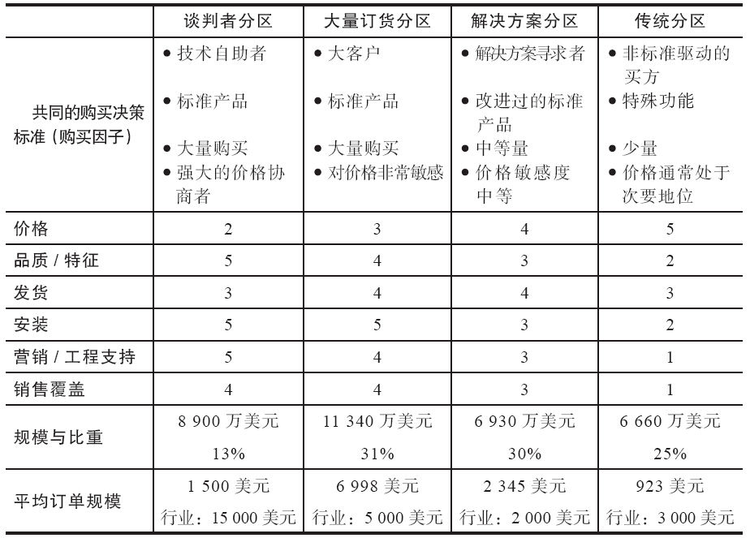

列出市场分区的潜在方法，包括旧的和新的市场分区法，下一步就是把分区的数量减少到可控水平（3~7个）。去掉公司没办法服务的分区，不管是什么原因。然后用是否与公司资源相适应、长期战略、到达成本以及服务风险等指标对剩下的分区进行研究。对各分区进行排序，保证最大部分资源用于最重要的分区。

产品经理解决这个问题的一个方法是同时评估不同市场的吸引力，并确定公司满足那些市场需要的能力。不是所有的客户都是平等的，使劲实现所有客户的忠诚对公司的健康发展有害无益。产品经理必须确定哪些客户能提供未来最好的投资回报。对于大众产品（如快速消费品），共同的做法是确定大型用户，并制订计划吸引住他们。客户信息情况包括标准的人口变量，如年龄、性别、收入、位置、婚姻状况、家庭规模以及心理特征，如对自我的认识和期望的性格特征。对于工业产品（如资本设备）要求特别的用法或用途的客户，可能比其他客户更有利可图，因此他们被视为“最优”客户。

市场和客户分析过程

我们用一个称为进步食品服务公司（Progressive Foodservice）的虚构公司来做个例子。该公司把各类食品卖给两大类客户：食品服务分销商和食品服务运营商，每类客户都可以继续细分。食品服务经销商有普通分销商、专业分销商和采购集团。食品服务运营商有商业运营商（寄宿、快餐、饭店、咖啡厅、餐厅和零售主机）和非商业运营商（卫生保健机构、教育机构、航空公司和自动售货公司）。我们从最高层次开始细分，第一步是哪些需求是这些分区中独有的。假设普通分销商和采购集团偏爱集中采购、大量购买以获得一个折扣价，并且有专门的送货要求。专业分销商拥有特定的产品线或服务特定类型的客户，偏好独特的产品和可能的销售支持，以服务他们的客户。

对于通过快餐店运营商而不是分销商实现的直接销售，最终客户也有不同的需求。商业集团内，快餐店要求食品产品必须及时发货，价格必须尽可能的低。其余的商业运营商（不同程度上）希望凭菜单来保障和表达意图。非商业运营商偏好持续保持库存充足并要求较长的保质期。研究了这些需求之后，进步食品服务公司的产品经理重新把市场分成五大类需求分区，并观察两个方面的内容：（1）作为整体这些分区的吸引力如何；（2）在应对各分区需求时，公司是不是拥有竞争优势。

为了确定市场吸引力，产品经理研究了市场规模（每个分区顾客的总数）、增长率、竞争力量、客户的价格敏感度以及类似变量。然后，产品经理用数字1~5对各分区进行打分：1为最没有吸引力；5为最有吸引力。普通分销商（分区A）得3分，专业分销商（分区B）得4分，快餐连锁店（分区C）得2分，商业运营商（分区D）得3分，非商业运营商（分区E）得1分。注意：这时客户与非客户之间的界限有些模糊，我们不想把分析局限于现在发生的事情，而是考虑了增长的潜力。把整个市场上每个分区的规模、购买量以及增长率与现有每个客户分区的规模、购买量和增长率进行比较。分析时要问各种问题。每个分区对产品的需求量是多少？产品的市场渗透性如何？分区中只购买竞争产品的潜在客户有多少？为什么他们只购买那些产品？市场份额是增加了还是减少了？有没有进入行业中利润率最高的分区？表4-4对上述信息做了摘要。

表4-4 进步食品服务公司市场分区吸引力评级

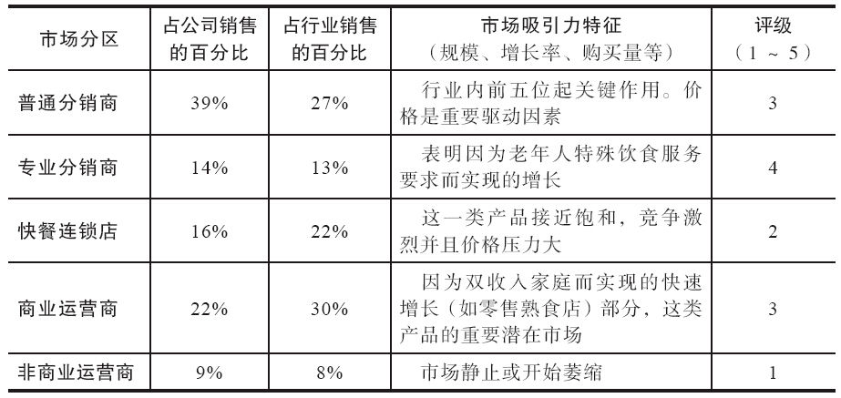

为了确定进步食品公司在处理特定分区的需求时是否具有竞争优势，产品经理诚实地评估了公司的能力，并对满足分区需求的能力打了分。还是运用1~5分的量表，1分表示存在强大竞争对手且对方拥有满足特定需求的巨大能力，3分表示与竞争对手一样，5分表示明显好过竞争对手。进步公司的竞争性服务能力得分如表4-5所示。“满足需要的要求”一栏凸显了进步公司需要做出的改进或改变，来满足所确认的5个分区中每一个分区的需要。这个得分表明了进步公司与竞争对手相比，如何才能很好地满足需要。

表4-5 服务能力评级

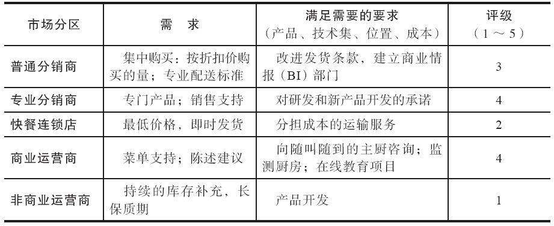

合并市场吸引力和服务能力的信息得出了图4-3所示的坐标。例如，普通分销商分区的市场吸引力得分为3，满足需要能力得分为3，这样它正好处于坐标的中间位置。

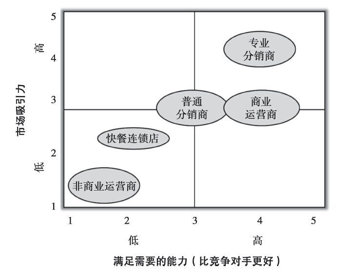

图4-3 进步食品服务公司市场吸引力坐标

如果其他保持不变，那么最好的目标市场将位于右上象限，在这里，公司拥有极具吸引力的客户分区，以及服务该分区时具有很强的竞争优势。当然，也有其他的担心。首先，也许没有哪个市场分区会完全落在这个象限。这样的话，公司就将目标定位在既有的最有吸引力的分区，并明确需要开发出什么产品以及培养什么技能，让这个分区成为恰当的分区。其次，右上象限内的分区与现有的其他分区相比，也许未来的利润潜力较小。为了更加形象化地表示出这种情形，可以调整圆圈的大小，以体现这个象限内的潜在机会。再次，右上象限的分区可能已经被大公司占据，再增加资源投入，所能获得的收益都相当有限。这样的话，分配一定的营销资源来保留客户比较合适，将更多的资源转移至其他更有希望的市场分区。为了让该坐标内容更加形象，把圆圈画成饼状图，用来区分已有市场和未来市场。最后，有些市场分区从绝对量上看已没什么吸引力，事实上，如果竞争对手没能很好地开发，也可能相当有吸引力。

为编辑这类信息，需要同时参考内部信息资源和二级（已出版的）信息资源。内部资源方面，销售记录应与人口特征关联起来，确定哪些变量与利润率的联系最为紧密。公司规模、地理区位、应用种类以及任何其他变量是不是能帮助“预测”销量？变量确定下来之后，可以把它们外推运用到非客户身上，来预测市场及其增长潜力。在这个分析步骤上的“待交付的”就是产品信息手册中的“知识章节”（我们将在第5章讨论这个问题），它总结顾客忠诚度的决定因素和确定有利可图的客户分区。

值得注意的是，由于公司需要不断地设计和实施新的服务项目来满足客户的预期，所以这个过程通常会变得更加复杂，成本也通常会随之增加。传统成本会计方法不能很好地识别服务成本方面的差异。它们不能识别为应对具体市场分区的需要而形成的生产完成之后的某些额外成本。重要的是要认识到，成本不是不可控的，而是由某些可以管理的、可测量因素导致的。因此，理解市场分区报告和因活动而产生的各种成本的能力，应该成为产品经理工作技能的一部分。

这些信息编制完成之后，产品经理就能够创建此前为进步食品服务公司描述的可视化坐标。该信息可用来识别主要和次要目标市场、市场的需求，以及公司必须处理好才能满足需要的各种问题。注意，前面例子模糊了渠道客户和终端客户的区别。尽管这个例子不是“纯粹的”或者“理想的”，这可能会是个真实的情形。有些产品经理（尤其是消费品产品经理）将渠道看成自己的客户，而将终端用户看成消费者。在很多情形中，理解渠道客户的需求和期望，对企业的生存至关重要。例如，保洁公司就极其依赖其与沃尔玛（2005年为宝洁公司贡献了17%的销量或者87亿美元的销售额）的关系。两家公司共享数据和销售计划；为提高效率，这两家公司还把计算机系统也连起来了。

留住老客户与获取新客户之间的平衡

对目标市场作全面分析之后，下一步就是考虑如何实现客户资产的增值（见图4-4）。我们可能需要采取以下一种或一组行动：（1）增加现有客户的利润率；（2）吸引未来可能带来高价值业务的新客户；（3）“放弃”低潜力客户。要增加现有利润率，首先要在高价值客户身上投资。额外销售和交叉销售（有时甚至是其他产品经理的产品）如何才能增加客户资产？（不能让产品或品牌管理的侧重点妨碍这种做法。记住，品牌本身并不创造财富，客户才能创造财富。）[[9]](part0011.xhtml#ch9-back)应尝试改变市场上的什么行为才能增加利润率？需要改变自己公司的什么行为才能增加利润率？

数据库项目能帮助产品经理弄清楚特定市场分区和二级分区的需求。产品经理应努力确定必要的行动，让现有客户增加他们与公司的生意，让“好的”客户变得更加忠诚，以及让二级分区客户转变为主要客户。然后通过利用灵活的制造和发货技术，产品经理能够提供为每个客户群体量身定制的划算的产品—产品特征、价格折扣、服务安排以及购买保修等都做了精心的考虑。工业公司、服务业公司以及批发商和零售商之类的销售公司，都在运用这种方法。例如，加拿大连锁杂货店分析过为大约1.5万个家庭提供服务、年销售收入2500万美元，以及经营利润率2%的“典型”商店后，发现了如下信息：

第一，公司根据商店周围的客户基础进行市场细分：主要买家（占杂货店80%的杂货生意）、二级买家（购买杂货方面的钱有10%~50%花在这里）以及非买家。

第二，公司计算了对现有客户行为信息微小调整之后，对商店利润率的影响。假设商店成本构成保持不变，客户在这里额外花费每一美元的边际收益率，是商店净利润率的10倍。于是，公司发现，只要众多客户中有一个在行为上作些微小的改变，利润就会明显增加。如果把客户基础扩大到主要客户的2%，商店就会增加45%以上的利润。只要把200位二级客户转变成主要客户，就能增加20%以上的利润。每多向一位客户出售一份农产品就会增加40%的利润。说服每位客户用两个本店品牌取代两个全国性品牌，那么他们每次购买会增加55%的利润。

但是，公司过去并没有直接注意到这些机会，相反，却像大多数其他组织一样，一直关注着更加传统的目标，如生产率、市场份额和质量。结果，他们忽视了优化客户价值交易行为就能缩小与全部潜力之间差距的这种可能性。[[10]](part0011.xhtml#ch10-back)

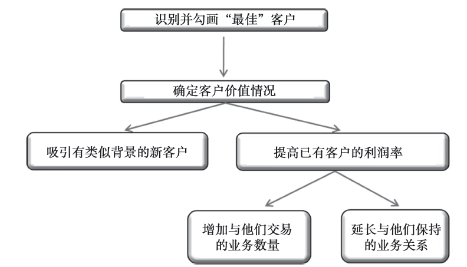

图4-4 客户资产流程图

主动放弃客户

很多产品经理面对的一个特殊难题就是，如何对一个不给公司创造任何利润的客户（或是不创造利润的客户群）说“不”的问题。所有公司都会有要求特殊服务（而不产生额外的利润）、对任何东西都要最低价或者要求修改基本的产品或服务来满足自己独特需求的客户。这些情形的任何一种，哪怕只出现一次，公司也只有很少几个选择：提高价格、降低对该客户的服务成本，或终止与该客户的业务关系。

提高价格来补偿所提供的额外价值是最显而易见的解决办法，但这种做法却很难实现。客户一定能察觉并相信产品的竞争价值，如果某个特别客户不是目标市场的一部分，可能不存在该客户需求和公司能力之间的匹配关系。由此，到了第二个选择：降低服务成本。这个时候重要的是，产品经理要清楚了解由该名客户所“造成”的额外成本是多少。表4-6是个示范表格，包括由该客户造成的直接和间接收益以及成本。只有了解真实成本才能采取降低成本的行动。

表4-6 客户利润率分析表

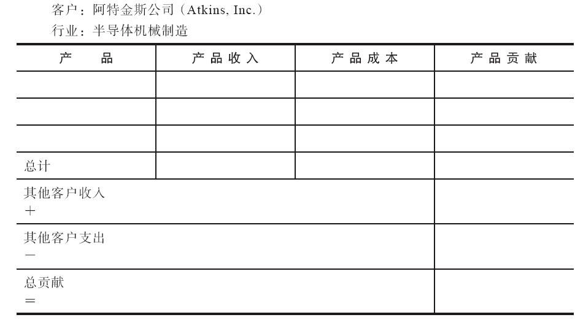

终止与该客户的业务联系可能是最后却又是必须做出的选择，通常是通过改变服务政策或提高价格等行为间接实施的。不过，在这之前，还得先问几个问题：该客户是不是只有成为顾客，才能为公司带来业务？该客户今后会不会成为公司的战略客户？如果业务关系终结，这位客户是不是已经承担了需要分配到其他地方的管理费用？先对这个情形做一次真实的评估，并做好在必要时说“不”的准备。

事件与趋势

产品经理需要关注很多外部性和趋势。社会趋势以及不断变化的风俗习惯、政治动荡、宏观经济的影响、环境事件或环境变化、监管合规问题，以及大量其他趋势都可能影响产品的成功。产品经理，不论是否参与新产品构思时的头脑风暴过程，或是为已有产品设计新颖的上市战略，都必须擅长发觉并利用好各种趋势（或将任何负面后果最小化）。

经营中我们太容易迷失于日复一日的救急工作，或者忘记环顾一下四周，看看我们周围都发生了什么变化。因为，发现趋势可能需要全心全意的关注，为此我们应该确定，需要积极寻找的是哪些趋势，以及对哪些趋势需要选择性进行评估。创建几个文件夹（虚拟或真实的），贴上标签，标明你需要追踪的关键趋势。例如，技术产品经理可能跟随虚拟化过程、云计算和商业分析方法，食品产品经理可能会追寻肥胖症、营养成分标示以及监管趋势。有时候请同行来帮帮我们也是有益的选择。建立一个趋势分析团队（TAG小组），请每个同事向你提供与某个特别趋势有关的信息。在任何情况下，一定要创建好文件夹标签，比如一个专门为杂感和思考准备的、标有随机分析字样的文件夹。把各种文章、顾客数据、渠道和销售见解、各种下载资料，以及杂感装到这些文件夹里。然后养成习惯，经常来看看这些信息。

监控人口趋势和变化也能发现对新产品、语言调整，以及改变营销战略的需要。尽管人们通常认为最新消费品应关注年轻人，但很多公司已经开始接触年纪更大的成年人。宝洁公司确立了大约30种可以直接面向年龄在50岁或以上的人群销售的产品，索尼公司已经增加了广告投放，让高端工具对于50~64岁年龄段的人群更有吸引力。[[11]](part0011.xhtml#ch11-back)全球人口老龄化还导致了对传统汽车设计的实质性挑战，日本人已经开始整合这些特征，解决这些问题（见企业案例4-4“日本车：老年人的选择”）。

企业案例4-4

日本车：老年人的选择

随着几乎所有发达国家人口中老年人口比重急剧上升，专门为老年人设计、满足老年人需求的产品和服务的需求量必将日益增加。在日本，65岁以上的老年人大约占总人口的1/4，他们已经开始面对这个问题。东京第31届国际居家护理与康复展览会上，多个品种的“老人车”就陈列在展示成人尿片和家用电梯的柜台旁边。

尼桑汽车公司的分公司展出了一款连接厢式货车的轮椅坡道，和为更小汽车设计的产品，包括旋转座椅和用来把轮椅吊进和吊出车厢的电动吊机。丰田公司正在开发“无障碍汽车”，并已经开发出了汽车座椅，该座椅同时能当轮椅使用。福特公司甚至都已经开发出了限制运动幅度的全身连身衣，帮助设计师理解老年人的各种限制。这种连身衣装有玻璃，用来模拟弱视的效果。

目前，这些类型的交通工具在市场上只占全部已销售汽车的比重不到1%。其中，很多是为残疾人改装的车辆。因为存在产品责任方面的担心，大多数汽车公司正采取谨慎等等看的态度对待这个问题。但是，人口发展趋势真实存在，必将会对未来产品的需求造成重大的影响。

资料来源：Adapted from Jathon Sapsford，“Japan’s Auto Makers Ply the Aged with‘Elder Car’s Options，”Wall Street Journal（November 5，2004），pp.B1-B3.

站在潮流的前沿绝对重要，因为这会影响到你的市场、产品、竞争对手和技术。和任何时候一样，做出先后顺序的安排会非常有帮助。按概率和重要性对趋势进行分类（见图4-5）。概率是指趋势在你当前规划期限内发生的可能性。重要性则指趋势可能对你的产品战略造成的正面或负面的影响。首先要关注的是发生概率最高、最具重要性的趋势。

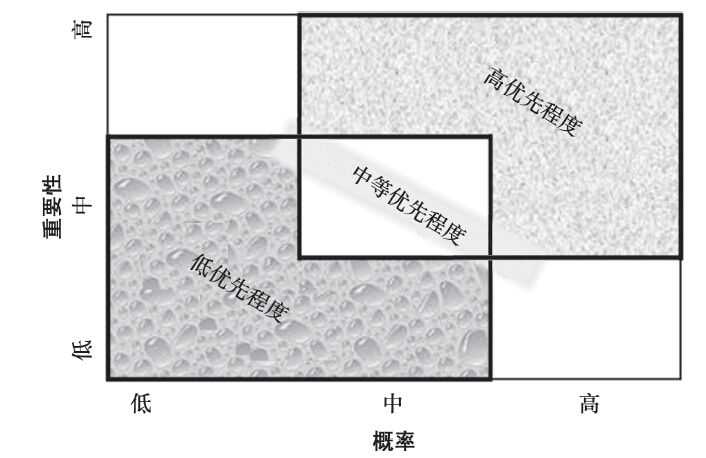

图4-5 趋势评估坐标

研究项目

收集客户信息通常是营销研究人员的职责，因此这里只作简单介绍，解释一些基本定义或术语。我先区分初步研究、联合调研和次级研究。初步研究是指为明确的目的收集信息而采用的普查、典型群众、观察和其他方法开展的研究工作，需要专门为某个特定目的选择一个样本并设计一份问卷。联合调研通常指公司在某个通用研究中插入一两个问题，并“共同承担研究成本”的研究。这样，研究样本和问卷不是专门针对公司的目标选择和设计的，只有当认为它们“够接近”公司的需要时才这么做。联合调研还包括运用诸如由尼尔森之类的公司编辑整理的仓库与零售数据。次级研究则是指对普查数据、贸易协会统计数据以及其他先前整理和出版的数据进行的分析。

研究还可分为定性研究、定量研究或实验研究。定性研究，如分组座谈、人种学研究和案例分析，与一般问卷调查相比，它能提供更为丰富、深入的答案和见解。格里·卡茨（Gerry Katz），应用营销科学公司执行副总裁，曾录制过一份4分钟长的有趣视频，并上传到Youtube上，介绍了人种学方法或观察研究方法。在这份介绍性资料中，他描述了如何通过观察护士对透析机的运用，发现了一个后来转变成非常成功的产品特性，可是却没有被表达出来的需求。

此外，定性研究的优势是靠牺牲其代表性才获得的，其研究结果不可能通过统计方法推广到全部客户。由于样本规模较小，对于整个群体不可能具有代表性，而且提出的问题容易发生变化也对统计分析结果的可靠性提出一定的挑战。

定量研究实质上是定性研究的对立面。它要求措辞严谨的封闭式问题和真实概率抽样。这两个要求是在某一置信水平上，从样本中推测全体（样本的出处）的结果所必需的。事实上，多数客户研究同时综合定性和定量研究的一些方面。应该记住，没有所谓的完美问卷之类的东西，因此，即使作概率性研究，也不可能保证完全“真实”地反映现实。

收集顾客信息时，实验研究的使用频率比定性研究和定量研究要低。消费品产品经理可以运用市场测试或商店测试，来确定哪种包装设计或广告信息比其他的更吸引客户。设计市场实验研究时，研究人员努力选择类似的顾客群体（控制尽可能多的外生变量），给每个小组不同的包装设计（或者价格或者信息或者其他变量）。信息的对比测试用互联网更为简单，因为不同处理方法都可以随机实现。测量、比较该因素变化后的反应，将其并用作决策的基础。

网络作为获取“群众智慧”的研究工具已经获得了极大的发展。对现有产品的看法、改进意见、新产品的观点以及有关态度方面的见解都可能触发各种可能的机会，增加客户满意度或公司的利润率。

如果没有足够的技能、资源或资金用来开展全面的客户研究项目，还可以试试其他方法：（1）把整个研究分成多个分别关注最重要问题且更能承担得起的小型项目；（2）与其他需要从同一个客户群体获取信息的产品经理共同分担研究成本；（3）到大学找一个营销研究班级，请他们作为学期项目帮助开展研究；（4）聘请拥有这些技能的实习生开展研究项目；（5）确定二级研究项目（也许由公司内部顾问开展）能否提供必要信息，以扩展你已有的认识。

产品经理还能够运用非正式技术获得很多信息。拜访客户、贸易展销中的交谈、对客户服务代表的建议和评价、用户组织的输入信息、投诉信、产品维修记录、博客、经销商/分销商/代表咨询委员会，以及其他人际资源，都能提供产品改进方面的信息。

内部情报

最后一类情报来自内部数据。对于产品成功与失败的认识、市场营销活动的结果、有关产品与客户的财务报告、对内部流程必要优化方面的认识，以及其他数据都有助于产品的改进。请阅读企业案例4-5“精益产品管理”，了解春季橱窗时尚（Springs Window Fashion）公司实施的精益营销活动，案例中用经优化后的流程来提高产品管理职能。

企业案例4-5

精益产品管理

格洛丽亚·格林（Gloria Green），春季橱窗时尚公司精益营销高级经理，拥有30多年的经验，曾帮助多家公司运用通过连接营销和运营的协同效益获益。她创建并实施过很多成功的营销方案，同时开发出改进程序，促进更好的实践。她拥有多个行业的经验，具备战略规划、市场营销、产品管理、精益营销以及项目管理（从确定目标与可交付的成果，到运用评估与普查方法，以确保让人满意的执行）等方面的专业技能。

在按订单装配的橱窗修饰世界，有很多不同品牌、数百个款式和各种花色，产品经理追踪可在哪里获得什么信息，并把消息传递给需要的人，要花费大量时间。如果有10条不同的产品线，情况就更加复杂了，春季橱窗时尚公司的产品经理每年都要花数千小时来管理数据。而这，只是把数据整合到一起，以便能准确地引入订单登录系统、生成在线订单、预设客户订单登录系统、添加到虚拟装饰师和在线样品集中、添加到价格清单中，以及用来确保样品手册中准确包含各种款式与花色。

春季橱窗时尚公司是一家创新型百叶窗、遮阳物以及遮阳篷的生产商，有巴利（Bali）和格拉博（Graber）两个品牌，它运用新型精益生产流程管理产品，解决了这个问题。开始时，为升级产品线，它收集了各种信息流。它的产品信息收集流程如图4-6所示。

在收集信息过程中，我们规定了产品经理应如何获得、运用并分享这些数据（主要是运用电子表格技术），并因此弄清楚了多个领域存在的浪费现象。

资源未充分利用

产品经理花数千小时处理电子表格中的数据，却没有通过分析数据来增加价值。

过度处理

在电子表格中可用VLOOKUP和Pivot Tables功能来减少工作量，但仍有一定的局限性，因为每个跨部门产品小组成员需要不同信息。为了消除（并不是每次都更新最近的变化的）多个表单现象，我们创建了庞大的电子表格系统。尽管小组成员的电子表格运用技术各不相同，但他们都需要花时间操作表单，以获得自己需要的具体数据。

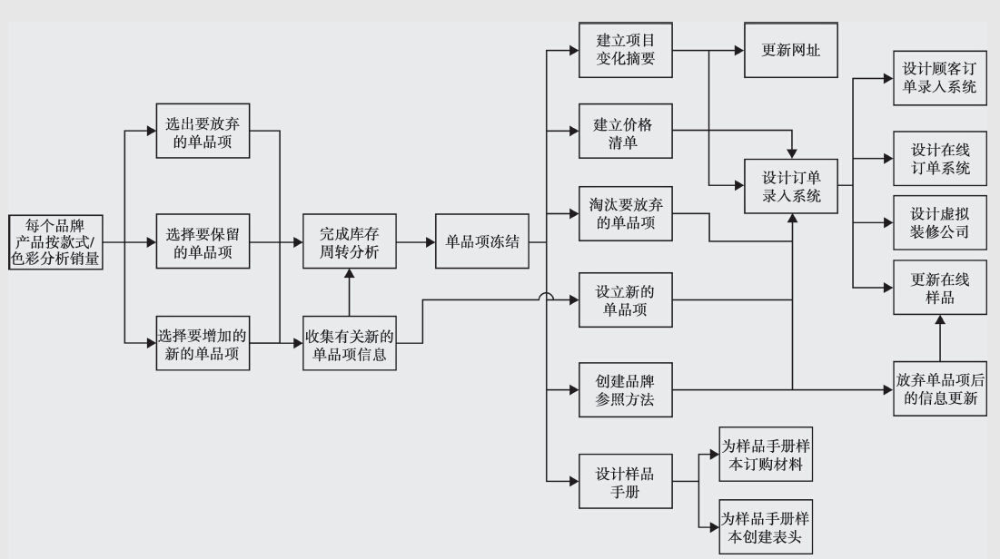

图4-6 产品信息地图

动态变化

只要有一个人在整理数据时出了错误（或者中断了某个链接），就会使所有数据失真。因为这种错误通常不能被及时发现，数据不可能自行恢复原状，通常需要重新创建。

创建的表单过多

每个产品经理都按自己的方式创建产品线表单。小组成员必须琢磨出如何运用每个项目的数据。各种特征、不同功能以及多种选择都根据不同的产品线起了不同名称。这导致了在我们的抽样和商品化材料中需要运用各种不同术语。

瑕疵

审阅一个有300行和50列数据的表单的准确性几乎是个不可能完成的任务。小组成员通常会把自己需要的信息单独保存，因此后续的升级和改变也就不存在了。

为了精益化营销活动，春季橱窗时尚公司运用SharePoint软件创建了一个产品信息数据库。小组成员通过输入数据到专门设计的只显示需要信息的表格。下拉式菜单会统一每个产品线的术语。工作流会得到优化，因为小组成员知道前项任务什么时候完成，数据库什么时候准备完毕，可让他们继续下一步操作。报告也会标准化，小组成员可以下载数据，为新的单品项创建产品开发文件，创建项目改变摘要（表明什么是新的，什么已经保留以及什么将会过时）、价格清单信息、为样品手册的样本订购的材料清单、样品手册样本的表头以及款式信息表。

整合营销经理阿玛·丘尔特（Am Curet）希望整个精益流程尽快部署到位。“我们的创新服务部门花了大量时间，核实自己准备的营销材料中的信息与数据的准确性和一致性。这样就可以让我们的图形和网站设计人员专注于艺术方面，从而增加我们工作的影响力。”

设计数据库还提供了额外的好处，它能提高产品经理在如下方面的能力：

·监控单品项生产力（用品牌/款式/花色拉动销量的增加，并因此让产品经理能腾出时间分析数据）。

·立即获取客户服务和销售团队需要的信息。

·把有关需要放弃的单品项信息通知给客户服务和销售部门。

·把用作网站样品和提供给虚拟装饰商的款式/花色变化信息通知给电子商务团队。

该产品信息数据库还没完全运行，产品经理詹妮弗·伊斯梅尔（Jennifer Ismail）就说：“时间的节省和效率的提高可大大减少管理数据所需的时间，腾出时间可用来作分析，制定全面的未来产品线战略。”

本章思考

能帮助更好决策的信息中，确定哪些需要持续获取，哪些需要周期性获取，以及哪些在用到时随时获取即可。既要考虑外在的“时间”因素，又要考虑内部数据，然后构建工作所需要的系统。记住，没有必要的数据支撑，你的说法都只能是你个人的意见。

葆拉·格雷访谈：运用人类学理论获取市场知识

葆拉·格雷（Paula Gray）

国际产品营销与产品管理协会（AIPMM）常驻人类学家

电子邮箱：Paula.gray@aipmm.com

葆拉，拥有常驻人类学家头衔的人可不是很多。在你身后，有没有什么故事可以与大家分享的？

我是应用文化人类学家。不过，我并不研究生活在热带雨林中的土着部落。我研究的是特定文化背景下的人类行为：一个公司（微软公司）、一个社区（真实的或虚拟的）、一个地理区域（洛杉矶）、一个拥有共同信仰和行为模式的团体（如吸毒者、工程师或滑板滑雪运动爱好者），或者公司已有或潜在客户。我运用所获得的信息回答各类问题，并帮助解决各种难题。

我在产品营销与产品管理协会有两个主要关注点：我对世界范围内的产品经理开展研究，并把我的见解提供给产品营销与产品管理协会，帮助协会支持自己的会员；我还开展课程合作，教会产品经理一些对他们的工作特别有用的人类学基本技能。我对产品经理的工作非常着迷，他们努力获取支持，却只能获得很少甚至根本没有官方力量的支持；他们努力为一个相当复杂的社会体系导航，却通常需要对自己无法控制的过程和任务负责。我认为他们这个群体真是很了不起。

我头衔中“常驻”这个词的意思是，我还可以自由追随自己的兴趣，独立开展额外研究项目。

产品经理需要持续寻求更好的方法，获取对消费者的认识以及客户的声音（VOC）。首先，你能不能给我们区分一下人种学和人类学这两个概念，并解释一下它们是如何为产品开发和市场营销服务的？

人类学是关注文化背景下的人类行为和互动的社会科学的一个分支。人类学家也做人种学研究。人种学是一种研究方法和工具，不像其他收集行为数据的方法，因为它研究的不仅仅是人们平时所说的，还研究他们所做的事情。我们在很久以前就认识到，人们谈论着理想，却实施不同的行为，他们从来没留意这种言行不一致的情形。

参与者观察是人种学研究的关键部分—我们把这种观察理解为在行为发生的地方与行为人见面，而不是让人们与自己的日常行为模式脱节，在实验室或受控制情形中强迫他们的行为。当然，调查研究、访问面谈、焦点小组和其他方法都有价值，但这些方法不能得到全面的信息，它们只能获取零星信息。这就是人种学研究的价值所在。它构建了一幅包括所有部分、细节丰满的完整画面。

收集好数据之后，我们会运用人类文化理论工具进行分析。人种学，是偏重定性数据分析的研究，需要文化理论工具来帮助解释其中发生的一切。人类学家在该领域技术独到，因为我们受过专门训练，寻找各种行为模式、说话风格、信仰体系、象征信息、社会网络，以及作为完整的文化体系一部分的其他要素。

产品开发中，人种学研究的见解可以揭示产品应定位在消费者生命周期的哪个阶段，以及社会文化背景的哪个节点上。一个产品通常会拥有远远超出其固有功能的象征意义。消费者可能不会需要它的预期用途，因为它满足了他们完全不同的需要。人种学研究还揭示了消费者的重要的信仰问题、价值观，以及他们未曾表达出来的需求。这些需求明确了产品需要具有什么特征才能满足消费者的需要。这些见解随后会被转化成更吸引消费者的产品或特性。

市场营销方面，人种学对产品用途更深层次的意义与背景的认识，可用于设计支持并利用这些意义的信息传播方式。对于更广泛文化背景的见解，可让营销人员了解自己的产品如何在不同文化环境中进行不同的定位，并能对自己产品的目标定位进行相应调整。人种学研究在提供有关市场与竞争环境的全球多元文化背景方面的知识尤其有用。

你能不能和我们分享几个运用这些工具的具体案例？

很多公司有自己的人类学家，聘请外部人类学家的公司也不愿意分享人种学研究的成果，因为这些研究为他们提供的竞争优势，只有在保守住秘密时才能实现。但是，仍有一些案例广为人知。

克里斯蒂娜·沃森（Christina Wasson）是北得克萨斯大学人类学教授。她在人类学与设计方面开展了重要研究工作。她曾讲过有关世楷公司（Steelcase）的一个故事。这是一家办公家具以及在大房间里构筑小隔间和工作空间所需的零部件生产商，曾与电子实验室［E-Lab，如今是沙宾特公司（Sapient）的一部分］合作，开展了一项人种学研究，以了解他们的产品如何在办公室里使用。世楷公司的设计团队曾设想各公司构筑自己的工作空间的情形，并按此设想设计自己的产品。他们相信人们工作时会使用个人空间，而需要团队互动时则用集体空间。他们没有意识到，自己客户的员工对办公系统的真实使用方法，并不会必然与所设计的功能相匹配。人种学研究表明，临时会议和互动往往在门厅和其他自由空间进行，因而把这些地方转变成了重要工作场所。基于这种发现，他们开始专注于开发支持利用这些空间的产品，因此也对未来产品设计带来了重要启示。

帕科·昂德希尔（Paco Underhill）是位零售人类学家，也是环境销售咨询公司（Envirosell）的创始人。他曾与一家消费品制造公司合作，开展了一项为期两年、针对超市购物和购买行为的调查研究活动。这项人种学研究发现了孩子们选择自己商品的自由程度、每种类型的产品都由谁来购买，以及他们的总体品牌倾向如何。根据这些发现，公司改变了产品陈列的空间布局，让它们更加精准地服务商品的核心买家。

产品经理怎么才能针对各种消费品、非消费品或服务，区别运用这些工具？

对于产品经理，人种学作为一种工具在这三个方面的作用同样重要。人类学家知道如何针对每种产品或服务的研究问题，调整数据收集方法。B2B产品往往有更多的客户层次需要研究，因此研究小组需要开展更为深入的研究工作，以获得对整个背景情况的了解。例如，商品的第一个购买者或客户可能将其作为某个更大商品的零部件，而这件商品本身可能还拥有自己的客户。因此，人种学研究需要开展对每个层次的顾客的调查工作，直到终端用户，以获取最为全面的信息。

除了已经分享的信息之外，你还有什么建议要给产品经理，以便增加他们以客户为中心的工具储备？

因为有很多公司在全球跨文化环境中设计与营销产品，产品经理很有必要了解所处地区及其文化特征方面的知识。即使没在人类学方面经过特别培训与教育，产品经理仍然能发现，影响并构成这些客户生活的一些关键要素，例如，他们拥有相同的信仰、价值观、风俗习惯、主要禁忌和该地区的主要宗教等。尽管这并不是什么高深的研究，但这些知识能帮助产品经理获得对某些人种学研究发现更加全面的理解，也会让他们能更好地表达客户的需求。

我认为，产品经理要做到在任何可能的时候随时开展非正式的客户观察活动，这一点很重要。他们需要获得与客户面对面的时间，以便了解这些个人的复杂性。这种非正式观察能增进了解，积累第一手知识，增长产品经理的见识。

[[1]](part0011.xhtml#ch1) Peter Burrows and Ben Elgin，“Why HP Is Pruning the Printers，”BusinessWeek（May 9，2005），pp.38–39.

[[2]](part0011.xhtml#ch2) Numerous trend-watching publications follow nanotechnology.TheFuturist（a publication of the World Future Society）has covered itin several issues.One such article is“Molecular Nanotech：Benefits and Risks，”by Mike Treder，The Futurist（January–February2004），pp.42–46.This was also the BusinessWeek cover story in theFebruary 14，2005，issue.

[[3]](part0011.xhtml#ch3) Rich Tomaselli，“Pharma Replacing Reps with Web，”AdvertisingAge（January 24，2005），p.50.

[[4]](part0011.xhtml#ch4) John A.Nolan，“It’s the Third Millennium：Do You Know WhereYour Competitor Is？”Journal of Business Strategy（November/December 1999），pp.11–15.

[[5]](part0011.xhtml#ch5) Theresa Howard，“Glen Ellen Reformulates to Go Upscale，”Brandweek（May 1，2000），p.78.

[[6]](part0011.xhtml#ch6) Julie Schlosser，“Looking for Intelligence in Ice Cream，”Fortune（March 17，2003），p.115.

[[7]](part0011.xhtml#ch7) Liz Torlee，“The Perils of Segmentation，”Marketing（August 23–August 30，2004），p.31.

[[8]](part0011.xhtml#ch8) Industries were previously grouped according to the StandardIndustrial Classifi cation（SIC）codes.Refer to census.gov for thetranslation to NAICS.

[[9]](part0011.xhtml#ch9) Refer to Niraj Dawar，“What are Brands Good For？”MIT SloanManagement Review（Fall 2004），pp.31–37for a discussion onreplacing brand management with customer management.

[[10]](part0011.xhtml#ch10) Alan W.H.Grant and Leonard A.Schlesinger，“Realize YourCustomers’Full Profi t Potential，”Harvard Business Review，vol.73，no.5（September–October 1995），pp.61–62.

[[11]](part0011.xhtml#ch11) Kelly Greene，“Marketing Surprise：Older Consumers Buy Stuff，Too，”Wall Street Journal（April 6，2004），pp.A1–A12.
