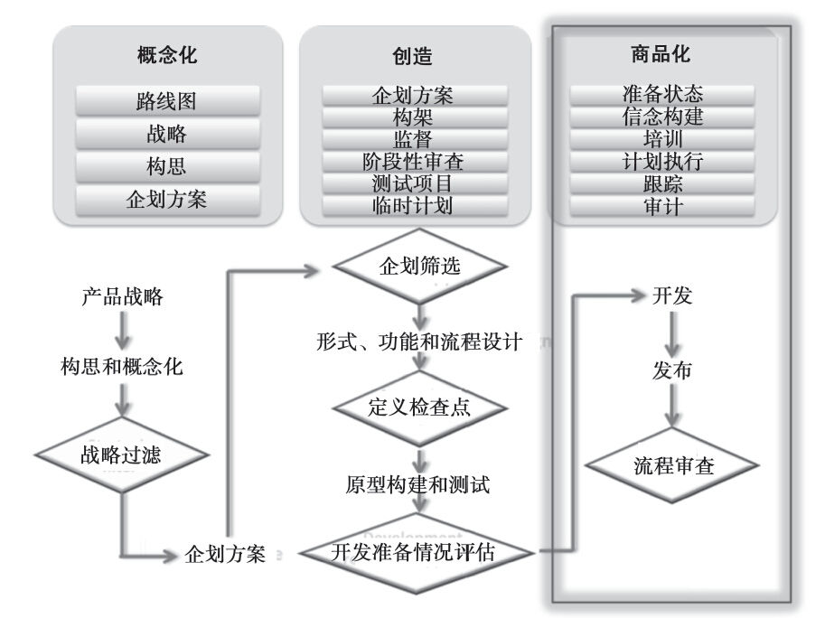
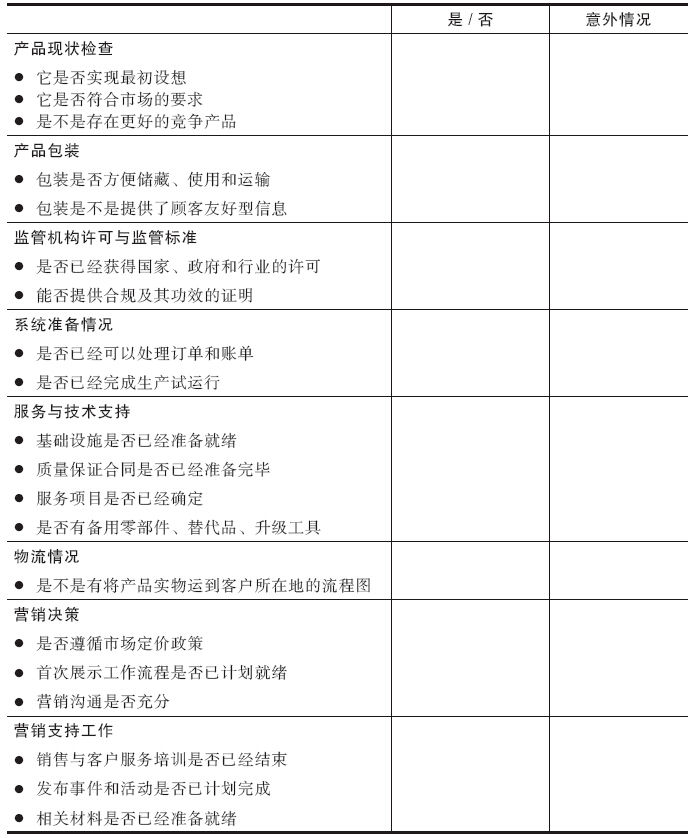
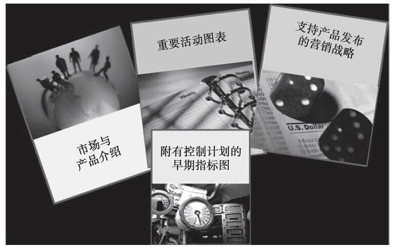
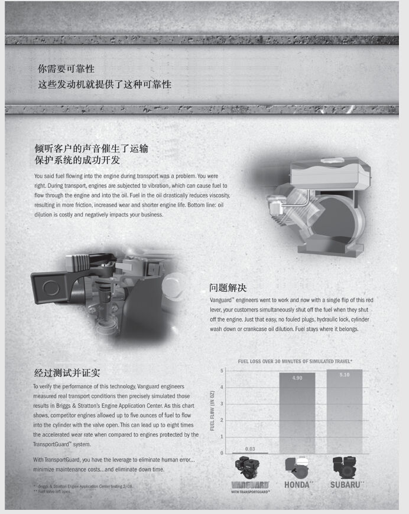
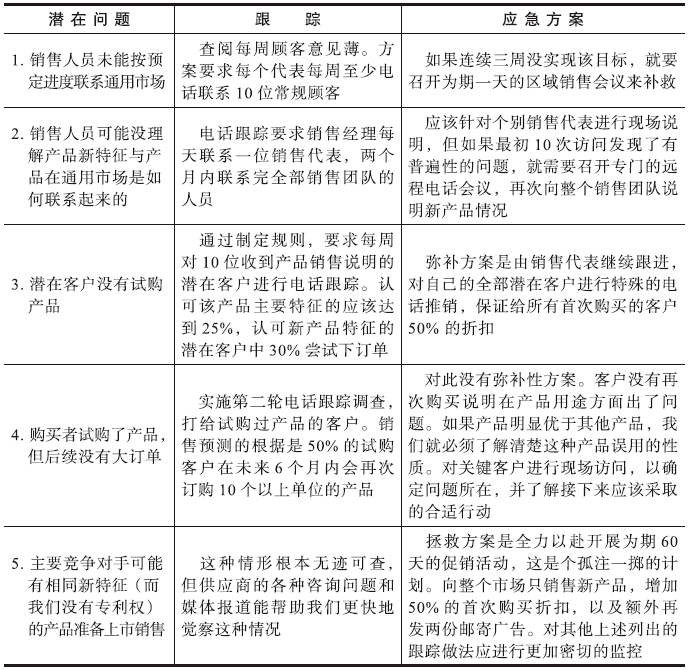

## 第9章 制定和实施产品发布方案

请判断对错：市场占先就能保证成功。

这种说法就是指先发优势，但它并不能确保最终的成功。很多我们以为是最先发布的产品（如苹果的iPod、亚马逊的Kindle）其实都只是成功的追随者，因为它们克服了先发产品的一些缺陷。它们还实施了卓越的产品发布战略。产品经理有时候会吃惊地发现，自己的占先新产品居然根本销售不出去。因此，千万不要低估扎实的产品发布工作的价值。

现在产品经理的工作进入了“概念化—创造—商品化”的新产品开发过程的最后一个阶段，如图9-1所示。

制定产品发布战略

最后期限即将到来。压力与日俱增。新产品发布日期逐渐临近，那种既激动又担心的复杂心情也会不断增强。产品能不能及时发货？是不是所有的辅助工作都已计划就绪？会不会发生什么意外情况？这些就是新产品发布过程的内容，其实产品发布是一段旅程，不是终点。产品经理是一位“导游”，他要确保某个功能强大的新产品不会因为实施了拙劣的发布战略而失败。因此，要把新产品项目看做一次登山活动。在向顶峰发起冲锋的过程中（即产品开发出来时），整个团队都要充满激情、意气风发。登顶后，团队所有成员还必须跋涉下山（即成功发布产品）。但此时，他们已疲惫交加、饥肠辘辘，盼望着早日结束行程。至此，产品经理必须与销售人员、渠道人员和客户一起，创造一个新的“潮流”。

在原始创意通过审核并开始实施之初，产品发布问题已经应该着手考虑；到了这个时候，发布行动应以更快的速度推进，各种安排也应更为细致。本章重点讨论的是，产品发布之前的各项活动（至此这些都应已经准备完毕），把它们介绍给销售团队与渠道进行发布时，需要考虑的各种问题，以及产品发布之后，跟踪其进展以及改进其流程的各种后续活动。

图9-1 产品开发3C框架的商品化阶段

产品发布之前

产品发布之前是产品商品化前的一个阶段。在这个时候，产品经理需要审核产品真正引入市场的各项工作是否都已准备就绪。在这个时候，要开展必要的市场测试，以评估所提出的营销战略的有效性。在这个阶段，产品经理必须了解全部利益相关方，并清楚他们对各种信息的需求；客户服务必须准备就绪，以解决各种咨询问题并处理订单；技术支持人员需要接受专门培训；分销渠道也要事先了解该产品或服务的独特要求。

#### 市场测试

正如第8章所讨论的一样，产品测试就是把产品放到真实的环境中，去发现并解决各种可能存在问题的过程。这些测试应确定产品的可行性，但并不一定就获得了产品上市的最好办法。此时，也许有必要对产品发布战略（而不仅对新产品）进行市场测试，或模拟市场测试。试销可以帮助评估产品定价是否合理、所发布的信息是否合适，以及分销战略的运用是否恰当。当然，从资金和时间的花费上看，试销的成本确实比较高昂，而且这样做相当于向竞争对手通告了自己的产品发布战略。因此，试销只能在非做不可的情况下实施。

典型的市场测试中，产品经理要选择一个可能成为产品目标市场的具有代表性的区域，在此限量销售产品。在这里需要做出的关键决定包括：有多少个测试市场？都是哪些市场？以及该测试要持续多长时间？很多公司选择能够很好地代表目标客户的两三个市场。“很好地代表”是指能够保证该区域重要的人口变量比例与整个市场大体相同。测试的时间长度要根据不同的产品类型而有所差别，有些需要6~9个月时间，有的甚至要持续长达2年时间。因此，购买周期的长短是需要认真考虑的因素，理想的测试至少要持续两个购买周期。[[1]](part0016.xhtml#ch1-back)

#### 了解可能发生的意外情况

很少有产品发布不出现各种小意外的，因此我们需要回到最初，审视每一个步骤，看看是否有什么疏漏。我们首先要制定一份产品发布前的检查清单（如表9-1所示），帮助我们不要偏离目标。该检查清单需要弄清楚，由哪方来负责，并再次确认产品发布的准备情况。

表9-1 产品发布前检查表

首先对产品现状进行检查。最终产品与最初的设想不完全一致的情况时有发生，要确定这个产品是否仍能提供其预先设定的功用。确保清楚了解该产品最合适的目标市场。如果自计划开始实施以来，市场或竞争对手的情况发生了变化，那么就有必要确认产品是否仍具竞争优势。

很多产品，尤其是消费品，其包装是消费者与产品最先接触的部分，因此，我们一定要确定包装是否恰当。20世纪90年代晚期，用于降低胆固醇的立普妥上市，被认为是药品市场发布的最成功案例。公司把部分原因归功于该药品包装中所准备的各种文献资料：

在产品包装内插入文献资料，把立普妥与它的每个竞争产品进行对比，比较它们降低胆固醇和甘油三酯的效果。我们用了大量比较型的促销材料，不少产品在整个生命周期中都用不了这么多。这表明我们的临床开发与营销团队在协同工作方面做得相当出色，甚至一直持续到产品发布之时。[[2]](part0016.xhtml#ch2-back)

对于卫生保健行业的多数产品而言，获得监管许可非常重要；产品如果没有获得许可，则可能导致其推迟发布。如果该产品面向全球市场发布，则可能需要分别获得不同国家的许可。因此，必须从IT、生产、技术支持以及其他运营团队核实系统的准备情况。确保质量保证规定清晰明确，在必要时能及时安排索赔。

还应核实营销的准备情况。定价政策，包括分销商折扣安排以及内部转移定价安排，均应准备就绪。首次产品展示战略应制定完毕，也应确定各个市场孰先孰后。广告团队（不论是内部还是外部的）应在发布时准备好适当的营销沟通信息。销售支持团队，其中包括培训、启动大会、各种竞赛、短期激励、支持材料等，也必须准备就绪。

#### 产品发布准备文件

除了前面讨论的产品发布之前的检查清单外，其他准备性文件（见图9-2）也很重要，以下四种需要认真对待：（1）市场与产品介绍；（2）重要活动图表；（3）支持产品发布的营销战略；（4）附有控制计划的早期指标图。所有这些文件都引导着产品的发布以及早期的商品化过程。

图9-2 产品发布之前的准备性文件

市场与产品介绍是产品发布的重要组成部分。市场情况介绍应界定由理想客户组成的目标市场，并尽可能运用多种分区变量进行分析。同时，要解释客户会购买本产品的理性与感性的原因。解释客户决定与购买流程，有时候还需说明影响人员的作用。问题是，有不少产品经理列出了所有未来某天可能购买该产品的市场，企图证明市场对很多应用与用法的热情程度。但如果仅仅声称产品能解决世界上所有问题，且人人都是潜在客户，只会招致销售人员的白眼和冷嘲热讽。突击销售法不仅浪费资源，而且会让销售力量过于分散化。

企业案例9-1“优质客户声音帮助百力通公司设计和发布运输保护系统产品”提供了很多有益的启发。首先，百力通公司有意识地运用调查和描述（人种学）方法，收集来自商业租赁市场的客户信息。其次，该公司发现了先前没有明确的各种需求，创造了消费者渴望的产品特征。最后，客户信息收集专注于倾听客户的声音，YouTube网站上的“运输保护系统”视频和本企业案例结尾处有关销售的那部分内容对此有详细描述。

企业案例9-1

优质客户声音帮助百力通公司设计和发布运输保护系统产品

作者：丹·罗奇（Dan Roche），百力通公司市场营销经理

丹·罗奇的整个职业生涯都在从事B2B营销工作，他起初在多家中西部广告公司担任营销沟通顾问的职务。转到“客户端”后，他为百力通商用动力公司工作，领导其营销工作，包括管理“先锋”（Vanguard）品牌。丹·罗奇喜欢与家人共度时光，在夏天他会在儿子的卡丁车竞赛小组担任后勤工作。

百力通公司产品在个人用户除草与园艺市场占很高份额，但其商用动力部分却只关注建筑和租赁设备市场份额的增长。先锋牌发动机产品线的发明是为了实现产品、团队和价值定位的差异化，以满足通过运用动力设备谋生的那部分人的需求。

开发单缸气冷发动机的过程中，该团队曾面临抉择，是否应该让其商用特征差异化更明显并更具价值，以便让新发动机产品线在众多已经占领市场的竞争产品中获得关注。

收集客户反馈信息之前，团队要清楚，在获取客户信息过程中，应先听取什么样的声音。明确商用租赁业务的性质（形势严峻、低端用户品牌两极分化）后，团队选择了设备出租商作为代表，帮助成员理解商用设备所有者和操作人员最看重的产品特征。

弄清楚一些特征后，团队的下一步工作是制作事件日历。他们使用的工具（在一大块木板中间放一张发动机照片，围绕其四周的是各种特征“通道”）是完美的概念筛选工具，用来鼓励客户参与，激发对产品有用的特征的讨论。开放的通道表示需要认真对待的特征，封闭的通道则表明其重要程度不高。事件日历还可在外出收集客户信息时，用做拍照和录像的物理道具。

客户收集信息的其他重要工作，就是拜访租赁业主的工作现场。这种走访活动为我们带来大量机会，让我们能提出各种问题，并因此理解发动机及维护设备运行的日常工作和取悦客户之间的真正联系。有一次，该团队在拜访一位客户信息提供方的设备维护点时，看到一个容量为200升的润滑油桶。他们问对方为什么机主需要放这么一大桶润滑油在这里。对方回答说，他所用的发动机要经常更换润滑油，一方面是因为操作员工作粗心，另一方面是因为发动机的关机程序比较复杂，容易搞混。机主显然已不再指望用户更加小心、更加严格地执行关机程序，但团队人员明白了，事件日历中要求的特征之一就是要一劳永逸地解决这个问题。

这次访问催生了新发动机的核心特征—运输保护系统。这个特征与现有发动机中装有两个开关不一样，它做了简化，只设计了一个关机按钮。运输保护系统把电路和油路合在一起，用一个操作杆来控制，从而消除了操作员失误的可能性，保护了发动机，并节省了租赁业主更换润滑油的服务时间。

这个特征之所以重要，是因为在运输发动机的过程中，人们往往会忘记关闭油阀，这样汽油就会从油箱通过汽化器流到发动机里面。运输途中汽油进入发动机会导致各种问题，并需要更换润滑油，清洗发动机。这不仅要花费机主时间和资金来修理机器，还会因为修理机器需要时间而影响机主履行紧接下来的租赁服务的能力，从而导致重复客户流失。

2010年2月在内华达州拉斯维加斯召开的2010年混凝土世界贸易展销会上，新的先锋牌运输保护发动机首次亮相。该团队综合运用各种印刷材料和电子文档材料，甚至直接展示性运转，来展现其运输保护系统的优越性，并以此来传达其特征和发动机的整体优势。在本次展销会上，该产品赢得了“最具创新产品奖”，并接连在北美租赁与除草设备市场和欧洲商业界获得类似奖项。

该团队制作了DVD材料，就有关设备运输和润滑油稀释方面的危险对OEM厂商和租赁业主开展培训。DVD视频部分还被经过转制，上传到了YouTube网站，公开播映。

争取到出租市场看门人对于OEM厂商具有重大说服力，因为他们最终负责更换自己设备上的发动机。尽管这项工作还在进展之中，但百力通公司的团队相信，听取客户的声音或其发出的不必要的抱怨，可以发现其尚未满足的各种需求，能够从他们的商用市场客户那里获取长期的收益（见图9-3）。

图9-3 销售展示样品

产品说明与市场说明共同发力，使客户需要的价值得以明确。产品说明要解释清楚，产品是什么，以及为什么这个产品比竞争对手的更好，然后提供各种证据，证明这种说法。如果不同市场有不同的价值需求，也要在此标注出来。药品品牌经理知道通过利益相关方来明确价值的重要性，企业案例9-2“在产品发布早期就要确立品牌价值”对此就有描述。

企业案例9-2

在产品发布早期就要确立品牌价值

根据医药行业的传统看法，新品牌发布后有120天时间来确立其地位。因此，产品经理必须在产品发布之前，明确所有的利益相关方的价值定位。在药房购买产品的病人，是希望能解除其病痛；受监管专业医疗人员为住院治疗使用而购买该产品时，所关心的是报销问题；为门诊使用而购买该产品的内科医生，则想省去各种文书工作以及该药品的疗效证明。针对这些具体的客户，产品的价值与优势必须表述明确。

产品经理还应了解清楚可能抵制该新产品的部分市场，并建立相应的应急方案：

20世纪90年代，默克公司推出一种新药—保列治（Proscar，非那雄胺），主治医师可用它来治疗良性前列腺肥大症，因此，老年人无须接受痛苦的浸入式外科手术治疗方案—经尿道的前列腺电切术。但问题是，患有良性前列腺肥大症的病人由泌尿科医生治疗，这些人的大部分收入来自给病人做手术，他们不愿意交出自己的病人，因此反对这种药物。这种药物最终都没能完全克服他们的抵制。

细分品牌价值的类似概念还适用于其他产品。给DIY人员用的工具与专业用户所需要的不同，它们要考虑使用者不同的能力、价格敏感性，以及销售渠道问题，尽管两种产品本质上是一样的。面向不同国家发布的产品必须做到“全球本地化”，以满足特定的价值要求。使用者、决策者、付款者、渠道人员以及其他影响人士的作用都需要考虑在内。

资料来源：Adapted from Roger Green and J.Martin Jemigan，“Building Brand Value，” Pharmaceutical Executive（September 2004），pp.36-45.

重要活动图会列出各项重要工作，并明确完成日期，如为产品发布购买设备、确定包装设计、获得法律许可、专业化劳动的分包以及准备用户手册。这些工作中每一项都可能包括多个步骤，而且项目不一样，重要性也有所不同。考虑各项工作先后顺序的时候，需要考虑它们对产品成功有什么影响。例如，电子或高科技消费品要获得成功，其技术文件的表述必须非常清晰。客户总是在复杂世界中寻求简单。不巧的是，正如《商业周刊》的一篇文章所说，“帮助我们使用电子产品的多数手册不会运用直白语言。”[[3]](part0016.xhtml#ch3-back)重要活动图的格式可以是一个简单的清单，列出各项活动及其日期，也可以是更加正式的项目时间表和控制技术图，如甘特图（Gantt）和计划评审技术图（PERT）。

产品发布材料有关营销的部分应该详细描述品牌、包装、定价、广告和有关事项。和年度产品计划一样，新产品营销计划首先应设定目标，比如，“把当前客户的25%转变成升级后产品的用户，并增加25%的试用用户”。然后，实施营销策略，实现既定目标。下面所列的是一个整合后的新产品营销战略大纲。有些公司可以用上所有或多数内容，其他公司则要选择性使用。产品线扩展的产品只需要简略大纲，而突破性产品则需要全面的营销战略方案。

1.新产品目标

a.销售量

b.市场渗透率

2.背景分析

a.整个行业的销售量与发展趋势

b.主要竞争对手分析

c.市场分区和潜力

3.产品概况

a.市场要求和规格

b.品牌名称

c.为什么我们的产品更好

d.理想客户简介

e.产品定位

4.市场进入战略

a.时间安排

b.产品首次展示战略

5.公司准备

a.内部准备

b.销售人员可用的工具

c.客户服务培训

d.现场研讨

e.政策声明

6.营销方案

a.市场针对性

b.销售激励

c.渠道激励

d.基本价格和折扣

e.特殊促销活动

f.产品广告

7.资源要求

a.培训工具和成本支出

b.产品展示与各项工具

c.产品发布重要事项

d.其他

如前所述，我们首先要做出决定，是定高价以尽快收回开发成本，还是定低价以尽快占领市场。至此，我们已经比开始阶段拥有更多信息，有能力对价格进行微调。决定是否要调整价格，受多个因素影响。第一，竞争对手短期内进入市场的可能性有多大？判断竞争对手进入市场的能力需要综合考虑他们进入该市场所需要的投资、进入市场的难易程度以及他们自己的战略。对手可能进入市场的速度越快，运用具有市场渗透性的（低）价格战略就越合适。第二，刚开始愿意支付高价购买我们产品的客户群是不是足够大。第三，对于所定价格战略，公司、产品或服务的定位是否足够准确？最后，公司希望的回收期、要求的报酬率和产品回报情况怎样？

产品发布文件的最后一部分内容（做完重要活动图、各种事件时间表和营销方案时间表之后）是确定发布成功与否的各项早期指标。早期指标指的是诸如客户咨询次数之类，能帮助预测或表明产品发布成功程度的各种结果。例如，以往历史表明，30次客户咨询通常有一次会转变成真正的销售，这样一来，跟踪客户咨询数量就能得出预测未来销售量的早期指标。其他早期指标还包括为销售新产品所做的客户访问次数、愿意销售该产品的分销商比例、市场知名度、零售商举办的现场促销活动数量等。了解清楚各种早期指标之后，接下来的工作就是为每个指标设定时间（即每周、每月）目标，然后列出指定日期结束之前（即每月）应实现的结果，因此，产品经理不需要等到最终销售数据报上来，就能够比较各种真实和预期的表现。

准备好产品发布文件，产品就已经进入了发布阶段。值得注意的是，产品发布之前的阶段，可能需要开展销售培训（官方产品发布前的6~9个月内），当然也可以把培训当作产品发布过程的一部分。有关销售培训的信息在下面的产品发布阶段中讨论。

#### 时间安排

不论是与竞争情况有关，还是与季节或行业事件有关，时间安排都是新产品成功的重要因素。如果竞争对手可能进入市场，产品经理必须决定是否在竞争对手之前、同时或之后进入市场。先入者往往享受各种好处，但如果因匆忙进入而导致产品缺陷，结果反而不好，可能更有破坏性。根据费尔南多·苏亚雷斯（Fernando Suarez）和詹维托·兰佐拉（Gianvito Lanzolla）发表在《哈佛商业评论》上的文章“先发优势更多是个谜，而不是确定的事实”。[[4]](part0016.xhtml#ch4-back)市场和技术变化的综合效果，影响先发优势的可能性。具体地说，技术和市场领域的渐进演变，为持续影响提供最好的条件。另一方面，技术上的突破（或技术和市场的突破）会给后来者提供攻击自己的武器。评估竞争对手反应和市场接受情况，必须考虑时间选择和决策的执行情况。

加入竞争的时间安排，可抵消竞争对手潜在的先发优势，并可能让市场份额增长得更快。推迟到在竞争对手之后进入市场，则可以利用竞争对手的缺陷及其培育市场所带来的好处。如果产品是季节性或周期性的，或者其成功要依赖于它在重要“新产品”贸易展上亮相的话，时机选择也极其重要。

时机选择需要考虑新产品对公司产品线中其他产品可能会产生什么影响。在对其可用性有重要作用的部件齐备之前就发布产品，时机显然不够成熟。同样，发布替代产品也必须选择合适的时机。如果渠道中存在大量在途存货，可能需要把新产品推迟到所有旧产品出售之后再进行发布。但是，市场上既没有旧产品也没有新产品的话，推迟发布会冒市场真空的风险，可能为竞争对手空出一段时间，实现其潜在优势。此时，计划一个重叠期，运用定价策略或渠道战略来差异化替代品，并最小化因新产品导入而导致销售收入减少的情形。医药行业产品专利即将过期时，时机选择会成为一个严重的问题，企业案例9-3“为专利到期而制定的产品线规划”对此有详细的描述。

企业案例9-3

为专利到期而制定的产品线规划

2008年有价值超过8000万美元畅销药的专利就要过期，因此71%的制药公司积极推行生命周期管理策略。这包括引入仿制药和侧翼品牌，鼓励从处方药向非处方药转变，以及通过后续产品、重新配方或新型药物递送系统进行品牌扩展。根本性问题是客户转向使用仿制药品的速度有多快，因为这影响到作这些决策的时机选择问题。

对仿制药品的接受程度越来越高。联邦贸易委员会称，1984~2002年，处方中所用的仿制药品从19%增加到47%，专家估计现在已经增加到50%以上。根据前沿咨询公司（Cutting Edge Information）高级分析师乔恩·赫斯（Jon Hess）的说法，“各个公司正在采取正确的策略更加密切地关注业内企业的成功做法。如今，全部可用的专利保护战略中，产品线扩展显然给各家公司带来获得丰厚回报的最大可能性。”

施贵宝制药、葛兰素史克、宝洁以及辉瑞制药在21世纪的第一个10年都在探索仿制药或侧翼品牌。例如，奥美拉唑专利到期前，阿斯利康（AstraZeneca）公司已经成功地让40%的用户转而使用埃索美拉唑（Nexium）—一种减少胃酸的新药。尽管不是所有公司在产品专利到期时都面对与制药公司相同的情况，但它们都可以从中学习到生命周期管理的思考过程。

资料来源：Jon Hess，“Line Extensions：Most Common Patent-Protection Strategy，”PR Newswire（March 2，2005），p.1；and Edward Tuttle，Andrew Parece，and Anne Hector，“Your Patent Is About to Expire：What Now？”Pharmaceutical Executive（November 2004），pp.88-92.

#### 地理分布战略

产品经理还有必要对地理分布战略做出决策。有时候，产品适合国内发布，有时则适合国际发布，但很多新产品推行全面的首次发布战略。确定优先选择哪个市场（即地区、行业或国家），并对进入顺序做出安排。例如，可以最先进入在市场规模和收益潜力方面最有吸引力的市场，也可以先进入竞争最少的市场，这样做，公司和产品都有机会来积累经验，获得曝光率并赢得市场地位。对于首次上市产品的市场选择，还可以根据产品的不同用途、市场上的在途存货、获得分销商或零售商支持的能力、公司在市场上的声誉，以及很多其他因素来考虑。

尽管首次展示可能与市场测试有点类似，但两者在以下几个重要方面还是有区别的。第一，在测试市场时，产品经理选择的是对产品的最终上市最具代表性的市场，而首次产品展示的情形并非如此。市场的选择依据是其获得早期现金流的能力，或者获得后续产品发布所需要的潜在的、有影响力的市场分区的能力。第二，测试市场是产品商品化决策之前的最后测试，而首次展示在商品化决策做出之后进行。[[5]](part0016.xhtml#ch5-back)

产品发布之时

新产品开发过程的下一个阶段就是产品发布，即把新产品最终引入市场，此时产品经理的职责是通过教育并激励人员来保持前进的动力。执行就是将时间安排与地理分布战略付诸实施，这要求为销售人员和渠道人员提供培训，并提供各种激励手段。同时，还要实施预先设计好的产品传播方案。

#### 销售人员培训

任何时候都要尽可能了解客户和潜在客户的情况。为销售团队提供的信息越多，对他们销售新产品的激励也就越大。要与销售团队成员紧密合作，为其提供有助于销售活动开展的各种信息。准备各种“销售方法”手册，探讨客户（不是目标市场）、用法（不是特征），以及销售人员在拜访客户时会被问到的各种有用问题。一定要确保客户服务部门时刻准备好通过内部新闻邮件、非正式和正式会议以及各种通告的形式进行充分的沟通。

引导性营销战略详细规定各种定价策略、基础价格和选择定价，新闻发布以及产品公告，针对精选客户的直接邮件和电子邮件发送，装运策略与步骤，渠道和终端用户沟通，以及为销售团队或客户开展培训。销售培训尤其能帮助销售人员销售产品，而不是简单地把产品抛向市场。

销售培训是产品发布工作的一部分，应该教育并激励销售人员销售产品。换句话说，销售人员为什么应该相信自己的产品会像其声称的那么有用？是什么激励他们去销售产品？如果是对现有产品的改良品，那么最好的证据是产品以往的成功事实。对于全新产品，就有必要提供更多说服工作。实验性销售或贝塔测试的结论、在首次销售地区获得成功的销售经理或其他销售人员的现身说法、自己个人（作为产品经理）完成的销售或者适当的展销会和潜在顾客开发流程等，都能帮助说服销售人员，该产品是值得他们花时间和精力去推销的。此外，还应该考虑运用财务和非财务激励手段。更高的佣金、更好的红利以及各种大家想要参与的竞赛，在适当情况下都很有帮助。非财务激励因素可包括：来自客户的表示不需太费劲销售就能成功的反馈意见，只需增加最少销售时间就可以把产品和其他产品捆绑在一起销售的能力，或者表明该产品比竞争对手的更好的各种无可置疑的证据。

销售培训可能还需要延伸至各渠道人员。分销商、经销商和其他转售商在新产品方面可能不像内部人员那样具有相同的既得利益，但他们在帮助新产品获得目标客户方面能发挥重要作用。这些转售商不仅需要相信投资于这个产品是有利可图的，他们同时还必须获得必要的激励，去创造最好的环境，以确保新产品的成功。那么，他们的销售人员需要什么样的培训呢？他们是不是要给辅助人员提供技术培训呢？准备多少库存才是合理的？新产品要取得成功是否需要最小限度的货架空间或具体货架如何布置？转售商在促销产品方面是否需要帮助？有些公司发现，需要通过竞赛和额外资金来建立“兴奋点”，给产品一个成功的机会（见企业案例9-4“通过经销商网络发布新产品”）。

企业案例9-4

通过经销商网络发布新产品

很多新产品的销售需要通过经销商、分销商、批发商或零售商进行。这些组织对产品的发布过程具有重要影响。它们想要的是能从客户那里获得销售收入和利润的新产品，它们有时候需要各种帮助来执行各种销售方案。例如，克莱斯勒公司就做出巨大努力，发布一系列新产品，并与经销商建立更紧密的合作关系。戴维·科尔（David Cole）是密歇根州安娜堡汽车研究中心主任，他很清楚这种关系的重要性。“克莱斯勒有很多新产品。真正的问题在于其他公司同样如此。那就是各公司和经销商应如何开展产品本身以外的其他工作，才能在彼此之间决出个胜负来。”

从2003年开始，克莱斯勒公司推出了更加全面的计划，支持其通过4400家经销商发布新产品。这些经销商都是具备独立思维的企业家，已经在经营中投入数千万美元，希望确保投入未来最具有潜力的汽车中去。很多经销商抱怨，先前的培训和辅助材料不能满足他们的需要。因此，他们制订了这个计划，里面包含了以下多项内容：

·全天候的驾乘体验。

·对通过经销商在线课程的销售人员进行认证。

·设立多个金额为1000美元的奖项，鼓励竞争。

·网络竞赛，把得分最高人员的名单发布在网络领先人员榜上。

·包括袖珍指南、分页卖单、光盘在内的保证文件。

·DVD以及其他销售网点提供的材料。

·帮助经销商赢得今后回来接受各种服务的计划。

产品发布流程的另一例子是20世纪90年代后期凯迪拉克发布凯帝（Catera）牌轿车的战略。尽管产品并没有所期望的那么好，但我们仍能从发布过程中学到不少经验。凯迪拉克引入凯帝牌轿车（一款入门级豪华车）时，需要放弃现有年纪偏大的忠实客户，转而吸引经销商不是很熟悉的客户群。为了赢得经销商对该产品的支持，它创建了凯帝学院。该学院的学习包括两天半的课程，介绍各种新客户基础与轿车本身的信息。在学院里，经销商可以亲自驾车，并亲眼观看轿车如何被一片一片地拆开。对于不能来参加学习的经销商，凯迪拉克在美国各地租了电影院，用大屏幕向经销商介绍客户以及参与该产品销售的团队的具体情况。尽管培训本身并不是产品销售激励措施，但它提供了让各种激励手段（如竞赛）起作用所需要的工具，并且这两者在凯迪拉克卓越标准奖（SFE）中都是有要求的。

经销商在诸如技工培训、销售人员培训和客户服务等方面的成功能够赢得积分。每个月，每位经销商都会接到通知，告诉他们在比赛中的排名。大奖是去一个有异国情调的地方旅游。把大奖得主送到海滩上喝鸡尾酒、观看日落并不是凯迪拉克举行比赛的唯一目的，旅程中密集的业务研讨会才是本次旅行的重点。1997年，凯帝轿车发布的大奖就是去德国观看该型轿车的生产线。

凯迪拉克卓越标准奖得主非常认同这种旅游的双重目的。佛罗里达州杰克逊维尔的尼姆尼希特凯迪拉克专门店总裁兼首席执行官埃德·尼姆尼希特（Ed Nimnicht）说：“上午开会研讨如何提升代理服务，其目的是促使你认真研究自己的汽车零售店，找出改进方法。之后，你会有一些闲暇时间享受比赛。”

产品发布工作的一部分还包括对经销商的测试。问题回答正确就可以赢得积点，并且参加该项目还要达到一个最低的知识水平。此外，销售凯帝轿车也是经销商赢得凯迪拉克“经销大师”称号的必要条件。

值得注意的是，成功的发布并不能“拯救”内在品质不佳的产品，但好的产品却会因为不成功的产品发布战略而受到损害。

资料来源：Adapted from Dale Buss，“Wheeling and Dealing，”Sales and Marketing Management（February 2004），pp.36-41.Kenneth Hein，“Preparing for the Launch，”incentive（April 1997），pp.45-49.

#### 营销沟通

新产品发布的信息与媒体战略和营销沟通的很多共同问题一起实施。如果可能，公关活动和宣传应作为新产品沟通战略的第一步，并应先于发布之日开展。产品差异化特征越明显、越独特，公共关系的重要性也就越大。公共关系是指公司为赢得媒体关注度而实施的活动和事件，包括开放参观、游览参观、演讲，以及各种资助活动，但并不局限于这些活动。媒体发布有关这些活动的信息，以及发表文章和新闻稿，就是宣传。

公共关系和宣传应该是为客户提供独特好处的产品所用的首选沟通工具（换句话说，对于在产品线扩展中变化很少的产品，或只是成本降低的产品之外的其他产品，这些活动更为有效）。立普妥[华纳·兰伯特（Warner Lambert）公司开发的降低胆固醇的新药]处于联邦食品药品监督管理局（FDA）检测的最后阶段时，它就和美国心脏协会开展合作，在全国推行有关胆固醇的教育项目。通过这些公关努力，公司表明其对胆固醇问题的关注，因此为立普妥的上市提供了坚实的基础。

同样，卡特尔公司（Cutter）在美国发布其第一款驱虫产品时，用派卡瑞丁（Picaridin）取代驱蚊胺（DEET），因为预算有限，所以很大程度上依赖于公共关系。为了争取对派卡瑞丁的支持，公司与地方卫生部门、联邦疾病控制与预防中心，以及世界卫生组织等机构的专家开展合作。这些联系为其产品成分带来了可信度，通过联想同样也给产品带来了可信度。公司还建了一个不冠其商标名的网站，介绍派卡瑞丁的种种好处。经理还参加西尼罗河病毒会议，敦促疾病防治中心（CDC）和世界卫生组织将派卡瑞丁列入其推荐药品之列。[[6]](part0016.xhtml#ch6-back)

产品经理还可以把以下内容纳入新产品公共关系活动之中：（1）准备新闻工具箱，用于贸易展销会和其他活动。这些工具箱中应至少包括贝塔测试的结果（如果有的话）、详细介绍新产品重要性的白皮书、公司历史、产品定位、背景信息和多份新闻稿件。（2）为精选刊物提供文稿，解释读者应如何从该新产品中获得好处。为了让出版商对这些文章感兴趣，产品必须是真正新颖的，并且文章必须给读者提供有价值的信息，不能只是各种销售说辞。（3）如果产品真正属于创新产品，它也可以进行现场展示，作为展销会上培训内容的一部分。（4）向合适的媒体发送新闻稿件。

利用完各种公共关系机会之后，就应认真考虑做广告了。尽管公共关系活动通常先于产品发布进行，但多数广告和其他促销活动会与产品发布活动同时进行。要确保这些活动如期进行，需要在产品发布之前做好充分计划。

实施促销沟通，我们必须回到对“最好潜在客户”的描述，强调需要着重指出的产品优势，用这种优势主导这个特定市场促销沟通活动。因此，必须认真回答如下沟通问题：你的产品（服务）能为潜在客户做什么？如何做到这些？为什么它比竞争产品更好？要让你的说法更加可信，需要提供什么证据？如果潜在客户对新购买产品不满意，他们能怎么做？注意：第一个问题明确各种好处；第二个问题指出提供这些好处的特征；第三个问题则表明这些优势。这些沟通活动包括与销售培训中典型的FAB方法（特征、优势、好处）相同的内容，但要对它们进行重新组织，以便把各种好处作为最重要的信息呈现给潜在客户。产品经理负责将早先提出的定位战略转变成传播给客户的沟通信息，并保持信息的相关性和及时性。一定要保证从各贝塔测试基地获取各种证据材料。然后确定如何最好地传播这些信息：是通过贸易展销会、各种销售力量或渠道、印刷媒体、直邮方式、创意传播方式，还是通过其他手段。在贸易展销会上发布产品的时候，也在各种行业刊物上有针对性地同步刊发广告，这样会比较有效。努力通过创造性地运用各种媒体，把你的信息多次呈现给潜在客户。

直接销售人员需要各种传播材料，其中包括公司内部（保密）信息、销售访问时可以使用的销售工具、能提供给客户的营销辅助资料。内部文件包括产品销售目标与定位、与竞争产品的对比情况和各种专门的资料。（这些信息可放到公司内部网上，也可以印刷品形式分发。）销售工具应强调协助销售人员完成其销售访问，因此重点在于如何销售。营销材料应从客户的角度来准备，遵循上面提到的FAB方法（如果客户是分销商，应该关注他们如何从该产品中获利。如果客户是终端用户，则应关注带给他们的各种好处）。即便客户是终端用户，各种好处也可能因个人的层次不同而有所不同。例如，高层管理人员对新产品如何实现利润感兴趣，而技术人员可能对数据表更感兴趣。产品经理只给销售人员提供各种产品特征与好处（相对于技术人员的），而不提供各种支持材料，用来说服更高层次的管理人员，这种情况非常常见。

间接销售渠道的情形也会有所不同。公司信息会更注重生产商与分销商之间的合作或关系，而不会包含各种绝密信息。对于高端产品，视频和电子自测模块也许很有好处，但只有在渠道认可这种时间付出的真正价值时才有用。销售工具部分可能比较简短，只提供不多的细节。支持材料应重视对终端用户的好处。用于为直接或间接渠道提供沟通材料方面的预算比重，要根据作为产品发布战略一部分的渠道先后顺序情况而定。

产品发布后的评估活动

产品发布阶段之后（或期间），有些类型的项目评估活动就应结束。这一阶段的主要目标是改进未来的产品开发，而产品也从新产品状态过渡到需长期维护的在售产品的状态。有时候，由于产品没有实现预期情况，就可能需要重新发布产品。产品的再次发布应尽早考虑；是否需要再次发布产品，可能已在早期指标中体现出来，关于这些指标，我们在本章中的“产品发布之前”那一部分已经讨论过。如果产品勉强可以接受，则可能要改变营销战略，以使产品能真正获得成功。产品发布材料中应该包括应急或控制方案，表9-2就是一个控制方案的例子。

除了对新产品进行评估之外，还有必要对新产品开发过程进行评估。未来改进的最好方法，就是把成功和失败的项目进行比较。把自己的见解记录下来，就能增加其他新产品获得成功的概率。

表9-2 控制计划样本

资料来源：C.Merle Crawford，New Products Management，4th ed.（lrwin，1994），p.317.

本章思考

寻找创造性方法来发布新产品。不要武断地认为每个产品都能卖得很好。

埃莉丝·凯访谈：培养产品发布技能

埃莉丝·凯（Elyse Kaye）

家用医疗设备公司高级产品经理

埃莉丝，因为你曾任职于完全不同类型的多家公司，在开始讨论产品发布战略前，你可不可以向我们简单地谈谈你的职业之路？

我的职业之路并不是很传统。我是密歇根州立大学传播学专业的毕业生，课程设置中根本没有产品或品牌管理的内容。可是在我的职业生涯的每个转折点，我都获得了足够的知识，这让我自然而然地通向产品管理之路。

刚一毕业，我偶然发现一个最主要以生产熔岩灯闻名的消费品公司的营销协调员工作。该公司传统上属于销售驱动的，因此不会在营销方面花费太多的预算（因此聘用一位22岁的人来管理其营销和公共关系工作！）。因为人们再次掀起对媚俗产品的热情，所以产品的分销扩张很快。我的工作是制定可实施的营销方案和预算来扩展业务。想想看，作为一个刚进入劳动力市场，梦想大展宏图的年轻人，我居然拥有这么大的一个发展空间。在这家公司，我有机会制定并执行自己方案的每一个细节，包括建立产品授权部门，以及加强我们产品开发流程。通过这些导入性工作，我发现这就是我想要做的事情。

年纪这么小就在一家创业型公司中工作的困难是，这些公司通常组织架构和流程管理不够明确。我的第二份工作是在一家典型的营销型和资金驱动的办公用品公司。在这家公司，我开始了解公司的组织架构。我明白了控制好利润表、过量库存的现金价值以及公司内部自由流动的重要性。我的职责是管理一个由工程师、设计师、包装专家、工程采购人员、绘图师和销售人员组成的团队。

我的下一份工作把我带入了设计、工程采购和工厂管理领域。我相信，从事与产品有关的工作的任何人，都必须拥有在每个领域的实践经验。我在马洛手袋公司（Marlo Handbags）工作时，有37家不同的工厂为我们的产品线生产产品。每次遇见什么特别的要求时，我们就要求工厂来解决。因此，对于任何一家工厂而言，我们都不怎么重要。当第一次代表公司访问中国时，我参观了每一家工厂，充分了解了它们的产能与局限。第二次再去中国访问时，我们把代工工厂的数量减少到13家，这使得我们自己对于这些工厂的重要性大大加强。这导致了更好的定价、物流，并缓解了我们与工厂的紧张关系。这样做还给我带来了机会，运用这些工厂的资源扩展了产品线。

目前，我作为高级产品经理在一家世界领先的消费品企业“家用医疗设备公司”（HoMedics）工作。这里是很好地融合大型公司与我刚开始工作时所具有的创新精神的一个地方。在这里，我可以充分施展我在先前公司中所学到的各种技能。

你的产品发布方法在这些公司中有些什么不同？

成功的产品发布始于产品开发的早期，要计划充分且富有灵活性。很多伟大的产品没有被市场接受，是因为它们的发布方式不对。从内部看，其最大的错误在于缺乏持续的沟通工作。完全孤立工作会导致各种指责，以及各种昂贵的开销支出！根据产品复杂程度不同，我都会尽早地引入必要的参与者，包括开发团队（设计师、工程设计师、研究人员、包装人员、采购资金人员）和产品发布团队（销售人员、广告人员、商品化团队成员、公共关系人员和市场营销专家等）。即使每个人都想要一份简明的时间表，但现实情况却是，需要不断地对方案进行“修修补补”，以应对各种可能扼杀产品发布的意外情况。

我个人喜欢尽可能在早期讨论产品概念的阶段，就去与采购人员进行联系沟通。采购人员是零售商货架布置的看门人。销售与营销之间的冲突时有发生。生产计划或销售订单，应谁先谁后？这种冲突总会不断发生。我有过一次最不成功的产品发布，当时就是因为销售和营销部门没有很好地协作。每个产品经理都能给你讲他自己的失败案例，向客户承诺根本实现不了的发货日期。在任何陈列图（陈列图是解释零售产品应陈列在商店哪个地方的图表）中，都有一些关键的日期和价格点。如果采购者对产品很感兴趣，他们就会与公司合作，给予陈列位置与营销支持；如果他们不感兴趣，则了解他们为什么不感兴趣就会很重要。

影响产品发布成败的另一因素是退出战略。零售中消费品的平均上架时间大约为18个月，而平均产品开发时间为12个月。计算一下，只有在所有库存消化之后，而最好在另一产品即将上市之前，某一产品的成功上市才算结束。作为经理，我们有责任把自己和我们正要发布的产品（我们的孩子）区分开来。到了最后，仍然都只是各种数据而已。

对于你刚提到的产品发布团队，作为产品经理，你是如何在产品发布中“引导”开展各种工作的？

我的“引导”职责是制定战略，整合工作团队成员、分配任务，以及促进双方的沟通。

你能不能举一两个你认为在自己的产品发布中真正有价值的游击式营销、产品植入式营销、销售和渠道激励或者任何产品发布的其他技术的例子？

当然可以。我最喜欢的一个例子是，新线电影公司（New Line）与我们接触，要把我们的熔岩灯放到一部名为《王牌大贱谍》（Austin Powers）的新电影中去。没人能预料到这股复古潮流会成功。公司实际上因为产能的限制，甚至战略性地拒绝了世界上一些最大的客户。但在短短的几年之内，我们的销售增长了三倍。植入式营销可能是接触大量新客户的比较便宜的方法。另一个例子发生时间比较近一点，《奥普拉杂志》（O Magazine）在2010年12月刊中把百得牌碎纸机（Black&Decker）列为“奥普拉最喜欢的东西”。该产品的优惠券代码在亚马逊网站同时发布，产品销量环比增长了一倍以上。

我相信，你有很多在各种各样的公司和行业中的产品发布故事。你有没有发现有些好的产品因为拙劣的发布而失败；或者相反，“差强人意”的产品因为出色的产品发布而取得成功的例子？

苹果公司是产品发布的典范，但他们在新产品发布后不久就发布升级产品时，也出现过营销异常情况。

随着社交媒体的出现和Web2.0时代的到来，你认为产品发布战略正在发生什么样的变化？你认为消费者和B2B产品所受到的影响都是一样的吗？

当今的产品发布战略必须包括病毒式营销计划。网络是教育和构建知名度的绝好的工具，根据各公司对成功的看法，它也可能是很好的销售工具。我在零售行业工作。买家都是看门人，并且有时候会改变习惯，他们也会变得非常厌恶风险。像“夏普尔印象”（Sharper Image）这样的公司之所以如此成功，是因为它有能力在一个平台上开展各种创新。零售商数量依然持续减少，夏普尔印象、利纳斯、电路城和其他大型零售连锁店的关张，给予仅剩的零售巨头极大的话语权。社交媒体是建立兴奋水平的强大工具，但如果像我们公司这样，未能将产品通过分销商进入零售市场，那么一切都是没用的。我有好几个产品，测试阶段都表现得相当出色，也获得了相当多社交媒体的关注，但所有这些却没能给我们带来真正的销售。

你能不能举几个提早了解产品发布战略导致产品定义改变的例子？

我的产品买家往往是我的产品发布战略的重要推动力量。他们往往和我一道确定定价战略、预制购买时间表，以及实现项目的商品化。因为分销渠道不一样，产品的外形和触感就完全不同。所以，专业零售商想要60个点的回报，大型零售商要35个点，而连锁俱乐部则要13个点。而我，则希望产品线中增加通用部件，尽可能提高设计效率。我还希望在包装和产品美观方面保持品牌的一贯性，尽管我需要同时开发三个独立的产品线，要制定三个独立发布战略和时间安排。

对于产品发布，你能不能给其他产品经理提三个你认为最重要的建议？

一定要结交最为优秀的精英。我喜欢把产品经理称为品牌或产品首席执行官。我们不可能在所有领域都是专家，但我们必须擅长发现专家。在职业生涯的后期，我发现，一定不能感情用事，情绪化往往会导致各种失误。必须保持方案的灵活性，因为随时会发生各种预料不到的变化和问题。最重要的是，我们从事的工作是世界上最有意思的。

[[1]](part0016.xhtml#ch1) C.Merle Crawford，New Products Management，4th ed.（RichardD.Irwin，1994），p.351.

[[2]](part0016.xhtml#ch2) Wayne Koberstein，“Master Launchers，”Pharmaceutical Executive（May 1998），p.45.

[[3]](part0016.xhtml#ch3) Bruce Nussbaum and Robert Neff，“I Can’t Work This Thing！”BusinessWeek（April 19，1991），p.60.

[[4]](part0016.xhtml#ch4) Fernando Suarez and Gianvito Lanzolla，“The Half-Truth ofFirst-Mover Advantage，”Harvard Business Review（April 2005），pp.121–127.

[[5]](part0016.xhtml#ch5) C.Merle Crawford，New Products Management，4th ed.（RichardIrwin，1994），pp.351–353.

[[6]](part0016.xhtml#ch6) Mary Jo Feldstein，“How Do You Take a New Product，Create a Needfor It and Sell It？”St.Louis Post-Dispatch（April 19，2005），p.D1.
