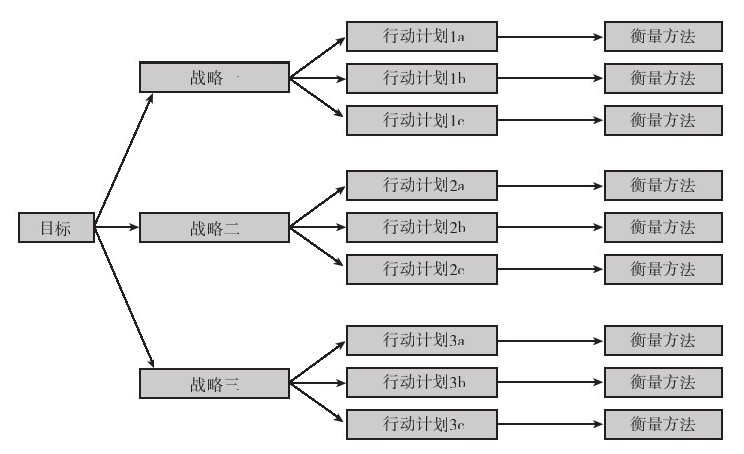

## 跟踪

实施计划自然需要进行跟踪。跟踪是指用明确的衡量方法和里程碑，对计划目标的实施进程进行评估。跟踪的衡量方法应列入计划，且需要得到负责该计划实施的相关人员的认可。产品上市的里程碑方面的范例详见第9章，其他里程碑则与业已确定的计划目标相关。如果目标是通过新的销售渠道使年度销售额达到X美元，那么你希望第一季度分销商有多少存货？如果目标是改变客户的认知，那么就需要进行一系列的小型调查。这些都在进行吗？请注意图3-2中的行动计划和衡量方法之间的联系。

图 3-2 战略和衡量方法的关联 

步骤五：跟踪计划实施

·是否已经确定跟踪的衡量方法及具体的时点？跟踪计划的进程有助于尽早地发现问题，从而让你及时采取纠正措施。

·计划的衡量方法是否与计划的目标相关？注意不要追踪那些与计划目标和战略战术无关的衡量结果。

关键要素

▶（从时间、规模和具体产品等方面）明确计划范围，这是计划的起点。

▶数据收集是环境扫描的部分内容，可为解决你现在在哪里这一问题提供事实依据。

▶制定战略和战术的目的是缩小“你现在在哪里”和“你想去哪里”之间的差距。

▶确定并获得执行计划及所需资源的承诺。

▶确定跟踪实现最终目标和目的的进程的具体衡量方法和里程碑。

▶请记住，未来不是你将要去的地方，而是你正在创造的地方，而商业计划就是带领你到达那里的路线图。

计划清单

▶明确范围

是否已经明确了计划范围？ 是 否

计划的目标使用者是否明确？ 是 否

▶环境扫描

是否已经列出高层业务目标？ 是 否

是否对目标客户有了详细的了解？ 是 否

是否充分掌握了竞争的详细情况，从而验证了你的优势？ 是 否

是否已经分析研究了可能影响计划的外部趋势或事件？ 是 否

是否已经对企业在产品方面的优势和劣势做出了客观的评价？ 是 否

是否已对产品进行了简要而全面的竞争分析？ 是 否

▶目标与目的

能否明确阐述产品的长期目标？ 是 否

年度目标是否有利于实现长远目标？ 是 否

目标是否符合SMART原则？ 是 否

▶战略与战术

战略和战术是否解释了将如何从现在在哪里向要去哪里的目标前进？ 是 否

根据环境扫描的结果，战略与战术是否现实可行？ 是 否

▶实施

为了确保战略和战术的实施，计划是否明确了所需的人力和资源？ 是 否

是否已经获得了参与计划实施的主要部门的承诺？ 是 否

▶跟踪

是否有明确的衡量方法和里程碑来监控达成目标的进展情况？ 是 否
