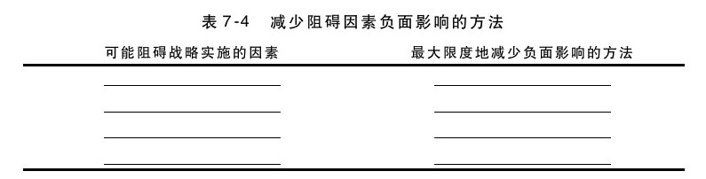

## 战略实施

作为变革推动者，产品经理必须有能力实施战略，也必须能与其他人共同实施。为了保证战略的有效实施，需要注意以下几点。首先，人们必须认同变革的必要性，必须相信现状是不可接受的，而战略所追求的商机是切实可行的，并与企业的整体战略是一致的，追求商机所获得的回报大于付出的代价。

其次，产品经理必须克服变革和实施战略的障碍。在成功实施战略的过程中，存在哪些部门利益障碍、个性问题及目标分歧？在制定产品战略计划时，需要考虑如何最大限度地减少这些因素的负面影响（见表7-4）。

再次，员工必须理解战略实施对个人的影响。

·这种变革与我的工作有什么关系？

·我应该具体做些什么？

·企业会如何考核我的工作？我将面对怎样的结果？

·会给我带来什么？

最后，还需要建立战略反馈与学习的系统，确保战略能够向前推进。反馈应该包括：（1）战略是否在贯彻实施；（2）战略假设是否仍然可行。

思考要点

我与本企业其他员工沟通产品愿景的效果如何？

▶其他员工是否认同战略对企业的重要性？

▶参与战略实施的员工是否理解战略对个人的影响，并愿意承诺投入？

▶我是否向其他员工明确了战略方向的紧迫感？

关键要素

▶制定有效的客户、竞争与产品线战略。

▶制定未来的产品年度报告，可以帮助你展望未来。

▶兼顾战略思考与战略计划活动。

▶确定未来潜在客户的特征、需求和可能的变化。

▶确定未来潜在竞争对手的战略（直接与间接战略）。

▶明确并优化核心业务。

▶确定可用于扩展产品线的资产与资源。

▶确定战略计划需要考虑的趋势。

▶寻找客户价值链中能够创建优势的机会。

▶和相关员工沟通愿景，并争取支持，以确保战略的实施。

战略清单

▶战略思考

是否明确了未来产品线的愿景？ 是 否

是否避免了简单地根据过去的情况来预测未来？ 是 否

是否兼顾了战略思考与战略计划活动？ 是 否

是否确定了并能描述未来潜在客户及其需求？ 是 否

是否明确了竞争领域的未来变化？ 是 否

是否明确了对客户最重要的方面？ 是 否

▶战略制定

是否明确了现状和目标之间的差距？ 是 否

是否了解在制定战略时需要权衡取舍？ 是 否

是否清楚地表达了核心业务？ 是 否

是否评估过能将核心业务拓展到新的机会领域的方法？ 是 否

是否明确了企业的资产并对其充分利用的战略方法？ 是 否

是否明确了未来的重要趋势并在制定战略时加以考虑？ 是 否

是否全面分析了整个客户价值链，并确定了潜在的竞争优势新领域？ 是 否

▶战略实施

是否说服了组织其他成员认同战略的重要性？ 是 否

是否确定了可能阻碍战略实施的因素？ 是 否

是否确定了最大限度地减少这些因素影响的方法？ 是 否

企业其他员工是否理解战略对其个人的影响？ 是 否

他们是否愿意接受这些影响？ 是 否

是否明确了战略的紧迫感？ 是 否
