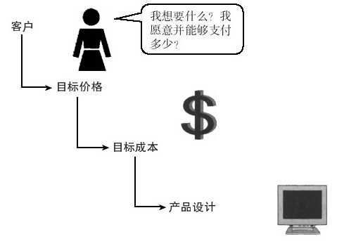
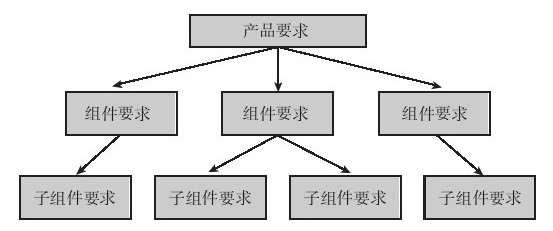

## 概念完善和规格要求

在新产品开发过程中，产品经理应能传达“客户的声音”。这就需要根据有关客户需求的原始数据来确定产品的规格要求。在撰写这些规格要求之前，产品经理应回顾一下新产品的目标是要达成企业的什么期望。例如，新产品是否有助于企业进入期望的市场？支持该目标的假设是什么？有何使新产品难以达成这些目标的制约因素？

在确定了与新产品目标相关的产品范围之后，还需要分析完整产品解决方案（参见第6章），以确保充分考虑解决方案的各方面的要求。例如，为了简化客户安装电脑组件的程序，现在的连接线采用了各种颜色来进行标示。虽然这与产品的功能无关，但需要改变新产品的要求。下面是一些可能对产品或服务有用的规格要求类别：

·产品/服务的功能

·制造

·存货

·运输

·安装

·客户存储要求

·客户的产品、服务、系统或能力的界面

·安全性

·实体设计或外观

要理解整体解决方案，你必须向客户收集其需求信息。需要注意的是，需求是客户希望从产品的使用过程中获得的利益，而不是产品应该如何开发。与构建创意过程类似，可能更适合用开放式问题来收集相关信息，但问题的内容主要是用来明确产品概念。当然，这一过程也可以采用评分量尺与封闭式问题。

概念陈述可以有多种形式。有时候，我们可以用语言文字来描述产品的差异化特征；其他时候，可能更适合用图片甚或是初始样品来展示产品特征。如果价格是客户购买决策的重要因素，那么在陈述内容中应包含价格因素，否则，就忽略不提。如果价格是重要的评估标准，那么在客户研究中应包括目标价格。将期望的毛利从价格中扣除，就可以得到目标成本，这一数值可能会直接影响产品设计，如图8-5所示。

图 8-5 在产品规格中考虑目标价格 

我们可以请客户来比较产品概念与竞争产品：我们所描述的产品概念有何独特之处？他们喜欢或不喜欢产品的哪些方面？认为有哪些方面需要加以改善？如果产品上市，他们是否会考虑购买？并且，如果合适的话，他们会购买多少或购买的频率有多高？这些有关产品特色与购买意向的问题，会有助于改进销售预测（如前面所提到的那样），而有关产品属性方面的问题，则可以引导开发产品的功能要求。我们可以请客户用“非常重要”到“非常不重要”这样的量尺来对产品的具体属性进行评分，这样就能够获取必要的数据来更明确地定义产品的特征。

因此，下一步是将你对客户需求的理解转化为可验证的产品要求。与SMART目标（如第3章所讨论的）的要求类似，产品经理应设法确定可衡量且可达到的产品要求。只是了解客户对产品的要求是“使用方便”或“携带方便”是不够的，我们需要明确客户在使用产品过程中需要经历的最大步骤数，而非只是阐述客户对产品的要求是使用方便。同样，我们需要明确产品的最大重量、携带方式和其他相关的变量，而非只是描述产品应携带方便。[[1]](part0083.xhtml#ch1-back)

很明显的是，并非所有需求都一样重要。对客户来说，有些需求更重要，而有些需求则可以和其他需求结合到一起。将这些需求进行分门别类，并消除重复的部分。然后再根据客户告诉你的信息，确定哪些需求是绝对必要的，哪些只是锦上添花或可有可无的，从而明确客户需求的重要程度，避免在设计时加入过多的产品属性。

确定产品属性的重要程度及确立目标规格还不是这一过程的最后一步，这些属性必须与竞争产品进行比较。如果某一属性对客户非常重要，产品经理就应该尽可能地在这一属性上建立自己的竞争优势。如果某一属性对客户并不重要，产品经理就应该决定是否可以消除这一属性，以降低成本，或只要和竞争产品做得一样好就足够了。

虽然明确前面所提到的高层次的规格要求，对某些产品来说，也许是必要的，但还有些产品则可能需要明确产品组件或子组件的要求。团队的不同成员可能需要分别负责确定不同层次的产品规格要求（见图8-6）。

图 8-6 产品需求层级 

产品经理应该确保某一层级的产品要求与其他相关层级的要求协调一致。例如，一项新软件产品的组件或子组件，可能是需要与竞争产品兼容的模块或性能。很多企业在其质量控制过程中就已完成了这项任务，但也并非总是如此。例如，当子组件的规格要求无法与高层次的产品规格要求一致时，可能意味着这项规格要求是不必要的，或是在整体产品规格要求中忽略了某些东西。无论是哪种情况，产品经理都应该意识到这种不一致会影响整体产品规格要求的改进。

然后我们再来讨论一下最后一步——概念完善。产品经理必须考虑客户需求的重要程度、竞争绩效标杆及不同产品开发层次间的联系等，然后与团队共同完成最后的产品要求组合，这对样品开发是必要的。请注意，产品经理此时的工作是要充分提供关于产品所能带来利益的详细资料，而不是明确产品到底需要什么样的材料和设计，这应该是产品设计者的工作。

概念完善和规格要求过程的八大步骤概括如下：

·回顾新产品目标及与产品概念相关的假设。

·列出整体解决方案中需要确定的相关产品要求。

·确定客户需求及其重要程度。

·将客户需求信息转化为具体的产品目标要求。

·对高层次的产品要求进行排序。

·与竞争对手的标杆规格进行比较。

·建立产品规格要求的层次，并理解各层次间的联系。

·完善产品要求。

思考要点

完善概念与撰写规格要求的效果如何？

▶有哪些新产品目标与此产品概念有关？

▶提供给客户的新产品解决方案的完整程度如何？

▶各层次产品要求的一致性如何？

▶产品规格是否反映了客户的意见？

▶规格要求是否有助于产品的技术设计？

[[1]](part0083.xhtml#ch1)如何明确新产品的要求？可参见艾薇·胡克斯（Ivy Hooks）和克里斯汀·法瑞（Kristin Farry）的《以客户为中心的产品》（Customer-Centered Products）一书中的相关精彩内容。其中第10章特别强调了一些无法验证的用语及其相应的替代名词。
