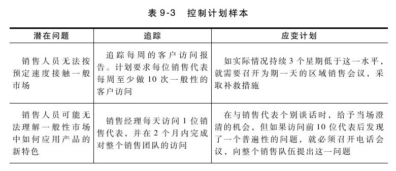
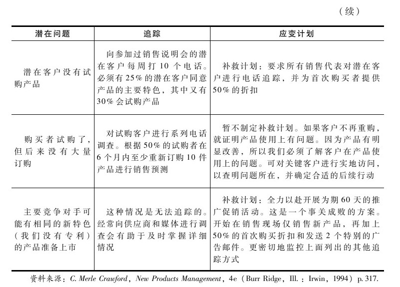

## 上市后追踪：尽早调整

产品上市后，还不能算是大功告成了。应该继续追踪新产品的成功与否，并制定必要的应变计划，这就是上市控制系统要做的事情。最后，还应对整个上市过程进行审计，这会有助于改善下一个重要新产品的开发。

通过上市控制系统，你可以通过追踪下列衡量指标来确定产品的成功与否：

·销售量

·回报率

·折扣

·客户接受度

·竞争反应

·服务电话

·股东价值

产品经理必须：（1）决定哪些衡量指标可以最有效地确定潜在问题；（2）设计追踪系统；（3）确定追踪的频率。表9-3所示的信息可用来制定控制计划：

有时候，调整营销战略可让新产品回归正常状态，如重新定位、重新包装、捆绑销售或分类定价、改变价格、确定新市场或新客户、改变销售渠道或与其他企业合作等。

在其他情况下，则必须调整产品战略，如调整产品、暂时退出市场、永久性放弃产品或出售产品专利等。

上市后的最后一项活动是评估整体产品开发过程。哪些阶段特别有效？项目团队面临哪些问题？为什么？我们学到的经验教训是否可用来改善未来的产品开发过程？

思考要点

在产品上市后可采取什么纠正行动？

▶是否建立了上市控制系统？

▶是否对新产品及开发过程进行了评估？

关键要素

▶在产品开发过程中，尽早准备上市。

▶检查上市前清单，确保没有疏忽任何重要事项。

▶获取组织其他成员的承诺和支持。

▶检查上市实施清单，决定是否还有需要解决的上市问题。

▶建立控制计划，帮助追踪上市过程。

▶检查上市后清单。

上市后清单

▶产品开发过程问题

新产品是否如期上市？ 是 否

项目是否控制在预算内？ 是 否

是否所有重要期限与计划相符？ 是 否

是否制定了追踪系统来监控产品开发过程？ 是 否

是否已经制定了上市控制系统？ 是 否

现有程序是否可以用于未来的产品开发？ 是 否

▶营销问题

客户是否如最初设想的那样使用产品？ 是 否

是否在上市初始阶段已经审查了所有销售发票？ 是 否

是否所有价格、销售折扣和交易折扣是一致并可以接受的？ 是 否

产品是否成功定位？ 是 否

在客户心目中的产品信息是否清晰？ 是 否

支持工具是否有效？ 是 否

是否对竞争反应进行监测并作出应对？ 是 否

▶内部问题

对项目的规模来说资金是否充足？ 是 否

项目是否实现了回收期/报酬率的目标？ 是 否

产品是否实现了预期的销售目标？ 是 否

产品是否实现了第一季度/年度/长期的目标？ 是 否

是否对产品储存、盘点与运输进行了充分的规划？ 是 否

是否有充足的资源来进行订购、管理客户订购并有效地为客户开发票？ 是 否

产品的生产是否能够满足市场需求？ 是 否
